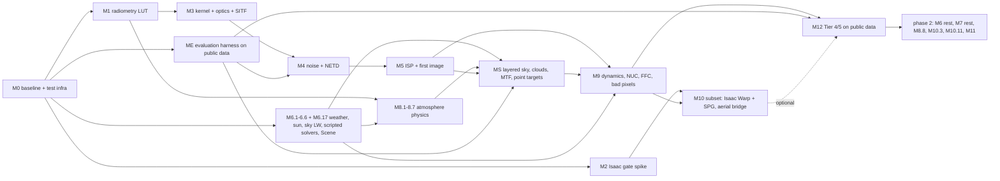

# irsim roadmap

The implementation plan for taking `irsim` from the current scaffold to an L2-fidelity multi-band IR
camera simulator running in Isaac Sim 6.0, with a clean upgrade path to L3. It is derived from
`docs/physics-model.md` (cited as §N.M throughout), the seven project skills, and the repository as it
stood on 2026-09-10.

**How to use this document.** Pick the lowest-numbered step whose `deps` are all ticked, ship it with the
`ship-step` skill (code + tests that would fail if the physics were wrong + `make check` + README status +
CHANGELOG + ADR if listed), tick it here in the same commit. Steps inside a milestone are ordered; milestones
that do not depend on each other (see the dependency graph) can run in parallel across people. Sizes are
S (hours), M (a day or two), L (several days). No calendar dates — the team decides pace. Work is split
into **phase 1 (sky targets)** and **phase 2 (ground / automotive)** per ADR 0003; the Phase plan says
which steps of each milestone belong to phase 1.

**Picking a step:** take the first step in phase-plan order whose `deps` are all ✅; when it ships, prefix
its **what** cell with `✅ done YYYY-MM-DD <hash>` as M0.1 does. Step ids are stable (`M3.4`, `ME.2`,
`MS.6`; a letter suffix marks a step that was split, `M9.5a`). The **what** column cites the finer work
items of the subsystem maps in [`docs/maps/`](maps/) (e.g. `R-06`, `THM-08`), where the fuller test lists
live. Commit scopes `pipeline`, `validation`, `eval` and `io` are proposed additions to the CLAUDE.md list
(open question 12); until approved, use `build` for infrastructure and the physics scope a step tests.

---

## Current state (2026-09-10)

Verified by reading every file and running the suite, not from the CHANGELOG:

| Thing | State |
|---|---|
| Dev environment | **Installed 2026-09-10** into the project interpreter, Isaac Sim's bundled Python `/home/hunter/IsaacSim/_build/linux-x86_64/release/python.sh` (CPython 3.12.13, NumPy 2.3.1, SciPy 1.17, pydantic 2.11) via `make install PYTHON=…/python.sh` (ADR 0002). Warp 1.16.0 is the `omni.warp.core` Kit extension, importable only inside a running Kit — measured by M2.1 (ADR 0014). |
| Existing unit suite | `make check PYTHON=…/python.sh` **green** after M0.1: ruff clean, 19 files formatted, mypy 0 issues, 25 tests in 0.19 s. Before M0.1 it was red on lint (N802), format (3 files) and mypy (one `Any` return), and red on NumPy 1.x (`np.trapezoid`). |
| `src/irsim/radiometry` | `constants.py` (CODATA, C1L/C1Q/C2, σ, Wien, guards — all verified) and `planck.py` (energy + photon spectral radiance, energy-form ∂B/∂T, fractional exitance series, top-hat band radiance). No photon-form derivative, no R(λ) loader, no quadrature, no LUT, no inverse. |
| Every other `src/irsim/*` package | One-line docstring stub. |
| `src/irsim_isaac` | Docstring stubs; no kernels, no AOV code, no `.cu/.cu.lua/.usda`. |
| Tests | `test_planck.py` (11 analytic tests), `test_layering.py` (engine-import guard over `src/irsim`), `conftest.py` (`rng`, `gbuffer_ramp`, `gbuffer_uniform`). No golden or integration tests. `make golden-update` passes `--update-golden`, which **no conftest registers** — it errors today. |
| Configs / data | `configs/sensors/flir_boson_640_lwir.yaml` (full §12.2 shape, most values `ESTIMATED`); it references `spectra/boson_vox.csv`, which **does not exist**. `configs/materials`, `configs/atmospheres`, `data/*` are empty. |
| Docs | `docs/physics-model.md` (1393 lines), ADR 0001 (template), 0002 (interpreter), 0003 (sky-first), `docs/maps/` (the twelve subsystem maps), README status table (radiometry 🟡 T1, all else ⬜). |
| Tests CLAUDE.md claims exist | Non-negotiable #2 ("there is a test for the encode/decode round trip") and #4 ("a test that walks the whole material library") — **neither exists yet**. Both are early steps below. |

See `README.md` for the status table this roadmap updates.

---

## Target

- **Application, phase 1 (ADR 0003):** objects in the sky — drones, aircraft, birds — against a sky
  background, seen by a ground- or vehicle-mounted LWIR camera. Ranges to 5 km are *modelled*; the
  public data validates target size and contrast only to ~200 m (Halmstad > 60 m bin, LRDDv3 ≤ 200 m
  air-to-air), so 0.5–5 km stays analytic self-consistency until better data exists. **Phase 2** widens
  to the ground scenes and automotive use case the spec was written for.
- **Fidelity:** L2 per §1 with the sky-target additions the spec does not cover — a layered slant-path
  atmosphere whose column emission *is* the sky background, cloud clutter, sub-pixel / point-target
  radiometry — each recorded in an ADR with its error, so the L3 upgrade is a known delta.
- **First release ("defensible LWIR camera for sky targets"):** FLIR Boson 640 (and the Halmstad set's
  Boson 320 core) modelled end to end in the engine-free CPU reference pipeline; Tier 1 identities and
  Tier 2 self-consistency benches green; an 8-bit output whose noise, striping, FFC and clutter statistics
  fall inside the bands measured on Anti-UAV410 / Halmstad flat-sky regions after the same signal path
  and codec; synthetic→real and real→synthetic detector numbers beside the real→real ceiling.
  Milestones M0, M1, ME, M2, M3, M4, M5, MS, M9, M12 plus the phase-1 subsets of M6/M7/M8/M10/M11.
- **Isaac Sim 6.0:** the M2 gate spike runs early and in parallel; the phase-1 Warp path (M10 subset)
  follows the CPU pipeline; SPG only for stages proven in Warp.
- **Architecture proof:** the band-literal guard and the SWIR example config (M11.1) land in phase 1;
  the reflective-path physics for SWIR and MWIR is phase 2.
- **Evidence:** Tier 4 statistics and Tier 5 detector experiments on public data (M12), with the DN8
  substitutes for the §15 targets stated in ADR 0068 and the untestable ones (< 2 K bias) reported as
  such. The §15 lab benches are written as a protocol (M12.4) and executed only if a camera arrives.

Engine-free means `src/irsim` + plain `pytest`, no GPU. Everything marked **Isaac? = yes** needs the
simulator and is skipped by default (`@pytest.mark.isaac` / `@pytest.mark.gpu`).

---

## Phase plan

| phase | milestones in order | notes |
|---|---|---|
| **1 — sky targets** | M0 → M1 ∥ ME → M3 → M4 → M5 → MS → M9 → M12, with M2 beside M1 and the M10 subset beside M12 | phase-1 subsets of M6/M7/M8/M10/M11 below; ME.1–ME.2 must land before M4.4, ME.5 before MS.8 |
| **2 — ground / automotive** | M6 (rest) → M7 (rest) → M8.8 → M10.3, M10.11 → M11 → ground Tier 3/4 | re-instates the §16.4 order for what was deferred |

Phase-1 subsets of the ground-oriented milestones (every phase-1 step's `deps` resolve inside phase 1):

- **M6:** M6.1, M6.2 (weather), M6.3 (convection), M6.4 (sun geometry), M6.5 (broadband longwave sky),
  M6.6 (Prescribed / Newton solvers — the target's own heat sources and the coupled housing node),
  **M6.17** (the `Scene` builder that injects one `WeatherSeries` everywhere — non-negotiable #6 lives
  here in phase 1). M6.7–M6.16 (ground energy balance and everything built on it) are phase 2.
- **M7:** M7.2 (schema), M7.11 (environment config), **M7.18** (scalar-per-band `MaterialTable` with
  the UNMAPPED sentinel), M7.13 (reflected term), M7.17 (mapping resolver), and the four-material aerial
  library **MS.7**. M7.3–M7.10, M7.14–M7.16 are phase 2; M7.10 then extends the M7.18 table with the
  Level A/B columns.
- **M8:** M8.1–M8.7 (all the physics; MS.1 extends them to layered slant paths). M8.8 only with MWIR.
- **M10:** M10.1, M10.2, M10.4–M10.10b, M10.12, M10.13a–e (where M2.3 allows), **M10.18** (aerial
  thermal bridge on Prescribed/Newton solvers) and **M10.19** (in-sim aerial phenomenology). M10.3
  (ThermalField bridge) and M10.11 (ground demo stage) are phase 2.
- **M11:** M11.1 only.
## Milestones

### M0 — Green baseline and test infrastructure

**Goal:** the gate is real. `make check` passes on a fresh clone; the test infrastructure the skills
assume (golden fixtures, fixture set, layering guard, encoding round trip) actually exists; the spec
fixes coding depends on are raised first.
**Tier:** T1 (infrastructure). **Exit criteria:** `make check` green under the project interpreter
(Isaac's 3.12) and under one plain CPython ≥ 3.10 venv in CI (M0.11); `make golden-update` accepted;
`make test` < 5 s; every CLAUDE.md non-negotiable that can be enforced without physics code has its test;
`docs/spec-issues.md` exists and the three coding-blocking spec fixes are applied (M0.10).

| id | commit title | spec | what | verification | ADR | deps | size | Isaac? |
|---|---|---|---|---|---|---|---|---|
| M0.1 | `chore(build): make check green under the Isaac Sim interpreter; numpy>=2.0` | §15 T1 | ✅ **done 2026-09-10.** Makefile `PYTHON ?=` variable; NumPy floor 2.0 (Isaac ships 2.3.1); ruff `N802` ignore; one mypy fix; three files reformatted; `make test` prints the ten slowest tests. (`VAL-01`, `R-00`) | `make check PYTHON=…/python.sh`: ruff clean, mypy 0 issues, 25 tests in 0.19 s | 0002 dependency floors | — | S | no |
| M0.2 | `test(build): golden fixture helper and --update-golden option` | ir-sim-testing skill | ✅ **done 2026-09-10.** `tests/golden/conftest.py` with `pytest_addoption('--update-golden')`, `assert_golden(name, array, config_hash, tol)` storing `.npy` (float32/uint16 only) + JSON sidecar; STALE (hash mismatch) reported distinctly from FAILING; actual array dumped beside expected on failure. Decide whether `tests/golden` joins `make test`. (`VAL-05`) | Self-tests: stale path names the config; failure prints both paths; float16 golden refused | 0004 golden policy | M0.1 | M | no |
| M0.3 | `test(build): harden layering guard in both directions` | CLAUDE.md #1 | ✅ **done 2026-09-10.** Forbid `irsim` → `irsim_isaac`; forbid `torch`, `torchvision`, `cv2`, `PIL`, `imageio`, `sklearn` under `src/irsim` (the evaluation stack lives in `src/irsim_eval`, open question 12); scan `tests/unit` for engine imports; scanner self-test on synthetic offending modules; `irsim_isaac/env.py` (`has_isaac()`, `has_warp()`) and `tests/integration/conftest.py` that skips without Isaac. (`VAL-06`, `IU-03`) | Synthetic `import omni` and `import torch` files under `src/irsim` are caught; `import irsim_isaac` succeeds without Isaac; collection of `tests/integration` yields only skips when `has_isaac()` is False | — | M0.1 | S | no |
| M0.4 | `test(radiometry): Stefan-Boltzmann identity to 1e-6 via analytic tail` | §3.1, §15 T1 | ✅ **done 2026-09-10** (measured 3e-11; the `F(5000 µm) = 1 to 1e-12` check was physically wrong — 1−F = 4.5e-8 — and is replaced by a Rayleigh–Jeans-limit check, see ADR 0005). Replace the 2e-5 trapezoid test with Simpson on 0.1–200 µm + closed-form tail `(σT⁴/π)(1−F)` from `fractional_exitance`; route `fractional_exitance`/`band_radiance_tophat` inputs through `_validate` so metre-valued wavelengths raise. (`VAL-02`, `R-00`, `R-02` fix) | ∫B dλ = σT⁴/π to 1e-6 at 250/300/800 K; F(5000 µm) = 1 to 1e-12; `band_radiance_tophat(8e-6, 12e-6, 300)` raises | 0005 SB tolerance | M0.1 | S | no |
| M0.5 | `feat(radiometry): temperature encoding constants and encode/decode` | §13.3, §3.2, CLAUDE.md #2 | ✅ **done 2026-09-10** (ADR 0006, not 0005 — the backlog numbering; fp32 round trip 0.054 mK, the floor is float32 representation of T near 1000 K). `T_ENCODE_REF_K = 200`, `T_ENCODE_SPAN_K = 800`, `LUT_T_MIN/MAX/DT` in `constants.py` (one definition shared by config, radiometry, isaac); `irsim.radiometry.encoding.encode_temperature/decode_temperature` float32, raising on float16; optional coarse/fine fp16-pair codec as the §13.3 fallback. (`IU-01`, `VAL-04`) | fp32 round trip over 200–1000 K < 10 mK (expect ~0.02 mK); **negative controls**: raw Kelvin through fp16 → max error ≥ 0.1 K at 300 K; encoded `c` through fp16 → max error ≥ 0.04 K at 300 K and ≥ 0.15 K over 800–1000 K (both ≫ 10 mK); float16 input raises; fp16-pair codec < 10 mK | 0005 encoding | M0.1 | S | no |
| M0.6 | `feat(config): G-buffer contract dataclass and the synthetic fixture set` | ir-sim-testing skill, §13.3 | ✅ **done 2026-09-10.** `irsim.config.gbuffer.GBuffer` validating dtypes: float16 rejected on `temperature_k`, `encoded_t`, `distance_m` and any radiance key; other keys any float, upcast to float32 by the adapter (§13.3 allows fp16 normals/AO/motion). Fixtures: `gbuffer_two_material`, `gbuffer_sphere` (analytic cos θ = √(1−r²/R²), rim < 0.02), `gbuffer_step_edge` (5.5° tilt, 4× supersampled), `gbuffer_moving_edge`, `encoded_t` key; `material_id` fixtures use id 1 (0 is the UNMAPPED sentinel, M7.18); `test_gbuffer_schema.py` freezing the key set the Isaac adapter must emit. (`VAL-03`, `IU-02`) | Sphere fixture matches analytic cos θ to 1e-6; step edge has exactly one transition column; fitted edge angle 5.5° ± 0.1°; float16 temperature raises, float16 normal is upcast | — | M0.1 | M | no |
| M0.7 | `feat(config): pydantic sensor schema for §12.2 with physical validation` | §12.2, §16.1 | ✅ **done 2026-09-10.** `SensorConfig` (`extra='forbid'`, frozen, units-in-names, `schema_version`), discriminated `fpa.type` (bolometer forbids photon fields and vice versa), `ratios_3d.tvh == 1.0`, regime-vs-wavelength consistency, derived `pixel_area_m2`, `nyquist_cyc_per_mm`, `hfov_deg`, `frame_period_s`, `dn_max`; **no** aperture property. Add `types-PyYAML` (or mypy override) so `make typecheck` passes. (`BC-01`) | Boson YAML loads exactly; `pixel_area_m2 == 1.296e-10` to 1e-12; Nyquist 41.67 cyc/mm; HFOV 30.7° (documents the 32° discrepancy); `f_stop` typo rejected; source scan finds no aperture expression in `irsim.config` | 0007 config schema | M0.1 | M | no |
| M0.8 | `feat(config): YAML loader, data-root path resolution, canonical config and band hashes` | §12.2, §3.2(b) | ✅ **done 2026-09-10.** `load_sensor_config(path, data_dir)` resolving `spectral_response` against `<repo>/data` (override by arg / `IRSIM_DATA_DIR`), erroring by name on a missing file; `config_hash` (SHA-256 of canonical JSON, file paths replaced by content hashes) and `band_hash` (band block + spectral bytes only, so NETD grades share a LUT). Uses the `data/spectra/responses/` layout that M0.10 fixes in the spec. (`BC-02`) | Hash invariant to comments/key order; changes for every numeric leaf (parametrised); `band_hash` ignores `netd_mk_at_300k`; dangling `boson_vox.csv` errors by path | 0008 hashes & data root | M0.7 | S | no |
| M0.9 | `feat(config): band registry with canonical ids and per-band defaults` | §12.1, §5.2 | ✅ **done 2026-09-10.** `BandId = {nir, swir, mwir, lwir}`, nominal ranges from §12.1, `band_id_for(λmin, λmax)` by maximal overlap (error < 50 %), optional explicit `band.id` validated against derivation, `enabled_illumination_terms(regime)` → `{self_emission, solar, night}` so kernels never switch on a band name. (`BC-04`) | Each §12.1 range maps to itself; 1.8–2.6 µm raises; `Lb(SWIR,300 K)/Lb(LWIR,300 K) < 1e-6` and `Lb(MWIR)/Lb(LWIR) ∈ [1e-2, 1e-1]` via `band_radiance_tophat` | in 0007 | M0.7 | S | no |
| M0.10 | `docs(docs): spec fixes raised before coding — T_sky angle argument, §6.1 solar complement, §12.2 response path; open docs/spec-issues.md` | §5.3(a) line 311, §6.1 line 355, §12.2 line 832, CLAUDE.md "say so before coding" | ✅ **done 2026-09-10** (applied; awaiting spec-owner review, open question 10). Change `cos^q(θ_el)` → `cos^q(θ_zen)` (line 314 and R13 require the depression at zenith), `(1−α_sol)^c Q_sol` → `α_sol Q_sol` (line 363 already says so), `responses/boson_vox.csv` → `data/spectra/responses/boson_vox.csv`; open `docs/spec-issues.md` listing the S/T issues below with their proposed resolutions for the spec owner. No code. | Reviewed by the spec owner (open question 10); M6.5/MS.2's coldest-at-zenith and M6.7's monotone-α tests encode the fixes | — | — | S | no |
| M0.11 | `chore(build): GPU-free CI job — plain CPython 3.10 venv running make check` | ADR 0002 revisit clause | ✅ **done 2026-09-10.** CI workflow (or a Makefile `ci` target) that creates a venv with the dev extras and runs `make check PYTHON=<venv>/bin/python`; documents the interpreter matrix (Isaac 3.12 locally, plain 3.10 in CI). | CI green on the scaffold in < 2 min; the job fails on a deliberately introduced `import omni` in `src/irsim` | in 0002 | M0.1 | S | no |

### M1 — Radiometry core: band LUT, inverse, first band data (§16.4 step 1)

**Goal:** every Tier 1 radiometry identity in §15 is a passing test; a band is a YAML + CSV; `make luts`
works. **Tier:** T1. **Exit criteria:** LUT vs quadrature < 5 mK over 200–1000 K; inverse round trip
< 1 mK; in-band ∂L/∂T vs FD < 1e-5; `make luts` regenerates the LWIR bundle with a valid sidecar; README
`Bands configured: LWIR`.

| id | commit title | spec | what | verification | ADR | deps | size | Isaac? |
|---|---|---|---|---|---|---|---|---|
| M1.1 | `feat(radiometry): photon-form thermal derivative` | §3.4, §9.4 | ✅ **done 2026-09-11.** `d_spectral_photon_radiance_dT` with the same expm1/clip guards; export both derivative forms. Needed because photon-detector NETD divides by (∂L_q/∂T)_B. (`R-01`) | `dB_q/dT · hc/λ == dB/dT` to 1e-12; vs central FD < 1e-6; finite over the 200–2000 K × 0.4–20 µm sweep | — | M0.4 | S | no |
| M1.2 | `feat(radiometry): photon fractional exitance and σ_q closed form` | §3.2(a) | ✅ **done 2026-09-11** (`F_q(5000 µm) = 1 to 1e-6` replaced by a Rayleigh–Jeans-limit check as in M0.4: 1−F_q(1000 µm, 300 K) = 4.8e-4 physically). `SIGMA_Q = 2π·2ζ(3)k_B³/(h³c²) = 1.52046e15` with derivation in `constants.py`; `fractional_photon_exitance`, `band_photon_radiance_tophat` — the only implementation-independent oracle for the `Lb_q` table. (`R-02`) | `F_q(5000 µm) = 1` to 1e-6; vs trapezoid of `spectral_photon_radiance` < 1e-4; known answer `Lb_q(7.5–13.5, 300 K) = 2.915e21` to 1e-3; `Lb/Lb_q = hc/λ_eff` with λ_eff inside the band | — | M1.1 | S | no |
| M1.3 | `feat(radiometry): spectral response file contract, loader, and estimated Boson VOx curve` | §2 R(λ), §3.2(b), §12.2 | ✅ **done 2026-09-11.** `irsim.radiometry.spectral_response.load_spectral_response` → `SpectralResponse` (and `irsim.radiometry.band.Band`): two-column CSV, `#` header with provenance, λ strictly increasing in **µm** (0.1–100), 0 ≤ R ≤ 1, **peak == 1.0 ± 1e-6** (assert, never renormalise — QE lives in `fpa.quantum_efficiency`), resample to 0.01 µm, zero outside support; `Band` object; author `data/spectra/responses/boson_vox.csv` (ESTIMATED: 7.5–13.5 µm with 0.25 µm cosine edges) and point the YAML at it. (`R-03`, `BC-03`) | Exact top-hat CSV integrates to `band_radiance_tophat` within 0.1 %; nm-valued file raises; area-normalised (peak 0.17) file raises; Boson 50 % points within ±0.2 µm of 7.5/13.5; `∫R dλ` of a resampled top-hat equals its width to 1e-12 | 0009 R(λ) & QE convention | M0.8 | M | no |
| M1.4 | `feat(radiometry): reference band integration by Simpson quadrature` | §3.2(b), §3.4 | ✅ **done 2026-09-11.** `band_radiance`, `band_photon_radiance`, `d_band_radiance_dT`, `d_band_photon_radiance_dT` — float64, vectorised over T, composite Simpson on an odd-length edge-aligned 0.01 µm grid (numpy, no scipy). The oracle every faster path is tested against. (`R-04`) | Top-hat vs closed-form series < 0.1 % for (7.5–13.5, 300), (3–5, 300/500), (0.9–1.7, 300) with the error also printed in mK; in-band derivative vs FD (1 mK) < 1e-5 over 200–1000 K; **known answer** `dLb/dT(373)/dLb/dT(300) = 1.736 ± 0.5 %` for 7.5–13.5 µm (the 39→23 mK NETD anchor of [R9]) | — | M1.2, M1.3 | M | no |
| M1.5 | `feat(radiometry): band-weighted averaging of spectral material properties` | App. A #3, §12.3, §4.1 | ✅ **done 2026-09-11.** `band_average(band, s(λ), T_ref, form)` = ∫R s B dλ / ∫R B dλ (energy or photon weighting). The only sanctioned route from ε(λ)/ρ(λ)/τ(λ) files to per-band scalars; linear, so Kirchhoff closure survives. (`R-05`) | Constant s → same value to 1e-12; step spectrum vs closed-form ratio of two top-hats to 1e-4; `avg(ε)+avg(ρ)+avg(τ) = 1` to 1e-9 for pointwise-closed spectra; T-dependence of a sloped ε is > 1e-3 between 300 and 600 K (documents what the ADR accepts) | 0010 grey-within-band ε | M1.4 | S | no |
| M1.6 | `feat(radiometry): float32 band LUT with the §13.5 interpolation contract` | §3.2(b), §13.5, CLAUDE.md #2 | ✅ **done 2026-09-11** (float32 cast measured 0.086 mK, not < 0.05: the kernel's float32 index near 16000 costs 0.05 mK by itself — recorded in ADR 0011). `BandLUT`: 200–1000 K, 0.05 K, N = 16001, tables `Lb, Lb_q, dLb_dT, dLb_q_dT` built in float64, cast once; `lookup(T, quantity)` implements `u = (T−T0)/(T1−T0)·(N−1)` **in float32 with the kernel's clamp to N−1.001**, float16 rejected; session-scoped pytest fixture (< 2 s build). Out-of-range policy = clamp, flagged. (`R-06`) | Off-grid lookup vs M1.4 quadrature < 5 mK over 200–1000 K with actual mK printed (expect ≤ 0.03 mK); float32 cast cost < 0.05 mK; `Lb` strictly increasing, `dLb_dT` > 0; `lookup(199 K) == lookup(200 K)` exactly; FD of `Lb_q` table vs `dLb_q_dT` table < 1e-4 | 0011 LUT grid & range | M1.4 | M | no |
| M1.7 | `feat(radiometry): inverse lookup — apparent temperature from band radiance` | §3.3, §15 T1 | ✅ **done 2026-09-11.** `BandLUT.apparent_temperature(L)`: `searchsorted` + linear inversion in the bin, float32 in/out; policy for radiance outside `[Lb(T0), Lb(T1)]` (clamp vs NaN — ADR). Output named `T_apparent`, never routed through kinetic T. (`R-07`) | Round trip < 1 mK on a 0.013 K off-grid sweep; grey body ε = 0.9 at 300 K: `T_app` agrees with `brentq` on the closed form < 5 mK (= 293.51 K — the 6.5 K gap *is* the product, §3.3); photon-form round trip < 1 mK | in 0011 | M1.6 | S | no |
| M1.8 | `feat(radiometry): LUT bundle on disk with hash sidecar, stale detection, binary export` | §3.2(b), §13.5, §14 | ✅ **done 2026-09-11** (generated, not committed — ADR 0012 answers open question 6 provisionally). `save_band_lut` → `<band_hash>_{Lb,Lb_q,dLb_dT,dLb_q_dT}.npy` + raw little-endian `.f32` (for Lua/Unreal `PF_R32_FLOAT`) + `<band_hash>_lut.json` {T0, T1, N, dt, dtype, band, config_sha256, spectral_sha256, numpy version}; `load_band_lut` recomputes hashes and raises `StaleLUTError` naming the changed input; asserts float32. Decide committed-vs-generated (currently gitignored; skill says committed) — ADR. (`R-08`, `IU-04`, `BC-08`) | Save→load bitwise; hand-written float16/float64 `.npy` rejected; one-byte CSV change → `StaleLUTError`; `.f32` decodes bit-identical to `.npy`; sidecar T0/T1/N land grid temperatures on integer indices | 0012 LUT artefact policy | M1.7 | M | no |
| M1.9 | `feat(radiometry): scripts/generate_luts.py and make luts` | §3.2(b), §12.2 | ✅ **done 2026-09-11.** Replace the stub: `--configs --out --data`; per sensor YAML build via M1.3/M1.4/M1.6, cross-check against the closed-form top-hat over the config range (report % and mK), write via M1.8, print a summary. Adding a band must touch only YAML + CSV + this command. (`R-09`) | Synthetic top-hat CSV + minimal YAML → `Lb(300 K) = 55.49 W m⁻² sr⁻¹` to 0.1 %, sidecar verifies; peak ≠ 1 or nm file → non-zero exit, nothing written; rerun is bitwise-deterministic | — | M1.8 | M | no |
| M1.10 | `feat(radiometry): generate the LWIR Boson LUT; README bands configured` | §16.1, §12.1 | ✅ **done 2026-09-11** (bundle is generated per ADR 0012, not committed). Run `make luts` on the estimated Boson curve; commit per 0012; README `Bands configured: LWIR (flir_boson_640_lwir)`; status row radiometry → 🟢 T1. (`R-10`) | Loader accepts the file; λ_eff at 300 K within 9.5–11.5 µm; `Lb(300 K)` within 10 % of the top-hat 55.49 (soft edges legitimately differ by a few %); `dLb_dT(373)/dLb_dT(300) ∈ [1.65, 1.85]` | 0013 estimated Boson R(λ) | M1.9 | S | no |
| M1.11 | `test(radiometry): golden LUT slice` | ir-sim-testing skill | ✅ **done 2026-09-11.** Every 100th entry of `Lb`, `dLb_dT` as a golden with config hash, 1 mK tolerance, via the M0.2 helper. (`R-11`) | Regenerated LUT vs golden < 1 mK; hash mismatch reported STALE | — | M1.10, M0.2 | S | no |

### ME — Evaluation harness on public data (phase 1, in parallel with M1)

**Goal:** before any pixel is simulated, know what real Boson-class sky video looks like statistically —
*including what the storage path did to it* — and have the code that measures the simulator against it.
Image decoding, the discriminator and the trainers live in a separate package `src/irsim_eval/` (extras
`validation`, `ml`); `src/irsim/validation` keeps NumPy-only metric functions. Datasets stay outside git.
**Tier:** T4/T5 infrastructure. **Exit criteria:** `data/validation/README.md` indexes every set with
licence, hash, sensor, signal path, bit depth and codec; each analyser recovers its own synthetic ground
truth *and* reports its bias through the set's codec; a reference-statistics report for Anti-UAV410 and
the Halmstad set is committed; a detector trains and evaluates real→real from one command.

| id | commit title | spec | what | verification | ADR | deps | size | Isaac? |
|---|---|---|---|---|---|---|---|---|
| ME.1 | `feat(eval): dataset index, fetch scripts, signal-path and licence notes` | §15 T4 [R34], ADR 0003 | `scripts/fetch_validation_data.py` for Anti-UAV410, CST Anti-UAV, the Halmstad drone-detection set (Svanström et al. 2021, CC0), LRDDv3, IRSTD-1k / NUAA-SIRST → `data/validation/<set>/` (gitignored). `data/validation/README.md` records per set: URL, licence, SHA-256, frame counts, **sensor, signal path (Halmstad: Boson Y16 → recorder 8-bit → mp4; Anti-UAV410/CST: display output → lossy; LRDDv3: air-to-air, ≤ 200 m), bit depth, codec, bitrate**, and which analysers may use it (IRSTD-1k / NUAA-SIRST: single frames, sensor unknown → target size/SCR priors only). `irsim_eval.data`: `Sequence`/`Frame` reader (8-bit frames, boxes, per-frame attributes), static-camera clip detector. | Reader round-trips a synthetic sequence; licence and signal-path fields non-empty for every set; the static-clip detector flags a translated synthetic clip as moving and a jittered one as static | 0068 evaluation data & metrics | M0.1 | S | no |
| ME.2a | `feat(validation): noise analysers — NVESD 3-D decomposition, spatial/temporal PSD, compare_psd` | §10.2 [R28], §15 T2/T4(c) | ✅ **done 2026-09-11** (split from ME.2; the NumPy analysers only, no dataset dependency). `irsim/validation/noise.py`: leakage-corrected `decompose_3d` (random-effects mean squares), `spatial_psd` with the k_v = 0 / k_h = 0 lines, `temporal_psd`, `compare_psd` — **the sole home of these functions** (`NOISE-04`, `NOISE-12`). | Synthetic float cube with the Boson ratios recovered within 3× the estimator's own sampling floor per component (`estimate_floors`; TVH 0.6 %, VH 3 %, but σ_H/σ_V only ~27 % at 64 columns/rows — the flat 5 % of the plan is unattainable on a 64-wide cube); white cube radial PSD max/min < 1.3 and no directional terms; σ_H-only ≥ 95 % on the k_v = 0 line; sum-of-squares identity 1e-6 | 0023 3-D estimator & tolerances | M4.3, M0.6 | M | no |
| ME.2b | `feat(validation): flat-region finder, temporal PSD shape on sky, codec floor` | §10.2, §15 T4(c) | Flat-region finder (low-gradient sky patches), per-pixel temporal std on real clips, **temporal PSD shape** (a low-pass on flat sky is the fingerprint of an in-camera temporal filter), codec awareness: 8-px blockiness detector, quantiser-step estimate, per-set noise floor; extends ME.2a's functions with a codec-limited flag. | **Quantised negative control**: a uint8 cube with σ = 0.3 LSB is either recovered within the stated bias or flagged codec-limited; a synthetic cube round-tripped through the Halmstad set's codec and bitrate reports its bias | in 0023 | ME.1, ME.2a | M | no |
| ME.3 | `feat(validation): ISP-behaviour extractors — FFC freeze and interval, fixed-pattern growth, AGC signature, DDE overshoot, bad pixels` | §11.2, §11.3, §10.3, §10.4 | FFC detector (runs of near-identical frames ≥ 0.3 s followed by a fixed-pattern change → freeze length from any clip, interval *distribution* only from sequences ≥ 3 min, i.e. Anti-UAV410/CST, not the 10-s Halmstad clips; Boson FFC also triggers on ΔT_FPA); column/row-mean spatial std vs time since the last FFC (between-FFC growth); histogram-shape statistics distinguishing plateau equalisation from a linear stretch and edge-overshoot profiles — **run only on sets whose frames are the camera's display output**, with a "recorder conversion" mode (linear / min-max / unknown) for Y16-derived sets; fixed-position Laplacian minima → bad-pixel map estimate. | Synthetic video with injected 42-frame freezes every 10 800 frames recovered exactly, and after the codec round trip within ±1 frame; an OU drift of known τ recovered within 15 % from a 5-min synthetic sequence; a plateau-equalised synthetic frame separated from a linear one; injected 3×3 replaced clusters found with < 1 % false positives; Y16-mode refuses to report an AGC signature | in 0068 | ME.2 | M | no |
| ME.4 | `feat(validation): sky and target statistics — scale-free elevation profile, cloud spectra, size-vs-range, SCR, polarity, edge spread, smear` | §5.3, §8.3, §15 T4 | Sky column profiles when the horizon is visible, reported **scale-free**: shape normalised by the horizon–zenith span and DN8 gradient per degree divided by flat-sky σ (SNR per degree); clutter PSD slope on cloud regions in the display domain; from boxes: target area in px, local SCR = (mean_target − mean_ring)/std_ring, contrast-polarity fraction, ESF across the target, **trailing/leading edge asymmetry vs box velocity** (the smear fingerprint); LRDDv3 range labels → size and SCR vs range (air-to-air, ≤ 200 m, ground clutter — stated); Halmstad FOV taken from the Breach PTQ-136 datasheet (24° × 19°) with horizon geometry as a consistency check. | Synthetic Gaussian target of known SCR measured within 5 %; power-law clutter of known slope recovered within 0.1; size-vs-range for a synthetic 0.5 m target follows f/(R·p) within 3 %; a synthetic IIR-smeared target's asymmetry recovers τ within 2 % | in 0068 | ME.1 | M | no |
| ME.5 | `feat(validation): reference-statistics report for Anti-UAV410 and the Halmstad set` | §15 T4 | `scripts/reference_statistics.py` runs ME.2–ME.4 over the indexed sets and writes `docs/validation/reference-stats-<date>.md` + JSON — the bands the simulator must land in: 3-D ratios in DN8, PSD slopes and line energy, temporal PSD shape, FFC freeze length (and interval distribution where measurable), between-FFC growth, plateau signature (display-output sets only), scale-free sky profile, cloud slope, SCR and size distributions vs range — **each with N, a confidence interval and a codec-limited flag**. | Regenerates deterministically; every statistic carries N, CI and its floor; JSON schema test; README `Validation` section links the report | in 0068 | ME.2, ME.3, ME.4 | M | no |
| ME.6 | `feat(validation): real-vs-synthetic comparison and the Tier 4 acceptance report` | §15 T4, §10.2 | `irsim/validation/compare.py` (NumPy): per-class histogram EMD in DN8, class-vs-background contrast ratio `(target − ring)/σ_ring`, PSD-shape ratio above the codec floor, ESF width; `irsim_eval.discriminator`: real-vs-synthetic patch classifier whose AUC is the gap score; `scripts/validation_report.py` exits non-zero on any exceeded target. **The DN8 targets that replace §15's radiometric ones (ADR 0068):** contrast ratio within 25 % after the same signal path and codec, histogram EMD below the ADR threshold, PSD shape within ×2 above the floor, ESF width within 20 %, AUC < 0.7; the §15 "< 2 K bias" target is declared untestable without radiometric data and listed as open in every report. | Synthetic-vs-itself: AUC 0.5 ± 0.03 and the report passes; a ×3 noise mismatch fails the PSD check; a shifted histogram reports the shift | in 0068 | ME.5 | M | no |
| ME.7 | `feat(eval): detector train/evaluate harness with the four transfer protocols` | §15 T5 | `ml` extra (torch + a small permissively-licensed detector — open question 1; **never imported by `src/irsim`**, enforced by M0.3); `scripts/train_detector.py`, `scripts/eval_detector.py` with AP@0.5, AP_small, P_d vs SCR and vs size, false alarms per frame on clutter; protocols **real→real, synthetic→real, real→synthetic, real+synthetic→real** (§15 asks for both gaps). Closes the ME exit criterion on real→real alone. | A fixed-seed real-only smoke run on the Halmstad set reproduces a documented AP within tolerance; layering test green | 0069 ML dependency & Tier 5 protocol | ME.1 | L | no (GPU for training) |
| ME.8 | `feat(config): fidelity-ablation switches hashed into the config` | §15 T5 caution 1 | Switches (noise off, `agc: linear`, MTF off, FFC off, bad pixels off, clouds off) as explicit YAML fields so each ablation variant has its own config hash; consumed by M12.3. Scheduled after the features they switch exist. | Every switch changes the config hash; a switched-off feature is bit-identical to its absence in `run_frame` | in 0069 | M9.8, MS.3 | S | no |

### M2 — Isaac Sim gate spike (§16.4 step 2) — **stop and fix if it fails**

**Goal:** retire the engine unknowns before any pipeline code depends on them. Each step is a time-boxed
experiment with a written outcome; none produces production code except the encoding probe and the env
test. Runs in parallel with M1 (needs only M0.5). **Tier:** T1 (encode/decode). **Exit criteria:** ADR
0014 records: the float32 AOV that carries T and its measured round-trip error; whether `omni.rtx.spg`
is available; whether SPG can hold cross-frame state; the semantics of the Normal / DistanceToCamera /
AmbientOcclusion / MotionVectors annotators; an exact integer material-id transport.

**Status 2026-09-10 (ADR 0014):** M2.1–M2.3 done, M2.4 partly. No float32 colour AOV carries T — the
transport is **ids + float32 geometry** with a Warp temperature table. SPG is present, passes float32
through bit-exactly, holds **no** cross-frame state (stateful stages stay in Warp) and takes its LUT
baked into the `.cu`. Normal / AO / motion semantics remain for M10.1.

| id | commit title | spec | what | verification | ADR | deps | size | Isaac? |
|---|---|---|---|---|---|---|---|---|
| M2.1 | `test(isaac): environment probe integration test` | §13.2, §13.6 | ✅ **done 2026-09-10.** `tests/integration/test_environment.py` + `irsim_isaac.probe.probe_environment` (`scripts/probe_isaac_environment.py` writes `environment.json`): Kit 110.3.0, **Isaac Sim 6.1.0-rc.26** (not 6.0 GA — T16), `omni.rtx.spg` 0.4.0 enabled, `isaacsim.sensors.experimental.rtx` 1.9.0 exposes `RtxCamera`/`CameraSensor`/`TiledCameraSensor`/`SPGNode`, deprecated `isaacsim.sensors.camera` not imported by `irsim_isaac`, Warp 1.16.0 with one CUDA device — but Warp is the `omni.warp.core` Kit extension and imports only inside a running Kit, so **no `warp-lang` extra is pinned** (a pip Warp would shadow it; ADR 0014). The session fixture boots one headless Kit (14–35 s), hides pytest's argv from Kit's parser (`-m ""` segfaults it) and closes the app at interpreter exit because `SimulationApp.close()` ends in `os._exit`. (`IU-10`) | Extension and API assertions; version string recorded in the ADR | 0014 Isaac 6.1 findings | M0.3 | S | **yes** |
| M2.2 | `feat(isaac): temperature encode/decode round trip through an AOV — THE GATE` | §13.3, §16.4 step 2, §15 T1 | ✅ **done 2026-09-10 — gate failed as specified, fix chosen (ADR 0014).** `irsim_isaac/probe.py` (`build_ramp_scene`, `probe_render_mode`, `probe_id_transport`) + `scripts/probe_isaac_environment.py`: 64 OmniPBR emissive quads (UsdShade authoring — the Kit `CreateMdlMaterialPrimCommand` path silently emitted nothing), ramp 200–1000 K incl. 300.000/300.050/300.100 K, RT and PT at 0/1/4 bounces, intensity 1 and 40. Every colour AOV — `HdrColor`, `LdrColor`, `PtSelfIllumination`, all `Pt*` — is **float16** and exposure-scaled (readback ≈ 2.8e-4 × colour × intensity, linear); the float32 `GroundTruthEmission*` return no data; PT at 0 bounces returns a constant. fp16 caps the round trip near 100 mK at 300 K, so temperature-in-emission cannot meet 10 mK in this build. **Fix: transport ids + geometry, not temperature** — `instance_segmentation`/`semantic_segmentation` (uint32, 64/64 quads exact, 5×5 centre windows pure) and float32 `Camera3dPositionSD`/`DistanceToCameraSD` at full resolution; the per-facet temperature is looked up in a float32 Warp table (zero quantisation). M0.5's fp16 pair stays the documented fallback. `tests/integration/test_isaac_transport.py` pins the ids, the float32 geometry and the fp16 finding. (`IU-11`, `VAL-23`) | **Measured:** emission path ≈ 100 mK-class (fp16) — not met; id + geometry path exact. Spec was:  max ǀdecoded − authoredǀ < 10 mK across the ramp; AOV dtype float32; hot quad next to cold quad shifts it < 10 mK (no bounces); c = 0.5 reads 0.5 ± 1e-6 (no gamma/colour management); c = 0.999 → 999.2 K (no clamp) | in 0014 | M2.1, M0.5 | M | **yes** |
| M2.3 | `test(isaac): SPG capability experiments (state, LUT load, float32 pass-through)` | §13.2, §13.5 | ✅ **done 2026-09-10.** `irsim_isaac/spg_probe.py` + `scripts/probe_isaac_spg.py`, graphs authored with `RtxCamera.author_spg(SPGNode…)`, one render product per graph, report checkpointed after every experiment. **(a)** float32 pass-through **bit-identical** (`DistanceToCameraSD`, `DistanceToImagePlaneSD`, `Camera3dPositionSD`; `LdrColor`/`HdrColor` too, the latter on the fp16 grid). **(b) no cross-frame device state:** a `cuda.static` buffer (`cuda.array`/`cuda.zeros`) is re-initialised every frame, `cuda.empty` is an output descriptor not a kernel argument, and an output AOV wired back into the node's own input produces no output at all — Lua file-scope variables do persist (one call per rendered frame) and `rtx.frameId` advances 6–7 per `orchestrator.step()`. **(c)** `io.` is a forbidden token (the whole file is rejected by a textual validator); a 16 001-entry Lua literal **crashes the Kit process** under the default 1 000-instruction limit and a Lua loop fails cleanly; both work with `/rtx/spg/lua/instructionLimit` raised at runtime; a `__device__ const float[16001]` **baked into the `.cu`** works under default limits (NVRTC, ≈ 1 s). Hazard: a kernel that fails to load yields a **zero-filled output with status ok**. (`IU-12`) | **Measured:** (a) bytes identical; (b) the counter never exceeds 1 → stateful stages 4–5 stay in Warp (ADR 0014, 0061); (c) the baked table matches numpy exactly, the Lua forms only with the sandbox limit raised | in 0014 | M2.1 | M | **yes** |
| M2.4 | `test(isaac): AOV semantics probe — normals, distance, occlusion, motion, material id` | §13.3, §5.3(a), §7.1 | 🟡 **partly done 2026-09-10** (inside M2.2/M2.3, ADR 0014): `DistanceToCameraSD` = Euclidean ray length (1 mm), `DistanceToImagePlaneSD` = z-depth (0 mm) — both float32 at 256² once `/rtx/post/aa/op = 0` (DLSS otherwise renders 256² products at 128², and `DiffuseAlbedo`/`BumpNormal`/`EmissionAndForegroundMask` stay 128² regardless); `Camera3dPositionSD`/`PtWorldPos` float32 world position, 3.4 mm mean error (pixel quantisation at 2 m); material/instance id via `instance_segmentation` — exact, no edge blending in 5×5 centre windows. **Open, folded into M10.1:** normals (`SmoothNormal` no data in RT, `BumpNormal` 128², `PtWorldNormal` zeros below 4 bounces), `AmbientOcclusion` (no data in RT on the unlit ramp) and `Motion2d` (no data on a static scene) need the lit, moving, tilted-geometry scene this row describes. (`IU-13`, `IU-14`, `MAT-12` probes) | **Measured** for distance, position and id; normals, AO and motion pending in M10.1. Spec was:  Each quantity's semantics and dtype written into ADR 0014 with the measured values; the id transport whose histogram has exactly N+1 distinct values is chosen | in 0014 | M2.2 | M | **yes** |

### M3 — Constant-ε radiance kernel, optics irradiance, ideal detector, SITF (§16.4 step 3)

**Goal:** the engine-free CPU reference pipeline exists end to end for a blackbody: G-buffer → band
radiance → focal-plane power → linear DN16 → apparent temperature, and the Tier 2 SITF bench runs on it.
This pipeline is the oracle every Warp/SPG kernel is later compared against. **Tier:** T1 → T2 (SITF).
**Exit criteria:** SITF on the Boson config strictly increasing and linear in `Lb(T)` to 0.5 LSB;
blackbody round trip `T_app == T` < 1 mK; grey-body gap matches the LUT prediction < 5 mK; aperture factor
defined exactly once.

| id | commit title | spec | what | verification | ADR | deps | size | Isaac? |
|---|---|---|---|---|---|---|---|---|
| M3.1 | `feat(optics): aperture factor π/(4F²+1), FPA irradiance, pixel power` | §8.1, §2, CLAUDE.md #5 | ✅ **done 2026-09-11.** `irsim.optics.aperture`: `aperture_factor(F)`, `cone_half_angle`, `fpa_irradiance`, `pixel_power` — quantity-agnostic (W or photons), float16 rejected. **AST guard test** (not a string grep): outside `irsim/optics/aperture.py`, no `**2`, `pow(…, 2)` or self-multiplication applied to a name matching `f_number` / `fnum` / `F`, and no literal `4` multiplying such a term, anywhere under `src/irsim` and `src/irsim_isaac`; self-test on three obfuscated variants (`4.0 * f_number ** 2`, `(2*F)**2`, `f*f*4`). (`O1`, `VAL-10`) | `aperture_factor(F) == π sin²(atan(1/2F))` to 1e-12; numerical cone integral to 1e-10; `aperture_factor(1.0)/(π/4) == 0.8` exactly; Boson `pixel_power(L=1) = 7.492e-11 W`; the guard catches all three variants | — | M0.1 | S | no |
| M3.2 | `feat(optics): field-angle map and cos⁴ natural vignetting` | §2, §8.1 | ✅ **done 2026-09-11** (known answers are at the format corner/edge; the corner pixel *centre* reads 0.7930). `field_angle_map(w, h, pitch, f, principal_point, supersample)` from undistorted pinhole geometry; `cos4_field`; `vignetting_cos4: false` → ones; hook for a measured multiplicative map. (`O2`) | Boson corner cos⁴ = 0.79240, edge-centre 0.86496 to 1e-4; flip symmetry to 1e-7; 4× field box-averaged matches native to 1e-4 | 0015 distortion delegated to engine | M0.7 | S | no |
| M3.3 | `feat(optics): optics self-emission — single-lens form and Kirchhoff-closed element stack` | §8.2, §11.2, CLAUDE.md #4 | ✅ **done 2026-09-11.** `self_emission_power(A_d, F, τ_opt, Lb_housing)`; `OpticalElement(τ, T, ρ=0)` with ε = 1−τ−ρ asserted to 1e-6; `stack_self_radiance` (each element attenuated by everything downstream). Added in power space, never Kelvin. (`O3`) | Isothermal enclosure: `Φ_scene + Φ_self = A_d Ω_eff Lb(T)` independent of τ_opt to 1e-12; two-element stack vs hand value; **shutterless-drift known answer**: +1 K housing → +87 mK ± 1 mK apparent T (τ = 0.92, F/1); `τ+ρ > 1` raises | 0016 self-emission model & T_housing meaning | M3.1 | M | no |
| M3.4 | `feat(config): optics/FPA schema extensions with derived quantities` | §12.2, §8.3, §8.4 | ✅ **done 2026-09-11.** `OpticsConfig`/`DistortionConfig` (per-model coefficient counts; `vignetting_cos4` forbidden with non-rectilinear models), new optional fields `housing_temp_k`, `housing_tau_s`, `housing_self_heating_k`, `supersample_factor` (default 4), `mtf.aberration_sigma_um`, `mtf.reference_wavelength_um`; derived `detector_active_area_m2`, `active_width_um`, `cutoff_cyc_per_mm`; `schema_version` bump. (`O8`, part of `BC` schema-gaps ADR) | Boson YAML derived values (A_d 1.296e-10, ξ_N 41.667, ξ_c(10 µm) 100); `fixed` without `housing_temp_k` raises; `kannala_brandt` + `vignetting_cos4` raises | 0017 schema gap policy | M0.7 | S | no |
| M3.5 | `feat(detector): FPA parameter model and derived quantities` | §12.2, §9.1, §9.2, §2 | ✅ **done 2026-09-11.** `FpaParams` mirroring `fpa:` plus the fields §12.2 omits (read noise, dark-current sub-model, α_abs, G_th, FPA thermal constants), discriminated on type; derived `active_area_m2 = pitch²·fill_factor`, `frame_dt_s`, `dn_max`. R(λ) is peak-normalised and η is a separate scalar applied exactly once. (`DET-01`) | Boson: `A_d == 1.296e-10` to 1e-12, `frame_dt == 16.6667 ms`; photon type without `quantum_efficiency` raises; `t_int > 1/frame_rate` raises; bolometer YAML lacking the four photon `null` keys loads | in 0017 | M3.4 | S | no |
| M3.6 | `feat(pipeline): emission-only band-radiance stage on the synthetic G-buffer` | §5.1, §16.4 step 3, §13.5 | ✅ **done 2026-09-11.** `irsim.pipeline` package (engine-free; layout and scope addition pending open question 12): `Stage` protocol, `PipelineConfig`, `PipelineState`, stage 1 `band_radiance` = `ε0 · Lb(T)` per material id, no reflection, float32 in/out, float16 rejected; **no π, no aperture, no cos⁴ in this stage**. (`SR-1`, `IU-05` part) | ε = 1 ramp vs closed-form `band_radiance_tophat` < 5 mK; two-material split gives ratio 0.95/0.5 to 1e-6 (per-pixel lookup); grey body `T_app` below 300 K by the LUT-predicted amount < 5 mK | 0018 `irsim.pipeline` is the oracle (not the Warp path) | M1.7, M0.6 | M | no |
| M3.7 | `feat(detector): ideal microbolometer static transfer and shared quantiser` | §9.2, §8.1, §3.1 | ✅ **done 2026-09-11.** `absorbed_power_w = α_abs A_d Ω τ_opt Lb (+ Φ_self)`, membrane ΔT = αΦ/G_th, `R_0 = α β I_bias R/G_th` reported; one documented effective DN-per-W gain (ADR); `quantise(signal) → uint16` clipped, shared with the photon path. (`DET-05`) | DN linear in Φ to 1e-9; Φ for a 300 K blackbody vs test-local trapezoid × (π/5) × 0.92 × A_d to 1e-4 (≈ 1e-8 W); steady-state ΔT vs RK4 of the membrane ODE to 1e-9; `R_0` known answer −8.4e5 V/W; feeding photon radiance (1e20× larger) raises the plausibility guard | 0019 bolometer gain representation | M3.5, M3.1 | M | no |
| M3.8 | `feat(detector): ideal photon-detector transfer — photon radiance → electrons → DN` | §9.1, §8.1 | ✅ **done 2026-09-11.** `photoelectrons = η A_d t_int aperture_factor τ_opt Lb_q (+ dark)`, `electrons_to_dn` with `min(2^bits−1, floor(N_e/N_well · 2^bits))`; aperture factor imported, never rewritten. Ships the photon path early so the interface is fixed before SWIR. (`DET-02`) | Independent trapezoid of `spectral_photon_radiance` to 1e-4; `N_e(F=1)/N_e(F=2) == 17/5 = 3.4` to 1e-9 (a hand-written 4F² gives 4.0); 1500 K source → DN == 2^bits−1, no wrap; MWIR order of magnitude 1e6–1e8 e⁻ | — | M3.5, M3.1 | M | no |
| M3.9 | `feat(pipeline): optics stage — aperture, cos⁴, self-emission, box downsample; inverse for T_app` | §8.1, §8.2, §8.3, §13.4 | ✅ **done 2026-09-11** (discrete box = Dirichlet kernel, 2.6 % above sinc at k = 4; sinc reached at k = 32 — ADR 0020). `apply_optics(L_ss, cfg, T_housing)`: box-mean downsample from k× (`O7`, exact block mean, fill factor handled per ADR) → `×π τ_opt/(4F²+1) cos⁴ A_d` → `+Φ_self`; `invert_optics` returning scene radiance for the radiometric branch; fixed order recorded. (`O7`, `O9`, `IU-07` optics part) | Blackbody round trip through forward+inverse < 1 mK at the principal point and everywhere once cos⁴ is divided out; on-axis Φ = `A_d π/5 (0.92 Lb(300) + 0.08 Lb(T_h))` to 1e-9; corner/centre 0.79240; +1 K housing → +87 mK ± 2 mK; supersampled sinusoid attenuated by ǀsinc(wξ)ǀ to 1e-3 and a 1.5/p sinusoid aliases to 0.5/p | 0020 supersample factor & box width | M3.2, M3.3, M3.7 | M | no |
| M3.10 | `feat(isp): radiometric branch — DN → radiance → apparent temperature` | §3.3, §11.1, §12.2 outputs | ✅ **done 2026-09-11.** `linearise(dn, sitf) → L` via the detector's calibrated DN↔L transfer, `apparent_temperature(L)` via the LUT inverse; the pipeline's `apparent_t` output comes from the float32 radiance branch (so the < 1 mK claims are meaningful) while the DN16-derived value is a separate validation output with the ½-LSB bound; `outputs.apparent_temperature: false` omits the branch (no zeros). (`ISP-06`) | ε = 1 chain at 250/300/350/450 K: ǀT_app − Tǀ < max(10 mK, ½ LSB in mK); ε = 0.9 with 260 K environment: `T_app == Lb⁻¹(0.9 Lb(T) + 0.1 Lb(260))` < 5 mK and < T by > 1 K (kinetic T must not leak); radiance output equals closed form to 1e-4 | 0021 NUC level convention & SITF route | M3.6, M3.9 | M | no |
| M3.11 | `feat(pipeline): run_frame composing stages 1/3/4 with identity 2/5/6; four outputs` | §13.4, §12.2 outputs | ✅ **done 2026-09-11.** `run_frame(gbuffer, state) → Outputs(radiance f32, apparent_t f32, dn16 u16, display8 = None)`; stages 2, 5, 6 are identity for now; each `outputs.*: false` flag omits that output (`None`, never zeros). (`IU-05`) | Output dtypes float32/float32/uint16; DN strictly increasing over 250–450 K blackbodies; `apparent_t == temperature_k` < 1 mK for ε = 1 | — | M3.10 | S | no |
| M3.12 | `test(pipeline): Tier 2 SITF bench on the CPU reference` | §15 T2, §16.4 step 3 | ✅ **done 2026-09-11.** `irsim/validation/bench.py::sitf(cfg, temps, frames)` (creates `src/irsim/validation/__init__.py` if ME.2 has not yet); `test_tier2_sitf.py` on the Boson config, 10 blackbodies 253–453 K; skip-if-absent hook for a measured SITF CSV under `data/validation/`. README detector/optics/radiometry rows → T2 (self-consistency; measured data pending). (`VAL-12`) | DN strictly increasing and smooth (relative second difference < 1e-3); DN linear in `Lb(T)` with residual < 0.5 LSB rms; blackbody `T_app` < 10 mK; emissivity gap vs LUT prediction < 20 mK | — | M3.11 | M | no |

### M4 — Detector noise, 3-D noise model, NETD anchoring (§16.4 step 4)

**Goal:** noise has the NVESD spatial structure and the datasheet magnitude, generated in radiance/electron
space; the Tier 2 NETD and 3-D-noise benches pass. **Tier:** T2. **Exit criteria:** two-blackbody NETD
within 10 % of `netd_mk_at_300k`; NETD(373 K)/NETD(300 K) equals `dLb_dT(300)/dLb_dT(373)` within 5 %;
3-D decomposition recovers the configured ratios; replay is bit-identical for the same (sensor seed,
frame id).

| id | commit title | spec | what | verification | ADR | deps | size | Isaac? |
|---|---|---|---|---|---|---|---|---|
| M4.1 | `feat(config): noise and NUC schemas` | §12.2, §10.2, §10.4, §11.2 | ✅ **done 2026-09-11** (as `NoiseSpec`/`NucSpec` in `irsim.config.sensor`, schema v4). `NoiseConfig` (`ratios_3d.tvh == 1.0`, seven keys, `bad_pixel_fraction ∈ [0, 0.01]`, `bad_pixel_type_mix` summing to 1, new `netd_ref_f_number`), `NucConfig`; `sigma_ratios()`, `total_over_tvh()`. (`NOISE-01`) | Boson YAML: `total_over_tvh() == 1.0604` to 1e-12 (variance closure); `tvh = 0.9` rejected | in 0017 | M0.7 | S | no |
| M4.2 | `feat(noise): deterministic per-(sensor, frame, stream) RNG factory` | §13.2 `rtx.frameId`, skill | ✅ **done 2026-09-11.** `noise_rng(sensor_seed, frame_id, stream)` on `SeedSequence`; enumerated streams; `sensor_rng` for once-per-sensor state; no global state. (`NOISE-02`) | Same triple → bit-identical; different frame/stream/sensor → ǀrǀ < 3/√N | 0022 RNG scheme & CPU/GPU reproducibility contract | M0.1 | S | no |
| M4.3 | `feat(noise): reference synthesis of the seven NVESD components` | §10.2 | ✅ **done 2026-09-11.** `FixedPattern` (V, H, VH float32, created once) and `synthesize_frame(shape, sigmas7, fixed, rng)` = T+V+H+TV+TH+VH+TVH, unit-agnostic (caller passes sigmas in radiance or electrons). (`NOISE-03`) | Only σ_H: columns constant, identical across frames (axes not swapped); only σ_TH: per-frame column vectors uncorrelated; pooled variance over 400 frames = Σσ² = 1.1243 within 3 %; row-mean-variance identity within 10 % | — | M4.1, M4.2 | M | no |
| M4.4 | `test(noise): validate the synthesiser against the ME.2a 3-D decomposition analyser` | §10.2 [R28], §15 T2 | ✅ **done 2026-09-11** (tolerances are 3× the estimator floors of ADR 0023, not the flat 5 %/10 %/15 %). Round-trip tests of M4.3's synthesiser through ME.2's `decompose_3d` (no estimator code here); adds `measure_from_uniform_scene(stage, n_frames)`. (`VAL-14`) | 200 × 64×64 frames: TVH/VH/H within 5 %, V/TV/TH within max(10 %, 0.01 σ_TVH), T within 15 % (sampling floor, stated); each single-component cube recovered within 3 %; sum of recovered squares equals cube variance to 1e-6 | in 0023 | M4.3, ME.2 | S | no |
| M4.5 | `feat(detector): NETD predictor and datasheet figures of merit (both detector classes)` | §9.3, §9.4, §3.4, §10.1 | ✅ **done 2026-09-11** (sampled-IIR ENBW reaches 1/(4τ) only for Δt ≪ τ; at 60 Hz / 10 ms it is 18 % lower — both reported; the datasheet/+1 ratio is 4F²/(4F²+1) = 0.8 at F/1, i.e. the paraxial form *understates* NETD, with the §9.4 L' read as the exitance derivative π ∂L/∂T — ADR 0024). `dNe_dT`/`dS_dT` from `dLb_q_dT`/`dLb_dT` through the transfer (which imports `aperture_factor`); `sigma_total(T)`; `predict_netd_k(T)`; bolometer noise bandwidth = the equivalent noise bandwidth of the first-order membrane response, **ENBW = 1/(4τ_th)** (or the ROIC window if it dominates), with Johnson and temperature-fluctuation floors reported; `responsivity_v_w`, `nep_w`, `d_star_cm_hz_w` reported (§9.3). The §10.1 1/f term is represented by M9.4's drift, not by `sigma_total` (ADR 0054). (`DET-08`, `DET-09`) | Derivative vs FD of the transfer < 1e-5; NETD(373)/NETD(300) < 1 and equals the derivative ratio to 1e-9 for scene-independent noise, within 15 % of the published 23/39 [R9]; shot-limited: doubling `t_int` → NETD/√2; read-limited NETD(F=2)/NETD(F=1) == 3.4 (not 4.0); ENBW of the sampled IIR equals 1/(4τ) numerically within 1 %; D* = √(A_d Δf)/NEP identity to 1e-12 and a Boson-class D* of order 1e8–1e9 | 0024 NETD form (+1 only; 4F² is a datasheet conversion) | M3.7, M3.8, M1.6 | M | no |
| M4.6 | `feat(detector): NETD anchoring — scale Gaussian terms to netd_mk_at_300k` | §9.4 steps 1–4, App. A #7 | ✅ **done 2026-09-11.** `anchor_noise(params, target, T_ref=300)`: compute ∂S/∂T at `netd_ref_f_number` through the transfer, solve for the scene-independent Gaussian σ in signal units (Poisson shot never rescaled); raise if shot noise alone exceeds the target; **no explicit F factor anywhere** — the configured F enters only through the transfer; expose `σ_TVH(T)` in signal units for the 3-D distribution. (`DET-10`, `NOISE-05`) | After anchoring `predict_netd_k(300) == 50 mK` to 1e-9; shot variance bit-identical before/after; 20 mK target on a 30 mK-shot config raises; grade sweep 60/50/40 mK scales σ_read analytically; **σ_signal unchanged when `f_number` changes and predicted NETD(F=1.4)/NETD(F=1.0) = 1.768 to 1e-9 (not 1.96)** | 0025 anchoring convention (σ_TVH = NETD at the reference F; which terms scale) | M4.5 | M | no |
| M4.7 | `feat(detector): PhotonDetector.response — Poisson + read noise in electron space, seeded` | §9.1, §10.1, CLAUDE.md #3 | ✅ **done 2026-09-11** (response takes the pixel photon rate from the optics stage; Poisson via PCG64, read noise via the hash stream). `PhotonDetector(...).response(Lb_q_frame, frame_id, sensor_id) → DetectorFrame(electrons f32, dn u16, sigma_e f32)`; Poisson(signal + dark + background) + Gaussian read, then quantise. Dark current Arrhenius `i_ref (T/T_ref)^1.5 exp(−E_g/2k_B (1/T − 1/T_ref))` with band-gap constants (InSb, InGaAs) in `constants.py`. (`DET-11`, `DET-03`) | Poisson: variance/mean = 1 within 3 %; InSb 77→150 K dark ratio matches closed form to 1e-9 and > 1e3; two-blackbody NETD within 10 % of the anchor at 300 K and, at 373 K, equal to the M4.5 prediction within 5 % on ≥ 200 frames; determinism bit-identical; Celsius T raises | 0026 detector/noise boundary (TVH in detector, correlated terms in noise, quantise last) | M4.6, M4.3 | M | no |
| M4.8 | `feat(detector): MicrobolometerDetector.response — static transfer + anchored Gaussian noise` | §9.2, §9.4, §10.1 | ✅ **done 2026-09-11.** Order: Φ → signal → (IIR and FPA coupling are M9) → + anchored Gaussian in signal space → quantise. Golden `tests/golden/boson_sitf` via M0.2. (`DET-12` without IIR/FPA) | Two-blackbody NETD within 10 % of 50 mK at 300 K; **NETD(373)/NETD(300) = dLb_dT(300)/dLb_dT(373) = 0.576 within 5 % on ≥ 200 frames** (a Kelvin-space σ gives 1.0); DN-noise std scene-independent to 2 % while NETD in K falls (the pair distinguishes signal-space from Kelvin-space noise); SITF linear in `Lb(T)` to 1e-6; golden within 1 DN | in 0026 | M4.6 | M | no |
| M4.9 | `feat(noise): NoiseStage assembling anchor + 3-D components; end-to-end Tier 2 bench` | §2, §10.2, §13.4 SPG#5, §16.4 step 4 | ✅ **done 2026-09-11.** `NoiseStage(sensor_cfg, seed).apply(ideal, frame_id, dt, T_fpa)` in the pre-quantisation unit; wire into `run_frame` stage 5; `tests/unit/test_tier2_netd.py`, `test_tier2_3d_noise.py`. (`NOISE-10`, `VAL-13`, `VAL-14`) | DN-domain NETD bench within 10 % of 50 mK; ratios recovered per M4.4 tolerances; replay bit-identical and frame 500 reached directly equals sequential for memoryless components; float16 raises; two sensors uncorrelated | — | M4.7, M4.8, M4.4 | M | no |
| M4.10 | `test(noise): golden noise cube and compare_psd through the ME.2 analysers` | §15 T4(c), §10.3 | ✅ **done 2026-09-11** (`compare_psd` landed in ME.2a; golden keyed on config hash + NumPy version). `compare_psd(a, b) → max ratio` (PSD functions imported from ME.2); 8-frame 64×64 golden with the numpy version in the sidecar. (`NOISE-13`) | White TVH radial PSD max/min < 1.3 via ME.2; σ_H-only ≥ 95 % of power on the k_v = 0 line; golden to 1e-6 with numpy-version-changed reported STALE | — | M4.9, ME.2 | S | no |

### M5 — ISP, AGC, palette, display: the first thermal-looking image (§16.4 step 5)

**Goal:** 16-bit linear → 8-bit display through the same algorithms real cores use; the AGC-collapse
phenomenology is a scalar test; a golden end-to-end frame exists. NUC is `mode: ideal` here (§12.2);
residual/FFC arrive in M9. **Tier:** T2 → first Tier 3 items. **Exit criteria:** `run_frame` emits all
four outputs on the Boson config; hot-exhaust contrast collapse > 50 % under linear AGC; golden frame
committed; README `isp` 🟢 and "first image" noted.

| id | commit title | spec | what | verification | ADR | deps | size | Isaac? |
|---|---|---|---|---|---|---|---|---|
| M5.1 | `feat(isp): linear AGC with percentile clipping and gamma` | §11.3 | ✅ **done 2026-09-11.** `agc_linear(x, p_lo, p_hi, γ)` global, histogram-based percentiles on 2^bit_depth bins (matches GPU and real cores); degenerate constant frame defined. (`ISP-01`) | Uniform-histogram ramp: pixel at percentile p → (p−0.005)/0.99 within 1e-6; clip fractions ±1/N; γ = 2.2 median → 0.7297 (exponent is 1/γ); affine invariance to 1e-6; float16 raises | 0027 percentile method | M0.6 | S | no |
| M5.2 | `feat(isp): plateau-equalisation AGC` | §11.3, §15 T3 | ✅ **done 2026-09-11.** `agc_plateau(x, plateau, bit_depth)`: P = plateau·N_pixels per bin, 2^bit_depth bins, P→0 limit defined; global by default. (`ISP-02`) | plateau ≥ 1 equals rank/(N−1) within one bin; P = 1/N on a dense histogram (every bin between min and max occupied) equals the min–max stretch within one bin, on a sparse one the distinct-value rank map (ADR 0028 says which is normative); monotone in input; entropy non-decreasing in P; **hot-exhaust test**: 5 % pixels at 600 K collapse linear-AGC background std to < 20 % of baseline while plateau keeps > 50 %; 14-bit data in a uint16 container maps 16383 → 1.0 | 0028 plateau semantics | M5.1 | M | no |
| M5.3 | `feat(isp): digital detail enhancement (unsharp mask)` | §11.3 | ✅ **done 2026-09-11.** `dde(y, gain, kernel)` with a 3×3 box (ADR), clipped. (`ISP-03`) | gain 0 → bit-identical; constant preserved to 1e-7; step overshoot = ±gain/6 (3×3 box on a 0.5 step) to 1e-6; PSD transfer ǀ1 + g(1−K̂)ǀ² within 3 % | 0029 DDE kernel & position | M0.6 | S | no |
| M5.4 | `feat(isp): polarity, palette LUTs, 8-bit quantisation` | §11.4, §13.4 | ✅ **done 2026-09-11.** 256×3 uint8 tables gray/ironbow/rainbow/lava/arctic from cited public approximations; `to_display8(y, polarity, palette) → RGBA8`; black-hot = LUT[255 − DN8]. (`ISP-04`) | Gray == round(255y) exactly; black-hot is the complement; ironbow/lava luma non-decreasing; rainbow has 256 distinct entries; y = −0.01 → 0 and 1.01 → 255 (no wrap) | 0030 RGBA8 + palette provenance | — | S | no |
| M5.5 | `feat(isp): display-branch assembly, agc none, DN16 emission, config hash in outputs` | §11.1, §12.2, §15 T5 caution 2 | ✅ **done 2026-09-11.** `run_display_branch(dn16, cfg) → uint8` in the ADR order AGC → gamma → DDE → polarity → palette; `agc: none` = `DN16 >> (bits−8)`; `IspOutputs` carries the isp config hash. (`ISP-05`) | Identity settings on a ramp → `round(255·rank)` within 1 LSB8; `agc: none` is the exact shift for 16- and 14-bit; hash changes when plateau or palette changes; uint16 → float32 intermediates → uint8, float16 raises anywhere | 0031 display operator order | M5.2, M5.3, M5.4 | M | no |
| M5.6 | `feat(isp): two-point NUC operator (ideal mode)` | §11.2 | ✅ **done 2026-09-11.** `TwoPointNuc.calibrate(dn_low, dn_high) → (G, O)`, `apply(dn)`; ideal mode = these coefficients, no residual; corrected cold blackbody = 0 (level convention recorded with M3.10's SITF route). (`ISP-08`) | Synthetic g ∈ U[0.9,1.1], o ∈ U[−500,500] DN removed to spatial std/mean < 1e-6; G, O match §11.2 formulas to 1e-12; quadratic response leaves the analytic residual at a third temperature within 1 % | in 0021 | M4.8 | S | no |
| M5.7 | `feat(pipeline): wire stage 6 and the display output; end-to-end golden frame` | §13.4, §16.4 step 5 | ✅ **done 2026-09-11.** `run_frame` now yields `display8`; `tests/golden/test_pipeline_golden.py` on `gbuffer_ramp` + a hot-patch scene with the Boson config: radiance 1e-5 rel, apparent T 1 mK, DN16 ±1, display ±1 code. Save one PNG under `outputs/` for the human look. (`IU-08` isp part, `IU-09`) | Golden passes; **with `agc: linear`, pedestrian-vs-background 8-bit contrast drops > 50 % when a 600 K patch enters frame** while DN16 contrast is unchanged; with the Boson's plateau 0.012 the background std is retained > 50 % (the two assertions together pin §11.3); frame reproducibility bit-identical | — | M5.5, M5.6, M4.9 | M | no |
| M5.8 | `docs(docs): README status for the first LWIR camera; Tier column rules` | ship-step skill | ✅ **done 2026-09-11.** README status table: radiometry/optics/detector/noise/isp → T2; `pipeline` row added; define in README what evidence promotes a row to T2/T3/T4 and that T5 is external. | README claims nothing above its evidence | — | M5.7 | S | no |

### MS — Sky background, clouds, MTF, point targets, target signature (phase 1)

**Goal:** the sky is the emission of the same layered atmosphere that attenuates the target; clutter comes
from clouds; targets render correctly down to sub-pixel through the real MTF; ranges reach 5 km in the
model (validated by data to ~200 m). **Tier:** T1 → T3 (sky) → T4 (statistics vs ME.5). **Exit
criteria:** τ_B and L_path at 5 km within 5 % of spectral quadrature for structured bands; a receding
target converges to the sky radiance of its elevation; scale-free sky profile and display-domain cloud
slope inside the ME.5 bands; point-target signal ∝ τ(R)/R² within 2 % and continuous across the handoff;
MTF at Nyquist 0.31 ± 0.05.

| id | commit title | spec | what | verification | ADR | deps | size | Isaac? |
|---|---|---|---|---|---|---|---|---|
| MS.1 | `feat(atmosphere): layered slant-path atmosphere with an exponential-sum band model` | §7.1 [R13], §7.4, App. A #2, §5.3 | ✅ **done 2026-09-11** (R13 LWIR anchor −39.7 °C at 15°; thermal-only MWIR +2 °C -- R13's +10 °C is a midday value with scattered sunlight, ADR 0071; the convergence limit is τ(∞)L_t + L_sky, not L_sky). Replaces the single grey γ_B beyond 300 m: per band, τ_B(d) = Σ_k w_k exp(−γ_k d) with 2–3 (w_k, γ_k) pairs fitted to the §7.2 table and M8.7's spectral curves (horizontal 0–300 m reproduces M8.3), γ_k(h) from surface humidity with a water-vapour scale height (~2 km), `T_air(h)` by lapse rate; τ(d, θ_el) and `L_path(d, θ_el)` by quadrature along the ray, per term; **`L_sky_B(θ) = L_path_B(∞, θ)`** — the sky background *is* this column emission (space term ≈ 0); the layer parameters are calibrated per band so the column emission reproduces the digitised R13 profiles. (`ATM-07` extension) | θ_el = 0 reproduces M8.1 to 1e-12; isothermal-atmosphere invariance holds at every elevation; **τ_B(5 km) and L_path(5 km) vs spectral quadrature within 5 % for the two-level LWIR and MWIR-notch γ(λ) of M8.7** (the grey model is off by ~17× on the first); **R13 known answer: LWIR at 15° elevation −40 °C ± 5 K and MWIR ≈ +10 °C ± 5 K for T_air = 288 K, RH 50 %**; for θ_el ∈ {5°, 15°, 45°, 90°} a 300 K target at d → 20 km converges to `L_sky(θ)` within 5 mK and the excess is monotone in d | 0071 slant-path model | M8.5, M8.7 | L | no |
| MS.2 | `feat(pipeline): sky radiance model from the layered atmosphere — tilt LUT, hemispheric mean, cos^q fast path` | §5.3(a), §7.1 | ✅ **done 2026-09-11** (the cos^q form cannot follow the column model within 0.5 K -- q fits at 0.2–0.35 with several-kelvin errors near the horizon; the elevation LUT is the fast path, ADR 0044). `SkyModel(weather, env, band)` built on MS.1: `L_sky_B(θ_el)`, `L_sky_eff(β)` cosine-weighted over the sky visible to a plane of tilt β (1-D tilt LUT), `broadband_downwelling()` delegated to M6.5; the spec's `cos^q(θ_zen)` form kept only as a **fitted fast path** (parameters derived, not authored) validated against the layered model. Constructor takes the `WeatherSeries` object only. (`SR-2`) | cloud = 1 → `L_sky_eff = Lb(T_air)` to 1e-9 (via MS.3's thick cloud); coldest at zenith, `T_sky(horizon) → T_air`; hemispheric mean vs `quad` to 1e-6; fast path within 0.5 K of the layered model over 5°–90° for every preset; scalar `T_air` constructor rejected (#6) | 0044 sky from the layered atmosphere; cos^q as fast path | MS.1, M7.11, M1.4 | M | no |
| MS.3 | `feat(pipeline): cloud clutter model — layered cloud radiance with fractal structure` | §5.3(a) (no cloud section exists), §15 T3 | ✅ **done 2026-09-12** (physics + generator; the display-domain slope assertion is skipped with reason until ME.5 lands). Cloud base from the lifting condensation level of the same `WeatherSeries` (T_air, RH, dry-adiabatic 9.8 K/km), base temperature by the environmental lapse rate; `τ_cloud` authored, **ε_cloud = 1 − τ_cloud derived** (thick → ε = 1) with the MS.2 clear sky behind thin cloud; spatial structure from a seeded 1/f^β field thresholded by cloud fraction; per band via the LUT; sun-lit cloud term deferred to MWIR (phase 2). | cloud = 1 thick → uniform `Lb(T_base)`; cloud = 0 → MS.2 exactly; **generator self-test**: synthesised PSD slope equals the configured β within 0.1; **the comparison that bounds R18 is in the display domain**: the field rendered through the full chain with the reference set's estimated signal path has a cloud-region slope inside the ME.5 band; cloud edges warmer than clear zenith sky by > 20 K-equivalent for a 1 km base at `T_air` 288 K | 0070 cloud clutter model (authored, not in the spec) | MS.2, ME.4 | M | no |
| MS.4 | `feat(optics): MTF cascade and PSF synthesis at the supersampled pitch` | §8.3 [R20][R21] | ✅ **done 2026-09-11** (also wired into `apply_optics`/`PipelineConfig` as the first optics step; goldens regenerated). `mtf_diffraction`, `mtf_detector` (`np.sinc(w·ξ)` — NumPy's sinc already includes π), `mtf_motion`, `mtf_gaussian`, `mtf_system`, `cutoff_frequency`, `nyquist_frequency`; `optical_psf` from MTF_diff·MTF_gauss at the supersampled pitch (MTF_det comes from the box filter, never double-counted; MTF_motion photon detectors only — bolometers use the M9.1 IIR); `apply_psf` FFT in float64, output cast to input dtype. (`O5`, `O6` part) | Worked case 12 µm/F1/10 µm: ξ_c = 100, ξ_N = 41.667 cyc/mm, MTF_diff(ξ_N) = 0.4853 ± 0.5 %, MTF_det(ξ_N) = 0.6366 ± 0.1 % (the double-π bug gives 0.198); diffraction equals the pupil autocorrelation to 2e-3; Airy first dark ring at 1.22 λF to 3 % at 8×; kernel sums to 1, non-negative, radially symmetric; uniform field unchanged to 1e-6 | 0059 supersample as MTF_det; band-representative λ; one Gaussian; motion MTF vs IIR | M3.9, M0.6 | M | no |
| MS.5 | `test(optics): slant-edge MTF estimator and the Tier 2 MTF bench` | §8.3, §15 T2 [R37] | ✅ **done 2026-09-11** (ε = 1 on both edge materials until M7.13 lands the reflected term). `irsim/validation/mtf.py::slant_edge_mtf` (ISO 12233-style, 4× binning, Hann window); `test_tier2_mtf.py` on the hotplate/aluminium step edge through MS.4's PSF then the M3.9 box filter. (`O6` part, `VAL-15`, `VAL-16`) | Gaussian σ = 0.8 px recovered within 0.02 up to Nyquist; unblurred box-sampled edge recovers ǀsinc(πξ)ǀ within 0.03; **measured MTF at Nyquist = 0.485·0.637 = 0.31 ± 0.05**; supersampled path aliases, native blur does not; PSF-after-box changes MTF > 2 % (pins the order); estimator invariant to edge polarity and to noise at SNR 100 | in 0059 | MS.4 | M | no |
| MS.6 | `feat(pipeline): point-target radiometry — analytic injection below one native pixel` | §8.1, §8.3, §2, CLAUDE.md #5 | ✅ **done 2026-09-12.** Unresolved-target injection when the projected extent < 1 native px (4 supersamples across): `Φ_excess = aperture_factor(F) · τ_opt · A_d · (A_t f²/(R² A_pix)) · τ(R) · [L_t − L_sky_beyond(R, θ)]` — the fill-fraction form that equals the resolved-path formula by construction, importing `irsim.optics.aperture_factor` (no hand-written pupil area); `L_sky_beyond` from MS.1 (the path between camera and target is *not* double-counted); PSF-spread at the sub-pixel position through MS.4's `optical_psf`, then the same box downsample as the resolved side. The rasteriser's flux error vs size is measured and recorded in ADR 0071 so the threshold is evidence. | With τ ≡ 1 the excess ∝ 1/R² within 2 %; with the preset atmosphere it equals τ(R)/R² times the same constant within 2 %; a target at `L_t = L_sky_beyond` has zero excess at every range to 1e-9; continuous (±1 %) across the handoff; a sub-pixel phase sweep conserves total flux to 1e-6; **on the resolved side a 1.2 px target swept through 16 sub-pixel phases has total flux within 5 % of its area-exact value in the phase mean, with a per-phase rms above 10 % at k = 4 (pure 2-D count quantisation, irreducible at fixed k -- the evidence for the threshold, ADR 0071)**; point-target Φ at F = 1 vs F = 2 has ratio 3.4, not 4.0 | in 0071 | MS.4, MS.2, M3.9 | M | no |
| MS.7 | `feat(materials): four-material aerial library and target thermal signature` | §16.2, §6.6, §4.4, CLAUDE.md #4 | ✅ **done 2026-09-12.** `painted_composite`, `carbon_fibre`, `aircraft_aluminium_painted`, `propeller_rubber` -- `source: literature`, scalar `emissivity_per_band` via the M7.2 fallback, opaque, ρ derived; packed by M7.18. `irsim.thermal.aerial`: motor/ESC/battery ΔT = ΔT_max u² (45/30/15 K, **ESTIMATED** -- the ordering is the defensible part) and an airframe node at the shared weather's T_air, all as M6.6 `PrescribedSolver`s on a grid `refine_nodes` bisects until linear interpolation holds the analytic law to 1 mK. `irsim.validation.aerial` closes the loop with MS.1/MS.2. **L_env uses the ground-level sky model**, so the belly case (V_s → 0) carries an unquantified bias and V_s = 1 is the honest configuration (ADR 0072). | Closure < 1e-6 in every band, before and after float32 packing; belly (V_s = 0) reads warmer than top (V_s = 1) for all four and the gap widens as ε falls; motor/ESC/battery schedules within 1 mK of T_air + ΔT_max u² **between** nodes as well as on them; **horizon test** (T_air = 300 K, ε = 0.9, V_s = 1, R = 1 km, `us_standard_clear`): +64 K contrast at zenith, single sign change, analytic root **1.26°** agreeing with the rendered stage-1+2 root within 1° (target and sky apparent temperatures equal to < 1 mK there); 1.97° at ε = 0.8, 0.78° at ε = 0.95, **no crossing at ε = 1** -- the inversion is the reflected cold sky, not path radiance | 0072 aerial library & target heat schedules | M7.2, M7.18, M7.13, M6.6, MS.2 | M | no |
| MS.8 | `test(pipeline): aerial-scene fixture and Tier 3 sky phenomenology` | §15 T3, §5.3 | ✅ **done 2026-09-12** (the ME.5 frame-statistics comparison is written and skipped with reason until the evaluation lane lands the reference bands). `gbuffer_aerial` (sky with elevation gradient, optional cloud field, N targets at given ranges and sizes, horizon; material ids from M7.18); tests: scale-free sky profile and SNR-per-degree vs MS.2 after the matched signal path; clouds warmer than clear sky; target SCR falls with range as τ(R)/R²; MTF/aliasing on a 2-px target; frame statistics compared to the ME.5 reference bands. Smear and the ME.6 pass are asserted in M9.9 on this fixture. | Every assertion above passes; the fixture's schema test is green | — | MS.3, MS.5, MS.6, MS.7, ME.5 | M | no |

### M6 — Thermal solver, weather, spin-up, vehicle heat (§16.4 step 6)

**Phase:** M6.1–M6.6 and M6.17 are phase 1; M6.7–M6.16 are phase 2 (see Phase plan).

**Goal:** the temperature field is predicted, not painted: energy balance with weather, 48 h spin-up,
diurnal crossover falls out. One `WeatherSeries` object is the only weather source (non-negotiable #6).
**Tier:** T1 (equilibrium) → T3 (diurnal). **Exit criteria:** steady state vs analytic < 0.1 K; energy
conservation 1e-6/step; 48 h vs 96 h spin-up < 0.5 K; contrast collapses within ±1 h of sunrise and
sunset on the facet scene.

| id | commit title | spec | what | verification | ADR | deps | size | Isaac? |
|---|---|---|---|---|---|---|---|---|
| M6.1 | `feat(thermal): WeatherSeries container with validation, interpolation, content hash` | §6.4, §7.3, CLAUDE.md #6 | ✅ **done 2026-09-11.** Immutable arrays (time_s, T_air_K, rh **fraction**, wind, cloud, DNI, DHI, **visibility_m**, precip); `at(t)`; `content_hash`; never opens a file; refuses extrapolation. Add `SOLAR_CONSTANT_W_M2 = 1361` (Kopp & Lean 2011) to constants. (`THM-01`, `BC-07` fields) | Node/midpoint interpolation identities to 1e-12; T_air = 15 (Celsius), rh = 55 (percent), negative irradiance, non-monotonic time raise; hash differs for a 0.01 K change | 0032 weather format & fields | M0.1 | S | no |
| M6.2 | `feat(thermal): weather CSV loader, synthetic clear-day generator, sample 48 h file` | §6.4, App. A #8 | ✅ **done 2026-09-11.** Project CSV (ISO-8601 UTC, SI units with unit header, hourly); `load_weather_csv`; `synthetic_clear_day(...)`; commit `data/weather/clear_midlat_summer_48h.csv` (synthetic, documented). (`THM-02`) | Write→read bit-exact; half-sine irradiance integrates to 2E_peak(t_set−t_rise)/π to 0.1 %; `°C` header adds 273.15 exactly once; malformed columns raise | in 0032 | M6.1 | S | no |
| M6.3 | `feat(thermal): convection coefficient with vehicle speed` | §6.2 | ✅ **done 2026-09-11.** `h = max(c ǀΔTǀ^{1/3}, a + b v_rel^n)`, `v_rel = ǀwindǀ + ǀvehicleǀ`, coefficients in a params dataclass. (`THM-03`) | h(0,0) = 5.000, h(28 m/s) = 62.52 to 1e-9; free/forced crossover at ǀΔTǀ = 37.0 K; h(2+28) == h(30+0); h(28)/h(0) > 10 | 0033 convection form | — | S | no |
| M6.4 | `feat(thermal): solar geometry and per-facet solar loading` | §6.1 [R15], §5.4 | ✅ **done 2026-09-11.** `sun_direction(lat, lon, utc)` (NOAA/Spencer-class, no new dependency; shared later by the solar reflected term); `solar_loading(normal, sun, DNI, DHI, V_s, shadow) = S ψ E_dir + V_s E_dif`; absorbed = α_sol·Q_sol (the §6.1 displayed complement is a typo — see spec issues). (`THM-04`, `SR-6a`) | Equinox noon elevation = 90° − ǀlatǀ within 0.5°; declination 21 June within 0.1° of 23.44°; three NOAA known answers within 0.5°; facet cosine identities to 1e-12; S = 0 removes exactly the direct term | 0034 solar geometry source | M6.1 | M | no |
| M6.5 | `feat(thermal): broadband longwave downwelling irradiance for the energy balance` | §5.3, §6.1 | ✅ **done 2026-09-11.** `longwave_down(weather_sample, sky_view, T_surround)`: broadband `Q_LW↓ = V_s · ε_sky σ T_air⁴ + (1−V_s) σ T_surround⁴` with a clear-sky broadband emissivity relation `ε_sky(e_vapour, cloud)` (Brunt/Idso family; vapour pressure from the same `WeatherSeries` via M8.2's Magnus form) — **not** the LWIR-window `T_sky`, which under-estimates broadband Q_LW↓ by 100+ W m⁻². Exposed later as `SkyModel.broadband_downwelling()` (MS.2) so the one sky object serves both paths. (`THM-05`) | cloud = 1 → σT_air⁴ (390.1 W m⁻² at 288 K) to 1e-9; V_s = 0 → σT_surround⁴; clear dry 288 K in [230, 320] W m⁻² and ≥ 60 W m⁻² below overcast; broadband Q_LW↓ never below the hemispheric LWIR-window value; monotone in cloud and vapour pressure | 0035 sky object shared; broadband emissivity relation, not the window proxy | M6.1, M8.2 | M | no |
| M6.6 | `feat(thermal): TemperatureSolver protocol, PrescribedSolver, NewtonCoolingSolver` | §6.5, §6.6 | ✅ **done 2026-09-11.** `advance(t, dt)`, `temperature()`, `state`, dtype guarantee; Newton via the exact exponential update (unconditionally stable). Scope limit in docstring: scripted actors and residual engine heat only — not panels under a cold sky. (`THM-06`) | Newton vs analytic < 1 mK at dt = τ/100 and at dt = 5τ (no overshoot); stepped T∞ restarts analytically; prescribed nodes exact, non-monotonic schedule raises; every solver satisfies the Protocol under mypy | — | M6.1 | S | no |
| M6.7 | `feat(thermal): single-node surface energy balance, RK2 step, analytic steady state` | §6.1, §6.2, §15 T1 | `ThermalProperties` (emissivity populated **from the material's optical data**, never authored under `thermal:`), `SurfaceForcing`, `net_flux`, `rk2_step`, `steady_state_temperature` by `brentq`. (`THM-07`) | Steady state vs brentq root < 0.1 K (no solar; q_int = 50; Q_sol = 600); per-step energy conservation 1e-6 over 1000 steps; linearised relaxation τ = C/(h + 4εσT³) within 1 %; ε = 0 → T_eq = T_air + (αQ + q)/h to 1e-9 | — | M6.3, M6.5, M6.6 | M | no |
| M6.8 | `feat(thermal): LumpedTwoNodeSolver with stability guard (scalar reference)` | §6.3, §6.4 | Two nodes, R12 = δ1/(2k1) + δ2/(2k2), **defined** R2d and T_deep (ADR), RK2, constructor guard using worst-case h over the injected weather and T_max = 400 K. Thin panels are single nodes with a resistive back boundary (the §6.4 60–200 s claim is wrong with the substrate term — see spec issues). (`THM-08`) | R12→∞ reproduces M6.7 < 0.1 mK; two-node equilibrium vs brentq < 0.1 K; linearised 2×2 system via `expm` matches RK2 < 10 mK over 6 h; dt = 1.1× bound raises, 0.9× does not; **car-paint bound computes to 0.235 ± 0.005 s** (documents the spec inconsistency); energy conservation 1e-6; swing amplitude ordered by thermal inertia P | 0036 integrator & two-node parameters | M6.7 | M | no |
| M6.9 | `feat(thermal): vectorised facet solver validated against the scalar reference` | §6.4, CLAUDE.md working style | Same equations over (N,) facet arrays with per-facet properties/forcing; float64 internally. (`THM-09`) | 64 random facets over 6 h equal 64 scalar runs < 0.1 mK; shadowing one facet changes only that facet; float16 raises | — | M6.8, M6.4, M6.5 | M | no |
| M6.10 | `feat(thermal): spin-up with cache keyed by (material hash, weather hash, t0)` | §6.4 | `spin_up(solver_factory, weather, t0, hours=48)`; class × orientation-bin × shadow-state granularity at L2 (ADR). (`THM-10`) | 48 h vs 96 h < 0.5 K for asphalt and thin steel (concrete reported, < 1.0 K); constant weather → equals analytic equilibrium < 0.1 K; second call with identical keys performs zero steps; 0.01 K perturbation invalidates | 0037 solve granularity & spin-up policy | M6.9, M6.2 | S | no |
| M6.11 | `feat(thermal): ThermalField tick scheduler with render-time interpolation, float32 boundary` | §6.4, §1, CLAUDE.md #2 | Fixed 1 Hz tick, `temperature_at(t_render) → float32` by linear interpolation; queries never mutate state. The object the Isaac glue reads. (`THM-11`) | Interpolation identity 1e-12; float64 vs float32 output over 48 h < 10 mK; 3600 queries between ticks leave the state hash unchanged; bit-identical reruns (no randomness in the thermal path) | — | M6.10 | S | no |
| M6.12 | `feat(config): thermal scene config and ThermalField wiring into the Scene (phase 2)` | §12.3 thermal block, §12.2 | `ThermalSceneConfig` (lat, lon, tz, start, weather_file, spin_up_hours, tick) and the `ThermalField` solver registered with the M6.17 `Scene` in place of the phase-1 prescribed solvers; same identity guarantees. (`THM-18` rest) | The §12.3 example validates (density 7800, thickness 0.0012); `scene.thermal.weather is scene.atmosphere.weather`; naive `start_datetime` rejected | in 0031 | M6.11, M6.17 | S | no |
| M6.13 | `test(thermal): Tier 3 diurnal phenomenology and validation plot` | §6.3, §15 T3, §16.4 step 6 | Facet scene fixture (asphalt dry/wet, concrete, black/white car roof, glass, shaded asphalt) driven by the 48 h weather; `tests/unit/test_tier3_thermal.py` (Δt = 60 s, inside the 30 s budget); `scripts/validate_thermal_diurnal.py` plot for the manual pass; `docs/validation/tier3-checklist.md` for non-automatable items. (`THM-12`, `VAL-17`) | Asphalt T_max in [13:00, 16:00], swing 15–40 K; sign of (T_asphalt − T_steel) flips within ±60 min of sunrise and sunset; overcast cuts swing and night contrast > 30 %; wind 2→4 m/s lowers T_max > 1 K; hood at 28 m/s vs 0 differs > 3 K at 14:00; wet asphalt colder than dry > 2 K at 14:00 (wet/dry soil as a second pair); shade colder than sun > 3 K by day, within 1 K at night | — | M6.12 | M | no |
| M6.14 | `feat(thermal): cabin-air node coupled to panels and glazing` | §6.6, skill five regimes | One lumped cabin node with solar gain through glazing, interior convection, infiltration; panels single-node with the cabin as back boundary. (`THM-13`) | Greenhouse: roof at 14:00 with cabin enabled > 2 K hotter than with back side at T_air; coupled equilibrium vs `fsolve` < 0.1 K; energy conservation 1e-6; night relaxation time constant within 2 % | 0038 vehicle thermal architecture | M6.9 | M | no |
| M6.15 | `feat(thermal): prescribed vehicle heat sources — engine bay, driveline, brakes, tyres` | §6.6 | Schedules driven by a `VehicleState(t, speed, accel, ignition, braking)` trace, plus a `human_body` schedule (core +8…+15 K over `T_air`, face warmest; ε from the skin/cotton materials); defaults from the §6.6 table, marked ESTIMATED. (`THM-14`) | Warm-up (1−e⁻¹) at t = τ to 1 mK; brake ΔT = E/(m c_p) analytic to 1e-6 then Newton cool-down; tyre ΔT monotone in speed within +10…+35 K; manifold > cat > pipe > tip; determinism | in 0038 | M6.6 | M | no |
| M6.16 | `feat(thermal): ground heat-trace overlays — tyre traces and body shadows` | §6.6 last row, §15 T3 | `HeatTraceLayer` of decaying footprints on a 2-D ground grid; `tyre_trace_from_trajectory`, `body_shadow_from_pose`. (`THM-15`) | Amplitude ΔT0/e at t = τ to 1 mK; superposition linear to 1e-12, cells outside footprints bit-identical; rasterised stripes equal an independently built mask; tyre +3…+10 K, shadow −3…−8 K, decay < 0.5 K in 20 min | 0039 traces as overlays (not conserved) | M6.11 | M | no |
| M6.17 | `feat(config): Scene builder — one WeatherSeries injected everywhere (phase 1)` | CLAUDE.md #6, thermal-solver skill | ✅ **done 2026-09-11.** `Scene.from_config(...)` loads the weather **once** and injects the same `WeatherSeries` instance into the sky model (MS.2), `Atmosphere` (M8.5), `HousingTemperature` (M9.3), `FpaThermalModel` (M9.2) and the target's Prescribed/Newton solvers (M6.6); no constructor anywhere accepts a path. (`THM-18` part, `VAL-11`) | Introspection: no `weather_file` parameter on any of those constructors; `sky.weather is atmosphere.weather is housing.weather is fpa.weather`; building with two different weather objects raises; T_air used by path radiance equals T_air used by convection to 1e-9 K at every timestamp | in 0031 | M6.1, M6.6, M0.7 | S | no |

### M7 — Materials, angular emissivity, sky-view-factor reflections (§16.4 step 7)

**Phase:** M7.2, M7.11, M7.13, M7.17, M7.18 are phase 1 (with the four-material MS.7 library); the rest is phase 2.

**Goal:** materials are Kirchhoff-closed data; ε(θ) and the cold sky make vehicles and glass look right;
the library-walk closure test CLAUDE.md #4 promises finally exists. **Tier:** T1 (closure, Fresnel) → T3
(reflection). **Exit criteria:** every material × every band closes to 1e-6; water Fresnel at 10 µm matches
[R1]; clear-night roof and glass read ≥ 3 K cold, overcast within 0.5 K of kinetic; isothermal enclosure
identity holds through the kernel to 1 mK.

| id | commit title | spec | what | verification | ADR | deps | size | Isaac? |
|---|---|---|---|---|---|---|---|---|
| M7.2 | `feat(materials): material schema and loader with derive-don't-author closure` | §4.1, §4.4, §12.3, CLAUDE.md #4 | ✅ **done 2026-09-11.** `irsim/config/materials.py` (`source` required; `thermal{…}`; `optical{spectral_emissivity ǀ spectral_reflectance — exactly one of the pair, plus optional transmittance_per_band, roughness_per_band, angular_model union fresnelǀempiricalǀconstant}`; scalar `emissivity_per_band` fallback; band keys free strings validated against `configs/sensors`, not an enum) and `irsim/materials/library.py` deriving the third quantity (ρ_B = 1 − ε_B − τ_B) and refusing ε + τ > 1. The precise reading of non-negotiable #4 for τ > 0 materials — one of {ε, ρ} plus τ may be authored; the remaining one is always derived — is recorded (ADR 0040) and proposed as a CLAUDE.md wording fix (open question 12). One YAML per material, `materials:` wrapper dropped. (`MAT-01`, `BC-05`) | Authoring both ε and ρ raises; authoring ρ and τ without ε loads with ε derived; closure < 1e-6 after load for the §12.3 example and a τ = 0.7 glass; ε 0.9 + τ 0.2 raises; §12.3 example round-trips; `solar_absorptivity` white 0.28 < black 0.94; a material declaring an extra `lwir_wide` band loads | 0040 material file layout, data dirs & closure reading | M0.9, M1.5 | M | no |
| M7.3 | `feat(materials): spectral ε(λ) loader and band-effective emissivity` | §12.3, App. A #3, §3.1 | `data/spectra/materials/<name>.csv` loader (µm, 0 ≤ ε ≤ 1, covers every configured band); `band_effective(curve, band, T_ref, weighting)` built on M1.5 with energy weighting for bolometer bands, photon for photon bands. (`MAT-02`) | Flat 0.9 → 0.9 to 1e-12; step spectrum equals closed-form top-hat ratio to 1e-6; photon-weighted < energy-weighted for a decreasing spectrum; band outside the curve raises | in 0010 | M7.2 | M | no |
| M7.4 | `feat(materials): branch-safe complex Fresnel reflectance (Level A)` | §4.2 Level A [R1] | `fresnel_reflectance(n, k, cos θ) → (R, R⊥, R∥)` with the A/B reparameterisation exactly as §4.2, `sgn(0) := 0` documented, back faces via ǀcos θǀ; `directional_emissivity_fresnel = 1 − R`. (`MAT-03`) | R(0) = ((n−1)²+k²)/((n+1)²+k²) to 1e-12 over n ∈ [0.05, 30], k ∈ [0, 100]; Brewster null for n = 1.5 < 1e-12; n = 1, k = 0 → R = 0; **water 10 µm (1.218, 0.0508): R(0) = 0.01018 ± 1e-4, ε(60°) = 0.961 ± 0.005, ε(80°) = 0.697 ± 0.005**; lossy n = 0.5, k = 0.5 has no TIR knee (R < 1 − 1e-4, ǀdR/dθǀ bounded); n sweep 0.3→3.0 continuous | — | M0.1 | M | no |
| M7.5 | `feat(materials): n/k tables — loader, interpolation, first data (water, glass, Al, paint proxy)` | §4.2, §12.3 | `data/nk/<name>.csv` with `# source:` URL header; interpolate n and k separately; raise on extrapolation; `fresnel_from_table`. (`MAT-04`) | Water table at 10.0 µm gives n = 1.218 ± 0.01, k = 0.0508 ± 0.003; Al ε(0) at 10 µm < 0.03 (a mirror); every file has a source header; 30 µm from a 20 µm table raises | 0041 data provenance & licences | M7.4 | S | no |
| M7.6 | `feat(materials): Level B empirical angular model and per-class (a, p) fitter` | §4.2 Level B, §13.5 | `emissivity_empirical(ε0, a, p, cos θ)`; `fit_empirical` over 0–70° with p ∈ {4,5,6} free, reporting failure > 0.02 rather than returning a bad fit; `bake_angular_models`. Kernel table carries (ε0, a, p) — not the §13.5 float2 with p = 4 hard-coded. (`MAT-05`) | Water/paint/glass proxies fit < 0.02 over 0–70°; aluminium (ε rises with θ) is rejected, not silently fitted; ε(0) == ε0, a = 0 → constant; p recorded per material | 0042 angular level per class; kernel table layout | M7.4, M7.5 | M | no |
| M7.7 | `feat(materials): directional-emissivity dispatch over G-buffers (Levels A/B/C)` | §4.2, §13.3 | `directional_emissivity(material, band, cos_theta f32) → f32` selecting the level per `angular_model`; Level C refused for ε_B < 0.93. The CPU oracle for the kernel's ε(θ). (`MAT-06`) | Level A vs baked B on the sphere fixture < 0.02 where cos θ > cos 70°; limb darker than centre for every dielectric; back-facing uses ǀcos θǀ; float32 preserved; finite at cos θ = 0 | in 0042 | M7.6, M0.6 | S | no |
| M7.8 | `feat(materials): hemispherical (band and total) emissivity for the thermal solver` | §6.1, §6.2, §4.2 | `hemispherical_emissivity` = 2∫ε(θ) cos θ sin θ dθ (Gauss–Legendre), `total_hemispherical_emissivity(material, T)`; exposed on `MaterialThermal` so the solver cannot reach the directional band value. (`MAT-13`) | Level C: ε_hemi == ε to 1e-12; **water 10 µm: ε_hemi = 0.951 ± 0.002 < ε(0) = 0.990**; aluminium ε_hemi > ε(0) (sign flips for metals); 16- vs 64-point GL agree to 1e-6; equilibrium T with ε 0.990 vs 0.951 under a clear sky differs > 0.3 K | 0043 what the §16.2 scalars mean (normal vs hemispherical vs effective) | M7.6, M7.3 | S | no |
| M7.9 | `feat(materials): library v0 — the fifteen §16.2 materials with provenance` | §16.2, §12.3, §4.3, §4.4 | `configs/materials/<name>.yaml` × 15, `source: literature`, thicknesses (paint 1.2 mm; rest per ADR), roughness decreasing with λ for smooth classes, glass τ (nir/swir > 0.5, mwir from Beer–Lambert over 5 mm of the checked-in k(λ), lwir 0), synthetic flat spectra where no curve exists (labelled). **Lands the non-negotiable #4 library-walk test.** (`MAT-07`, `VAL-08`) | `test_material_library_closure`: every YAML × every band declared plus every band in `configs/sensors`: ǀε+ρ+τ−1ǀ < 1e-6; ε_B within 0.02 of the §16.2 columns per the 0043 convention; glass τ_swir > 0.5, τ_lwir < 0.01; Al ε_lwir < 0.15 and ε_mwir < ε_lwir; roughness monotone for paint/glass/water; P = √(kρc_p) ordering water > concrete > asphalt > cotton | in 0043 | M7.2, M7.3, M7.5, M7.6 | M | no |
| M7.10 | `feat(materials): extend the MaterialTable with Level A/B angular columns (phase 2)` | §13.3, §13.5, §14 | Adds (a, p, roughness, Level-A angle LUT) columns to the M7.18 table from the fifteen-material library and the M7.6 fits; same sentinel and sidecar. (`MAT-08` rest) | Closure survives float32 packing (< 1e-6) and a deliberate float16 pack **fails** the same test; round trip by name to 1e-6; stale table rejected | — | M7.9, M7.7, M7.18 | S | no |
| M7.11 | `feat(config): environment/illumination schema and presets (sky, ground, solar, airglow)` | §5.3, §5.4, §5.5, §12.2 | ✅ **done 2026-09-11.** `EnvironmentConfig`: sky {ΔT_clear per band, q}, ground {mode airǀsolverǀfixed}, solar, night {airglow level with explicit unit key, shape file, k_cloud, moon}; presets `configs/environments/{clear_dry, overcast, humid}.yaml`; ranges validated against §5.3. (`SR-0`) | 10 nW/cm² loads as 1.0e-4 W/m² to 1e-12; ΔT_clear outside [55,70] K (clear) or q = 5 raises; regime enum round-trips | in 0017 | M0.7 | S | no |
| M7.13 | `feat(pipeline): reflected environment term — sky-view factor and (1−ε) L_env` | §5.3(a), §4.1, §13.7 option 1 | ✅ **done 2026-09-11.** Stage 1 becomes `L = ε Lb(T) + (1−ε) L_env`, `L_env = V_s L_sky_eff + (1−V_s) L_ground`; `sky_view_factor(n·up, occlusion) = occlusion·(1+n·up)/2` (raw AO alone is wrong for walls); `L_ground = Lb(T_ground)` per ADR. (`SR-3`, `IU-06` part) | **Isothermal enclosure: T_s = T_sky = T_ground → T_app = T_s within 1 mK for ε ∈ {0.05, 0.5, 0.9, 1} and every V_s**; (1+n·up)/2 gives 1/0.5/0 and matches a seeded cosine-weighted Monte Carlo to 1e-3; cold-roof: ε 0.9 panel drop under clear vs overcast equals (1−ε)(Lb(T_air) − L_sky_eff)/dLb_dT within 0.05 K and is negative; Al ε 0.09 reads > 10 K colder than paint | 0045 reflection fidelity level; V_s source; L_ground definition | MS.2, M7.18, M3.6 | M | no |
| M7.14 | `feat(pipeline): directional emissivity in the kernel (Level B per pixel, p carried)` | §4.2, §13.5, §16.4 step 7 | Stage 1 consumes (ε0, a, p) and ǀn·vǀ from the sphere fixture; p per material. (`SR-4`, `IU-06` part) | n·v = 1 → ε0 to 1e-12; uniform-T sphere with L_env = Lb(220 K): rim apparent T below centre by the analytic (ε0 − ε(θ))(Lb(T) − L_env)/dLb_dT within 10 mK; with L_env = Lb(T) the rim effect vanishes (< 1 mK); painted a = 0.25 vs asphalt a = 0 (< 5 mK rim) | in 0042 | M7.13, M7.7 | S | no |
| M7.15 | `feat(pipeline): semi-transparent second ray with per-pixel closure` | §4.4, §4.1, §12.3 | ✅ **done 2026-09-12.** `L = ε Lb(T_s) + ρ L_env + τ L_behind`, ρ derived, closure asserted per pixel to 1e-6; `L_behind` from a fixture key (engine second-hit AOV later); `surface_radiance` oracle in `irsim.materials` (`MAT-09`, `SR-8`) | Enclosure identity with transmission for (0.88,0.12,0), (0.1,0.2,0.7), (0.02,0.03,0.95) < 1 mK; ε+ρ+τ = 1.01 raises; LWIR glass dL/dL_behind = 0 to 1e-12, SWIR glass τ = 0.7 → 0.7 to 1e-6 (the windshield shows the driver in SWIR, itself in LWIR) | 0046 τ scalar-per-band & L_behind source | M7.13 | S | no |
| M7.16 | `test(pipeline): Tier 3 reflection phenomenology on the facet scene` | §15 T3, §5.3, §16.4 step 7 | `tests/unit/test_tier3_reflection.py` at 03:00 on the M6.13 facet scene through stage 1. (`SR-10` LWIR part, `VAL-18`) | Clear night (ΔT_clear 60): zenith-facing ε 0.90 roof and glass ≥ 3 K below kinetic, rough asphalt within 1 K; overcast: every facet within 0.5 K of kinetic and scene std < 50 % of clear; bare Al tracks T_sky within 5 K; roof colder than wall by (1−ε)·0.5·(Lb(T_ground) − L_sky_eff)/dLb_dT within 0.1 K | — | M7.14, M6.13 | S | no |
| M7.17 | `feat(materials): engine-free USD material-mapping resolver and audit script` | thermal-materials skill, §13.3 | ✅ **done 2026-09-11.** `resolve(PrimRecord(path, material_name, semantic_class, override))` with precedence override → semantic → name pattern → loud miss (sentinel 0, recorded); rules in `configs/materials/mapping.yaml`; `scripts/audit_materials.py` (JSON prim dump path is engine-free). (`MAT-10`, `IU-12`) | Precedence test; `Windshield_Glass` → glass, `Chrome_Trim` → bare_aluminium; `Mystery_Mat_07` in misses with id 0 (never silently defaulted); 7/10 mapped → coverage 0.7, exit non-zero at threshold 0.9; ids stable across loads | 0047 mapping defaults & coverage threshold | M7.10 | M | no |
| M7.18 | `feat(materials): scalar-per-band MaterialTable (Level C) with the UNMAPPED sentinel (phase 1)` | §13.3, §13.5, CLAUDE.md #2 | ✅ **done 2026-09-11.** `MaterialTable.from_library(library, bands)` → contiguous float32 arrays of ε0 (a = 0, p = 4 placeholders), ρ, τ per band plus thermal columns, from the M7.2 scalar fallback; index 0 = UNMAPPED (magenta downstream); `.npz` + sidecar; `conftest` material ids move off 0 (T7). (`MAT-08` part) | Closure survives float32 packing (< 1e-6) and a float16 pack fails the test (guard is live); all arrays float32/int32; `is_unmapped[0]`; stale table rejected; fixture ids ≠ 0 | in 0040 | M7.2, M0.6 | S | no |

### M8 — Atmosphere (§16.4 step 8)

**Phase:** M8.1–M8.7 are phase 1 (MS.1 extends them to layered slant paths); M8.8 is phase 2.

**Goal:** band-averaged Beer–Lambert with humidity and visibility from the one `WeatherSeries`; the
fog/humidity band crossovers are scalar tests. Steps M8.1–M8.4 and M8.7 depend only on M1 and may be
pulled forward. **Tier:** T1 → T3. **Exit criteria:** isothermal invariance to 1e-12; presets reproduce
the §7.2 τ@200 m table; `tau_LWIR < tau_SWIR` humid and `tau_LWIR > tau_SWIR` in fog from weather alone;
`solver.weather is atmosphere.weather`.

| id | commit title | spec | what | verification | ADR | deps | size | Isaac? |
|---|---|---|---|---|---|---|---|---|
| M8.1 | `feat(atmosphere): Beer-Lambert transmittance and path radiance reference kernel` | §7.1, §2, §13.4 | ✅ **done 2026-09-11.** `transmittance(d, γ) = exp(−γd)` (d = ∞ → 0), `path_radiance`, `apply_atmosphere(L, d, γ, L_air) = τL + (1−τ)L_air`; `tau_override` as the documented L1 fallback; float16 rejected. (`ATM-01`) | τ(d1+d2) = τ(d1)τ(d2) to 1e-12; τ(100 m, ln2/100) = 0.5; **isothermal invariance**: L = Lb(T_air) → output = Lb(T_air) to 1e-12 for d ∈ {0, 10, 200, 5000, ∞}; contrast identity ΔL'/ΔL = τ exactly (fails for any Kelvin-space shortcut); segment composition; convexity; `gbuffer_ramp` at γ = 2e-3: contrast ratio e^−0.1 | — | M1.4 | S | no |
| M8.2 | `feat(atmosphere): Magnus saturation pressure, absolute humidity, γ(w)` | §7.3 | ✅ **done 2026-09-11.** `saturation_vapour_pressure_hpa` (Bolton 1980), `absolute_humidity_g_m3(T_K, RH_fraction) = 216.7 RH e_s/T_K` (renamed from the spec's "precipitable water" — see spec issues), `gamma_molecular = γ0 + βw`; `R_V_WATER = 461.5 J kg⁻¹ K⁻¹` in constants. (`ATM-02`) | e_s(20 °C) = 23.39 hPa, e_s(30 °C) = 42.47 within 0.5 %; w(30 °C, 0.80) = 24.3 g/m³ within 1 %; RH = 80 raises; dγ/dw = β to 1e-12 | — | M0.1 | S | no |
| M8.3 | `feat(config): atmosphere preset schema and seven presets fitted to the §7.2 table` | §7.2, §12.2, CLAUDE.md #6 | ✅ **done 2026-09-11.** `AtmospherePreset` (`extra='forbid'`, **rejects any weather-like key**), per-band `{gamma0_per_m, beta, aerosol_ratio_to_visible}`, `valid_range_m = 500`, provenance saying ESTIMATED; presets us_standard_clear, midlat_summer_humid, midlat_winter_dry, tropical, haze, fog_light_200m, fog_dense_50m derived from table midpoints (LWIR γ0 ≈ 1.4e-4 m⁻¹, β ≈ 4.4e-5 m⁻¹ per g/m³). (`ATM-03`, `BC-06`) | Every preset × band: τ_B(200 m) at the preset's reference weather inside the §7.2 row; `air_temperature_k` in a preset raises; identical band-key set across presets; 0 < τ ≤ 1 | 0048 grey Beer-Lambert as L2 + coefficient provenance | M8.1, M8.2, M0.9 | M | no |
| M8.4 | `feat(atmosphere): aerosol/fog extinction from visibility (Koschmieder + per-band ratio)` | §7.2, §7.1 | ✅ **done 2026-09-11.** `gamma_aerosol(V, ratio_B) = ratio_B · 3.912/V` (`KOSCHMIEDER = 3.912` in constants with source); `gamma_B = γ_mol(w) + γ_aer(V)`; droplet-regime tag on fog presets; resolve the inconsistent haze row (ADR). (`ATM-04`) | ratio = 1: τ_vis(d = V) = 0.02 to 1e-12; V → ∞ recovers clear air; **fog ordering at V = 200 m: τ_LWIR > τ_MWIR > τ_SWIR > τ_vis with LWIR ∈ [0.35, 0.60], vis ∈ [0.02, 0.10]**; dense fog τ_vis(200 m) < 1e-4 | 0049 aerosol scaling & fog regimes | M8.3 | M | no |
| M8.5 | `feat(atmosphere): Atmosphere bound to the shared WeatherSeries; humidity and fog crossovers` | §7.3, §7.2, CLAUDE.md #6, §15 T3 | ✅ **done 2026-09-11** (before M6.17: the Scene's identity test lands there). `Atmosphere(preset, weather, bands).state(t) → {T_air, γ per band, L_air per band}`; constructor takes the object only; reads T_air, RH, visibility_m. (`ATM-05`, `VAL-11`) | `Atmosphere(preset, '/path.csv')` raises TypeError; T_air(t) equals the weather's to 1e-9 K at every hour and equals the convection T_air (the #6 physics check); RH step 20 °C/30 % → 30 °C/80 % changes γ_LWIR by exactly β(w2−w1); **humid: τ_LWIR(200) < τ_SWIR(200); fog: τ_LWIR(200) > τ_SWIR(200) — from weather alone**; `solver.weather is atmosphere.weather` | in 0032 | M8.4, M6.17 | M | no |
| M8.6 | `feat(pipeline): atmosphere stage on the G-buffer with sky-pixel policy` | §13.3, §13.4, §3.3 | ✅ **done 2026-09-11.** Stage 2 `apply_atmosphere_gbuffer(L, distance_m, state, band)`: per-pixel M8.1; non-finite/sentinel distance = sky pixel, passed through for the sky model to fill; scalar reference loop kept in the test as oracle. (`ATM-06`) | **Known answer: 310 K blackbody, T_air 290 K, τ 0.8, 8–12 µm → T_app = 306.303 K within 1 mK** (cross-checked by bisection in the test); isothermal G-buffer at 10 m and 5 km: ǀT_app − T_airǀ < 1 mK; vectorised equals scalar loop to 1e-12; sky pixels bit-identical; float16 raises | 0050 path radiance uniform T_air, sky pixels to sky model, no scattered sunlight | M8.5, M3.11 | S | no |
| M8.7 | `test(atmosphere): quantify the grey-band approximation error (ADR evidence)` | §7.2, §7.4, App. A #2, §12.1 CO₂ | ✅ **done 2026-09-11** (pulled forward: depends only on M1). `scripts/validate_atmosphere_band_average.py` + unit test: exact spectral τ_B(d) by quadrature for a two-level LWIR γ(λ) and a MWIR γ(λ) with an opaque 4.2–4.4 µm notch; fit γ_B over 0–300 m; report error at 500 and 1000 m into ADR 0048 and the README limitation line. (`ATM-07`) | Grey γ(λ) = const → exact exp(−γd) to 1e-12; curve of growth: γ_eff(d) strictly decreasing for structured γ; LWIR two-level error at 500 m < 2 %; MWIR-notch value recorded as the accepted bound | in 0048 | M1.4 | M | no |
| M8.8 | `test(atmosphere): Tier 3 atmosphere phenomenology and solar-path stub` | §15 T3, §7.2, §5.4 | ✅ **done 2026-09-12.** `tests/unit/test_tier3_atmosphere.py` over every preset at 200 m; a slant-path vs horizontal self-consistency check; `tau_sun(θ_zen) = τ_zenith^{1/cos θ}` field on the preset schema, consumed in M11. (`VAL-19`, `ATM-09` schema part) | Fog ordering and ranges; humid crossover; Magnus known values; target at T_air distance-invariant to 1e-9; horizontal 300 m vs 10° slant of equal length within 0.1 K; `tau_sun(60°) = τ_zenith²` | 0051 solar-path transmittance deferred to M11 | M8.6 | S | no |

### M9 — Bolometer dynamics, FPA/housing drift, NUC residual, FFC, bad pixels (§16.4 step 9)

**Goal:** the behavioural artefacts a perception stack must survive: motion smear, pattern breathing,
FFC freeze/reset, dead-pixel footprints — with one budgeted source of post-NUC drift. **Tier:** T2 → T3.
**Exit criteria:** IIR step response analytic to 1e-6; FFC at 60 Hz/700 ms freezes exactly 42 frames and
resets the pattern; post-NUC spatial std 179 s after FFC equals the single budgeted value within 10 %
(no double counting); replaced pixels are exact on a linear ramp.

| id | commit title | spec | what | verification | ADR | deps | size | Isaac? |
|---|---|---|---|---|---|---|---|---|
| M9.1 | `feat(detector): bolometer thermal time constant — stateful per-pixel IIR` | §9.2, §15 T3 | ✅ **done 2026-09-12** (component + ADR; the pipeline wiring is M9.8). `BolometerLowPass` float32 per-pixel state owned by `PipelineState.buffers`, `step(S_ideal, dt)` applied **before** noise (ADR 0052 quantifies why: filtering after noise would cut the per-frame temporal variance by α/(2−α) ≈ 0.68 and silently break the M4.6 anchor); settled start; `alpha_for`, `responsivity_rolloff(f, τ)`, `trailing_decay_length_px` = v τ/Δt. Spec issue S8 resolved in the code's favour. ME.4's edge-asymmetry-vs-velocity statistic is deferred to ME.4 itself (the evaluation harness does not exist yet). `BolometerLowPass` float32 state; `step(S_ideal, dt)`; applied in signal space **before** noise (ADR); `responsivity_rolloff(f, τ)`. The "0.6 frames" phrase is τ/Δt, not the smear extent (see spec issues). (`DET-06`) | Step response (S_k − S_0)/(S_ideal − S_0) = 1 − e^{−k·1.6667} to 1e-6 (k = 1 → 0.8111); vs RK4 of the membrane ODE to 1e-4 over 100 frames; moving edge trailing decay length = v τ/Δt within 2 %; photon path has zero tail (LWIR smears, cooled MWIR does not — §15 T3); state float32 after 1000 steps; ME.4's edge-asymmetry-vs-velocity statistic on the smeared fixture lands inside the measured band | 0052 IIR placement & state ownership | M4.8 | M | no |
| M9.2 | `feat(detector): FPA temperature node and gain/offset(T_FPA) polynomials` | §9.2, §6.4, §11.2 | ✅ **done 2026-09-12** (component + ADR; the pipeline wiring is M9.8). `FpaThermalModel` with the housing node's three modes, RK2 on the thermal tick, τ and ΔT_self authored rather than C/h/P (only those two combinations are identifiable from outside); ambient from the shared `WeatherSeries` or an injected provider, never both (#6). `gain_of_t`/`offset_of_t` carry no constant term, so g(T_cal)=1 and o(T_cal)=0 structurally; ADR 0053 fixes the split against `nuc.residual_*` so T_FPA drift is not counted twice. Schema → v5, node opt-in. `FpaThermalModel` (C dT/dt = P − h(T − T_amb), RK2 on the thermal tick, `T_amb` from the shared weather or an injected provider); `gain_of_t`, `offset_of_t` normalised at T_cal; applied before noise; publishes `T_fpa` for the NUC residual. (`DET-07`) | Steady state T_amb + P/h to 1 mK; time constant from the 63.2 % crossing within 1 %; gain(T_cal) == 1, offset == 0; 5 K ambient rise → uniform DN shift, zero when TEC-pinned; energy conservation per step 1e-6; non-shared ambient source raises | 0053 split of T_FPA effects between detector and NUC residual | M4.8, M6.1 | M | no |
| M9.3 | `feat(optics): housing temperature source — fixed ǀ ambient ǀ coupled` | §8.2, §12.2, CLAUDE.md #6 | `HousingTemperature.at(t)`: fixed value; ambient = the shared weather's `T_air(t)`; coupled = an M6.6 `NewtonCoolingSolver` node with `housing_tau_s` and `housing_self_heating_k` (no ThermalField needed). Feeds M3.3's self-emission each frame; receives its weather from the M6.17 `Scene`. (`O4`) | Coupled step response to 0.01 K at τ, 2τ, 5τ; steady state `T_air + self_heating` to 0.01 K; ambient tracks weather to 1e-6 K; a housing model built with a weather object different from the scene's raises | in 0015 | M6.6, M3.3, M6.17 | M | no |
| M9.4 | `feat(noise): mean-reverting (OU) drift of fixed-pattern components` | §10.3, §10.2, §8.2 | `FixedPattern.advance(dt, rng)`: x ← x e^{−dt/τ} + σ√(1−e^{−2dt/τ}) ξ on VH (V, H per ADR) with τ = `fpn_drift_tau_s`; stationary so the configured ratios stay true; pixel-level only — global offset drift comes physically from M3.3/M9.3, not from a random walk. (`NOISE-06`) | Lag-τ autocorrelation e⁻¹ ± 0.05 (a pure random walk → 1); variance stationary within 5 % after 2000 frames; mean zero; τ = ∞ is frozen bit-identical; the OU τ and amplitude sit inside the between-FFC growth band ME.3 measured | 0054 drift model & which components drift | M4.3 | S | no |
| M9.5a | `feat(noise): bad-pixel map by a Poisson cluster process and defect injection` | §10.4 | `generate_map(shape, cfg, sensor_rng)` Neyman–Scott (parents Poisson, 1 + Poisson(λ) offspring within radius 2 px), type mix dead/hot/flicker/blink; `apply_defects` with persistent RTS/blink states. (`NOISE-07`, `NOISE-08` part) | 1024² at 0.0015 → count within 10 % of 1573; nearest-neighbour distance < 0.6× the uniform-Poisson expectation (clustering real); stuck pixels bit-identical across 100 frames at floor/ceiling; RTS occupancy within 5 % and geometric dwell (KS p > 0.01); map deterministic per sensor seed | 0055 cluster process, type mix | M4.2, M0.6 | M | no |
| M9.5b | `feat(isp): bad-pixel replacement — 4-neighbour mean, iterated for clusters` | §10.4, §11.1 | `replace(frame, mask)`: mean of valid 4-neighbours excluding other bad pixels, iterated until clusters fill; per-frame mask so intermittent pixels are replaced only when active. (`ISP-07`) | Exact on a linear ramp (< 1 mK); 2×2 and 3×3 clusters filled, no stuck value leaks; replaced-pixel variance = σ²/4 within 10 % on white noise (copy-one-neighbour or 8-neighbour fail); replaced-pixel Laplacian < 0.5× untouched (the detectable footprint §10.4) | in 0055 (stencil) | M9.5a | S | no |
| M9.6 | `feat(noise): NUC residual — gain/offset drift with ΔT_FPA and growth between FFC events` | §2 g_ij o_ij, §11.2, §12.2 nuc | `NucResidual(cfg, shape, sensor_rng)`: `gain = 1 + ppm·1e-6·ΔT_FPA·ξ`, `offset` in mK converted **once** via `(∂DN/∂T)` at 300 K and applied in signal/DN space (never Kelvin); between-FFC growth drives M9.4's σ_VH target; `ffc_reset`. This is the **only** ΔT_FPA-driven residual (ADR 0053). (`NOISE-09`, `ISP-09`) | ΔT_FPA = 0 after reset → gain ≡ 1, offset ≡ 0; offset std at ΔT = 2 K is 90 mK ± 2 % and exactly 2× the 1 K value; gain residual scales with signal on the ramp within 5 %; **`test_residual_not_kelvin_flat`**: apparent-T error at 373 vs 300 K scales as the ∂L/∂T ratio within 5 %; reset decorrelates (ǀrǀ < 0.05) and returns σ_VH to the configured ratio within 5 %; the growth curve lies inside ME.3's measured band | in 0053; 0056 mK→DN conversion reference | M9.4, M9.2 | M | no |
| M9.7 | `feat(isp): FFC controller — schedule, freeze, reset; shutterless and ideal modes` | §11.2, §12.2 nuc, §15 T3 | `FfcController(mode, interval, freeze_ms, fps)`: shuttered holds the last frame for round(freeze·fps) frames and calls a `Resettable.reset(frame_id)` hook on the residual, drift and T_cal; shutterless = bounded residual, no freeze; ideal = neither; rounding rule at 9 Hz fixed. (`ISP-10`) | 60 Hz/180 s/700 ms: freeze starts at frame 10800, lasts exactly 42 frames, held frames bit-identical while input changes; first post-FFC residual std < 1 LSB; at FFC + 179 s with 0.05 K/s drift the residual matches M9.6's prediction within 5 %; ideal never freezes; shutterless residual at 540 s ≤ 1.5× its 180 s value; 9 Hz → 6 frames | 0057 module boundary noise/isp, freeze semantics | M9.6, M9.5b | M | no |
| M9.8 | `feat(pipeline): wire IIR, FPA node, housing, drift, defects, NUC residual, FFC into run_frame` | §13.4, §11.1 | `PipelineState` gains S_{n−1}, T_fpa, T_housing, fixed patterns, bad-pixel map, FFC timer; order per §11.1 with the ADR-fixed positions. §11.1's undefined "temporal filter": **identity unless the ME.5 temporal-PSD shape shows an in-camera low-pass on flat sky, in which case an optional first-order stage before AGC with its coefficient ESTIMATED from the measured roll-off** (ADR 0058). (`IU-08` rest, `ISP-11`) | Uniform 300 K scene 179 s after FFC: post-NUC spatial std equals the single budgeted value (residual ⊕ σ_VH) within 10 %, not a sum of four mechanisms; if the temporal stage is enabled, σ_TVH is reduced by √(α/(2−α)) within 5 % and σ_VH unchanged within 2 %; golden frame updated deliberately via `make golden-update` with the change stated in the commit body | 0058 ISP temporal filter conditional on ME.5 | M9.1, M9.2, M9.3, M9.7 | M | no |
| M9.9 | `test(pipeline): Tier 3 sensor-chain phenomenology — AGC collapse, FFC, smear, saturation, aerial statistics` | §15 T3, §16.4 step 9 | `tests/unit/test_tier3_sensor_chain.py` on the moving-edge fixture, a 300/303 K pair scene and the MS.8 aerial fixture. (`VAL-20`) | With `agc: linear` a 5 % 450 K patch cuts pair contrast to < 0.5 C0, plateau 0.012 retains > 0.5 C0, the M9.10 local variant > 0.8 C0; exactly 42 identical frames at FFC and pattern std < 10 % of pre-FFC; trailing profile equals the geometric series with ratio e^{−dt/τ} to 1e-4, the MWIR config has none, and a 20 px/frame aerial target's edge asymmetry lands inside ME.4's measured band; 1000 K source clips at 65535 without wrap; **the ME.6 comparison on a synthetic aerial clip passes its noise / PSD / FFC / signal-path checks** | — | M9.8, M9.10, MS.8, ME.6 | M | no |
| M9.10 | `feat(isp): ROI-weighted and locally-adaptive AGC variants` | §11.3 | Weighted histogram; tiled CDF with bilinear interpolation (CLAHE-style); config enum extension; global stays default. (`ISP-12`) | Uniform weights == global bit-exact; single tile == global; local keeps background std ≥ 80 % under exhaust; no tile seams on a ramp (≤ 2 LSB8) | — | M5.2 | M | no |

### M10 — Isaac Sim integration on the Warp path (§13.6), then SPG for proven stages

**Phase:** M10.1, M10.2, M10.4–M10.10b, M10.12, M10.13a–e, M10.18, M10.19 are phase 1; M10.3 and M10.11 are phase 2.

**Goal:** the six stages run on GPU inside Isaac Sim against the M2 AOVs, each validated against its
NumPy oracle at 1e-4 relative / 5 mK; in-sim SITF and NETD benches pass; four outputs published. Each
Warp stage can land as soon as its oracle exists, so an Isaac-owning teammate can start M10.1–M10.5
right after M5. **Tier:** T2 in-sim → T3 in-sim. **Exit criteria:** `IrCamera.get_outputs()` returns
float32/float32/uint16/RGBA8 on device; in-sim blackbody `IrApparentT = 300.000 ± 0.005 K`; in-sim
NETD within 10 % and falling at 373 K; phenomenology tests pass on the demo stage.

| id | commit title | spec | what | verification | ADR | deps | size | Isaac? |
|---|---|---|---|---|---|---|---|---|
| M10.1 | `feat(isaac): geometry AOVs → GBuffer assembly from CameraSensor annotators` | §13.3, §13.6, §5.3(a) | ✅ **done 2026-09-12.** `gbuffer_isaac.py`: `AovReader` (annotator attach/read, all-zero and wrong-resolution rejection on required channels) plus the engine-free assembly -- `normal_dot_view` against the **per-pixel** ray direction, `normal_dot_up`, V_s = occlusion·(1+n·up)/2 via `irsim.pipeline.environment.sky_view_factor`, two-sided normal flip, `sky_mask` from `inf` ray length, `to_gbuffer` joining the facet-table temperature and material id. `geometry_probe.py` + `scripts/probe_isaac_geometry.py` survey every candidate annotator; findings in the ADR 0014 addendum: `normals` (float32, full-res, **world** space), **not** `PtWorldNormal` (fp16, half-res, all-zero); no AO AOV; **no motion AOV transports motion**, so `motion_px` is omitted and the analytic form is M10.1b. (`IU-14`, `SR-11` part) | 22 engine-free tests incl. sphere cos θ vs the closed form to 1e-5 where the optical-axis shortcut misses by > 0.05; 12 in-sim tests: tilted-quad ray length 1 cm, sphere cos θ 0.01, plates V_s 1.0/0.5/0.0 ± 0.05, normals world-space under a 20° pitch, motion floor pinned | in 0014 | M2.4, M0.6 | M | **yes** |
| M10.1b | `feat(isaac): analytic image-plane motion from per-prim transforms` | §13.3, §9.2 | No motion AOV on this build transports motion (ADR 0014 addendum): `motion_vectors` sits at a ~6e-5 floor after a 180 px displacement and `Motion2d` returns nothing. Synthesise `motion_px` instead from the previous and current per-prim world transforms and the camera pose, broadcast by instance id -- exact for rigid targets and free of the renderer. Needed by motion MTF and bolometer smear in-sim. | Bar at 3 px/frame reports 3.0 ± 0.1; a static scene reports 0; a prim and a camera moving together report 0 | in 0014 | M10.1, M10.18 | S | **yes** |
| M10.2 | `feat(isaac): material-ID transport and magenta unmapped debug mode` | §13.3, §13.5, skill | ✅ **done 2026-09-12.** `material_ids.py` (engine-free): instance id → prim path via `idToLabels` → material id from the M7.17 resolver, by exact integer lookup; `unmapped_mask`, `id_coverage`, `overlay_unmapped` painting MAGENTA on the miss mask only (display branch; DN16 and the float outputs untouched). `materials_usd.py` walks the stage for bound material name, `class` semantics and the `thermal:material` override, Gprims only. `scripts/audit_materials.py` gains `--stage` / `--dump-prims`. **ADR 0014 addendum:** `instance_segmentation` is per-prim only for *labelled* prims and collapses the rest into one UNLABELLED id — the transport uses **`instance_id_segmentation`**, `colorize=False` explicit. (`IU-13`, `MAT-11`, `MAT-12`) | 10 engine-free tests: ids decode exactly, a 0/7 edge never yields 3 or 4, a supersampled block never averages to a non-id, a miss keeps the sentinel, magenta touches the mask only. 8 in-sim on a 5-prim stage at 4× supersample: walk reports every binding, override beats `*glass*`, semantic beats an unmatched name, 4/5 coverage fails the 0.95 gate and names the miss, ids exact on every pixel and after decimation to native | in 0047 | M2.4, M7.17 | M | **yes** |
| M10.3 | `feat(isaac): thermal bridge — ThermalField tick → per-prim encoded emission (phase 2; M10.18 is the phase-1 form)` | §13.1, §6.4, §14, CLAUDE.md #6 | `thermal_bridge.py`: prim → facet map, 1 Hz tick from the single `WeatherSeries`, per-frame interpolation, the per-facet temperature written into the float32 facet table keyed by instance id (ADR 0014: emissive colour is fp16 and exposure-scaled, so it carries no temperature); baked per-prim sky-view attribute and analytic shadow flag during spin-up. (`IU-15`, `THM-19`) | Prescribed 317.25 K reads back 317.25 ± 0.010 K; Newton-cooling prim over 120 frames tracks the solver < 10 mK; two different weather objects raise; 10 000 prims at 1 Hz < 100 ms (else switch to a temperature atlas — ADR); demo-scene contrast std at 06:00/19:00 < 40 % of 13:00 | 0060 thermal-to-renderer coupling | M2.2, M6.11, M6.12 | L | **yes** |
| M10.4 | `feat(isaac): Warp stage 1 band_radiance with equivalence harness` | §13.5, §13.6, skill | ✅ **done 2026-09-12.** `irsim_isaac/pipeline/warp_stages.py`: `band_radiance_warp` / `band_radiance_stage_warp` / `WarpBandRadianceStage`, an op-for-op twin of `irsim.pipeline.radiance` (float32 `BandLUT.lookup` index/clamp/interp, ε = 1 under `sky_mask`, host-built `l_env`); `DeviceTables` uploads the LUT and the M7.18 ε₀ column once, keyed by content; host guards mirror every CPU refusal. `tests/integration/test_kernels_vs_reference.py` — **the harness every later stage registers in** via `EQUIVALENCE_STAGES` — parametrised over stage × {ramp, sphere, two-material} × {`cuda:0`, Warp `cpu`}; engine-free contract tests in `tests/unit/test_warp_stages_contract.py`. `isaac` extra emptied (no pip Warp, ADR 0061). (`IU-16`, `VAL-24`) | **Measured:** CUDA vs oracle 1.25e-7 relative / 0.015 mK worst, 83 % bit-identical, ≤ 2 ulp; Warp CPU device bit-identical; LUT pointer stable over 10 frames; isothermal identity ≤ 1e-5; UNMAPPED and fp16 refused. Spec was: Ramp/sphere/two-material: ≤ 1e-4 relative and ≤ 5 mK (primary, via dLb_dT); LUT device pointer unchanged across 10 frames; Kirchhoff identity on GPU to 1e-5 | 0061 Warp first (written) | M7.13, M7.18, M1.8, M0.3 | M | **yes** (gpu) |
| M10.5 | `feat(isaac): Warp stages 2–3 (atmosphere, optics with PSF and box downsample)` | §13.4, §7.1, §8.1–8.3 | ✅ **done 2026-09-12.** Stage 2 `_atmosphere_kernel`: one kernel for all three branches `atmosphere_stage` can take, because Σ w_k = 1 collapses the per-term path radiance Σ_k w_k (1 − τ_k) L_air to (1 − τ) L_air exactly -- grey M8.1 (one term), MS.1's exponential sum (three in LWIR) and the constant-τ L1 fallback. Stage 3 `_psf_kernel` + `_optics_kernel`: direct convolution with edge replication (identical to the oracle's FFT-over-edge-padding, since the padding never lets the circular wrap reach the crop) **then** the block mean, then Ω_eff τ_opt cos⁴θ A_d + Φ_self. Every per-frame scalar is evaluated by the model that owns it and passed in (`AtmosphereTerms`, `OpticsTerms`): τ(∞) is *asked of the oracle* rather than re-derived, so the grey "γ = 0 means a transparent infinite path" and the layered "an infinite horizontal path is opaque" both come out right with no branch in the kernel. `irsim.pipeline.optics.optics_stage` added as the plane-dict oracle stage 3 lacked; `EQUIVALENCE_OUTPUT` records that stage 3 leaves `flux`, not `radiance`. Per-pixel *slant* paths stay MS.8's. (`IU-17`, `ATM-10`, `O13`) | **Measured on an RTX A6000, both `cuda:0` and Warp `cpu`** (32 tests, 17 s, no Kit): stage 2 ≤ 1.9e-7 relative / 0.015 mK on all three branches including d = 0 and d = ∞; stage 3 with the real 53×53 PSF on the 4× step edge **8.5e-7** (budget 1e-5) and 1.6e-7 with no PSF; cos⁴ field and Φ_self within 1e-6 of `irsim.optics` called directly; sky pixels bit-identical under the mask; **+1 K housing → +87.43 mK, CPU and GPU agreeing to 0.03 mK** (the roadmap's +87 ± 2 mK, now pinned as a test). `aperture_expressions` finds nothing in the kernel source. The "sphere at 10.000 m" row belongs to M10.1's DistanceToCamera transport, not to these kernels. | — | M10.4, M8.6, MS.1, MS.4 | M | **yes** (gpu) |
| M10.6 | `feat(isaac): Warp stage 4 detector with persistent IIR state on device` | §9.2, §13.4 | In-place IIR on a persistent `wp.array` owned by `WarpPipelineState`; photon path selected by `fpa.type`. (`IU-18`, `DET-13`) | 20-frame step vs CPU ≤ 1e-5; frame-1 fraction 0.811 ± 0.002; state pointer unchanged and never copied to host; photon DN saturates and matches CPU `floor()` exactly | in 0052 | M10.5, M9.1 | S | **yes** (gpu) |
| M10.7 | `feat(isaac): Warp stage 5 noise seeded per frame; statistical equivalence to CPU` | §10.2–10.4, §11.2, §13.2, CLAUDE.md #3 | `wp.rand_init(seed, frame·H·W + pixel)`, device-resident fixed fields with OU drift, defects/replacement, NUC residual, FFC. CPU/GPU streams differ → statistical equivalence (ADR 0022). (`IU-19`, `NOISE-14`) | Same frame id → bit-identical; frame+1 → new TVH, identical VH/V/H; 200 frames: NETD within 5 % of CPU and 10 % of config, ratios within 15 %, NETD(373)/NETD(300) < 0.8; row/column PSD vs CPU within ×1.5 | in 0022 | M10.6, M9.8 | M | **yes** (gpu) |
| M10.8 | `feat(isaac): Warp stage 6 — device histogram, plateau EQ, DDE, palette → DN16 + RGBA8` | §11.3, §11.4, §13.2 | Atomic histogram into a `wp.array`, CDF with plateau clip, LUT kernels; DN16 preserved separately. (`IU-20`) | ≥ 99.9 % of pixels within ±1 code of CPU for linear and plateau; DN16 identical under either AGC; exhaust collapse reproduced on GPU | — | M10.7, M5.5 | M | **yes** (gpu) |
| M10.9a | `feat(isaac): IrCamera end-to-end wiring at supersampled resolution with engine-side distortion` | §13.6, §13.4 outputs, §8.4 [R23], §8.3 | `ir_camera.py::IrCamera(sensor_yaml, atmosphere_preset, environment, scene)` at `supersample × native` resolution; **applies `optics.distortion` (brown_conrady → OpenCV pinhole, kannala_brandt, ftheta) and `focal_length_mm`/pitch to the `RtxCamera` prim** (the CPU reference stays rectilinear, ADR 0015); `get_outputs()`. (`IU-21` part, `O12` part) | A grid target rendered with coeffs [−0.28, 0.09, 0, 0, 0] reprojects through the config model to < 0.2 px and coeffs = 0 gives a pinhole; output dtypes float32/float32/uint16/uint8 on device and after host copy; 4× costs 3–6× a 1× frame | in 0015 | M10.18, M10.8, M10.2 | L | **yes** |
| M10.9b | `test(isaac): renderer-settings audit and in-sim SITF / NETD / MTF bench` | §15 T2, §8.3, §13.8 | `scripts/bench_sitf.py`; renderer audit: uniform emission plane flat to 1e-4 (no hidden vignetting), sharp edge with fStop set stays sharp (DoF off), denoiser/AA off so aliasing survives; in-sim slant edge. (`IU-21` rest, `IU-22`, `O12` rest) | In-sim SITF equals the CPU SITF to 1e-4 after 100-frame averaging; blackbody quad `IrApparentT = 300.000 ± 0.005 K`; in-sim NETD within 10 % and lower at 373 K; **slant-edge MTF at ξ_N = 0.31 ± 0.05** (diffraction + detector, matching MS.5) and a 1.2 ξ_N bar target beats | 0062 renderer settings audit | M10.9a | M | **yes** |
| M10.10a | `feat(io): float32-preserving dataset writers with per-frame sidecar` | §12.2 outputs, CLAUDE.md #2 disk rule | `irsim.io` (engine-free): radiance / T_app as float32 `.npy` or float32 EXR (never 16-bit PNG), DN16 as uint16 PNG, display as RGBA8 PNG, labels uint32 + id map, per-frame JSON sidecar (config hash, weather timestamp, frame id); EXR dependency recorded in ADR 0002. (`IU-26`) | Ramp write/read < 1 mK and float32; half-float EXR request refused; a float16 array raises | in 0002 | M3.11 | S | no |
| M10.10b | `feat(isaac): ROS 2 publishing of the four outputs` | §13.4 line 1027, §13.6 step 4 | `ros2_bridge.py` with `32FC1` / `mono16` / `rgba8` and `CameraInfo` from the M10.9a intrinsics/distortion; frame id and stamp from the sim clock. (`IU-27`) | `IrApparentT` round trip < 1 mK; `fx = f/p` within 0.1 %; distortion model and coefficients equal what M10.9a applied to the prim | — | M10.9a, M10.10a | M | **yes** (ROS) |
| M10.11 | `test(isaac): in-sim Tier 3 ground phenomenology on the demo stage (phase 2)` | §15 T3, §16.4 steps 7 and 9 | Demo scene (road, parked car with painted roof and glass, pedestrian, exhaust tip, moving bar) under clear-night and overcast-night presets switched through the single weather object. (`IU-28`) | Roof (clear) ≥ 3 K below roof (overcast), glass same sign; exhaust drops 8-bit pedestrian contrast > 50 % with DN16 unchanged; bar at 4 px/frame is ≥ 1.5 px wider with τ_th = 10 ms than 0 (cooled MWIR config < 0.2 px) | — | M10.9b, M9.9 | M | **yes** |
| M10.12 | `feat(spg): band_radiance shader triple + naming-invariant unit test + in-sim equivalence` | §13.2, §13.5 | `spg/band_radiance.{cu,cu.lua,usda}` with (ε0, a, p) and the LUT **baked into the generated `.cu` as a `__device__` array** (M2.3: Lua `io.` is forbidden and a 16 k literal crashes Kit under the default sandbox limit); scene `.usda` with every RenderVar in `orderedVars`; **engine-free test** parsing the triple for the CUDA entry point == Lua function == `subIdentifier` and `.usda` inputs matching the kernel signature. M2.3(a) passed; (c) passed in the baked form (ADR 0014). (`IU-24`) | Naming-invariant test fails on any mismatch before a GPU is involved; `FileCapture` output vs Warp stage 1 ≤ 1e-4 and float32; second frame < 20 % of first-frame cost (LUT not rebuilt) | in 0061 | M10.4, M2.3 | L | **yes** |
| M10.13a | `feat(spg): stage 2 atmosphere shader triple` | §13.4, §13.2 | Element-wise per-term τ and path radiance from MS.1; chained output→input after M10.12. (`ATM-11`) | `FileCapture` vs Warp stage 2 ≤ 1e-4; ×2 on a γ term changes −ln(contrast) by ×2 ± 1e-3 | in 0061 | M10.12, M10.5 | M | **yes** |
| M10.13b | `feat(spg): stage 3 optics shader — PSF, box, aperture, cos⁴, self-emission` | §13.4, §8 | Aperture factor as a value input computed by `irsim.optics`; PSF then box. | ≤ 1e-4 vs Warp stage 3; corner/centre 0.79240 | in 0061 | M10.13a | M | **yes** |
| M10.13c | `feat(spg): stage 4 detector shader with persistent IIR state (only if M2.3(b) passed)` | §9.2, §13.4 | **Deferred:** M2.3(b) found no persistent device buffer in `omni.rtx.spg` 0.4.0 (`cuda.static` re-initialises per frame, feedback edges produce nothing — ADR 0014), so stage 4 stays in Warp; ADR 0061 records it. Re-open if a later SPG documents cross-frame state. | IIR step response 1 − exp(−k Δt/τ) to 1e-4 over 10 frames; **300.000 vs 300.050 K blackbodies differ by the CPU-predicted ΔDN ± 1** (no fp16 between stages) | in 0061 | M10.13b, M10.6 | M | **yes** |
| M10.13d | `feat(spg): stage 5 noise shader seeded by rtx.frameId (only if M2.3(b) passed)` | §10, §13.2 | **Deferred with M10.13c** (no persistent state in SPG 0.4.0 — ADR 0014); fixed patterns and the bad-pixel map could be baked like the LUT, drift/RTS need state. | Re-rendering the same `rtx.frameId` is bit-identical; NETD within 5 % of Warp, ratios within 15 % | in 0061 | M10.13c, M10.7 | L | **yes** |
| M10.13e | `feat(spg): stage 6 ISP shader and the RGBA display RenderVar` | §11, §13.2 | Histogram into a `cuda.empty` stats buffer, plateau CDF, DDE, palette; IrDisplay8 as an RGBA unorm RenderVar the viewport can show, float outputs via `FileCapture`. | ≥ 99.9 % of pixels within ±1 code of Warp; `IrDisplay8` visible in the viewport while float RenderVars are capture-only (documents §13.2) | in 0061 | M10.13d, M10.8 | M | **yes** |
| M10.18 | `feat(isaac): aerial thermal bridge — Prescribed/Newton target temperatures → encoded emission (phase 1)` | §13.1, §6.5, CLAUDE.md #6 | ✅ **done 2026-09-12.** `aerial_bridge.py`: `AerialThermalBridge(scene, prim_to_target, band=)` over the M6.6 solvers the M6.17 Scene built; float32 table indexed by instance id from `idToLabels`; 1 Hz thermal tick with linear interpolation at render time and a computed error bound (`tick_error_k`); the clock refuses to rewind (stateful solvers); a rendered prim with no thermal node raises, non-strict fill is 0 K not a plausible value; sky pixels take MS.2 `T_sky(θ)` from their own ray elevation, **below the horizon they take `T_ground`** (the sky model is undefined there and extrapolating inverts silhouette contrast). No ThermalField — that is M10.3. (`IU-15` reduced) | 15 engine-free: 317.25 K reads back < 10 mK; 300.000/300.050 K stay 50 mK apart where fp16 collapses them; Newton node tracks an independent solver < 10 mK over 120 frames; tick independent of frame rate; rewind and unknown-target and unmapped-prim all raise; horizon split. 7 in-sim: five prims read back five distinct authored temperatures < 10 mK each, sky pixels match MS.2 within 0.5 K and cool with elevation, foreign weather raises | 0060 thermal-to-renderer coupling | M2.2, M6.6, M6.17, MS.3 | M | **yes** |
| M10.19 | `test(isaac): in-sim aerial phenomenology on the sky-dome demo stage (phase 1)` | §15 T3, ADR 0003 | Demo stage: sky dome with elevation gradient and optional clouds, three drones at 100 m / 500 m / 2 km, a bird, a moving bar; clear and overcast presets switched through the single weather object; frames exported via M10.10a and compared with ME.6. (`IU-28` aerial) | SCR falls with range as τ(R)/R² within 10 % of the CPU pipeline; cloud edges warmer than clear sky; the bar at 4 px/frame is ≥ 1.5 px wider with τ_th = 10 ms than 0; the exported clip passes ME.6's noise / PSD / FFC checks against the ME.5 bands | — | M10.9b, M10.18, MS.8, ME.6 | M | **yes** |

### M11 — Second and third band: SWIR then MWIR (§16.4 step 10)

**Phase:** M11.1 is phase 1; M11.2–M11.8 are phase 2.

**Goal:** prove "bands are data". SWIR first (pure reflective path: solar, airglow, glass transmission,
photon detector); MWIR second (both regimes, glint). No file under `src/irsim/radiometry` changes.
**Tier:** T1 → T3 multi-band. **Exit criteria:** `test_adding_a_band_touches_no_radiometry_code` passes;
SWIR at night has SNR > 5 from airglow alone; MWIR glint saturates at noon and ranks like LWIR at 03:00;
every material closes in every band (the M7.9 walk now spans four bands).

| id | commit title | spec | what | verification | ADR | deps | size | Isaac? |
|---|---|---|---|---|---|---|---|---|
| M11.1 | `feat(config): SWIR InGaAs example config, spectrum, and the band-scalability guard` | §12.2 line 900, §12.1, §16.4 step 10 | `configs/sensors/example_swir_ingaas_640.yaml` (reflective, photon, QE 0.8, well, t_int, dark model — ESTIMATED), `data/spectra/responses/ingaas.csv`; `tests/unit/test_band_scalability.py` parametrised over every sensor YAML; **static guard: no band-name literal or hard-coded band edge in `irsim/{radiometry,optics,detector,noise,isp,pipeline}`**. (`BC-09`, `SR-5` guard) | Every config loads, classifies, hashes and generates a LUT with no code change; SWIR config is photon with no bolometer fields; `Lb_q(SWIR)·hc/λ / Lb(LWIR) < 1e-6` at 300 K; core packages contain no `'lwir'`/`'swir'`/… literals | — | M1.9, M0.9 | M | no |
| M11.2 | `feat(pipeline): band-agnostic kernel — illumination bundle, photon-form LUT path, regime switch` | §5.2, §12.1, §9.1 | Stage 1 takes `(L_env, Lb_sun, Lb_night)` and a LUT in energy or photon units chosen by `fpa.type`; `sensor.band.regime` gates illumination **at runtime** (not the §5.2 "compile-time flag"); emission is never culled (hot exhausts glow in night SWIR); units tag checked at kernel entry. (`SR-5`) | Energy/photon outputs for ε = 1 differ by the independently quadratured band-mean photon energy to 1e-6; emissive regime with non-zero illumination is bitwise identical to zero illumination; reflective regime: 500 K exhaust emission exceeds reflected airglow > 100× | 0063 runtime regime switch, emission never culled | M11.1, M7.13 | M | no |
| M11.3 | `feat(pipeline): solar reflected term with a TOA/ground spectrum file and shadow mask` | §5.4, §5.2, §7.1 | `data/spectra/solar/astm_e490_toa.csv` (+ G173 ground-level shape); band `E_sun` energy and photon forms; `Lb_sun = (ρ_B/π) E_B τ_sun cos θ_s S` using M6.4's sun geometry; `tau_sun` from M8.8 (or DNI scaling — ADR); `shadow_mask` fixture key. (`SR-6`) | TOA file integrates to 1361 W/m² within 1 %; G173 direct 900 W/m² within 0.5 %; Lambertian identity ρ = 1 → E_B/π to 1e-12; below-horizon exactly 0; **two-regime known answer: SWIR reflected/emitted > 1e3, LWIR < 1 %, spectral crossover in 3.0–5.0 µm**; photon/energy consistency 1e-6 | 0064 solar irradiance source | M11.2, M6.4, M8.8 | M | no |
| M11.4 | `feat(pipeline): night illumination — airglow hemisphere source, cloud coupling, first-order moon` | §5.5, §12.1, §15 T3 | OH-Meinel spectral-shape file normalised so the in-band integral equals the configured level (in-band definition — ADR); isotropic, no shadow; k_cloud; slow seeded temporal variation; `E_moon(λ, phase)` = solar shape × albedo × Lane–Irvine phase law; stars and artificial deferred. (`SR-7`) | Shaped spectrum integrates to the level to 1e-6 (10 nW/cm² → 1.0e-4 W/m²); output identical for S = 0/1 and any sun direction; cloud = 1 attenuates, never zeroes; full-moon/airglow band ratio ∈ [0.3, 3] [R7]; ρ 0.3 target reflected > 10× 300 K emission in 0.9–1.7 µm while a 500 K exhaust exceeds airglow > 100× | 0065 airglow definition, lunar model, deferred sources | M11.3 | M | no |
| M11.5 | `feat(detector): cold-shield background term; MWIR InSb example config` | §9.1, §12.2 | `background_power` with Ω_admit = Ω_lens/η_cs (ADR — no formula in the spec), zero at η_cs = 1; `configs/sensors/example_mwir_insb_640.yaml` (mixed regime, photon, cooled). (`DET-04`, `O10`) | η_cs = 1 → 0 exactly; η_cs = 0 → full-hemisphere isothermal identity `A_d π Lb(T)`; NETD strictly rises as η_cs falls with the analytic √((N_e+N_bg)/N_e) factor; MWIR config loads and classifies | 0066 cold-shield model | M4.7, M11.1 | S | no |
| M11.6 | `feat(noise): electron-space anchor rule for shot-limited photon FPAs` | §10.1, §9.4, §12.1 | `electron_noise(N_e, i_dark, t_int, σ_read, rng)`; anchor scales only non-shot terms; raises when shot noise alone exceeds the datasheet NETD. (`NOISE-11`) | Variance/mean = 1 within 2 %; ∂N_e/∂T at F/1 uses π/5 and differs from π/4 by 20 % ± 0.5 %; synthetic InGaAs bench NETD within 10 % of prediction; infeasible target raises | in 0025 | M4.6, M11.5 | M | no |
| M11.7 | `feat(pipeline): specular sky reflection and solar glint via a per-band roughness lobe` | §4.3, §5.4, §12.3, §13.7 | Mirror-direction geometry; normalised microfacet lobe (GGX vs Beckmann — ADR) with `roughness_per_band`; (1−ε) split into specular + diffuse summing to (1−ε); specular sky samples the analytic `L_sky(θ_el)` of the reflected ray; glint `L = R(θ_i) E_sun,B τ/Ω_sun` spread by the lobe. The engine-free oracle for any later cubemap probe. (`SR-9`) | White furnace: lobe × cos integrates to the specular weight within 1e-3 for roughness 0.05/0.2/0.5; flat mirror at 30° elevation reads `Lb⁻¹(ε Lb(T_s) + (1−ε) Lb(T_sky(30°)))` within 0.1 K and roughness → 1 recovers the V_s blend to 1e-6; **MWIR glint at midday: L_glint/Lb(300 K) > 1e3 (apparent T > 600 K), same pixel at night within 1 K of the emissive answer**; specular + diffuse = 1 − ε to 1e-12 | 0067 specular lobe model; roughness semantics | M11.3, M7.14 | L | no |
| M11.8 | `test(pipeline): Tier 3 multi-band phenomenology and the architecture assertion` | §15 T3, §5.2, §16.4 step 10 | `tests/unit/test_tier3_multiband.py` with LWIR/SWIR/MWIR configs on the facet scene; README `Bands configured: LWIR, SWIR, MWIR`. (`VAL-21`, `SR-10` rest) | MWIR glass facet at 12:00 saturates DN16 while LWIR does not; MWIR vs LWIR per-class apparent-T rank correlation > 0.9 at 03:00; SWIR moonless night SNR > 5 from airglow, linear in level 3.5→39 nW/cm² (r > 0.999), SNR < 1 with airglow = 0; `git`-tracked check: no change under `src/irsim/radiometry` since M1.11 | — | M11.4, M11.6, M11.7 | M | no |

### M12 — Tier 4 statistics and Tier 5 detector experiments on public data

**Goal:** the first honest numbers against reality, using the ME harness. **Tier:** T4 → T5. **Exit
criteria:** the reference-statistics comparison passes for noise / PSD / FFC freeze / signal path on the
Halmstad and Anti-UAV410 flat-sky regions after the same codec; synthetic→real and real→synthetic AP
reported beside the real→real ceiling; the ablation table says which fidelity items move AP and feeds the
phase-2 ordering; the untestable §15 targets are listed as such.

| id | commit title | spec | what | verification | ADR | deps | size | Isaac? |
|---|---|---|---|---|---|---|---|---|
| M12.1 | `feat(pipeline): Halmstad- and Anti-UAV410-matched scenario generator` | §12.2, §15 T4 | Sensor YAML for the Halmstad core (Boson 320×256, 60 fps, Breach PTQ-136 24° × 19° lens; **`agc: none` plus the recorder's estimated Y16→8-bit mapping**, ESTIMATED) and for Anti-UAV410 (unknown sensor: display-output ISP with settings estimated from ME.3, ESTIMATED); scenario sampler drawing sky / cloud / range / target size from the ME.5 distributions; renders through the CPU pipeline (and M10 when available) into the ME.1 sequence format with boxes, **then encodes with each set's container / codec / bitrate** before ME.6 compares. | Generated set passes the ME.6 comparison: 3-D ratios in DN8 within 15 % above the codec floor, PSD shape within ×2, FFC freeze length exact and interval inside the measured distribution, plateau signature inside the band (Anti-UAV410 only), SCR distribution EMD below the ADR threshold; discriminator AUC < 0.7 | in 0068 | ME.6, MS.8, M9.9 | L | no |
| M12.2 | `test(validation): Tier 4 acceptance run and report` | §15 T4 | Run `validation_report.py` real vs synthetic; write `docs/validation/tier4-<date>.md`; promote README rows only where the ADR 0068 targets are met; the §15 '< 2 K bias' target is reported as untestable. | Report committed; each failing metric names the responsible step | — | M12.1 | S | no |
| M12.3 | `test(validation): Tier 5 — all four transfer protocols and the fidelity ablation` | §15 T5 | ME.7 harness on Halmstad / Anti-UAV410 splits: real→real, synthetic→real, **real→synthetic**, real+synthetic→real; ablation over noise / AGC / MTF / FFC / bad pixels / clouds via ME.8; `docs/validation/tier5-<date>.md` with AP tables and P_d-vs-SCR curves. | Both gaps reported with seeds and confidence intervals beside the real→real ceiling; the ablation ranking recorded and applied to the phase-2 order (ADR 0003 revisit clause) | in 0069 | M12.1, ME.7, ME.8 | L | no (GPU for training) |
| M12.4 | `docs(validation): Tier 2 lab-bench protocol for when a camera arrives` | §15 T2 | The §15 SITF / NETD / 3-D-noise / slant-edge bench as a written procedure, with the `data/validation/<camera>_*.csv` layout the M3.12 / M4.9 / MS.5 skip-if-absent hooks expect. | Procedure reviewed; the hooks exercised with a synthetic "measured" CSV | — | M12.2 | S | no |
### Deferred to L3 (deliberately, each with its ADR)

| item | why deferred | revisit when |
|---|---|---|
| `THM-16` 1-D slab solver (implicit conduction) — *do build the two-node error-bound test from it early if the M6.8 bound looks large* | L3 per §1; two-node error (< 1.5 K RMS asphalt) is what the ADR must quantify | Tier 4 shows a per-class bias > 2 K on ground materials |
| `IU-23`/`SR-12` low-resolution encoded-T cubemap reflection probe (§13.7 option 2) | Second render product doubles cost; M11.7 is the engine-free oracle it needs first | Tier 4 shows vehicle/glass bias from missing specular structure |
| `O11` narcissus | §8.2 gives only a phenomenological form (radial multiplicative field, drifting amplitude) and no amplitude data | Tier 4 flat-field PSD shows a radial low-frequency term |
| `THM-17` ImportedSolver (MuSES/DIRSIG per-facet series) | Data-driven path; trivial once the Protocol exists | A vehicle asset arrives with measured temperatures |
| `IU-29` engine-interface contract + Unreal port doc | Needs the six stages and four outputs to be final | After M10.9b — write it before anyone opens Unreal |
| Turbulence, polarisation, spectral fine structure, scattered-sunlight path radiance for SWIR haze | App. A #2, #5, #6; §7.4 | Ranges beyond 500 m or airborne use |
| §6.6 exhaust plume (gas emission, band-selective CO₂ 4.3 µm) | needs a participating-medium term absent from §2; a surface-radiometry pipeline cannot represent it | MWIR Tier 3 (M11.8); record as ADR 0073 when scoped |
| NIR Si-CMOS example config (§12.1 "four cameras") | no NIR data or use case in phase 1 or 2 | when a NIR camera enters a trade study — runs through the M11.1 guard |
| `E_star`, `E_artificial`, headlights (§5.5, §5.2) | no illumination data; airglow and moon cover the night SWIR case | a night urban SWIR scene is needed |
| §13.7 options 3 (radiance-domain second render product) and 4 (Warp mirror ray cast) | option 2's probe is the cheaper upgrade and has its oracle (M11.7) | Tier 4 on vehicles/glass still fails after the probe |

---

## Dependency graph

**Critical path (phase 1):** M0 → M1 → M3 → M4 → M5 → MS → M9 → M12, with ME.1–ME.2 landing before
M4.4 (the noise benches use ME.2's estimator) and ME.5 before MS.8. **Parallel lanes** once M0 is done:
ME (needs only M0.1/M0.6), M2 (needs only M0.5), M6.1–M6.6 and M6.17, M8.1–M8.7 (need M0/M1), M7.2,
M7.11, M7.18. Two people: {M0 → M1 → M3 → M4 → M5} and {ME → M6a/M8a → M7.2/M7.11/M7.18/M7.13 → MS}.
A third: M2, then the M10 subset stage by stage as each oracle lands. M12.1 can run on the CPU pipeline;
M10 is optional for the first Tier 4/5 numbers.

---
## Spikes and risk register

Every spike is time-boxed, produces an ADR entry (not code), and has a success criterion stated before it
starts. "Retired by" names the step whose test closes the risk.

| # | risk | mitigation / spike | success criterion, time box | retired by |
|---|---|---|---|---|
| R1 | No float32 AOV carries temperature in Isaac 6.0 (fp16 = 0.25 K at 300 K, sensor destroyed silently) | **Materialised 2026-09-10** (ADR 0014): every colour AOV is fp16 and exposure-scaled. Mitigation applied: ids + float32 geometry transport, temperature from a Warp table; the fp16 pair stays the documented fallback | Ramp round trip < 10 mK and dtype float32, or the fp16-pair path passes the same bound; **2 days** | M2.2 |
| R2 | `omni.rtx.spg` absent from Isaac 6.0, or cannot hold cross-frame state / read a LUT file from Lua | **Measured** (ADR 0014): SPG present; (a) bit-exact; (b) no cross-frame state → stateful stages stay in Warp; (c) `io.` forbidden → LUT baked into the `.cu` | (a) bytes identical, (b) counter reaches 100 across scrubs, (c) first LUT entry matches; **2 days**; failure → Warp-only for stateful stages, recorded in ADR 0061 | M2.3, M10.12 |
| R3 | AO AOV is not sky visibility (vertical wall reads ~1, true V_s 0.5 → ~2 K roof/wall error, same size as the Tier 4 target) | M2.4 measures AO on open/vertical/covered quads; M7.13 uses occlusion·(1+n·up)/2 | Recorded AO values; wall V_s 0.5 ± 0.05 after correction; **1 day** | M2.4, M10.1 |
| R4 | Integer material id cannot be transported exactly (AA/filtering blends ids at edges → wrong material, not a small error) | **Retired** (ADR 0014): `instance_segmentation` gives exactly N+1 distinct values with pure 5×5 centre windows at 256²; the 4× supersample check moves to M10.2 | Exactly N+1 distinct values, no blended edge pixels; **1 day** | M2.4, M10.2 |
| R5 | `PtSelfIllumination` only exists in path-traced mode / is exposure-scaled / colour-managed | **Confirmed** (ADR 0014): fp16, exposure-scaled ≈ 2.8e-4 × colour × intensity, grey 0.5 reads 6e-8; moot under id transport | Linear to 1e-6; **inside R1's box** | M2.2 |
| R6 | Two-node explicit RK2 is unstable for thin metal with a substrate (bound 0.24 s, not the spec's 60–200 s) | M6.8 computes the bound from §16.2 numbers; panels become single nodes with a resistive back boundary; slab solver deferred | Bound test asserts 0.235 ± 0.005 s; guard raises above it; **inside M6.8** | M6.8 (ADR 0036) |
| R7 | Four mechanisms describe post-NUC drift (§8.2 self-emission, §9.2 T_FPA polynomials, §11.2 residual, §10.3 random walk) → double counting inflates spatial noise past the anchor | ADR 0053 assigns one budget; M9.8 end-to-end test | Post-NUC std 179 s after FFC equals the single budgeted value within 10 % | M9.8 |
| R8 | NETD anchor convention (σ_TVH vs σ_total, 6 % apart; the datasheet's reference F vs the configured F) makes component tests fail for non-physics reasons, or smuggles in a paraxial F² factor | ADR 0025 fixes σ_TVH = NETD at `netd_ref_f_number`, solved through the transfer with no explicit F factor; both σ conventions computed numerically in the ADR | M4.6 identity to 1e-9; σ_signal unchanged under an F change and NETD(F=1.4)/NETD(F=1.0) = 1.768 | M4.6 |
| R9 | Reflection at L2 (sky-view blend) has an unbounded error on specular vehicles and glass | M11.7 engine-free lobe first; cubemap probe deferred with its oracle ready | Flat-mirror known answer within 0.1 K; Tier 4 per-class bias on vehicles | M11.7, M12.3 |
| R10 | "Bands are data" silently broken by a band literal or a hard-coded edge in a kernel | Static guard from M11.1; SWIR/MWIR configs exercise every path | Guard finds nothing; `src/irsim/radiometry` unchanged since M1.11 | M11.1, M11.8 |
| R11 | Unit suite drifts past 30 s (Tier 2 benches, 16001-point quadratures, 1024² edges) | `--durations=10` from M0.1; session-scoped LUT fixture; 64×64 benches; `slow` marker deselected by `make test` (decide in ADR 0004) | `make test` < 30 s at every milestone exit | every milestone |
| R12 | A dataset's storage path (Y16 → recorder → mp4, or unknown ISP → jpg) is mistaken for the camera's own behaviour, so the sim is matched to the wrong reference chain | ME.1 records sensor, signal path, bit depth and codec per set before any metric is defined; ME.3 runs AGC/DDE extraction only on display-output sets; M12.1 reproduces each set's path and codec | Signal-path field present for every set; Y16-mode extractors refuse to report an AGC signature | ME.1, ME.3, M12.1 |
| R13 | Estimated data (Boson R(λ), τ_opt, fill factor, 3-D ratios, materials) is mistaken for measurement | Every such file/field carries `ESTIMATED`/`source: literature`; hashes flag replacement; README limitations | Tier 2 benches carry skip-if-absent hooks for measured CSVs under `data/validation/` | M3.12, M12.3 |
| R14 | Isaac Sim unavailable for weeks | Everything through M9 and M11 is engine-free; only M2, M10, M12.3 need it | Milestones M0–M9, M11 completable without the simulator | — |
| R15 | Session/token or people limits: a step turns out larger than a commit | Split per CLAUDE.md; the map ids in the **what** column give the finer decomposition | No commit lands half-tested | — |
| R16 | Dataset licences forbid redistribution or commercial use | ME.1 records the licence per set; data stays out of git; results cite, never re-host | Licence field present for every set; **inside ME.1** | ME.1 |
| R17 | Public frames are 8-bit, lossy-coded and (for the Halmstad set) recorder-converted — no radiometric truth, and noise near 0.2–0.5 LSB is quantisation-limited | Compare on the 8-bit output after the same signal path and codec only; ME.2 reports a codec floor per set; SITF/NETD stay self-consistency (ADR 0003); README limitation; the §15 "< 2 K bias" target is listed as untestable in every report (ADR 0068) | Every ME.5 statistic carries its floor and a codec-limited flag | ME.2, ME.6, M12.2 |
| R18 | The cloud clutter model is invented (no spec section) and its error is unbounded | MS.3 is bounded only by the ME.5 clutter statistics; M12.3's ablation shows whether it matters to AP | PSD slope inside the measured band; ablation entry recorded | MS.3, M12.3 |
| R19 | A single grey γ_B fitted over 0–300 m extrapolated to 1–5 km under-estimates structured-band transmittance by an order of magnitude, and a separate sky model disagrees with the path radiance of the same column | MS.1 exponential-sum band model with the sky derived from the same column; M8.7's spectral quadrature re-run at 5 km | τ_B(5 km) and L_path(5 km) within 5 % of spectral quadrature; receding target converges to `L_sky(θ)`; **the 0.5–5 km regime remains unvalidated by data (ME.4 reaches ~200 m)** | MS.1 |
| R20 | Targets between one supersample and one native pixel are rendered with 0–4× their flux depending on sub-pixel phase; targets below the injection threshold are dropped | MS.6 injects analytically below one native pixel with the fill-fraction form; the rasteriser's flux error vs size is measured and recorded in ADR 0071 | Excess ∝ τ(R)/R² within 2 %, continuous ±1 % across the handoff; a 1.2 px target's flux within 5 % over 16 phases in the phase mean (per-phase rms > 10 % at k = 4) | MS.6 |
| R21 | The evaluation stack (torch, cv2/PIL/imageio, sklearn) leaks into `src/irsim` or the unit gate | Separate `src/irsim_eval/` package with `validation`/`ml` extras; M0.3's layering test forbids those imports under `src/irsim`; training scripts under `scripts/` | Layering test green after ME.1 and ME.7; a synthetic `import torch` under `src/irsim` is caught | M0.3, ME.1, ME.7 |
| R22 | The reference cameras' ISP settings (plateau, DDE, recorder conversion) are unknown | Estimated per set from ME.3 signatures where the frames are display output, recorded ESTIMATED; Y16-derived sets get a recorder-mapping estimate instead; matched exactly between train and test (§15 caution 2) | Plateau signature inside the reference band (Anti-UAV410); recorder mapping reproduces the Halmstad histogram shape | ME.3, M12.1 |

---

## ADR backlog

Numbered in the order the roadmap produces them; each records the decision, the error it introduces, and
the revisit condition, using the template in ADR 0001.

| ADR | decision it records | step |
|---|---|---|
| 0002 | Dependency floors: NumPy ≥ 2.0 (or a `trapz` shim), pytest, `types-PyYAML`; project venv | M0.1 |
| 0003 | Sky targets first; validation against public data only; the ME and MS milestones; phase split | done (this roadmap) |
| 0004 | Golden fixtures: `.npy` + JSON sidecar with config hash; STALE vs FAILING; whether `tests/golden` and `slow` are in the default gate | M0.2 |
| 0005 | Stefan–Boltzmann identity at 1e-6 via analytic tail (spec) rather than 1e-12 (skill) or 2e-5 (old test) | M0.4 |
| 0006 | Temperature encoding: `c = (T−200)/800` float32, constants defined once; coarse/fine fp16 fallback | M0.5 |
| 0007 | Config technology: pydantic v2, `extra='forbid'`, frozen, units-in-names, `schema_version`; band registry & explicit `band.id` | M0.7, M0.9 |
| 0008 | Canonical config hash vs band hash; data root `<repo>/data` with `responses/`, `materials/`, `solar/`, `nk/` subdirectories | M0.8 |
| 0009 | R(λ) is a peak-1 shape; QE is `fpa.quantum_efficiency` applied exactly once; config band edges vs CSV support precedence | M1.3 |
| 0010 | Grey-within-band ε: Planck-weighted at 300 K (energy for bolometers, photon for photon FPAs); bounded error recorded | M1.5, M7.3 |
| 0011 | LUT grid 200–1000 K at 0.05 K float32; clamp policy; inverse by searchsorted + linear; four tables incl. `dLb_q_dT` | M1.6, M1.7 |
| 0012 | LUT artefacts committed vs generated; `.npy` + `.f32` + sidecar; tolerance-compare on regeneration (libm ulps) | M1.8 |
| 0013 | Estimated Boson VOx spectral response and the 10 % expected error until measured | M1.10 |
| 0014 | **Written.** Isaac Sim 6.1 findings: no float32 colour AOV carries T → ids + float32 geometry transport with a Warp temperature table; SPG present, bit-exact pass-through, no cross-frame state, LUT baked into the `.cu`; distance/position/id semantics; pinned build 6.1.0-rc.26 | M2.1–M2.4 |
| 0015 | Distortion applied by the engine; core stores schema only; cos⁴ from pinhole geometry, forbidden for non-rectilinear models | M3.2 |
| 0016 | Self-emission: single-lens form, ρ_lens = 0, T_housing is a lumped body node distinct from T_FPA; housing modes | M3.3, M9.3 |
| 0017 | §12.2 schema-gap policy: optional defaulted fields (housing, supersample, MTF, read noise, dark model, airglow) with a version bump | M3.4, M3.5, M4.1, M7.11 |
| 0018 | `irsim.pipeline` (NumPy) is the reference; Warp/SPG are fast paths validated against it; layout/scope additions proposed in open question 12 | M3.6, M0.6 |
| 0019 | Bolometer transfer as one effective DN-per-W gain at L2; R₀ reported only | M3.7 |
| 0020 | Supersample 4×, box width = pitch (fill factor in A_d only); PSF before box; float64 inside FFT | M3.9 |
| 0021 | NUC level convention (cold blackbody → 0) and SITF calibration frame; non-radiometric = `outputs.apparent_temperature: false` | M3.10, M5.6 |
| 0022 | RNG: `SeedSequence(sensor, frame, stream)` + PCG64 on CPU; GPU statistically equivalent only | M4.2, M10.7 |
| 0023 | 3-D noise estimator (directional means, leakage-corrected) and per-component tolerances; codec floor reporting | ME.2, M4.4 |
| 0024 | NETD form: photon-count/+1 only; 4F² datasheet form kept as a labelled conversion | M4.5 |
| 0025 | Anchoring: σ_TVH = NETD at `netd_ref_f_number`; only Gaussian terms scale; infeasible target raises | M4.6, M11.6 |
| 0026 | Detector/noise boundary: TVH in the detector, correlated terms in the noise stage, quantise last | M4.7, M4.8 |
| 0027 | Linear-AGC percentiles histogram-based (matches GPU and real cores) | M5.1 |
| 0028 | Plateau = fraction of N_pixels per bin over 2^bit_depth bins; P→0 limit | M5.2 |
| 0029 | DDE kernel 3×3 box, applied after gamma | M5.3 |
| 0030 | Display output RGBA8 always; palette tables from cited public approximations | M5.4 |
| 0031 | Display operator order AGC → gamma → DDE → polarity → palette | M5.5 |
| 0032 | Weather: project CSV format, fields incl. `visibility_m`, RH as fraction; `WeatherSeries` never reads files; `Scene` injects one instance | M6.1, M6.12, M8.5 |
| 0033 | Convection form and coefficients; scalar speed composition | M6.3 |
| 0034 | Solar geometry computed in irsim (NOAA-class), shadow flag as input | M6.4 |
| 0035 | One sky object serves both paths: broadband downwelling from a clear-sky emissivity relation (Brunt/Idso) for the energy balance, band radiance from the layered atmosphere for the image — the LWIR-window `T_sky` is not a broadband proxy | M6.5, MS.2 |
| 0036 | Integrator: explicit RK2 with guard; panels single-node with resistive back boundary; R2d, T_deep, δ2 defaults; two-node error bound | M6.8 |
| 0037 | Solve granularity class × orientation × shadow; spin-up 48 h; cache policy | M6.10 |
| 0038 | Vehicle thermal architecture: prescribed sources, solved panels/glazing, one cabin node | M6.14, M6.15 |
| 0039 | Heat traces as additive overlays (not energy-conserving) | M6.16 |
| 0040 | Material file layout: one YAML per material, `source` required, `materials:` wrapper dropped; spectra under `data/spectra/materials/` | M7.2 |
| 0041 | Provenance and licences of checked-in n/k and ε(λ) data | M7.5 |
| 0042 | Angular level per class; kernel table carries (ε0, a, p); specular Fresnel used as DHR for smooth materials only | M7.6, M7.7, M7.14 |
| 0043 | What the §16.2 scalars mean; effective-k fit vs trusting bulk n/k | M7.8, M7.9 |
| 0044 | Sky radiance is the layered atmosphere's column emission calibrated per band to R13; the spec's cos^q form survives only as a fitted fast path | MS.2 |
| 0045 | Reflection level: sky-view blend; V_s = occlusion·(1+n·up)/2; L_ground definition; tilt LUT | M7.13 |
| 0046 | τ scalar per band, closure on band-effective values; L_behind = L_env until a second ray exists | M7.15 |
| 0047 | Mapping defaults (sentinel → magenta, ε = 1 physics), coverage threshold 95 % | M7.17, M10.2 |
| 0048 | Grey Beer–Lambert per band fitted over 0–300 m; coefficient provenance; measured residual at 500 m | M8.3, M8.7 |
| 0049 | Aerosol/fog: Koschmieder + per-band ratios; droplet regimes; haze-row resolution | M8.4 |
| 0050 | Path radiance with uniform T_air; sky pixels to the sky model; no scattered sunlight at L2 | M8.6 |
| 0051 | Solar-path transmittance deferred to M11 (1/cos air mass) | M8.8 |
| 0052 | Bolometer IIR before noise; per-frame state ownership (Warp; SPG only if M2.3(b) passed) | M9.1, M10.6 |
| 0053 | T_FPA effects: detector owns gain/offset(T_FPA); NUC residual owns the calibration error only | M9.2, M9.6 |
| 0054 | Fixed-pattern drift: OU on VH (V, H frozen until FFC); pixel-level only; the §10.1 1/f term is represented by this drift and `sigma_total` omits σ_1/f explicitly | M9.4, M4.5 |
| 0055 | Bad pixels: Neyman–Scott, type mix, 4-neighbour iterated replacement | M9.5b |
| 0056 | `residual_offset_mk_per_k` converted once via ∂DN/∂T at 300 K | M9.6 |
| 0057 | Noise injects, ISP corrects; FFC controller owns reset; freeze = hold last frame; rounding rule | M9.7 |
| 0058 | ISP temporal filter: identity at L2 unless ME.5's temporal-PSD shape shows an in-camera low-pass, then an optional first-order stage with an ESTIMATED coefficient | M9.8 |
| 0059 | MTF: supersample-box as MTF_det; band-representative λ = R-weighted mean; one Gaussian for aberration, MTF_elec = 1; motion MTF photon-only, bolometer smear via the IIR | MS.4, MS.5 |
| 0060 | Thermal-to-renderer coupling: per-prim emissive write in a ChangeBlock (or atlas if too slow) | M10.3 |
| 0061 | **Written.** Warp first: one twin per stage, one equivalence harness (≤ 1e-4 / 5 mK; measured ≤ 2 ulp), tables uploaded once; `isaac` extra empty (no pip Warp); `gpu` marker only; SPG only for proven stateless stages | M10.4, M10.12 |
| 0062 | Renderer settings audit: DoF off, denoiser/AA off on the supersampled product | M10.9b |
| 0063 | Runtime regime switch; emission never culled | M11.2 |
| 0064 | Solar irradiance source (TOA × slant τ vs DNI × G173 shape) | M11.3 |
| 0065 | Airglow level is in-band; lunar phase law; stars/artificial deferred | M11.4 |
| 0066 | Cold-shield background model | M11.5 |
| 0067 | Specular lobe (GGX/Beckmann) and the numerical meaning of `roughness_per_band` | M11.7 |
| 0068 | Evaluation data: public datasets, licences, per-set signal path / bit depth / codec; the DN8 substitutes for the §15 Tier 4 targets (contrast ratio 25 %, histogram EMD threshold, PSD ×2 above the floor, ESF 20 %, AUC < 0.7) and the targets declared untestable | ME.1, ME.6, M12.1 |
| 0069 | ML dependency (`ml` extra, detector choice and licence) and the Tier 5 protocol incl. the fidelity ablation | ME.7, M12.3 |
| 0070 | Cloud clutter model: LCL base from the weather, ε_cloud = 1 − τ_cloud, 1/f^β structure — authored, bounded only by display-domain clutter statistics | MS.3 |
| 0071 | Layered slant-path atmosphere with an exponential-sum band model (2–3 terms per band), sky = column emission; point-target injection below one native pixel in the fill-fraction form, with the measured rasteriser flux error that justifies the threshold | MS.1, MS.6 |
| 0072 | Aerial material library (four materials, literature values, thicknesses) and target heat schedules (motor / ESC / battery, ESTIMATED) | MS.7 |

---

## Non-negotiable enforcement map

| # | rule | enforcing step(s) and test |
|---|---|---|
| 1 | Engine-free core | Existing `test_layering.py`; **M0.3** adds the `irsim → irsim_isaac` ban, the evaluation-stack ban (torch, cv2, PIL, imageio, sklearn), the `tests/unit` scan and a scanner self-test; `src/irsim_eval` holds everything that needs those libraries; M10.4's harness lives under `@gpu`; every Warp/SPG/USD/ROS file is under `src/irsim_isaac` |
| 2 | float32 or better wherever T or L flows | **M0.5** fp32 round trip < 10 mK with an fp16 negative control; M0.6 GBuffer dtype guard; M1.6/M1.8 LUT float32 in memory and on disk (fp16 file rejected); M0.2 refuses fp16 goldens; **M2.2** AOV dtype float32 in Isaac; M6.11 field output; M7.10 material table (fp16 pack *fails* the closure test); M10.10b writers refuse fp16 EXR; M10.13c 300.000 vs 300.050 K ΔDN test |
| 3 | Noise in radiance/electron space, never Kelvin | **M4.5/M4.6/M4.8**: NETD(373)/NETD(300) = `dLb_dT(300)/dLb_dT(373)` = 0.576 within 5 % on ≥ 200 frames and DN-noise std scene-independent to 2 % (a Kelvin σ gives a ratio of 1.0 and fails); M4.7 the same through the photon predictor; M9.6 `test_residual_not_kelvin_flat`; M10.7 and M10.9b repeat the ratio on GPU and in-sim |
| 4 | Kirchhoff closure ε + ρ + τ = 1 to 1e-6, every material, every band | **M7.2** schema: exactly one of {ε, ρ} may be authored (plus τ), the third is always derived — the reading of the rule recorded in ADR 0040 and proposed for CLAUDE.md (open question 12); **MS.7** lands the library walk over the aerial materials, **M7.9** extends it to fifteen (`configs/materials` × declared ∪ sensor-configured bands); M7.18/M7.10 after float32 packing; M7.13/M7.15 isothermal-enclosure identities through the kernel; M3.3 optical elements; M1.5 closure survives band averaging |
| 5 | Aperture factor π/(4F²+1) defined once | **M3.1** analytic identity, cone integral, `aperture_factor(1)/(π/4) = 0.8`, and an **AST guard** over `src/irsim` and `src/irsim_isaac` with obfuscated-variant self-tests; M3.8/M4.5 detector ratios 3.4 not 4.0; M4.6 anchors through the transfer with no explicit F factor (1.768, not 1.96); **MS.6** point targets in the fill-fraction form importing `aperture_factor` (ratio 3.4); M10.5 Warp kernel source contains no recomputation; M0.7 config exposes no aperture property |
| 6 | One `WeatherSeries` for thermal and atmosphere | **M6.1** container never reads files; **M6.17** (phase 1) `Scene` injects one instance into sky, atmosphere, housing, FPA node and the target solvers — constructors have no path parameter (introspection), identity assertion across all five, two objects raise, path-radiance T_air equals convection T_air to 1e-9 K; **M8.5** binds the atmosphere to that object and puts visibility on it; MS.2 `SkyModel` rejects scalar T_air; M6.12 re-registers the ThermalField with the same `Scene` in phase 2; M10.18/M10.3 bridges take one object |

---

## Phenomenology checklist coverage (§15 Tier 3)

| checklist item | automated scalar test | step | manual pass |
|---|---|---|---|
| Diurnal crossover near dawn and dusk | sign of (T_asphalt − T_steel) flips within ±60 min of sunrise/sunset; contrast std at 06:00/19:00 < 40 % of 13:00 | M6.13, M10.3 | plot from `validate_thermal_diurnal.py` |
| Overcast flattens; clear night darkens roofs and glass | roof/glass ≥ 3 K cold under clear, all facets within 0.5 K under overcast, scene std < 50 % | M7.16, M10.11 | demo stage screenshot |
| Wet asphalt colder than dry; shade colder than sun | wet soil > 2 K colder at 14:00; shade > 3 K colder by day, within 1 K at night | M6.13 | — |
| Departed vehicle: warm tyre trace, cool body shadow | +3…+10 K / −3…−8 K overlays decaying < 0.5 K in 20 min | M6.16 | demo stage |
| Fog kills visible and SWIR before LWIR | τ_LWIR > τ_MWIR > τ_SWIR > τ_vis at V = 200 m within §7.2 ranges | M8.4, M8.8 | — |
| Humid clear air degrades LWIR more than SWIR | τ_LWIR(200) < τ_SWIR(200) at 30 °C/80 % RH from weather alone | M8.5 | — |
| MWIR glint at midday, LWIR-like at night | glass facet saturates DN16 at 12:00; rank correlation with LWIR > 0.9 at 03:00 | M11.7, M11.8 | — |
| SWIR usable at night from airglow alone | SNR > 5 at 10 nW/cm², linear in level, SNR < 1 with airglow = 0 | M11.4, M11.8 | — |
| Hot exhaust collapses global AGC | with `agc: linear`, pedestrian contrast drops > 50 % and DN16 is unchanged; plateau 0.012 retains > 50 % of background std; the local variant > 80 % | M5.7, M9.9, M10.11 | — |
| FFC freezes the image and resets the pattern | exactly 42 identical frames at 60 Hz/700 ms; residual std < 10 % of pre-FFC | M9.7, M9.9 | — |
| Lateral motion smears LWIR, not cooled MWIR | trailing profile equals the IIR geometric series; MWIR path has no tail; aerial edge asymmetry inside ME.4's band | M9.1, M9.9, M10.19 | — |
| Sky colder toward zenith, warmer toward the horizon (per band) | scale-free profile shape and SNR-per-degree vs MS.2 after the matched signal path, inside the ME.5 band; R13 elevations reproduced by the layered column | MS.1, MS.2, MS.8 | — |
| Clouds warmer than clear sky and spatially structured | cloud edges > 20 K-equivalent warmer at zenith; display-domain PSD slope inside the measured band | MS.3, MS.8 | demo stage |
| Target contrast falls with range (τ(R)/R² when unresolved) and converges to the sky of its elevation | excess ∝ τ(R)/R² within 2 %; a receding target converges to `L_sky(θ)` within 5 mK | MS.1, MS.6, MS.8 | — |
| Contrast inversion near a warm horizon | zero-contrast elevation equals the analytic root within 1° for the specified T_air, ε, V_s, range and preset | MS.7 | — |
| Real-video statistics reproduced (noise, striping, FFC freeze, signal path, clutter) | ME.6 comparison passes on a synthetic aerial clip after the same codec | M9.9, M12.1, M12.2 | — |

Items that stay manual (visual only): overall "does it look like a thermal camera" on the demo stage after
M5.7 and M10.9b; palette appearance vs a real Boson screenshot (M5.4). Record each manual pass in
`docs/validation/tier3-checklist.md` with the commit hash it was done at.

---

## Open questions for the team

Decisions only a person can make; each blocks the step named.

1. **Detector framework and licence** (ME.7, ADR 0069): torch plus which small detector — a YOLO-family
   model (AGPL) or an Apache-licensed alternative? Matters if the simulator or its results are ever
   commercial. Which GPU trains it?
2. **Dataset licences** (ME.1, ADR 0068): the Halmstad set is CC0; Anti-UAV410, CST Anti-UAV and LRDDv3
   terms need reading — research only? This decides what can be redistributed and whether Tier 5
   results can be published.
3. **Reference camera for phase 1** (M12.1): the Boson 640 / 14 mm the spec assumes, or the Halmstad
   set's Boson 320 / Breach PTQ-136 (24° × 19°) the public data was recorded with? Recommendation: both
   YAMLs; validate on the Halmstad one, with its recorder conversion modelled rather than a plateau AGC.
4. **Target classes for phase 1** (MS.7, M12.1): quadcopters only, or fixed-wing, birds and aircraft as
   confusers (the Halmstad set has all of them)?
5. **Isaac Sim access, GPU and SPG** (M2, M10): which machine, is `omni.rtx.spg` shipped with the Isaac
   launcher, why did Warp not import from `python.sh`, and is a Warp-CPU CI job wanted (ADR 0061)?
6. **LUT artefacts in git** (ADR 0012): commit the 4 × 64 kB tables per band, or require `make luts` on
   every clone? The skill and `.gitignore` disagree today.
7. **Boson 640 lens** (M0.7, M3.2): 14 mm EFL gives 30.7° HFOV; the datasheet says 32°. Which unit will
   we compare against, if any?
8. **Reflection ambition for phase 2** (ADR 0045, R9): sky-view blend only, or the cubemap probe before
   ground Tier 4?
9. **Bolometer noise bandwidth and ROIC parameters** (ADR 0025): anchor only (Appendix A #7), or does
   anyone have Δf / G_th / bias data?
10. **Spec ownership** (M0.10): who approves the `docs(docs)` spec fixes and the issue list below?
11. **Camera later?** If a Boson becomes available, M12.4's protocol is executed and every `ESTIMATED`
    field is replaced — worth knowing early because it changes how much M12 evidence is trusted.
12. **CLAUDE.md proposal** (the plan does not edit CLAUDE.md itself): add commit scopes `pipeline`,
    `validation`, `eval`, `io`; add `src/irsim/pipeline/`, `src/irsim/validation/`, `src/irsim/io/` and
    the top-level `src/irsim_eval/` to the layout; add `carb` to non-negotiable #1's module list; reword
    non-negotiable #4 to "author exactly one of ε, ρ (plus τ where the material transmits); derive the
    rest"; note that the `irsim_isaac/pipeline` docstring's "reference pipeline" wording refers to the
    Warp *fast path*, the NumPy `irsim.pipeline` being the oracle (ADR 0018). Needed before M0.6 / ME.1.

---
## Spec issues found

> Maintained copy with applied status: [`docs/spec-issues.md`](spec-issues.md) (M0.10). The tables below are the
> roadmap-time snapshot.

Contradictions or gaps in `docs/physics-model.md`, the skills, or the scaffold that the readers flagged.
Each must be raised (M0.10 opens `docs/spec-issues.md`) rather than silently resolved; the proposed
resolution is what this roadmap assumes. Line numbers refer to `docs/physics-model.md` at commit `3b653b3`.

**Physics (fix the spec):**

| # | issue | proposed resolution |
|---|---|---|
| S1 | §5.3(a) line 311: `T_sky = T_air − ΔT_clear(1−cloud)cos^q(θ_el)` puts zero depression at zenith and maximum at the horizon — inverted vs line 314 ("at zenith"), line 305 (`L_sky(θ_zen)`) and R13 | Change to `cos^q(θ_zen)`; calibrate (ΔT_clear, q) per band to the digitised R13 profiles (the quoted 55–70 K, q 0.5–1 do not reproduce −40 °C at 15° elevation) — M6.5, MS.1 |
| S2 | §6.1 line 355 writes absorbed solar as `(1−α_sol)^c Q_sol` (stray exponent) while line 363, §6.4 and the skill use `α_sol Q_sol` | Use `α_sol Q_sol`; fix the displayed equation — M6.4 |
| S3 | §6.4 line 412: RK2 stability "60–200 s for thin painted metal" ignores the 1/R12 term; with §16.2 car paint and 1.2 mm the bound is 0.24 s | ADR 0036: thin panels are single nodes with a resistive back boundary; keep 1–60 s ticks — M6.8 |
| S4 | §6.4 uses R2d, T_deep, δ1, δ2 but defines none; §12.3 has one `thickness_m` | Define in ADR 0036 (R2d = δ2/(2k) + δ_deep/k; T_deep = spin-up-window mean of T_air; δ2 per material default) |
| S5 | §7.3 line 495 calls `w` "precipitable water (g m⁻³)"; the formula gives absolute humidity; RH unit (fraction vs percent) unstated | Rename to absolute humidity; RH is a fraction asserted at the loader — M8.2, M6.1 |
| S6 | §7.2 haze row: visible τ 0.45–0.65 at 200 m contradicts Koschmieder at 5 km visibility (0.855); implies V ≈ 1–1.8 km | Keep Koschmieder and the visibility label; re-derive the row — M8.4 (ADR 0049) |
| S7 | §9.4 line 661 quotes the paraxial 4F² datasheet NETD two paragraphs before the +1 form; §8.1 line 525 says "NETD scales as F²" | Implement only the +1 form; keep 4F² as a labelled datasheet conversion (ratio 1.25 at F/1) — M4.5 (ADR 0024) |
| S8 | §9.2 line 634 "smears over roughly 0.6 frames" is τ_th/Δt, not the smear extent (the IIR reaches 81 % in one frame); same phrase in the skill | Reword; tests use the closed form only — M9.1 |
| S9 | §9.2 line 629 uses R₀ for both responsivity (V/W) and bolometer resistance (Ω) | Rename one symbol |
| S10 | §13.4 SPG#4 emits `DN_ideal` and SPG#5 adds noise after quantisation, contradicting §9.1 (n_e before floor) and CLAUDE.md #3 for shot noise | Noise before quantisation; quantise last — ADR 0026 |
| S11 | §4.2 line 236 water n/k gives ε(0) = 0.990, ε_hemi = 0.951; §16.2 says 0.96. Bulk Al n/k gives ε ≈ 0.012 vs table 0.09. The table never says what it tabulates | ADR 0043 defines the convention and whether an effective k is fitted — M7.8/M7.9 |
| S12 | §4.1 defines ρ as the hemispherical DHR; §4.2 uses the specular Fresnel R as 1−ε — exact only for smooth surfaces, while §4.3 requires roughness for the same materials | ADR 0042: specular Fresnel for Level A (smooth) only; Level B/C for rough; error band recorded |
| S13 | §12.1 says glass is "opaque-ish" in MWIR; §4.4 gives only LWIR/SWIR; τ_mwir undefined for the headline material | Compute from Beer–Lambert over 5 mm of the checked-in k(λ) — M7.9 |
| S14 | §3.2(b) LUT 200–1000 K vs §5.3 cold sky below 200 K (T_air < 270 K) and §5.4 glint above 1000 K; the §13.5 kernel clamps silently | L_sky by direct quadrature (MS.1); inverse flags out-of-range; range widening evaluated in ADR 0011 |
| S15 | §1 line 55 says L3 reflection is "path-traced in T-domain"; §5.3(c) and §13.7 option 3 say radiance domain — temperatures do not add | Fix §1 to "radiance domain" |
| S16 | §2 line 86 reflected term `(1−ε) L↓` is the opaque-diffuse special case; §4.4 needs `ρ = 1−ε−τ`, §5.4 a specular lobe | Note in §2 that it is the L2 opaque-diffuse form |
| S17 | §5.2 "compile-time flag" for illumination culling vs §12.2 line 900 "no core code changes" | Runtime switch on `regime` — ADR 0063 |
| S18 | §13.5 hard-codes p = 4 with a float2 (ε0, a) table; §4.2 fits p ∈ 4–6 per class; §12.3 has no (a, p) fields | Table carries (ε0, a, p) — ADR 0042 |
| S19 | §13.3/§13.7 equate the AO AOV with V_s; §5.3(a) defines V_s as cosine-weighted sky visibility (wall: AO ≈ 1, V_s = 0.5) | V_s = occlusion·(1+n·up)/2 — ADR 0045 |
| S20 | §13.3 lists MotionVectors for "bolometer smear"; §9.2 defines smear as an inter-frame IIR | IIR from state; motion vectors feed MTF_motion for photon detectors only — ADR 0059 |
| S21 | §8.3 worked MTF_det(ξ_N) ≈ 0.64 assumes w = pitch; config fill factor 0.90 gives 0.669; the spec never says which | Box width = pitch, fill factor in A_d — ADR 0020 |
| S22 | §8.3 lists MTF_aberr, MTF_defocus, MTF_elec separately, defines one Gaussian and no MTF_elec | One Gaussian, MTF_elec = 1 — ADR 0059 |
| S23 | §11.1 pipeline omits DDE; the skill puts DDE after gamma; §13.4 before gamma; §11.1 names an undefined "temporal filter" | Order AGC → gamma → DDE → polarity → palette; no ISP temporal filter — ADRs 0031, 0058 |
| S24 | Four descriptions of post-NUC drift (§8.2, §9.2, §10.3, §11.2) with no budget; §8.2 both mandates and disparages the random walk | ADR 0053/0054: one budget; pixel-level OU drift only; global drift from self-emission |
| S25 | §10.2 "ratios in NETD units" (σ_TVH = NETD) vs §9.4 NETD from σ_total — 6 % apart for the Boson ratios; 5 % recovery for σ_T = 0.02 is statistically unattainable at 200 frames | ADR 0025 and 0023 |
| S26 | §11.3 plateau P is a per-bin count; §12.2 gives 0.012 dimensionless; "plateau = 0 behaves like linear" is degenerate | P = plateau·N_pixels; P→0 limit defined — ADR 0028 |
| S27 | §11.4 palettes include Arctic and omit gray; §12.2 the reverse | Support both sets — M5.4 |
| S28 | §7.1 says path radiance varies with elevation; the model has none; sky pixels have no defined owner | Uniform T_air on the path; sky pixels handed to the sky model — ADR 0050 |
| S29 | §5.4 `τ_atm^sun` (slant path) has no provider; §7 is horizontal only | ADR 0051/0064 — M8.8, M11.3 |
| S30 | §5.5 airglow in nW/cm² without saying in-band or total; no shape file | In-band definition, OH-Meinel shape with source — ADR 0065 |
| S31 | §9.1 cold-shield efficiency has no formula and lives under `optics:` while described as detector physics | ADR 0066 |
| S32 | §16.4 calls steps 1–5 "a defensible LWIR camera" although §5.3 says reflections are not to be skipped | Roadmap keeps the §16.4 order but M7 is part of the first *deployable* release |
| S33 | §5.3 models the sky by a cloud *fraction* only; for aerial targets clouds are the dominant clutter and no spatial cloud model exists anywhere in the spec | Author one and record it as an approximation (MS.3, ADR 0070); bound it by display-domain clutter statistics (ME.4) |
| S34 | §7.4 and Appendix A #2 bound the band-averaged atmosphere to ~500 m; ground-to-air sky targets sit at 0.5–5 km on slant paths, where a single grey γ_B is wrong by an order of magnitude for structured bands and the §5.3 sky formula disagrees with §7's own column emission | Exponential-sum band model with the sky derived from the same layered column (MS.1, ADR 0071); the cos^q sky kept only as a fitted fast path |
| S35 | The spec's radiometry is extended-source throughout (§2, §8.1); unresolved targets — the sky-target case — have no point-source treatment beyond §8.3's aliasing remark | Analytic injection below one native pixel in the fill-fraction form that reuses the §2 aperture factor (MS.6) |
| S36 | §15 Tier 4/5 assume owned hardware and ground-scene datasets; the data actually available for sky targets is 8-bit post-AGC anti-UAV video | Compare on the display output with matched AGC; Tier 2 benches remain self-consistency (ADR 0003) |
| S37 | CLAUDE.md #4 "author one of the three and derive the others" is unsatisfiable for τ > 0 materials (one closure equation, three unknowns) | Read as "author exactly one of ε, ρ, plus τ where it transmits; derive the rest" (ADR 0040, open question 12) |

**Repository / tooling (fix in M0):**

| # | issue | resolution |
|---|---|---|
| T1 | `np.trapezoid` needs NumPy ≥ 2.0; `pyproject` allows ≥ 1.24; suite red on 1.x; CHANGELOG claims green | M0.1 |
| T2 | `make golden-update` passes an unregistered option; `tests/golden` never runs in `make check` | M0.2 |
| T3 | CLAUDE.md #2 and #4 claim tests that do not exist | M0.5 (encode/decode), M7.9 (library walk) |
| T4 | Spectral-response path stated four ways (`responses/`, `spectra/`, `data/spectra/`, skill) and the file is missing | M0.10 fixes the spec to `data/spectra/responses/`; M0.8 resolves it; M1.3 authors the file |
| T5 | `.gitignore` ignores `data/lut/*` while the ir-radiometry skill says LUTs are committed | ADR 0012 |
| T6 | Stefan–Boltzmann tolerance: spec 1e-6, skill 1e-12, test 2e-5 with no ADR | M0.4 (ADR 0005) |
| T7 | `tests/conftest.py` fixtures are two of the five the testing skill requires; `material_id = 0` will collide with the UNMAPPED sentinel | M0.6, M7.10 |
| T8 | `test_layering.py` forbids `carb` (CLAUDE.md does not) and neither forbids `irsim → irsim_isaac` | M0.3 |
| T9 | CLAUDE.md calls `irsim_isaac/pipeline` the "Warp-based reference pipeline" while both skills make the NumPy path the oracle; no `irsim/pipeline`, `irsim/validation`, `irsim/io` or `irsim_eval` in the layout; scopes `pipeline`/`validation`/`eval`/`io` not in the commit-scope list | ADR 0018; the CLAUDE.md changes are bundled into open question 12 (the user asked that CLAUDE.md not be edited by this plan) |
| T10 | `generate_luts.py` plans three tables; §9.4 needs the photon-form derivative (`dLb_q_dT`) too; `planck.py` lacks it | M1.1, M1.6 |
| T11 | Makefile `luts` passes no data root; `mypy --strict` will fail on `import yaml` (no stubs) | M1.9, M0.7 |
| T12 | Boson YAML: 14 mm/32° HFOV inconsistent (30.7°); `spectra/boson_vox.csv` missing; photon `null` keys omitted | M0.7 test documents it; M1.3; schema accepts both forms |
| T13 | ir-radiometry skill 0.1 % top-hat check ≠ the 5 mK LUT check (0.1 % ≈ 63 mK at 300 K); the ship-step example claims "< 2 mK" from a 0.1 % comparison | Both tests exist separately and print mK — M1.4, M1.6 |
| T14 | No config field declares a camera non-radiometric; `outputs.apparent_temperature` is the proxy | ADR 0021 |
| T15 | `conftest.py` says every random test must take `rng`; the noise skill seeds from (frame, sensor) | Physics tests seed via the stage API; `rng` for ad-hoc sampling — M4.2 |

---

## Review notes

This roadmap was assembled from the twelve subsystem maps in `docs/maps/` (radiometry, materials, scene
radiance, thermal, atmosphere, optics, detector, noise, ISP, band/config, Isaac/Unreal, validation) that
read the spec, the skills and the repository independently.

**Revision 2 (2026-09-10, ADR 0003):** sky-targets-first phasing; the ME and MS milestones; M12 as Tier
4/5 on public data; M0.1 shipped.

**Revision 3 (2026-09-10 evening):** four adversarial critics (spec coverage, physics, sky-first /
evaluation, team usability) returned 72 findings — 6 blocking, 39 major, 27 minor — all verdicts
"revise". Applied: the dataset formerly called "DREGON" is the Halmstad drone-detection set and its
frames are recorder-converted Y16, not Boson AGC output (ME rewritten around per-set signal paths and
codec floors); a single grey γ_B cannot be extrapolated to 5 km and the sky must be the emission of the
same layered column (MS.1/MS.2 redesigned, ADR 0071/0044); phase 1 now closes on its own steps (M6.17
`Scene`, M7.18 scalar table, M10 subset with M10.18/M10.19); NETD anchoring carries no explicit F
factor; ENBW = 1/(4τ); point-target physics in the fill-fraction form with a one-pixel threshold and
the background beyond the target; broadband Q_LW↓ from a sky-emissivity relation rather than the LWIR
window; the maps are committed so the work-item ids resolve; split steps carry letter suffixes. Rejected
or deferred: none of the blocking/major findings; among the minor ones, a NIR example config was
recorded as deferred rather than added.

Places where a reviewer should still push back:

- The exponential-sum atmosphere (MS.1) is more model than the spec asked for; if Tier 5 shows the
  atmosphere knobs do not move AP, a simpler two-term fit may be enough.
- The phase-1 subsets of M6/M7/M8/M10 are judgement calls; if a phase-1 step turns out to need a deferred
  item, pull that item forward rather than approximating.
- The 0.5–5 km regime is modelled, not validated: ME.4's data reaches ~200 m.
- Step sizes are estimates from the map decompositions, not measured velocity.
