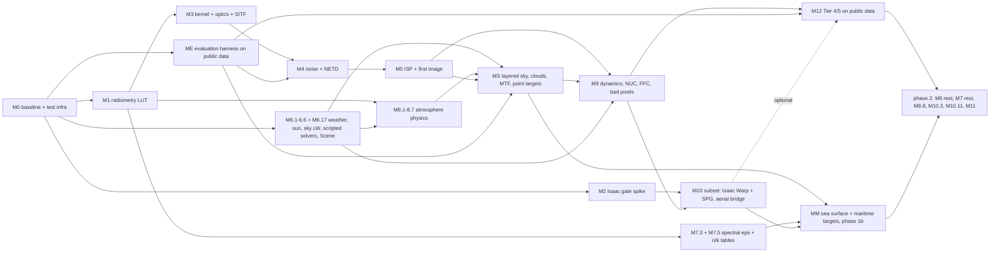

# irsim roadmap

The implementation plan for taking `irsim` from the current scaffold to an L2-fidelity multi-band IR
camera simulator running in Isaac Sim 6.0, with a clean upgrade path to L3. It is derived from
`docs/physics-model.md` (cited as §N.M throughout), the seven project skills, and the repository as it
stood on 2026-09-10.

**How to use this document.** Pick the lowest-numbered step whose `deps` are all ticked, ship it with the
`ship-step` skill (code + tests that would fail if the physics were wrong + `make check` + README status +
CHANGELOG + ADR if listed), tick it here in the same commit. Steps inside a milestone are ordered; milestones
that do not depend on each other (see the dependency graph) can run in parallel across people. Sizes are
S (hours), M (a day or two), L (several days). No calendar dates — the team decides pace. Work is split
into **phase 1 (sky targets)**, **phase 1b (sea targets, ADR 0078)** and **phase 2 (ground / automotive)**
per ADR 0003 as amended; the Phase plan says which steps of each milestone belong to which phase.

**Picking a step:** take the first step in phase-plan order whose `deps` are all ✅; when it ships, prefix
its **what** cell with `✅ done YYYY-MM-DD <hash>` as M0.1 does. Step ids are stable (`M3.4`, `ME.2`,
`MS.6`; a letter suffix marks a step that was split, `M9.5a`). The **what** column cites the finer work
items of the subsystem maps in [`docs/maps/`](maps/) (e.g. `R-06`, `THM-08`), where the fuller test lists
live. Commit scopes `pipeline`, `validation`, `eval` and `io` are proposed additions to the CLAUDE.md list
(open question 12); until approved, use `build` for infrastructure and the physics scope a step tests.

---

## Current state (2026-09-10)

Verified by reading every file and running the suite, not from the CHANGELOG:

| Thing | State |
|---|---|
| Dev environment | **Installed 2026-09-10** into the project interpreter, Isaac Sim's bundled Python `/home/hunter/IsaacSim/_build/linux-x86_64/release/python.sh` (CPython 3.12.13, NumPy 2.3.1, SciPy 1.17, pydantic 2.11) via `make install PYTHON=…/python.sh` (ADR 0002). Warp 1.16.0 is the `omni.warp.core` Kit extension, importable only inside a running Kit — measured by M2.1 (ADR 0014). |
| Existing unit suite | `make check PYTHON=…/python.sh` **green** after M0.1: ruff clean, 19 files formatted, mypy 0 issues, 25 tests in 0.19 s. Before M0.1 it was red on lint (N802), format (3 files) and mypy (one `Any` return), and red on NumPy 1.x (`np.trapezoid`). |
| `src/irsim/radiometry` | `constants.py` (CODATA, C1L/C1Q/C2, σ, Wien, guards — all verified) and `planck.py` (energy + photon spectral radiance, energy-form ∂B/∂T, fractional exitance series, top-hat band radiance). No photon-form derivative, no R(λ) loader, no quadrature, no LUT, no inverse. |
| Every other `src/irsim/*` package | One-line docstring stub. |
| `src/irsim_isaac` | Docstring stubs; no kernels, no AOV code, no `.cu/.cu.lua/.usda`. |
| Tests | `test_planck.py` (11 analytic tests), `test_layering.py` (engine-import guard over `src/irsim`), `conftest.py` (`rng`, `gbuffer_ramp`, `gbuffer_uniform`). No golden or integration tests. `make golden-update` passes `--update-golden`, which **no conftest registers** — it errors today. |
| Configs / data | `configs/sensors/flir_boson_640_lwir.yaml` (full §12.2 shape, most values `ESTIMATED`); it references `spectra/boson_vox.csv`, which **does not exist**. `configs/materials`, `configs/atmospheres`, `data/*` are empty. |
| Docs | `docs/physics-model.md` (1393 lines), ADR 0001 (template), 0002 (interpreter), 0003 (sky-first), `docs/maps/` (the twelve subsystem maps), README status table (radiometry 🟡 T1, all else ⬜). |
| Tests CLAUDE.md claims exist | Non-negotiable #2 ("there is a test for the encode/decode round trip") and #4 ("a test that walks the whole material library") — **neither exists yet**. Both are early steps below. |

See `README.md` for the status table this roadmap updates.

---

## Target

- **Application, phase 1 (ADR 0003):** objects in the sky — drones, aircraft, birds — against a sky
  background, seen by a ground- or vehicle-mounted LWIR camera. Ranges to 5 km are *modelled*; the
  public data validates target size and contrast only to ~200 m (Halmstad > 60 m bin, LRDDv3 ≤ 200 m
  air-to-air), so 0.5–5 km stays analytic self-consistency until better data exists. **Phase 2** widens
  to the ground scenes and automotive use case the spec was written for.
- **Fidelity:** L2 per §1 with the sky-target additions the spec does not cover — a layered slant-path
  atmosphere whose column emission *is* the sky background, cloud clutter, sub-pixel / point-target
  radiometry — each recorded in an ADR with its error, so the L3 upgrade is a known delta.
- **First release ("defensible LWIR camera for sky targets"):** FLIR Boson 640 (and the Halmstad set's
  Boson 320 core) modelled end to end in the engine-free CPU reference pipeline; Tier 1 identities and
  Tier 2 self-consistency benches green; an 8-bit output whose noise, striping, FFC and clutter statistics
  fall inside the bands measured on Anti-UAV410 / Halmstad flat-sky regions after the same signal path
  and codec; synthetic→real and real→synthetic detector numbers beside the real→real ceiling.
  Milestones M0, M1, ME, M2, M3, M4, M5, MS, M9, M12 plus the phase-1 subsets of M6/M7/M8/M10/M11.
- **Isaac Sim 6.0:** the M2 gate spike runs early and in parallel; the phase-1 Warp path (M10 subset)
  follows the CPU pipeline; SPG only for stages proven in Warp.
- **Architecture proof:** the band-literal guard and the SWIR example config (M11.1) land in phase 1;
  the reflective-path physics for SWIR and MWIR is phase 2.
- **Evidence:** Tier 4 statistics and Tier 5 detector experiments on public data (M12), with the DN8
  substitutes for the §15 targets stated in ADR 0068 and the untestable ones (< 2 K bias) reported as
  such. The §15 lab benches are written as a protocol (M12.4) and executed only if a camera arrives.

Engine-free means `src/irsim` + plain `pytest`, no GPU. Everything marked **Isaac? = yes** needs the
simulator and is skipped by default (`@pytest.mark.isaac` / `@pytest.mark.gpu`).

---

## Phase plan

| phase | milestones in order | notes |
|---|---|---|
| **1 — sky targets** | M0 → M1 ∥ ME → M3 → M4 → M5 → MS → M9 → M12, with M2 beside M1 and the M10 subset beside M12 | phase-1 subsets of M6/M7/M8/M10/M11 below; ME.1–ME.2 must land before M4.4, ME.5 before MS.8 |
| **1b — sea targets** | MM.1 ∥ MM.2 → MM.3 → MM.4 → MM.5 → MM.6 → MM.7 → MM.8 | ADR 0078. Starts once MS and the M10 aerial subset are in; promotes M7.3/M7.5 out of phase 2 |
| **2 — ground / automotive** | M6 (rest) → M7 (rest) → M8.8 → M10.3, M10.11 → M11 → ground Tier 3/4 | re-instates the §16.4 order for what was deferred |

Phase-1 subsets of the ground-oriented milestones (every phase-1 step's `deps` resolve inside phase 1):

- **M6:** M6.1, M6.2 (weather), M6.3 (convection), M6.4 (sun geometry), M6.5 (broadband longwave sky),
  M6.6 (Prescribed / Newton solvers — the target's own heat sources and the coupled housing node),
  **M6.17** (the `Scene` builder that injects one `WeatherSeries` everywhere — non-negotiable #6 lives
  here in phase 1). M6.7–M6.16 (ground energy balance and everything built on it) are phase 2.
- **M7:** M7.2 (schema), M7.11 (environment config), **M7.18** (scalar-per-band `MaterialTable` with
  the UNMAPPED sentinel), M7.13 (reflected term), M7.17 (mapping resolver), and the four-material aerial
  library **MS.7**. M7.3–M7.10, M7.14–M7.16 are phase 2; M7.10 then extends the M7.18 table with the
  Level A/B columns.
- **M8:** M8.1–M8.7 (all the physics; MS.1 extends them to layered slant paths). M8.8 only with MWIR.
- **M10:** M10.1, M10.2, M10.4–M10.10b, M10.12, M10.13a–e (where M2.3 allows), **M10.18** (aerial
  thermal bridge on Prescribed/Newton solvers) and **M10.19** (in-sim aerial phenomenology). M10.3
  (ThermalField bridge) and M10.11 (ground demo stage) are phase 2.
- **M11:** M11.1 only.

Phase 1b adds one milestone of its own (**MM**) and promotes two steps out of phase 2:

- **M7 (promoted to phase 1b):** **M7.3** (spectral ε(λ) loader and band-effective emissivity) and
  **M7.5** (n/k tables). A sea surface is the one background whose emissivity cannot be a scalar —
  §4.2 refuses Level C for water by name — so MM.1 needs band-effective Fresnel, not a 10 µm point
  value. M7.4 (✅ 2026-09-14) already landed early for the same reason. M7.6/M7.8 follow only if
  Level A proves too expensive per pixel; the rest of M7 stays phase 2.
- **MWIR sun glint off the sea is explicitly *not* in phase 1b.** It belongs to M11.7's specular
  lobe, which is a band step, and MM.2's slope distribution is exactly the input it will want — the
  point of putting the slope statistics in their own step is that glint reuses them rather than
  growing a second wave model.
## Milestones

### M0 — Green baseline and test infrastructure

**Goal:** the gate is real. `make check` passes on a fresh clone; the test infrastructure the skills
assume (golden fixtures, fixture set, layering guard, encoding round trip) actually exists; the spec
fixes coding depends on are raised first.
**Tier:** T1 (infrastructure). **Exit criteria:** `make check` green under the project interpreter
(Isaac's 3.12) and under one plain CPython ≥ 3.10 venv in CI (M0.11); `make golden-update` accepted;
`make test` < 5 s; every CLAUDE.md non-negotiable that can be enforced without physics code has its test;
`docs/spec-issues.md` exists and the three coding-blocking spec fixes are applied (M0.10).

| id | commit title | spec | what | verification | ADR | deps | size | Isaac? |
|---|---|---|---|---|---|---|---|---|
| M0.1 | `chore(build): make check green under the Isaac Sim interpreter; numpy>=2.0` | §15 T1 | ✅ **done 2026-09-10.** Makefile `PYTHON ?=` variable; NumPy floor 2.0 (Isaac ships 2.3.1); ruff `N802` ignore; one mypy fix; three files reformatted; `make test` prints the ten slowest tests. (`VAL-01`, `R-00`) | `make check PYTHON=…/python.sh`: ruff clean, mypy 0 issues, 25 tests in 0.19 s | 0002 dependency floors | — | S | no |
| M0.2 | `test(build): golden fixture helper and --update-golden option` | ir-sim-testing skill | ✅ **done 2026-09-10.** `tests/golden/conftest.py` with `pytest_addoption('--update-golden')`, `assert_golden(name, array, config_hash, tol)` storing `.npy` (float32/uint16 only) + JSON sidecar; STALE (hash mismatch) reported distinctly from FAILING; actual array dumped beside expected on failure. Decide whether `tests/golden` joins `make test`. (`VAL-05`) | Self-tests: stale path names the config; failure prints both paths; float16 golden refused | 0004 golden policy | M0.1 | M | no |
| M0.3 | `test(build): harden layering guard in both directions` | CLAUDE.md #1 | ✅ **done 2026-09-10.** Forbid `irsim` → `irsim_isaac`; forbid `torch`, `torchvision`, `cv2`, `PIL`, `imageio`, `sklearn` under `src/irsim` (the evaluation stack lives in `src/irsim_eval`, open question 12); scan `tests/unit` for engine imports; scanner self-test on synthetic offending modules; `irsim_isaac/env.py` (`has_isaac()`, `has_warp()`) and `tests/integration/conftest.py` that skips without Isaac. (`VAL-06`, `IU-03`) | Synthetic `import omni` and `import torch` files under `src/irsim` are caught; `import irsim_isaac` succeeds without Isaac; collection of `tests/integration` yields only skips when `has_isaac()` is False | — | M0.1 | S | no |
| M0.4 | `test(radiometry): Stefan-Boltzmann identity to 1e-6 via analytic tail` | §3.1, §15 T1 | ✅ **done 2026-09-10** (measured 3e-11; the `F(5000 µm) = 1 to 1e-12` check was physically wrong — 1−F = 4.5e-8 — and is replaced by a Rayleigh–Jeans-limit check, see ADR 0005). Replace the 2e-5 trapezoid test with Simpson on 0.1–200 µm + closed-form tail `(σT⁴/π)(1−F)` from `fractional_exitance`; route `fractional_exitance`/`band_radiance_tophat` inputs through `_validate` so metre-valued wavelengths raise. (`VAL-02`, `R-00`, `R-02` fix) | ∫B dλ = σT⁴/π to 1e-6 at 250/300/800 K; F(5000 µm) = 1 to 1e-12; `band_radiance_tophat(8e-6, 12e-6, 300)` raises | 0005 SB tolerance | M0.1 | S | no |
| M0.5 | `feat(radiometry): temperature encoding constants and encode/decode` | §13.3, §3.2, CLAUDE.md #2 | ✅ **done 2026-09-10** (ADR 0006, not 0005 — the backlog numbering; fp32 round trip 0.054 mK, the floor is float32 representation of T near 1000 K). `T_ENCODE_REF_K = 200`, `T_ENCODE_SPAN_K = 800`, `LUT_T_MIN/MAX/DT` in `constants.py` (one definition shared by config, radiometry, isaac); `irsim.radiometry.encoding.encode_temperature/decode_temperature` float32, raising on float16; optional coarse/fine fp16-pair codec as the §13.3 fallback. (`IU-01`, `VAL-04`) | fp32 round trip over 200–1000 K < 10 mK (expect ~0.02 mK); **negative controls**: raw Kelvin through fp16 → max error ≥ 0.1 K at 300 K; encoded `c` through fp16 → max error ≥ 0.04 K at 300 K and ≥ 0.15 K over 800–1000 K (both ≫ 10 mK); float16 input raises; fp16-pair codec < 10 mK | 0005 encoding | M0.1 | S | no |
| M0.6 | `feat(config): G-buffer contract dataclass and the synthetic fixture set` | ir-sim-testing skill, §13.3 | ✅ **done 2026-09-10.** `irsim.config.gbuffer.GBuffer` validating dtypes: float16 rejected on `temperature_k`, `encoded_t`, `distance_m` and any radiance key; other keys any float, upcast to float32 by the adapter (§13.3 allows fp16 normals/AO/motion). Fixtures: `gbuffer_two_material`, `gbuffer_sphere` (analytic cos θ = √(1−r²/R²), rim < 0.02), `gbuffer_step_edge` (5.5° tilt, 4× supersampled), `gbuffer_moving_edge`, `encoded_t` key; `material_id` fixtures use id 1 (0 is the UNMAPPED sentinel, M7.18); `test_gbuffer_schema.py` freezing the key set the Isaac adapter must emit. (`VAL-03`, `IU-02`) | Sphere fixture matches analytic cos θ to 1e-6; step edge has exactly one transition column; fitted edge angle 5.5° ± 0.1°; float16 temperature raises, float16 normal is upcast | — | M0.1 | M | no |
| M0.7 | `feat(config): pydantic sensor schema for §12.2 with physical validation` | §12.2, §16.1 | ✅ **done 2026-09-10.** `SensorConfig` (`extra='forbid'`, frozen, units-in-names, `schema_version`), discriminated `fpa.type` (bolometer forbids photon fields and vice versa), `ratios_3d.tvh == 1.0`, regime-vs-wavelength consistency, derived `pixel_area_m2`, `nyquist_cyc_per_mm`, `hfov_deg`, `frame_period_s`, `dn_max`; **no** aperture property. Add `types-PyYAML` (or mypy override) so `make typecheck` passes. (`BC-01`) | Boson YAML loads exactly; `pixel_area_m2 == 1.296e-10` to 1e-12; Nyquist 41.67 cyc/mm; HFOV 30.7° (documents the 32° discrepancy); `f_stop` typo rejected; source scan finds no aperture expression in `irsim.config` | 0007 config schema | M0.1 | M | no |
| M0.8 | `feat(config): YAML loader, data-root path resolution, canonical config and band hashes` | §12.2, §3.2(b) | ✅ **done 2026-09-10.** `load_sensor_config(path, data_dir)` resolving `spectral_response` against `<repo>/data` (override by arg / `IRSIM_DATA_DIR`), erroring by name on a missing file; `config_hash` (SHA-256 of canonical JSON, file paths replaced by content hashes) and `band_hash` (band block + spectral bytes only, so NETD grades share a LUT). Uses the `data/spectra/responses/` layout that M0.10 fixes in the spec. (`BC-02`) | Hash invariant to comments/key order; changes for every numeric leaf (parametrised); `band_hash` ignores `netd_mk_at_300k`; dangling `boson_vox.csv` errors by path | 0008 hashes & data root | M0.7 | S | no |
| M0.9 | `feat(config): band registry with canonical ids and per-band defaults` | §12.1, §5.2 | ✅ **done 2026-09-10.** `BandId = {nir, swir, mwir, lwir}`, nominal ranges from §12.1, `band_id_for(λmin, λmax)` by maximal overlap (error < 50 %), optional explicit `band.id` validated against derivation, `enabled_illumination_terms(regime)` → `{self_emission, solar, night}` so kernels never switch on a band name. (`BC-04`) | Each §12.1 range maps to itself; 1.8–2.6 µm raises; `Lb(SWIR,300 K)/Lb(LWIR,300 K) < 1e-6` and `Lb(MWIR)/Lb(LWIR) ∈ [1e-2, 1e-1]` via `band_radiance_tophat` | in 0007 | M0.7 | S | no |
| M0.10 | `docs(docs): spec fixes raised before coding — T_sky angle argument, §6.1 solar complement, §12.2 response path; open docs/spec-issues.md` | §5.3(a) line 311, §6.1 line 355, §12.2 line 832, CLAUDE.md "say so before coding" | ✅ **done 2026-09-10** (applied; awaiting spec-owner review, open question 10). Change `cos^q(θ_el)` → `cos^q(θ_zen)` (line 314 and R13 require the depression at zenith), `(1−α_sol)^c Q_sol` → `α_sol Q_sol` (line 363 already says so), `responses/boson_vox.csv` → `data/spectra/responses/boson_vox.csv`; open `docs/spec-issues.md` listing the S/T issues below with their proposed resolutions for the spec owner. No code. | Reviewed by the spec owner (open question 10); M6.5/MS.2's coldest-at-zenith and M6.7's monotone-α tests encode the fixes | — | — | S | no |
| M0.11 | `chore(build): GPU-free CI job — plain CPython 3.10 venv running make check` | ADR 0002 revisit clause | ✅ **done 2026-09-10.** CI workflow (or a Makefile `ci` target) that creates a venv with the dev extras and runs `make check PYTHON=<venv>/bin/python`; documents the interpreter matrix (Isaac 3.12 locally, plain 3.10 in CI). | CI green on the scaffold in < 2 min; the job fails on a deliberately introduced `import omni` in `src/irsim` | in 0002 | M0.1 | S | no |

### M1 — Radiometry core: band LUT, inverse, first band data (§16.4 step 1)

**Goal:** every Tier 1 radiometry identity in §15 is a passing test; a band is a YAML + CSV; `make luts`
works. **Tier:** T1. **Exit criteria:** LUT vs quadrature < 5 mK over 200–1000 K; inverse round trip
< 1 mK; in-band ∂L/∂T vs FD < 1e-5; `make luts` regenerates the LWIR bundle with a valid sidecar; README
`Bands configured: LWIR`.

| id | commit title | spec | what | verification | ADR | deps | size | Isaac? |
|---|---|---|---|---|---|---|---|---|
| M1.1 | `feat(radiometry): photon-form thermal derivative` | §3.4, §9.4 | ✅ **done 2026-09-11.** `d_spectral_photon_radiance_dT` with the same expm1/clip guards; export both derivative forms. Needed because photon-detector NETD divides by (∂L_q/∂T)_B. (`R-01`) | `dB_q/dT · hc/λ == dB/dT` to 1e-12; vs central FD < 1e-6; finite over the 200–2000 K × 0.4–20 µm sweep | — | M0.4 | S | no |
| M1.2 | `feat(radiometry): photon fractional exitance and σ_q closed form` | §3.2(a) | ✅ **done 2026-09-11** (`F_q(5000 µm) = 1 to 1e-6` replaced by a Rayleigh–Jeans-limit check as in M0.4: 1−F_q(1000 µm, 300 K) = 4.8e-4 physically). `SIGMA_Q = 2π·2ζ(3)k_B³/(h³c²) = 1.52046e15` with derivation in `constants.py`; `fractional_photon_exitance`, `band_photon_radiance_tophat` — the only implementation-independent oracle for the `Lb_q` table. (`R-02`) | `F_q(5000 µm) = 1` to 1e-6; vs trapezoid of `spectral_photon_radiance` < 1e-4; known answer `Lb_q(7.5–13.5, 300 K) = 2.915e21` to 1e-3; `Lb/Lb_q = hc/λ_eff` with λ_eff inside the band | — | M1.1 | S | no |
| M1.3 | `feat(radiometry): spectral response file contract, loader, and estimated Boson VOx curve` | §2 R(λ), §3.2(b), §12.2 | ✅ **done 2026-09-11.** `irsim.radiometry.spectral_response.load_spectral_response` → `SpectralResponse` (and `irsim.radiometry.band.Band`): two-column CSV, `#` header with provenance, λ strictly increasing in **µm** (0.1–100), 0 ≤ R ≤ 1, **peak == 1.0 ± 1e-6** (assert, never renormalise — QE lives in `fpa.quantum_efficiency`), resample to 0.01 µm, zero outside support; `Band` object; author `data/spectra/responses/boson_vox.csv` (ESTIMATED: 7.5–13.5 µm with 0.25 µm cosine edges) and point the YAML at it. (`R-03`, `BC-03`) | Exact top-hat CSV integrates to `band_radiance_tophat` within 0.1 %; nm-valued file raises; area-normalised (peak 0.17) file raises; Boson 50 % points within ±0.2 µm of 7.5/13.5; `∫R dλ` of a resampled top-hat equals its width to 1e-12 | 0009 R(λ) & QE convention | M0.8 | M | no |
| M1.4 | `feat(radiometry): reference band integration by Simpson quadrature` | §3.2(b), §3.4 | ✅ **done 2026-09-11.** `band_radiance`, `band_photon_radiance`, `d_band_radiance_dT`, `d_band_photon_radiance_dT` — float64, vectorised over T, composite Simpson on an odd-length edge-aligned 0.01 µm grid (numpy, no scipy). The oracle every faster path is tested against. (`R-04`) | Top-hat vs closed-form series < 0.1 % for (7.5–13.5, 300), (3–5, 300/500), (0.9–1.7, 300) with the error also printed in mK; in-band derivative vs FD (1 mK) < 1e-5 over 200–1000 K; **known answer** `dLb/dT(373)/dLb/dT(300) = 1.736 ± 0.5 %` for 7.5–13.5 µm (the 39→23 mK NETD anchor of [R9]) | — | M1.2, M1.3 | M | no |
| M1.5 | `feat(radiometry): band-weighted averaging of spectral material properties` | App. A #3, §12.3, §4.1 | ✅ **done 2026-09-11.** `band_average(band, s(λ), T_ref, form)` = ∫R s B dλ / ∫R B dλ (energy or photon weighting). The only sanctioned route from ε(λ)/ρ(λ)/τ(λ) files to per-band scalars; linear, so Kirchhoff closure survives. (`R-05`) | Constant s → same value to 1e-12; step spectrum vs closed-form ratio of two top-hats to 1e-4; `avg(ε)+avg(ρ)+avg(τ) = 1` to 1e-9 for pointwise-closed spectra; T-dependence of a sloped ε is > 1e-3 between 300 and 600 K (documents what the ADR accepts) | 0010 grey-within-band ε | M1.4 | S | no |
| M1.6 | `feat(radiometry): float32 band LUT with the §13.5 interpolation contract` | §3.2(b), §13.5, CLAUDE.md #2 | ✅ **done 2026-09-11** (float32 cast measured 0.086 mK, not < 0.05: the kernel's float32 index near 16000 costs 0.05 mK by itself — recorded in ADR 0011). `BandLUT`: 200–1000 K, 0.05 K, N = 16001, tables `Lb, Lb_q, dLb_dT, dLb_q_dT` built in float64, cast once; `lookup(T, quantity)` implements `u = (T−T0)/(T1−T0)·(N−1)` **in float32 with the kernel's clamp to N−1.001**, float16 rejected; session-scoped pytest fixture (< 2 s build). Out-of-range policy = clamp, flagged. (`R-06`) | Off-grid lookup vs M1.4 quadrature < 5 mK over 200–1000 K with actual mK printed (expect ≤ 0.03 mK); float32 cast cost < 0.05 mK; `Lb` strictly increasing, `dLb_dT` > 0; `lookup(199 K) == lookup(200 K)` exactly; FD of `Lb_q` table vs `dLb_q_dT` table < 1e-4 | 0011 LUT grid & range | M1.4 | M | no |
| M1.7 | `feat(radiometry): inverse lookup — apparent temperature from band radiance` | §3.3, §15 T1 | ✅ **done 2026-09-11.** `BandLUT.apparent_temperature(L)`: `searchsorted` + linear inversion in the bin, float32 in/out; policy for radiance outside `[Lb(T0), Lb(T1)]` (clamp vs NaN — ADR). Output named `T_apparent`, never routed through kinetic T. (`R-07`) | Round trip < 1 mK on a 0.013 K off-grid sweep; grey body ε = 0.9 at 300 K: `T_app` agrees with `brentq` on the closed form < 5 mK (= 293.51 K — the 6.5 K gap *is* the product, §3.3); photon-form round trip < 1 mK | in 0011 | M1.6 | S | no |
| M1.8 | `feat(radiometry): LUT bundle on disk with hash sidecar, stale detection, binary export` | §3.2(b), §13.5, §14 | ✅ **done 2026-09-11** (generated, not committed — ADR 0012 answers open question 6 provisionally). `save_band_lut` → `<band_hash>_{Lb,Lb_q,dLb_dT,dLb_q_dT}.npy` + raw little-endian `.f32` (for Lua/Unreal `PF_R32_FLOAT`) + `<band_hash>_lut.json` {T0, T1, N, dt, dtype, band, config_sha256, spectral_sha256, numpy version}; `load_band_lut` recomputes hashes and raises `StaleLUTError` naming the changed input; asserts float32. Decide committed-vs-generated (currently gitignored; skill says committed) — ADR. (`R-08`, `IU-04`, `BC-08`) | Save→load bitwise; hand-written float16/float64 `.npy` rejected; one-byte CSV change → `StaleLUTError`; `.f32` decodes bit-identical to `.npy`; sidecar T0/T1/N land grid temperatures on integer indices | 0012 LUT artefact policy | M1.7 | M | no |
| M1.9 | `feat(radiometry): scripts/generate_luts.py and make luts` | §3.2(b), §12.2 | ✅ **done 2026-09-11.** Replace the stub: `--configs --out --data`; per sensor YAML build via M1.3/M1.4/M1.6, cross-check against the closed-form top-hat over the config range (report % and mK), write via M1.8, print a summary. Adding a band must touch only YAML + CSV + this command. (`R-09`) | Synthetic top-hat CSV + minimal YAML → `Lb(300 K) = 55.49 W m⁻² sr⁻¹` to 0.1 %, sidecar verifies; peak ≠ 1 or nm file → non-zero exit, nothing written; rerun is bitwise-deterministic | — | M1.8 | M | no |
| M1.10 | `feat(radiometry): generate the LWIR Boson LUT; README bands configured` | §16.1, §12.1 | ✅ **done 2026-09-11** (bundle is generated per ADR 0012, not committed). Run `make luts` on the estimated Boson curve; commit per 0012; README `Bands configured: LWIR (flir_boson_640_lwir)`; status row radiometry → 🟢 T1. (`R-10`) | Loader accepts the file; λ_eff at 300 K within 9.5–11.5 µm; `Lb(300 K)` within 10 % of the top-hat 55.49 (soft edges legitimately differ by a few %); `dLb_dT(373)/dLb_dT(300) ∈ [1.65, 1.85]` | 0013 estimated Boson R(λ) | M1.9 | S | no |
| M1.11 | `test(radiometry): golden LUT slice` | ir-sim-testing skill | ✅ **done 2026-09-11.** Every 100th entry of `Lb`, `dLb_dT` as a golden with config hash, 1 mK tolerance, via the M0.2 helper. (`R-11`) | Regenerated LUT vs golden < 1 mK; hash mismatch reported STALE | — | M1.10, M0.2 | S | no |

### ME — Evaluation harness on public data (phase 1, in parallel with M1)

**Goal:** before any pixel is simulated, know what real Boson-class sky video looks like statistically —
*including what the storage path did to it* — and have the code that measures the simulator against it.
Image decoding, the discriminator and the trainers live in a separate package `src/irsim_eval/` (extras
`validation`, `ml`); `src/irsim/validation` keeps NumPy-only metric functions. Datasets stay outside git.
**Tier:** T4/T5 infrastructure. **Exit criteria:** `data/validation/README.md` indexes every set with
licence, hash, sensor, signal path, bit depth and codec; each analyser recovers its own synthetic ground
truth *and* reports its bias through the set's codec; a reference-statistics report for Anti-UAV410 and
the Halmstad set is committed; a detector trains and evaluates real→real from one command.

| id | commit title | spec | what | verification | ADR | deps | size | Isaac? |
|---|---|---|---|---|---|---|---|---|
| ME.1a | `feat(eval): dataset index, fetch script, signal-path and licence notes` | §15 T4 [R34], ADR 0003 | ✅ **done 2026-09-13** -- split from ME.1 (the `irsim_eval.data` reader and the static-clip detector are ME.1b). `data/validation/datasets.yaml` + `irsim_eval.manifest`: licence, access, sensor, **signal path**, bit depth, codec, counts and the permitted/excluded analysers per set, with licence, signal path and analysers as *required* fields. **Checked against each publisher's page and it changed the plan:** only Halmstad (CC0-1.0, Zenodo 10.5281/zenodo.5500576, Boson 320x256, Y16 -> 8-bit -> mp4) states a licence, so it is the single `primary`; the other five are `unstated` -- Anti-UAV410 and CST publish none, LRDDv3 is behind an export-control access form, IRSTD-1k/NUAA-SIRST have no canonical source -- and CST is unreleased. `scripts/fetch_validation_data.py` refuses an `unstated` set unless asked, never auto-downloads a `manual` one, refuses non-https, and always hashes what is on disk. `data/validation/README.md` is generated. New `src/irsim_eval/` package, in `make typecheck`. | Licence and signal path non-empty for every set; `noise_3d` usable on Halmstad alone and `agc_signature` excluded there; exclusions beat inclusions; unstated refused by default and accepted with the flag; the licence gate precedes the access mode; http refused and file:// streamed byte-for-byte; a recorded hash detects an edited file; a malformed hash rejected; README regeneration is current (22 tests) | in 0068 | M0.1 | S | no |
| ME.1b | `feat(eval): Sequence/Frame reader and the static-camera clip detector` | §15 T4 | ✅ **done 2026-09-13.** `irsim_eval.data`: `Sequence`/`Frame`/`Box` plus a canonical layout (JSON index + one array per frame) and its writer, so converters target one form and no analyser reads a publisher's. Frames load on demand; **8-bit is enforced** (the quantisation is a floor under every statistic, ADR 0003); boxes are top-left + size in the project's pixel-edge convention. `irsim_eval.motion`: the static-clip gate, discriminating on **cumulative displacement from frame 0** rather than per-frame motion -- jitter is bounded and static, a drift accumulates and is moving however small its steps. Phase correlation with **Foroosh's ratio**, not a parabolic fit: a phase-only peak is a Dirichlet kernel and the parabola under-reads it ~30 % at a third of a pixel, biased toward calling a drifting clip static. New `validation` extra (imageio); `.npy` sequences need no decoder. | Synthetic sequence round-trips frames, boxes and attributes exactly; 8-bit enforced and a shape/schema contradiction raises; known sub-pixel shifts recovered to 0.1 px; a translated clip flagged moving and a jittered one static **at the same per-frame step size**; drift ratio separates them; a tripod clip with only noise stays static (16 tests) | in 0068 | ME.1a | S | no |
| ME.2a | `feat(validation): noise analysers — NVESD 3-D decomposition, spatial/temporal PSD, compare_psd` | §10.2 [R28], §15 T2/T4(c) | ✅ **done 2026-09-11** (split from ME.2; the NumPy analysers only, no dataset dependency). `irsim/validation/noise.py`: leakage-corrected `decompose_3d` (random-effects mean squares), `spatial_psd` with the k_v = 0 / k_h = 0 lines, `temporal_psd`, `compare_psd` — **the sole home of these functions** (`NOISE-04`, `NOISE-12`). | Synthetic float cube with the Boson ratios recovered within 3× the estimator's own sampling floor per component (`estimate_floors`; TVH 0.6 %, VH 3 %, but σ_H/σ_V only ~27 % at 64 columns/rows — the flat 5 % of the plan is unattainable on a 64-wide cube); white cube radial PSD max/min < 1.3 and no directional terms; σ_H-only ≥ 95 % on the k_v = 0 line; sum-of-squares identity 1e-6 | 0023 3-D estimator & tolerances | M4.3, M0.6 | M | no |
| ME.2b | `feat(validation): flat-region finder, temporal PSD shape on sky, codec floor` | §10.2, §15 T4(c) | ✅ **done 2026-09-14** (ADR 0023 addendum). `irsim.validation.flat`: `robust_noise_scale` (MAD of the first differences **about their own median**, so a gradient cancels exactly, minimum over the two axes so striping does not inflate it) as the ruler, and every threshold in units of it rather than DN; windows scored on a fitted plane's peak-to-peak and on block-averaged excess structure; per-pixel temporal std and `temporal_noise`, whose mean variance is σ_T²+σ_TV²+σ_TH²+σ_TVH² independently of `decompose_3d`. Two behaviours are deliberate and pinned: **striped windows stay flat** (else column noise is unmeasurable by construction) and a **single-pixel target is caught by the outlier rule alone** — in a 4×4 block it is a quarter of the block noise. `irsim.validation.codec`: lattice step read off the data, floor `step/√12`, Sheppard correction, per-component **codec-limited** flag, 8-px blockiness on a **per-gap null** (a pixel-count null reads |z| ~ 3 on an uncoded striped cube). `temporal_shape` in `noise.py` fits the sampled one-pole, **dropping DC and Nyquist** (the one-sided Nyquist bin is half-weight; keeping it reads 2 % low-pass on white noise, 5× the null). `irsim_eval.transcode.h264_round_trip` with full-range flags pinned. **The headline finding is negative and is now in the README limitations:** 8 bits alone leave only σ_TVH measurable on a 1.5-code Boson clip, and x264 at *CRF 18* removes 95 % of it — public-set noise numbers are lower bounds. | **Measured:** σ = 0.3 LSB reads 0.4155 raw (+38 %), Sheppard-corrected to 0.2989 (−0.4 %) **and** flagged codec-limited at 1.04 floors — both halves of the control; CRF 0 round trip bit-exact (without the range flags it drifts a code); CRF 18 takes σ_TVH 1.53 → 0.06 and `measurable()` → `()`; 10 ms membrane at 60 Hz recovered to 1 % and white separated from a 0.3-frame filter at 28σ; a 1σ drift costs 1.4 % on τ and a 5σ drift 28 %, with `drift_fraction` 0.14 → 0.75 announcing it (25 tests) | in 0023 | ME.1, ME.2a | M | no |
| ME.3a | `feat(validation): shutter signature — FFC freeze detection, interval gate, between-FFC pattern growth` | §11.2, §10.3, §15 T4 | ✅ **done 2026-09-14** (ADR 0068, opened here — it was owed from ME.1a). Split from ME.3: this half runs on **any** clip with frames, ME.3b's half only on display output. `irsim.validation.shutter`: `find_freezes` (runs of still frames, each gap judged against the clip's **own median gap**, so the test is scale-free and a codec-flattened clip is refused rather than read as one long freeze) reporting `pattern_change` beside every run — **a freeze is not an FFC**: counting repeated frames alone cannot tell a shutter from a dropped chunk of recording, and both would feed an interval distribution identically. `freeze_intervals_s` refuses a clip under `MIN_INTERVAL_CLIP_S = 180 s` (the Boson's own schedule), so Halmstad's 10 s clips give freeze *length* and never an interval. `line_means`/`pattern_energy`/`fit_pattern_growth` fit σ²(t) = floor + A(1 − e^{−2t/τ}) since each shutter — **the factor of two is in the variance**, and fitting it with the amplitude's law returns 2τ and looks reasonable. | **Measured:** 42-frame freezes every 10 800 recovered exactly (start frame and length) on a 21 700-frame clip, and the real `FfcController.process` loop agrees frame for frame; a stall reads pattern_change < 2.5 and a shutter > 5; a 10 s clip raises on the interval; τ = 30 s recovered from a 5-minute OU sequence to within 15 % **and 2τ explicitly rejected**; through x264, 4-code noise keeps the events exactly at CRF 18 while a 1-code clip is refused at CRF 23 and invents an event at CRF 18 (ME.2b's floor in a second statistic) (9 tests) | 0068 | ME.2 | S | no |
| ME.3b | `feat(validation): display-output extractors — AGC signature, DDE overshoot, replaced-pixel map` | §11.3, §10.4, §15 T4 | ✅ **done 2026-09-14** (ADR 0068 addendum). `irsim.validation.display_signature`: `require_display_output` makes the recorder conversion (`display`/`linear`/`min_max`/`unknown`) a **required argument** of `agc_signature` and `edge_overshoot`, so a Y16-derived set is refused in the function and not only in the index. `agc_signature` reports `cdf_deviation` (Kolmogorov distance of the output histogram from uniform) with three verdicts — `equalised` / `stretched` / **`indeterminate`**, because a scene whose own histogram is already uniform reads as equalised under *any* monotone stretch and a boolean would be confidently wrong there. `edge_overshoot` measures the ringing as a fraction of the step, with a local-maximum rule (the overshoot is itself a difference above the edge threshold, and measuring from it puts the real step inside the ring window). `replaced_pixel_map` scores pixels by their vanishing Laplacian, normalised by the array's own median so a smooth *scene* produces no detections. | **Measured:** plateau 0.003–0.007 against linear 0.15–0.50 across flat sky, a gradient, cloud and a horizon (20× separation), and a 20σ ramp under linear correctly reported indeterminate at 0.032; DDE overshoot = **gain/3** exactly (the analytic 3×3-box answer) to 1e-6, and to 10 % on a noisy 8-bit frame; 69 injected replaced pixels all found on float and 93 % on 8-bit codes with **zero** false positives; through x264 CRF 12 recall falls to 0 with false positives still 0 — silent rather than wrong; Y16 modes raise (10 tests) | in 0068 | ME.3a | S | no |
| ME.4 | `feat(validation): sky and target statistics — scale-free elevation profile, cloud spectra, size-vs-range, SCR, polarity, edge spread, smear` | §5.3, §8.3, §15 T4 | ✅ **done 2026-09-15** (ADR 0068 addendum; **the τ criterion below was wrong and is corrected by measurement**). `irsim.validation.targets`: `target_statistics` (SCR against the *ring* around the box, not the frame — a sky target's background is the sky behind it, and a frame-wide one mixes in the horizon), `sky_profile` returning shape **and** SNR-per-row (an AGC that stretched the sky twice as hard doubles the raw gradient and moves neither), `clutter_slope`, `edge_spread_function`, `profile_centre_index`, `edge_asymmetry`, `asymmetry_vs_tau_curve`, `size_from_range_px`. **`tau_from_asymmetry` was planned and does not exist**: the point-source inversion returns 0.45 frames for a true τ of 4 on a σ = 3 px target, because the core carries far more energy than the trail. What ships instead is the calibration curve, inverted by interpolation. Two findings shaped it. (a) The asymmetry must be split at the **box centre**, not the profile centroid: a long faint trail drags the centroid into itself, leaving the compact core on the leading side, so the centroid split reports the trail on the wrong *side* (−0.056 … −0.230 for a demonstrably rightward trail) and is not monotone in magnitude either. (b) The curve is valid only for the geometry it was built with — target size and speed both move all of it. | Sky column profiles when the horizon is visible, reported **scale-free**: shape normalised by the horizon–zenith span and DN8 gradient per degree divided by flat-sky σ (SNR per degree); clutter PSD slope on cloud regions in the display domain; from boxes: target area in px, local SCR = (mean_target − mean_ring)/std_ring, contrast-polarity fraction, ESF across the target, **trailing/leading edge asymmetry vs box velocity** (the smear fingerprint); LRDDv3 range labels → size and SCR vs range (air-to-air, ≤ 200 m, ground clutter — stated); Halmstad FOV taken from the Breach PTQ-136 datasheet (24° × 19°) with horizon geometry as a consistency check. | **Measured:** Gaussian target of known SCR within 5 % and polarity right in both directions; 1/f^β clutter slope within 0.1 for β = 2 and 3; size-vs-range within 3 % over 120–2500 m; sky shape and SNR-per-degree invariant under an arbitrary affine AGC. **The smear criterion is replaced:** asymmetry does *not* recover τ within 2 %, and no window or target size makes it. Split at the box centre it is strictly monotone in every regime tested — 0.083, 0.261, 0.496, 0.700, 0.836 for τ of 0.5, 1, 2, 4, 8 frames at σ = 3 px and 2 px/frame, and still monotone at a point-like σ = 0.6 px where the centroid split is not — so a τ = 3 probe interpolates to **3.25** against knots at 2 and 4 (the curve is convex; that is the accuracy the statistic supports). A short window compresses rather than folds it: τ 4 → 16 gains 0.212 of asymmetry in a 120 px window and 0.110 in a 6 px one, so the same DN8 error inverts to nearly twice the spread in τ (20 tests) | in 0068 | ME.1 | M | no |
| ME.5 | `feat(validation): reference-statistics report for Anti-UAV410 and the Halmstad set` | §15 T4 | ✅ **done 2026-09-15.** `scripts/reference_statistics.py` measures the Halmstad set and writes `docs/validation/reference-stats-<date>.md` + `.json`. **The set was downloaded, hashed and measured** -- the index said `access: manual`, and checking the DOI showed Zenodo serves the archive over https with no interstitial, so it is `direct` now and the archive's SHA-256 is recorded (every number was measured on those exact bytes). `irsim_eval.decode` (ffmpeg, luma plane, rate read from the container), `irsim_eval.reference` (`measure_clip` + `summarise`, where **no value reaches a report without N, a bootstrap CI and its floor**, and `Refusal` makes a thing that could not be measured a first-class row rather than an absence). The per-clip pass is cached before anything is aggregated, because it is half an hour and an arithmetic bug should not cost it twice. **Three index errors found by measurement and corrected:** the files are **30 fps**, not the core's 60 (a one-pole fit at the wrong rate is wrong by that factor and looks plausible); `color_range` is **unflagged** on every clip; and the labels are MATLAB Video Labeler `groundTruth` **MCOS** objects with **no Python reader** -- the index claimed one ships with the dataset and it does not -- so `target_size_and_scr`, `edge_spread` and `smear` moved to `excluded_analysers`. | **Measured over all 365 IR clips.** The headline is negative and is the most useful thing in the report: the **median robust noise scale is 0.00 codes** and **306 of 365 clips sit at or below one code** -- the codec has removed the sensor's noise entirely, and no window can meet a threshold written in units of a ruler that has collapsed onto the quantiser. With 81 moving and 30 more too structured (the categories overlap), **28 clips** support the noise table: σ_TVH 7.27, σ_VH 19.18, σ_V 4.21 codes, 5.8 of the NVESD seven measurable. The **missing colour-range flag is worth 6.09 codes** (CI 5.88-6.31), several times what noise survived, which is why only scale-free statistics are reported. Blockiness z = 1.84. 15 clips contain a freeze, mean length 18.3 frames, pattern change 4.94 -- shutter-like; the interval can never be measured on 10 s clips and says so. The one-pole τ is reported **with** its drift fraction of 0.93, which the analyser's own rule says makes it untrustworthy. Every box-dependent statistic is refused with its reason (15 tests, all on synthetic input) | in 0068 | ME.2, ME.3, ME.4 | M | no | | Regenerates deterministically; every statistic carries N, CI and its floor; JSON schema test; README `Validation` section links the report | in 0068 | ME.2, ME.3, ME.4 | M | no |
| ME.6 | `feat(validation): real-vs-synthetic comparison and the Tier 4 acceptance report` | §15 T4, §10.2 | ✅ **done 2026-09-15** (ADR 0085). `irsim/validation/compare.py`: histogram EMD in DN8 (the L1 distance between the CDFs, so the answer for a pure shift **is** the shift, in codes), contrast ratio, PSD shape ratio, ESF width, `auc_from_scores` with ties averaged, and `Tier4Report` in which **`untestable` is a verdict** -- §15's "apparent temperature within 2 K" is printed as open in *every* run, because a missing row reads as a passing row. `irsim_eval/discriminator.py` is a **linear probe on interpretable statistics**, fitted in NumPy with no torch and no scikit-learn, **cross-validated** (ten free parameters fitted and scored on the same eighty patches report a gap that is not there), and it **names the feature** that separated the sets. Its AUC is a *lower bound* on the gap: an AUC near 0.5 means these statistics do not separate the two sets, not that a detector cannot -- which is ME.7's question. `scripts/validation_report.py` exits non-zero on any failed check and has a `--self-test` mode that runs synthetic-versus-itself. | **Measured, and it moved three thresholds.** (a) The **x2 PSD-shape target does not catch a 3x noise mismatch**: over three seeds, matched noise reads 1.05-1.08, 2x reads 1.30-1.36, 3x reads 1.77-1.93 and only 5x reaches 3.2 -- so the target is **1.5**, which separates matched from 3x with a 1.6x margin and openly misses a 2x error. (b) A **fraction-of-peak spectral floor is the wrong shape of filter**: on a scene with low-frequency structure "carries little power" and "is high-frequency" are the same bins, and a 1 %-of-peak floor took a 3x mismatch from **1.90 to 1.06** -- it deleted the entire signal -- so it defaults to zero. (c) **"AUC 0.5 ± 0.03" is not achievable**: the AUC's own null standard error at 96 patches per class is **0.042**, so the control's criterion is `|auc - 0.5| < 2 sigma_null`, which scales with n. The control passes every check at AUC 0.54 (+1.02 sigma); a 3x noise mismatch reads AUC > 0.9 and names `noise_scale`/`std`; a 30-code histogram shift fails and the report exits non-zero (15 tests) | 0085 | ME.5 | M | no | | Synthetic-vs-itself: AUC 0.5 ± 0.03 and the report passes; a ×3 noise mismatch fails the PSD check; a shifted histogram reports the shift | in 0068 | ME.5 | M | no |
| ME.7 | `feat(eval): detector train/evaluate harness with the four transfer protocols` | §15 T5 | 🟡 **the scoring half done 2026-09-15; training is blocked on labels, not on compute.** `irsim_eval/detection.py` (pure NumPy, no torch): pairwise IoU, greedy highest-score-first matching, **all-point** average precision at IoU 0.5 (not the 11-point rule -- that was an artefact of a 2007 evaluation server and reports a visibly different number on a small set, the worst property a *comparison* metric can have), AP restricted to small and tiny targets, `detection_rate_by_bin` for P_d against SCR and against apparent size, and false alarms per frame. `scripts/eval_detector.py` scores boxes from anywhere **in the default environment**. `PROTOCOLS` names §15's four and what each answers. The `ml` extra (torch, torchvision) is declared and deliberately not installed; `tests/unit/test_layering.py` already forbids torch in `src/irsim`. ⚠️ **Two blockers, and the binding one is the data.** (a) torch is a multi-gigabyte dependency this session will not install into the user's Isaac build unasked; `scripts/train_detector.py` refuses with the install line. (b) **There are no boxes to train on:** ME.5 found the reference set's labels are MATLAB Video Labeler `groundTruth` MCOS objects with no Python reader, so every protocol is blocked on an export somebody has to do in MATLAB. **P_d vs SCR is the metric that matters** and is why the scoring half was worth landing alone: a drone at 2 km subtends two pixels at SCR 2 and is a rounding error in an AP dominated by close, large targets, so two sets can agree on AP and disagree completely about the regime this simulator exists to model. | **Measured on hand-worked input:** IoU on half-overlapping boxes = 50/150 exactly; the stronger of two boxes on one target claims it and the weaker scores no recall; a perfect detector reads AP 1.0 and a hopeless one 0.0 (not undefined); two hits and two false alarms interleaved give **0.8333** by the all-point rule where the 11-point rule would say 0.8182; a detection cannot claim a target in another frame; **an empty P_d bin reports NaN, never zero** -- "no target was this small" and "every target this small was missed" are opposite conclusions; a detector with an SCR floor at 8 reads P_d 0.0 / 0.28 / 1.0 across three bins, strictly increasing; false alarms are per frame and respect a score threshold (9 tests). The exit criterion (a seeded real-only run reproducing a documented AP) stays **open** on the label blocker | 0069 ML dependency & Tier 5 protocol | ME.1 | L | no (GPU for training) |
| ME.8 | `feat(config): fidelity-ablation switches hashed into the config` | §15 T5 caution 1 | ✅ **done 2026-09-15** (ADR 0083). A `fidelity:` block on the sensor config carrying `noise`, `optical_psf`, `bad_pixels` and `nuc_residual`, all defaulting to `true`. **All four already existed as keyword arguments** of `PipelineConfig.from_sensor` / `attach_sensor_chain`, and a keyword argument is invisible to `config_hash` -- so two ablation variants produced identical hashes and a stored result could not say which one it was. The arguments now default to `None` = read the config, and a bool still overrides as a bench affordance. **The AGC, the FFC and the clouds are deliberately not duplicated here**: `isp.agc: linear`, `nuc.mode: ideal` and the weather's own `cloud_fraction` were already explicit, hashed config, and a second way to set them would raise the question of which copy wins. Two hash decisions came with it: a `fidelity:` block equal to the default is dropped from the canonical dump (the hash tracks the ablation, not the notation), and **`schema_version` is excluded from the hash** because it describes the document format and not the sensor -- with the sensor schema gaining a readable **range** v8-v9, as the scene schema already had, and `MIN_SCHEMA_VERSION` as the load-bearing guard for a version that ever changes meaning. | **Measured:** sixteen combinations of the four switches give sixteen distinct config hashes; full fidelity written longhand hashes the same as full fidelity left unwritten, and a v8 document the same as a v9 one; `isp.agc: linear` and `nuc.mode: ideal` each change the hash where they live; each switch off is **bit-identical** across three frames to the corresponding argument, and demonstrably different from the switch on; a version outside v8-v9 is refused. Regenerating the goldens after the version bump rewrote twelve `.json` sidecars and left **every `.npy` byte-identical** -- the evidence that this moved provenance and no physics (13 tests) | 0083 | M9.8, MS.3 | S | no |

### M2 — Isaac Sim gate spike (§16.4 step 2) — **stop and fix if it fails**

**Goal:** retire the engine unknowns before any pipeline code depends on them. Each step is a time-boxed
experiment with a written outcome; none produces production code except the encoding probe and the env
test. Runs in parallel with M1 (needs only M0.5). **Tier:** T1 (encode/decode). **Exit criteria:** ADR
0014 records: the float32 AOV that carries T and its measured round-trip error; whether `omni.rtx.spg`
is available; whether SPG can hold cross-frame state; the semantics of the Normal / DistanceToCamera /
AmbientOcclusion / MotionVectors annotators; an exact integer material-id transport.

**Status 2026-09-15 (ADR 0014):** M2.1–M2.4 done. No float32 colour AOV carries T — the
transport is **ids + float32 geometry** with a Warp temperature table. SPG is present, passes float32
through bit-exactly, holds **no** cross-frame state (stateful stages stay in Warp) and takes its LUT
baked into the `.cu`. Normal / AO / motion semantics were measured in M10.1 and the two loose ends
closed in M2.4: the position AOV is **camera** space (the ADR had recorded world beside a probe that
said otherwise), and no ambient-occlusion AOV delivers, which is now a test rather than a memory.

| id | commit title | spec | what | verification | ADR | deps | size | Isaac? |
|---|---|---|---|---|---|---|---|---|
| M2.1 | `test(isaac): environment probe integration test` | §13.2, §13.6 | ✅ **done 2026-09-10.** `tests/integration/test_environment.py` + `irsim_isaac.probe.probe_environment` (`scripts/probe_isaac_environment.py` writes `environment.json`): Kit 110.3.0, **Isaac Sim 6.1.0-rc.26** (not 6.0 GA — T16), `omni.rtx.spg` 0.4.0 enabled, `isaacsim.sensors.experimental.rtx` 1.9.0 exposes `RtxCamera`/`CameraSensor`/`TiledCameraSensor`/`SPGNode`, deprecated `isaacsim.sensors.camera` not imported by `irsim_isaac`, Warp 1.16.0 with one CUDA device — but Warp is the `omni.warp.core` Kit extension and imports only inside a running Kit, so **no `warp-lang` extra is pinned** (a pip Warp would shadow it; ADR 0014). The session fixture boots one headless Kit (14–35 s), hides pytest's argv from Kit's parser (`-m ""` segfaults it) and closes the app at interpreter exit because `SimulationApp.close()` ends in `os._exit`. (`IU-10`) | Extension and API assertions; version string recorded in the ADR | 0014 Isaac 6.1 findings | M0.3 | S | **yes** |
| M2.2 | `feat(isaac): temperature encode/decode round trip through an AOV — THE GATE` | §13.3, §16.4 step 2, §15 T1 | ✅ **done 2026-09-10 — gate failed as specified, fix chosen (ADR 0014).** `irsim_isaac/probe.py` (`build_ramp_scene`, `probe_render_mode`, `probe_id_transport`) + `scripts/probe_isaac_environment.py`: 64 OmniPBR emissive quads (UsdShade authoring — the Kit `CreateMdlMaterialPrimCommand` path silently emitted nothing), ramp 200–1000 K incl. 300.000/300.050/300.100 K, RT and PT at 0/1/4 bounces, intensity 1 and 40. Every colour AOV — `HdrColor`, `LdrColor`, `PtSelfIllumination`, all `Pt*` — is **float16** and exposure-scaled (readback ≈ 2.8e-4 × colour × intensity, linear); the float32 `GroundTruthEmission*` return no data; PT at 0 bounces returns a constant. fp16 caps the round trip near 100 mK at 300 K, so temperature-in-emission cannot meet 10 mK in this build. **Fix: transport ids + geometry, not temperature** — `instance_segmentation`/`semantic_segmentation` (uint32, 64/64 quads exact, 5×5 centre windows pure) and float32 `Camera3dPositionSD`/`DistanceToCameraSD` at full resolution; the per-facet temperature is looked up in a float32 Warp table (zero quantisation). M0.5's fp16 pair stays the documented fallback. `tests/integration/test_isaac_transport.py` pins the ids, the float32 geometry and the fp16 finding. (`IU-11`, `VAL-23`) | **Measured:** emission path ≈ 100 mK-class (fp16) — not met; id + geometry path exact. Spec was:  max ǀdecoded − authoredǀ < 10 mK across the ramp; AOV dtype float32; hot quad next to cold quad shifts it < 10 mK (no bounces); c = 0.5 reads 0.5 ± 1e-6 (no gamma/colour management); c = 0.999 → 999.2 K (no clamp) | in 0014 | M2.1, M0.5 | M | **yes** |
| M2.3 | `test(isaac): SPG capability experiments (state, LUT load, float32 pass-through)` | §13.2, §13.5 | ✅ **done 2026-09-10.** `irsim_isaac/spg_probe.py` + `scripts/probe_isaac_spg.py`, graphs authored with `RtxCamera.author_spg(SPGNode…)`, one render product per graph, report checkpointed after every experiment. **(a)** float32 pass-through **bit-identical** (`DistanceToCameraSD`, `DistanceToImagePlaneSD`, `Camera3dPositionSD`; `LdrColor`/`HdrColor` too, the latter on the fp16 grid). **(b) no cross-frame device state:** a `cuda.static` buffer (`cuda.array`/`cuda.zeros`) is re-initialised every frame, `cuda.empty` is an output descriptor not a kernel argument, and an output AOV wired back into the node's own input produces no output at all — Lua file-scope variables do persist (one call per rendered frame) and `rtx.frameId` advances 6–7 per `orchestrator.step()`. **(c)** `io.` is a forbidden token (the whole file is rejected by a textual validator); a 16 001-entry Lua literal **crashes the Kit process** under the default 1 000-instruction limit and a Lua loop fails cleanly; both work with `/rtx/spg/lua/instructionLimit` raised at runtime; a `__device__ const float[16001]` **baked into the `.cu`** works under default limits (NVRTC, ≈ 1 s). Hazard: a kernel that fails to load yields a **zero-filled output with status ok**. (`IU-12`) | **Measured:** (a) bytes identical; (b) the counter never exceeds 1 → stateful stages 4–5 stay in Warp (ADR 0014, 0061); (c) the baked table matches numpy exactly, the Lua forms only with the sandbox limit raised | in 0014 | M2.1 | M | **yes** |
| M2.4 | `test(isaac): AOV semantics probe — normals, distance, occlusion, motion, material id` | §13.3, §5.3(a), §7.1 | ✅ **done 2026-09-15.** Measured 2026-09-10 inside M2.2/M2.3: `DistanceToCameraSD` = Euclidean ray length (1 mm), `DistanceToImagePlaneSD` = z-depth (0 mm), both float32 at 256² once `/rtx/post/aa/op = 0` (DLSS otherwise renders a 256² product at 128²); material/instance id exact, no edge blending. Normals, AO and motion needed the lit, moving, tilted scene M10.1 built, which measured them (`normals` float32 full-res **world** space, `PtWorldNormal` a half-res all-zero trap; **no** AO AOV; **no** motion AOV carries motion). This row closes the two that were left standing. **(a) The position AOV is `camera` space, not `world`** — the ADR recorded world *next to a probe that reported camera*, and the test of the day asserted only that one hypothesis fit, never which. `position_frame_residuals` scores all three candidate frames — including the untested `rotated_world`, the one that would break `ray_directions` by `|C|` on a camera both moved and turned — against a world point built from the **distance** AOV and the pinhole ray, so the channel under test is not its own oracle. **(b) No ambient-occlusion AOV delivers**, so `V_s` is the unoccluded `(1+n·up)/2`: R3 is bounded, not retired. `camera_pose` now states the USD→ray transpose once, for `IrCamera` and the probe both. (`IU-13`, `IU-14`, `MAT-12` probes) | **Measured** on the M10.1 scene at 0 / −8 / −20° pitch: `camera` residual **9.4 mm** (pixel quantisation) against 5.31–5.48 m for both rivals, which are separated from each other by exactly `|C|` = 5.48 m — the arithmetic reason a camera at the origin can never settle it. 7 engine-free tests: each encoding is recognised with a > 0.5 m margin, and the degenerate scene (origin, no rotation) reports **zero** margin rather than picking a winner from rounding. 2 in-sim: the frame verdict with its margin, and all three AO names still returning no data (an all-zero buffer would not count) | in 0014 | M2.2 | M | **yes** |

### M3 — Constant-ε radiance kernel, optics irradiance, ideal detector, SITF (§16.4 step 3)

**Goal:** the engine-free CPU reference pipeline exists end to end for a blackbody: G-buffer → band
radiance → focal-plane power → linear DN16 → apparent temperature, and the Tier 2 SITF bench runs on it.
This pipeline is the oracle every Warp/SPG kernel is later compared against. **Tier:** T1 → T2 (SITF).
**Exit criteria:** SITF on the Boson config strictly increasing and linear in `Lb(T)` to 0.5 LSB;
blackbody round trip `T_app == T` < 1 mK; grey-body gap matches the LUT prediction < 5 mK; aperture factor
defined exactly once.

| id | commit title | spec | what | verification | ADR | deps | size | Isaac? |
|---|---|---|---|---|---|---|---|---|
| M3.1 | `feat(optics): aperture factor π/(4F²+1), FPA irradiance, pixel power` | §8.1, §2, CLAUDE.md #5 | ✅ **done 2026-09-11.** `irsim.optics.aperture`: `aperture_factor(F)`, `cone_half_angle`, `fpa_irradiance`, `pixel_power` — quantity-agnostic (W or photons), float16 rejected. **AST guard test** (not a string grep): outside `irsim/optics/aperture.py`, no `**2`, `pow(…, 2)` or self-multiplication applied to a name matching `f_number` / `fnum` / `F`, and no literal `4` multiplying such a term, anywhere under `src/irsim` and `src/irsim_isaac`; self-test on three obfuscated variants (`4.0 * f_number ** 2`, `(2*F)**2`, `f*f*4`). (`O1`, `VAL-10`) | `aperture_factor(F) == π sin²(atan(1/2F))` to 1e-12; numerical cone integral to 1e-10; `aperture_factor(1.0)/(π/4) == 0.8` exactly; Boson `pixel_power(L=1) = 7.492e-11 W`; the guard catches all three variants | — | M0.1 | S | no |
| M3.2 | `feat(optics): field-angle map and cos⁴ natural vignetting` | §2, §8.1 | ✅ **done 2026-09-11** (known answers are at the format corner/edge; the corner pixel *centre* reads 0.7930). `field_angle_map(w, h, pitch, f, principal_point, supersample)` from undistorted pinhole geometry; `cos4_field`; `vignetting_cos4: false` → ones; hook for a measured multiplicative map. (`O2`) | Boson corner cos⁴ = 0.79240, edge-centre 0.86496 to 1e-4; flip symmetry to 1e-7; 4× field box-averaged matches native to 1e-4 | 0015 distortion delegated to engine | M0.7 | S | no |
| M3.3 | `feat(optics): optics self-emission — single-lens form and Kirchhoff-closed element stack` | §8.2, §11.2, CLAUDE.md #4 | ✅ **done 2026-09-11.** `self_emission_power(A_d, F, τ_opt, Lb_housing)`; `OpticalElement(τ, T, ρ=0)` with ε = 1−τ−ρ asserted to 1e-6; `stack_self_radiance` (each element attenuated by everything downstream). Added in power space, never Kelvin. (`O3`) | Isothermal enclosure: `Φ_scene + Φ_self = A_d Ω_eff Lb(T)` independent of τ_opt to 1e-12; two-element stack vs hand value; **shutterless-drift known answer**: +1 K housing → +87 mK ± 1 mK apparent T (τ = 0.92, F/1); `τ+ρ > 1` raises | 0016 self-emission model & T_housing meaning | M3.1 | M | no |
| M3.4 | `feat(config): optics/FPA schema extensions with derived quantities` | §12.2, §8.3, §8.4 | ✅ **done 2026-09-11.** `OpticsConfig`/`DistortionConfig` (per-model coefficient counts; `vignetting_cos4` forbidden with non-rectilinear models), new optional fields `housing_temp_k`, `housing_tau_s`, `housing_self_heating_k`, `supersample_factor` (default 4), `mtf.aberration_sigma_um`, `mtf.reference_wavelength_um`; derived `detector_active_area_m2`, `active_width_um`, `cutoff_cyc_per_mm`; `schema_version` bump. (`O8`, part of `BC` schema-gaps ADR) | Boson YAML derived values (A_d 1.296e-10, ξ_N 41.667, ξ_c(10 µm) 100); `fixed` without `housing_temp_k` raises; `kannala_brandt` + `vignetting_cos4` raises | 0017 schema gap policy | M0.7 | S | no |
| M3.5 | `feat(detector): FPA parameter model and derived quantities` | §12.2, §9.1, §9.2, §2 | ✅ **done 2026-09-11.** `FpaParams` mirroring `fpa:` plus the fields §12.2 omits (read noise, dark-current sub-model, α_abs, G_th, FPA thermal constants), discriminated on type; derived `active_area_m2 = pitch²·fill_factor`, `frame_dt_s`, `dn_max`. R(λ) is peak-normalised and η is a separate scalar applied exactly once. (`DET-01`) | Boson: `A_d == 1.296e-10` to 1e-12, `frame_dt == 16.6667 ms`; photon type without `quantum_efficiency` raises; `t_int > 1/frame_rate` raises; bolometer YAML lacking the four photon `null` keys loads | in 0017 | M3.4 | S | no |
| M3.6 | `feat(pipeline): emission-only band-radiance stage on the synthetic G-buffer` | §5.1, §16.4 step 3, §13.5 | ✅ **done 2026-09-11.** `irsim.pipeline` package (engine-free; layout and scope addition pending open question 12): `Stage` protocol, `PipelineConfig`, `PipelineState`, stage 1 `band_radiance` = `ε0 · Lb(T)` per material id, no reflection, float32 in/out, float16 rejected; **no π, no aperture, no cos⁴ in this stage**. (`SR-1`, `IU-05` part) | ε = 1 ramp vs closed-form `band_radiance_tophat` < 5 mK; two-material split gives ratio 0.95/0.5 to 1e-6 (per-pixel lookup); grey body `T_app` below 300 K by the LUT-predicted amount < 5 mK | 0018 `irsim.pipeline` is the oracle (not the Warp path) | M1.7, M0.6 | M | no |
| M3.7 | `feat(detector): ideal microbolometer static transfer and shared quantiser` | §9.2, §8.1, §3.1 | ✅ **done 2026-09-11.** `absorbed_power_w = α_abs A_d Ω τ_opt Lb (+ Φ_self)`, membrane ΔT = αΦ/G_th, `R_0 = α β I_bias R/G_th` reported; one documented effective DN-per-W gain (ADR); `quantise(signal) → uint16` clipped, shared with the photon path. (`DET-05`) | DN linear in Φ to 1e-9; Φ for a 300 K blackbody vs test-local trapezoid × (π/5) × 0.92 × A_d to 1e-4 (≈ 1e-8 W); steady-state ΔT vs RK4 of the membrane ODE to 1e-9; `R_0` known answer −8.4e5 V/W; feeding photon radiance (1e20× larger) raises the plausibility guard | 0019 bolometer gain representation | M3.5, M3.1 | M | no |
| M3.8 | `feat(detector): ideal photon-detector transfer — photon radiance → electrons → DN` | §9.1, §8.1 | ✅ **done 2026-09-11.** `photoelectrons = η A_d t_int aperture_factor τ_opt Lb_q (+ dark)`, `electrons_to_dn` with `min(2^bits−1, floor(N_e/N_well · 2^bits))`; aperture factor imported, never rewritten. Ships the photon path early so the interface is fixed before SWIR. (`DET-02`) | Independent trapezoid of `spectral_photon_radiance` to 1e-4; `N_e(F=1)/N_e(F=2) == 17/5 = 3.4` to 1e-9 (a hand-written 4F² gives 4.0); 1500 K source → DN == 2^bits−1, no wrap; MWIR order of magnitude 1e6–1e8 e⁻ | — | M3.5, M3.1 | M | no |
| M3.9 | `feat(pipeline): optics stage — aperture, cos⁴, self-emission, box downsample; inverse for T_app` | §8.1, §8.2, §8.3, §13.4 | ✅ **done 2026-09-11** (discrete box = Dirichlet kernel, 2.6 % above sinc at k = 4; sinc reached at k = 32 — ADR 0020). `apply_optics(L_ss, cfg, T_housing)`: box-mean downsample from k× (`O7`, exact block mean, fill factor handled per ADR) → `×π τ_opt/(4F²+1) cos⁴ A_d` → `+Φ_self`; `invert_optics` returning scene radiance for the radiometric branch; fixed order recorded. (`O7`, `O9`, `IU-07` optics part) | Blackbody round trip through forward+inverse < 1 mK at the principal point and everywhere once cos⁴ is divided out; on-axis Φ = `A_d π/5 (0.92 Lb(300) + 0.08 Lb(T_h))` to 1e-9; corner/centre 0.79240; +1 K housing → +87 mK ± 2 mK; supersampled sinusoid attenuated by ǀsinc(wξ)ǀ to 1e-3 and a 1.5/p sinusoid aliases to 0.5/p | 0020 supersample factor & box width | M3.2, M3.3, M3.7 | M | no |
| M3.10 | `feat(isp): radiometric branch — DN → radiance → apparent temperature` | §3.3, §11.1, §12.2 outputs | ✅ **done 2026-09-11.** `linearise(dn, sitf) → L` via the detector's calibrated DN↔L transfer, `apparent_temperature(L)` via the LUT inverse; the pipeline's `apparent_t` output comes from the float32 radiance branch (so the < 1 mK claims are meaningful) while the DN16-derived value is a separate validation output with the ½-LSB bound; `outputs.apparent_temperature: false` omits the branch (no zeros). (`ISP-06`) | ε = 1 chain at 250/300/350/450 K: ǀT_app − Tǀ < max(10 mK, ½ LSB in mK); ε = 0.9 with 260 K environment: `T_app == Lb⁻¹(0.9 Lb(T) + 0.1 Lb(260))` < 5 mK and < T by > 1 K (kinetic T must not leak); radiance output equals closed form to 1e-4 | 0021 NUC level convention & SITF route | M3.6, M3.9 | M | no |
| M3.11 | `feat(pipeline): run_frame composing stages 1/3/4 with identity 2/5/6; four outputs` | §13.4, §12.2 outputs | ✅ **done 2026-09-11.** `run_frame(gbuffer, state) → Outputs(radiance f32, apparent_t f32, dn16 u16, display8 = None)`; stages 2, 5, 6 are identity for now; each `outputs.*: false` flag omits that output (`None`, never zeros). (`IU-05`) | Output dtypes float32/float32/uint16; DN strictly increasing over 250–450 K blackbodies; `apparent_t == temperature_k` < 1 mK for ε = 1 | — | M3.10 | S | no |
| M3.12 | `test(pipeline): Tier 2 SITF bench on the CPU reference` | §15 T2, §16.4 step 3 | ✅ **done 2026-09-11.** `irsim/validation/bench.py::sitf(cfg, temps, frames)` (creates `src/irsim/validation/__init__.py` if ME.2 has not yet); `test_tier2_sitf.py` on the Boson config, 10 blackbodies 253–453 K; skip-if-absent hook for a measured SITF CSV under `data/validation/`. README detector/optics/radiometry rows → T2 (self-consistency; measured data pending). (`VAL-12`) | DN strictly increasing and smooth (relative second difference < 1e-3); DN linear in `Lb(T)` with residual < 0.5 LSB rms; blackbody `T_app` < 10 mK; emissivity gap vs LUT prediction < 20 mK | — | M3.11 | M | no |

### M4 — Detector noise, 3-D noise model, NETD anchoring (§16.4 step 4)

**Goal:** noise has the NVESD spatial structure and the datasheet magnitude, generated in radiance/electron
space; the Tier 2 NETD and 3-D-noise benches pass. **Tier:** T2. **Exit criteria:** two-blackbody NETD
within 10 % of `netd_mk_at_300k`; NETD(373 K)/NETD(300 K) equals `dLb_dT(300)/dLb_dT(373)` within 5 %;
3-D decomposition recovers the configured ratios; replay is bit-identical for the same (sensor seed,
frame id).

| id | commit title | spec | what | verification | ADR | deps | size | Isaac? |
|---|---|---|---|---|---|---|---|---|
| M4.1 | `feat(config): noise and NUC schemas` | §12.2, §10.2, §10.4, §11.2 | ✅ **done 2026-09-11** (as `NoiseSpec`/`NucSpec` in `irsim.config.sensor`, schema v4). `NoiseConfig` (`ratios_3d.tvh == 1.0`, seven keys, `bad_pixel_fraction ∈ [0, 0.01]`, `bad_pixel_type_mix` summing to 1, new `netd_ref_f_number`), `NucConfig`; `sigma_ratios()`, `total_over_tvh()`. (`NOISE-01`) | Boson YAML: `total_over_tvh() == 1.0604` to 1e-12 (variance closure); `tvh = 0.9` rejected | in 0017 | M0.7 | S | no |
| M4.2 | `feat(noise): deterministic per-(sensor, frame, stream) RNG factory` | §13.2 `rtx.frameId`, skill | ✅ **done 2026-09-11.** `noise_rng(sensor_seed, frame_id, stream)` on `SeedSequence`; enumerated streams; `sensor_rng` for once-per-sensor state; no global state. (`NOISE-02`) | Same triple → bit-identical; different frame/stream/sensor → ǀrǀ < 3/√N | 0022 RNG scheme & CPU/GPU reproducibility contract | M0.1 | S | no |
| M4.3 | `feat(noise): reference synthesis of the seven NVESD components` | §10.2 | ✅ **done 2026-09-11.** `FixedPattern` (V, H, VH float32, created once) and `synthesize_frame(shape, sigmas7, fixed, rng)` = T+V+H+TV+TH+VH+TVH, unit-agnostic (caller passes sigmas in radiance or electrons). (`NOISE-03`) | Only σ_H: columns constant, identical across frames (axes not swapped); only σ_TH: per-frame column vectors uncorrelated; pooled variance over 400 frames = Σσ² = 1.1243 within 3 %; row-mean-variance identity within 10 % | — | M4.1, M4.2 | M | no |
| M4.4 | `test(noise): validate the synthesiser against the ME.2a 3-D decomposition analyser` | §10.2 [R28], §15 T2 | ✅ **done 2026-09-11** (tolerances are 3× the estimator floors of ADR 0023, not the flat 5 %/10 %/15 %). Round-trip tests of M4.3's synthesiser through ME.2's `decompose_3d` (no estimator code here); adds `measure_from_uniform_scene(stage, n_frames)`. (`VAL-14`) | 200 × 64×64 frames: TVH/VH/H within 5 %, V/TV/TH within max(10 %, 0.01 σ_TVH), T within 15 % (sampling floor, stated); each single-component cube recovered within 3 %; sum of recovered squares equals cube variance to 1e-6 | in 0023 | M4.3, ME.2 | S | no |
| M4.5 | `feat(detector): NETD predictor and datasheet figures of merit (both detector classes)` | §9.3, §9.4, §3.4, §10.1 | ✅ **done 2026-09-11** (sampled-IIR ENBW reaches 1/(4τ) only for Δt ≪ τ; at 60 Hz / 10 ms it is 18 % lower — both reported; the datasheet/+1 ratio is 4F²/(4F²+1) = 0.8 at F/1, i.e. the paraxial form *understates* NETD, with the §9.4 L' read as the exitance derivative π ∂L/∂T — ADR 0024). `dNe_dT`/`dS_dT` from `dLb_q_dT`/`dLb_dT` through the transfer (which imports `aperture_factor`); `sigma_total(T)`; `predict_netd_k(T)`; bolometer noise bandwidth = the equivalent noise bandwidth of the first-order membrane response, **ENBW = 1/(4τ_th)** (or the ROIC window if it dominates), with Johnson and temperature-fluctuation floors reported; `responsivity_v_w`, `nep_w`, `d_star_cm_hz_w` reported (§9.3). The §10.1 1/f term is represented by M9.4's drift, not by `sigma_total` (ADR 0054). (`DET-08`, `DET-09`) | Derivative vs FD of the transfer < 1e-5; NETD(373)/NETD(300) < 1 and equals the derivative ratio to 1e-9 for scene-independent noise, within 15 % of the published 23/39 [R9]; shot-limited: doubling `t_int` → NETD/√2; read-limited NETD(F=2)/NETD(F=1) == 3.4 (not 4.0); ENBW of the sampled IIR equals 1/(4τ) numerically within 1 %; D* = √(A_d Δf)/NEP identity to 1e-12 and a Boson-class D* of order 1e8–1e9 | 0024 NETD form (+1 only; 4F² is a datasheet conversion) | M3.7, M3.8, M1.6 | M | no |
| M4.6 | `feat(detector): NETD anchoring — scale Gaussian terms to netd_mk_at_300k` | §9.4 steps 1–4, App. A #7 | ✅ **done 2026-09-11.** `anchor_noise(params, target, T_ref=300)`: compute ∂S/∂T at `netd_ref_f_number` through the transfer, solve for the scene-independent Gaussian σ in signal units (Poisson shot never rescaled); raise if shot noise alone exceeds the target; **no explicit F factor anywhere** — the configured F enters only through the transfer; expose `σ_TVH(T)` in signal units for the 3-D distribution. (`DET-10`, `NOISE-05`) | After anchoring `predict_netd_k(300) == 50 mK` to 1e-9; shot variance bit-identical before/after; 20 mK target on a 30 mK-shot config raises; grade sweep 60/50/40 mK scales σ_read analytically; **σ_signal unchanged when `f_number` changes and predicted NETD(F=1.4)/NETD(F=1.0) = 1.768 to 1e-9 (not 1.96)** | 0025 anchoring convention (σ_TVH = NETD at the reference F; which terms scale) | M4.5 | M | no |
| M4.7 | `feat(detector): PhotonDetector.response — Poisson + read noise in electron space, seeded` | §9.1, §10.1, CLAUDE.md #3 | ✅ **done 2026-09-11** (response takes the pixel photon rate from the optics stage; Poisson via PCG64, read noise via the hash stream). `PhotonDetector(...).response(Lb_q_frame, frame_id, sensor_id) → DetectorFrame(electrons f32, dn u16, sigma_e f32)`; Poisson(signal + dark + background) + Gaussian read, then quantise. Dark current Arrhenius `i_ref (T/T_ref)^1.5 exp(−E_g/2k_B (1/T − 1/T_ref))` with band-gap constants (InSb, InGaAs) in `constants.py`. (`DET-11`, `DET-03`) | Poisson: variance/mean = 1 within 3 %; InSb 77→150 K dark ratio matches closed form to 1e-9 and > 1e3; two-blackbody NETD within 10 % of the anchor at 300 K and, at 373 K, equal to the M4.5 prediction within 5 % on ≥ 200 frames; determinism bit-identical; Celsius T raises | 0026 detector/noise boundary (TVH in detector, correlated terms in noise, quantise last) | M4.6, M4.3 | M | no |
| M4.8 | `feat(detector): MicrobolometerDetector.response — static transfer + anchored Gaussian noise` | §9.2, §9.4, §10.1 | ✅ **done 2026-09-11.** Order: Φ → signal → (IIR and FPA coupling are M9) → + anchored Gaussian in signal space → quantise. Golden `tests/golden/boson_sitf` via M0.2. (`DET-12` without IIR/FPA) | Two-blackbody NETD within 10 % of 50 mK at 300 K; **NETD(373)/NETD(300) = dLb_dT(300)/dLb_dT(373) = 0.576 within 5 % on ≥ 200 frames** (a Kelvin-space σ gives 1.0); DN-noise std scene-independent to 2 % while NETD in K falls (the pair distinguishes signal-space from Kelvin-space noise); SITF linear in `Lb(T)` to 1e-6; golden within 1 DN | in 0026 | M4.6 | M | no |
| M4.9 | `feat(noise): NoiseStage assembling anchor + 3-D components; end-to-end Tier 2 bench` | §2, §10.2, §13.4 SPG#5, §16.4 step 4 | ✅ **done 2026-09-11.** `NoiseStage(sensor_cfg, seed).apply(ideal, frame_id, dt, T_fpa)` in the pre-quantisation unit; wire into `run_frame` stage 5; `tests/unit/test_tier2_netd.py`, `test_tier2_3d_noise.py`. (`NOISE-10`, `VAL-13`, `VAL-14`) | DN-domain NETD bench within 10 % of 50 mK; ratios recovered per M4.4 tolerances; replay bit-identical and frame 500 reached directly equals sequential for memoryless components; float16 raises; two sensors uncorrelated | — | M4.7, M4.8, M4.4 | M | no |
| M4.10 | `test(noise): golden noise cube and compare_psd through the ME.2 analysers` | §15 T4(c), §10.3 | ✅ **done 2026-09-11** (`compare_psd` landed in ME.2a; golden keyed on config hash + NumPy version). `compare_psd(a, b) → max ratio` (PSD functions imported from ME.2); 8-frame 64×64 golden with the numpy version in the sidecar. (`NOISE-13`) | White TVH radial PSD max/min < 1.3 via ME.2; σ_H-only ≥ 95 % of power on the k_v = 0 line; golden to 1e-6 with numpy-version-changed reported STALE | — | M4.9, ME.2 | S | no |

### M5 — ISP, AGC, palette, display: the first thermal-looking image (§16.4 step 5)

**Goal:** 16-bit linear → 8-bit display through the same algorithms real cores use; the AGC-collapse
phenomenology is a scalar test; a golden end-to-end frame exists. NUC is `mode: ideal` here (§12.2);
residual/FFC arrive in M9. **Tier:** T2 → first Tier 3 items. **Exit criteria:** `run_frame` emits all
four outputs on the Boson config; hot-exhaust contrast collapse > 50 % under linear AGC; golden frame
committed; README `isp` 🟢 and "first image" noted.

| id | commit title | spec | what | verification | ADR | deps | size | Isaac? |
|---|---|---|---|---|---|---|---|---|
| M5.1 | `feat(isp): linear AGC with percentile clipping and gamma` | §11.3 | ✅ **done 2026-09-11.** `agc_linear(x, p_lo, p_hi, γ)` global, histogram-based percentiles on 2^bit_depth bins (matches GPU and real cores); degenerate constant frame defined. (`ISP-01`) | Uniform-histogram ramp: pixel at percentile p → (p−0.005)/0.99 within 1e-6; clip fractions ±1/N; γ = 2.2 median → 0.7297 (exponent is 1/γ); affine invariance to 1e-6; float16 raises | 0027 percentile method | M0.6 | S | no |
| M5.2 | `feat(isp): plateau-equalisation AGC` | §11.3, §15 T3 | ✅ **done 2026-09-11.** `agc_plateau(x, plateau, bit_depth)`: P = plateau·N_pixels per bin, 2^bit_depth bins, P→0 limit defined; global by default. (`ISP-02`) | plateau ≥ 1 equals rank/(N−1) within one bin; P = 1/N on a dense histogram (every bin between min and max occupied) equals the min–max stretch within one bin, on a sparse one the distinct-value rank map (ADR 0028 says which is normative); monotone in input; entropy non-decreasing in P; **hot-exhaust test**: 5 % pixels at 600 K collapse linear-AGC background std to < 20 % of baseline while plateau keeps > 50 %; 14-bit data in a uint16 container maps 16383 → 1.0 | 0028 plateau semantics | M5.1 | M | no |
| M5.3 | `feat(isp): digital detail enhancement (unsharp mask)` | §11.3 | ✅ **done 2026-09-11.** `dde(y, gain, kernel)` with a 3×3 box (ADR), clipped. (`ISP-03`) | gain 0 → bit-identical; constant preserved to 1e-7; step overshoot = ±gain/6 (3×3 box on a 0.5 step) to 1e-6; PSD transfer ǀ1 + g(1−K̂)ǀ² within 3 % | 0029 DDE kernel & position | M0.6 | S | no |
| M5.4 | `feat(isp): polarity, palette LUTs, 8-bit quantisation` | §11.4, §13.4 | ✅ **done 2026-09-11.** 256×3 uint8 tables gray/ironbow/rainbow/lava/arctic from cited public approximations; `to_display8(y, polarity, palette) → RGBA8`; black-hot = LUT[255 − DN8]. (`ISP-04`) | Gray == round(255y) exactly; black-hot is the complement; ironbow/lava luma non-decreasing; rainbow has 256 distinct entries; y = −0.01 → 0 and 1.01 → 255 (no wrap) | 0030 RGBA8 + palette provenance | — | S | no |
| M5.5 | `feat(isp): display-branch assembly, agc none, DN16 emission, config hash in outputs` | §11.1, §12.2, §15 T5 caution 2 | ✅ **done 2026-09-11.** `run_display_branch(dn16, cfg) → uint8` in the ADR order AGC → gamma → DDE → polarity → palette; `agc: none` = `DN16 >> (bits−8)`; `IspOutputs` carries the isp config hash. (`ISP-05`) | Identity settings on a ramp → `round(255·rank)` within 1 LSB8; `agc: none` is the exact shift for 16- and 14-bit; hash changes when plateau or palette changes; uint16 → float32 intermediates → uint8, float16 raises anywhere | 0031 display operator order | M5.2, M5.3, M5.4 | M | no |
| M5.6 | `feat(isp): two-point NUC operator (ideal mode)` | §11.2 | ✅ **done 2026-09-11.** `TwoPointNuc.calibrate(dn_low, dn_high) → (G, O)`, `apply(dn)`; ideal mode = these coefficients, no residual; corrected cold blackbody = 0 (level convention recorded with M3.10's SITF route). (`ISP-08`) | Synthetic g ∈ U[0.9,1.1], o ∈ U[−500,500] DN removed to spatial std/mean < 1e-6; G, O match §11.2 formulas to 1e-12; quadratic response leaves the analytic residual at a third temperature within 1 % | in 0021 | M4.8 | S | no |
| M5.7 | `feat(pipeline): wire stage 6 and the display output; end-to-end golden frame` | §13.4, §16.4 step 5 | ✅ **done 2026-09-11.** `run_frame` now yields `display8`; `tests/golden/test_pipeline_golden.py` on `gbuffer_ramp` + a hot-patch scene with the Boson config: radiance 1e-5 rel, apparent T 1 mK, DN16 ±1, display ±1 code. Save one PNG under `outputs/` for the human look. (`IU-08` isp part, `IU-09`) | Golden passes; **with `agc: linear`, pedestrian-vs-background 8-bit contrast drops > 50 % when a 600 K patch enters frame** while DN16 contrast is unchanged; with the Boson's plateau 0.012 the background std is retained > 50 % (the two assertions together pin §11.3); frame reproducibility bit-identical | — | M5.5, M5.6, M4.9 | M | no |
| M5.8 | `docs(docs): README status for the first LWIR camera; Tier column rules` | ship-step skill | ✅ **done 2026-09-11.** README status table: radiometry/optics/detector/noise/isp → T2; `pipeline` row added; define in README what evidence promotes a row to T2/T3/T4 and that T5 is external. | README claims nothing above its evidence | — | M5.7 | S | no |

### MS — Sky background, clouds, MTF, point targets, target signature (phase 1)

**Goal:** the sky is the emission of the same layered atmosphere that attenuates the target; clutter comes
from clouds; targets render correctly down to sub-pixel through the real MTF; ranges reach 5 km in the
model (validated by data to ~200 m). **Tier:** T1 → T3 (sky) → T4 (statistics vs ME.5). **Exit
criteria:** τ_B and L_path at 5 km within 5 % of spectral quadrature for structured bands; a receding
target converges to the sky radiance of its elevation; scale-free sky profile and display-domain cloud
slope inside the ME.5 bands; point-target signal ∝ τ(R)/R² within 2 % and continuous across the handoff;
MTF at Nyquist 0.31 ± 0.05.

| id | commit title | spec | what | verification | ADR | deps | size | Isaac? |
|---|---|---|---|---|---|---|---|---|
| MS.1 | `feat(atmosphere): layered slant-path atmosphere with an exponential-sum band model` | §7.1 [R13], §7.4, App. A #2, §5.3 | ✅ **done 2026-09-11** (R13 LWIR anchor −39.7 °C at 15°; thermal-only MWIR +2 °C -- R13's +10 °C is a midday value with scattered sunlight, ADR 0071; the convergence limit is τ(∞)L_t + L_sky, not L_sky). Replaces the single grey γ_B beyond 300 m: per band, τ_B(d) = Σ_k w_k exp(−γ_k d) with 2–3 (w_k, γ_k) pairs fitted to the §7.2 table and M8.7's spectral curves (horizontal 0–300 m reproduces M8.3), γ_k(h) from surface humidity with a water-vapour scale height (~2 km), `T_air(h)` by lapse rate; τ(d, θ_el) and `L_path(d, θ_el)` by quadrature along the ray, per term; **`L_sky_B(θ) = L_path_B(∞, θ)`** — the sky background *is* this column emission (space term ≈ 0); the layer parameters are calibrated per band so the column emission reproduces the digitised R13 profiles. (`ATM-07` extension) | θ_el = 0 reproduces M8.1 to 1e-12; isothermal-atmosphere invariance holds at every elevation; **τ_B(5 km) and L_path(5 km) vs spectral quadrature within 5 % for the two-level LWIR and MWIR-notch γ(λ) of M8.7** (the grey model is off by ~17× on the first); **R13 known answer: LWIR at 15° elevation −40 °C ± 5 K and MWIR ≈ +10 °C ± 5 K for T_air = 288 K, RH 50 %**; for θ_el ∈ {5°, 15°, 45°, 90°} a 300 K target at d → 20 km converges to `L_sky(θ)` within 5 mK and the excess is monotone in d | 0071 slant-path model | M8.5, M8.7 | L | no |
| MS.2 | `feat(pipeline): sky radiance model from the layered atmosphere — tilt LUT, hemispheric mean, cos^q fast path` | §5.3(a), §7.1 | ✅ **done 2026-09-11** (the cos^q form cannot follow the column model within 0.5 K -- q fits at 0.2–0.35 with several-kelvin errors near the horizon; the elevation LUT is the fast path, ADR 0044). `SkyModel(weather, env, band)` built on MS.1: `L_sky_B(θ_el)`, `L_sky_eff(β)` cosine-weighted over the sky visible to a plane of tilt β (1-D tilt LUT), `broadband_downwelling()` delegated to M6.5; the spec's `cos^q(θ_zen)` form kept only as a **fitted fast path** (parameters derived, not authored) validated against the layered model. Constructor takes the `WeatherSeries` object only. (`SR-2`) | cloud = 1 → `L_sky_eff = Lb(T_air)` to 1e-9 (via MS.3's thick cloud); coldest at zenith, `T_sky(horizon) → T_air`; hemispheric mean vs `quad` to 1e-6; fast path within 0.5 K of the layered model over 5°–90° for every preset; scalar `T_air` constructor rejected (#6) | 0044 sky from the layered atmosphere; cos^q as fast path | MS.1, M7.11, M1.4 | M | no |
| MS.3 | `feat(pipeline): cloud clutter model — layered cloud radiance with fractal structure` | §5.3(a) (no cloud section exists), §15 T3 | ✅ **done 2026-09-12** (physics + generator; the display-domain slope assertion is skipped with reason until ME.5 lands). Cloud base from the lifting condensation level of the same `WeatherSeries` (T_air, RH, dry-adiabatic 9.8 K/km), base temperature by the environmental lapse rate; `τ_cloud` authored, **ε_cloud = 1 − τ_cloud derived** (thick → ε = 1) with the MS.2 clear sky behind thin cloud; spatial structure from a seeded 1/f^β field thresholded by cloud fraction; per band via the LUT; sun-lit cloud term deferred to MWIR (phase 2). | cloud = 1 thick → uniform `Lb(T_base)`; cloud = 0 → MS.2 exactly; **generator self-test**: synthesised PSD slope equals the configured β within 0.1; **the comparison that bounds R18 is in the display domain**: the field rendered through the full chain with the reference set's estimated signal path has a cloud-region slope inside the ME.5 band; cloud edges warmer than clear zenith sky by > 20 K-equivalent for a 1 km base at `T_air` 288 K | 0070 cloud clutter model (authored, not in the spec) | MS.2, ME.4 | M | no |
| MS.4 | `feat(optics): MTF cascade and PSF synthesis at the supersampled pitch` | §8.3 [R20][R21] | ✅ **done 2026-09-11** (also wired into `apply_optics`/`PipelineConfig` as the first optics step; goldens regenerated). `mtf_diffraction`, `mtf_detector` (`np.sinc(w·ξ)` — NumPy's sinc already includes π), `mtf_motion`, `mtf_gaussian`, `mtf_system`, `cutoff_frequency`, `nyquist_frequency`; `optical_psf` from MTF_diff·MTF_gauss at the supersampled pitch (MTF_det comes from the box filter, never double-counted; MTF_motion photon detectors only — bolometers use the M9.1 IIR); `apply_psf` FFT in float64, output cast to input dtype. (`O5`, `O6` part) | Worked case 12 µm/F1/10 µm: ξ_c = 100, ξ_N = 41.667 cyc/mm, MTF_diff(ξ_N) = 0.4853 ± 0.5 %, MTF_det(ξ_N) = 0.6366 ± 0.1 % (the double-π bug gives 0.198); diffraction equals the pupil autocorrelation to 2e-3; Airy first dark ring at 1.22 λF to 3 % at 8×; kernel sums to 1, non-negative, radially symmetric; uniform field unchanged to 1e-6 | 0059 supersample as MTF_det; band-representative λ; one Gaussian; motion MTF vs IIR | M3.9, M0.6 | M | no |
| MS.5 | `test(optics): slant-edge MTF estimator and the Tier 2 MTF bench` | §8.3, §15 T2 [R37] | ✅ **done 2026-09-11** (ε = 1 on both edge materials until M7.13 lands the reflected term). `irsim/validation/mtf.py::slant_edge_mtf` (ISO 12233-style, 4× binning, Hann window); `test_tier2_mtf.py` on the hotplate/aluminium step edge through MS.4's PSF then the M3.9 box filter. (`O6` part, `VAL-15`, `VAL-16`) | Gaussian σ = 0.8 px recovered within 0.02 up to Nyquist; unblurred box-sampled edge recovers ǀsinc(πξ)ǀ within 0.03; **measured MTF at Nyquist = 0.485·0.637 = 0.31 ± 0.05**; supersampled path aliases, native blur does not; PSF-after-box changes MTF > 2 % (pins the order); estimator invariant to edge polarity and to noise at SNR 100 | in 0059 | MS.4 | M | no |
| MS.6 | `feat(pipeline): point-target radiometry — analytic injection below one native pixel` | §8.1, §8.3, §2, CLAUDE.md #5 | ✅ **done 2026-09-12.** Unresolved-target injection when the projected extent < 1 native px (4 supersamples across): `Φ_excess = aperture_factor(F) · τ_opt · A_d · (A_t f²/(R² A_pix)) · τ(R) · [L_t − L_sky_beyond(R, θ)]` — the fill-fraction form that equals the resolved-path formula by construction, importing `irsim.optics.aperture_factor` (no hand-written pupil area); `L_sky_beyond` from MS.1 (the path between camera and target is *not* double-counted); PSF-spread at the sub-pixel position through MS.4's `optical_psf`, then the same box downsample as the resolved side. The rasteriser's flux error vs size is measured and recorded in ADR 0071 so the threshold is evidence. | With τ ≡ 1 the excess ∝ 1/R² within 2 %; with the preset atmosphere it equals τ(R)/R² times the same constant within 2 %; a target at `L_t = L_sky_beyond` has zero excess at every range to 1e-9; continuous (±1 %) across the handoff; a sub-pixel phase sweep conserves total flux to 1e-6; **on the resolved side a 1.2 px target swept through 16 sub-pixel phases has total flux within 5 % of its area-exact value in the phase mean, with a per-phase rms above 10 % at k = 4 (pure 2-D count quantisation, irreducible at fixed k -- the evidence for the threshold, ADR 0071)**; point-target Φ at F = 1 vs F = 2 has ratio 3.4, not 4.0 | in 0071 | MS.4, MS.2, M3.9 | M | no |
| MS.7 | `feat(materials): four-material aerial library and target thermal signature` | §16.2, §6.6, §4.4, CLAUDE.md #4 | ✅ **done 2026-09-12.** `painted_composite`, `carbon_fibre`, `aircraft_aluminium_painted`, `propeller_rubber` -- `source: literature`, scalar `emissivity_per_band` via the M7.2 fallback, opaque, ρ derived; packed by M7.18. `irsim.thermal.aerial`: motor/ESC/battery ΔT = ΔT_max u² (45/30/15 K, **ESTIMATED** -- the ordering is the defensible part) and an airframe node at the shared weather's T_air, all as M6.6 `PrescribedSolver`s on a grid `refine_nodes` bisects until linear interpolation holds the analytic law to 1 mK. `irsim.validation.aerial` closes the loop with MS.1/MS.2. **L_env uses the ground-level sky model**, so the belly case (V_s → 0) carries an unquantified bias and V_s = 1 is the honest configuration (ADR 0072). | Closure < 1e-6 in every band, before and after float32 packing; belly (V_s = 0) reads warmer than top (V_s = 1) for all four and the gap widens as ε falls; motor/ESC/battery schedules within 1 mK of T_air + ΔT_max u² **between** nodes as well as on them; **horizon test** (T_air = 300 K, ε = 0.9, V_s = 1, R = 1 km, `us_standard_clear`): +64 K contrast at zenith, single sign change, analytic root **1.26°** agreeing with the rendered stage-1+2 root within 1° (target and sky apparent temperatures equal to < 1 mK there); 1.97° at ε = 0.8, 0.78° at ε = 0.95, **no crossing at ε = 1** -- the inversion is the reflected cold sky, not path radiance | 0072 aerial library & target heat schedules | M7.2, M7.18, M7.13, M6.6, MS.2 | M | no |
| MS.8 | `test(pipeline): aerial-scene fixture and Tier 3 sky phenomenology` | §15 T3, §5.3 | ✅ **done 2026-09-12** (the ME.5 frame-statistics comparison is written and skipped with reason until the evaluation lane lands the reference bands). `gbuffer_aerial` (sky with elevation gradient, optional cloud field, N targets at given ranges and sizes, horizon; material ids from M7.18); tests: scale-free sky profile and SNR-per-degree vs MS.2 after the matched signal path; clouds warmer than clear sky; target SCR falls with range as τ(R)/R²; MTF/aliasing on a 2-px target; frame statistics compared to the ME.5 reference bands. Smear and the ME.6 pass are asserted in M9.9 on this fixture. **Updated 2026-09-15:** ME.5 has landed, and it **refused** the two bands this row was waiting on -- a sky profile and a cloud slope both need a labelled region on the published clips, and selecting one automatically would be inventing an annotation and calling it data. The comparison that *can* be made without a region list is a whole-set acceptance run and it lives in M12.2, where it currently fails with the discriminator naming the signal path rather than the physics. The skipped placeholders now say that instead of "not yet landed". | Every assertion above passes; the fixture's schema test is green | — | MS.3, MS.5, MS.6, MS.7, ME.5 | M | no |

### MM — Sea surface background and maritime targets (phase 1b)

**Goal:** the background below the horizon stops being one number. A sea surface is a Fresnel reflector
seen almost edge-on, and the geometry is unforgiving: a camera 20 m up sees the sea at 5 km at 0.23°
depression, i.e. **89.8° incidence**, where water's emissivity has fallen from 0.99 to under 0.15. Nearly
all visible sea is therefore a sky mirror, not a 290 K blackbody, and a vessel's contrast against it
changes *sign* between long and short range. Everything here is analytic for the reason ADR 0078 records:
at 3 km a Boson pixel spans 2.6 m and contains thousands of independent wave facets, so what the sensor
integrates is a slope *distribution*, which no practical tessellation delivers.

**Tier:** T1 (emissivity, slope statistics, the isothermal identity) → T3 (horizon gradient, contrast
polarity vs range) → T4 (public maritime LWIR imagery).
**Exit criteria:** the isothermal identity holds to 1 mK at every depression angle and wind speed; the
band-effective sea emissivity matches published sea-surface tables within 0.01 over 0–60°; a vessel
closing from 5 km to 500 m crosses zero contrast at the analytic range within 15 %; one command renders
a maritime scene from a scene YAML, the way `render_aircraft_pass.py` does for the air.

**Deliberately not here:** wakes, whitecaps and foam (L3 — each is a separate surface class with its own
emissivity and temperature, and none is needed to get the background right), and MWIR solar glint, which
is M11.7 reusing MM.2.

| id | commit title | spec | what | verification | ADR | deps | size | Isaac? |
|---|---|---|---|---|---|---|---|---|
| MM.1 | `feat(materials): band-effective sea-water emissivity vs angle` | §4.2, §4.1, §16.2 | ✅ **done 2026-09-14.** `band_directional_emissivity(table, response, cos θ)` — band-average M7.4's Fresnel ε(λ, θ) over the sensor's spectral response through the M7.3 machinery into `sea_water_emissivity(band, cos θ)`; `configs/materials/sea_water.yaml` with `angular_model: fresnel` pointing at the n/k table. Salinity is handled by *bounding* it, not by carrying a salinity axis. (`MAT-14`, `SEA-00`) **Measured** over the Boson response: ε_B = 0.9879 (0°), 0.9532 (60°), 0.6726 (80°), 0.1085 (89°), strictly monotone. **The band average is not decoration** — against Fresnel-at-10-µm it differs by 0.004 at nadir and **0.039 at 80°**, worst exactly where a sea surface lives; over the band n runs 1.28 → 1.16 and k spans an order of magnitude. ε_hemi = 0.945 sits below the normal 0.988 with §16.2's tabulated 0.96 between them, which is the ADR 0043 scalar ambiguity made concrete. A response wider than the table raises rather than averaging held end values. **Still open:** the comparison against published Masuda-class sea-surface tables, deferred to MM.8 where the data is fetched and cited | 0079 sea-water optical constants & salinity bound | M7.4 ✅, M7.5, M7.3 | M | no |
| MM.2 | `feat(atmosphere): Cox–Munk wave-slope statistics from the shared weather's wind` | §4.3, §5.4 | ✅ **done 2026-09-14.** `slope_variance(wind_m_s) → (σ²_up, σ²_cross)` on Cox & Munk's 1954 coefficients (σ²_c = 3.0e-3 + 1.92e-3 U, σ²_u = 3.16e-3 U, total 3.0e-3 + 5.12e-3 U at 12.5 m), Gaussian form first. Wind comes from the one `WeatherSeries` (#6) and is never authored beside it. (`SEA-01`) **Measured.** Components match to 1e-15; σ²(0) = 3.0e-3 (a glassy sea is not a mirror); total rms slope **13.1° at U = 10 m/s**; σ²_u > σ²_c for U > 0; the tilt quadrature's weights sum to 1 to 1e-12 with mean 0 and variance σ² to 1e-9. **Finding:** Cox & Munk's component fits sum to 3.0e-3 + 5.08e-3 U, *not* their separately fitted isotropic total 3.0e-3 + 5.12e-3 U — two independent regressions on the same slicks data, 0.8 % apart in variance. The test pins the gap so nobody later "fixes" the components to add up and silently replaces the measured anisotropy with an isotropic assumption | 0079 | M6.2 ✅ | S | no |
| MM.3 | `feat(atmosphere): sea-surface apparent temperature vs depression angle` | §5.3, §4.2, §7.4 | ✅ **done 2026-09-14.** The maritime analogue of MS.2's sky profile: `SeaModel.apparent_temperature_k(t, depression)` = Lb⁻¹[ ε_B(θ) Lb(T_skin) + (1 − ε_B(θ)) ⟨L_sky(θ_mirror)⟩ ], the reflection **integrated over MM.2's slope pdf** rather than sampled at the specular angle, then carried to the camera through MS.1's slant path over the range to that patch. Horizon elevation −atan√(2h/R_e). (`SEA-02`) **Measured**, 22 tests in 2.9 s. **Isothermal identity exact to 0 mK** at every depression 0.15–90° × wind 0/10/20 m/s × SST 275/290/305 K — it holds for *any* ε, so it is the one test that catches a mis-weighted reflection; horizon depression 0.045° at 2 m and 0.1436° at 20 m, and the spherical range at the horizon is **2× the flat-earth h/sin δ**, which lands straight on the path length to every long-range target. ⚠️ **Two predictions in this row were wrong and are corrected here.** (a) The profile is **not monotone**: emissivity rising with depression and the reflected sky cooling with elevation pull opposite ways, so the surface radiance turns over at a **minimum 2–15° below the horizon** (283.7 K against 289.5 K at nadir, SST 290 K). (b) Nadir sits **0.53 K** under SST, not 0.2 K, and that offset matches (1−ε)(Lb(T_sea) − L_sky(90°))/dLb_dT to 25 %. Adding the path pulls the far field back toward T_air (at 0.3°, 4.1 km, the observed sea is >1.5 K warmer than its own surface value), so **range and not angle alone sets maritime background contrast** — the profile cannot be tabulated against angle for a moving camera. Roughening flattens the span by >25 % from flat calm to 15 m/s; overcast closes it only ~30 %, limited by how far the cloud base sits below the SST | 0078 | MM.1, MM.2, MS.1 ✅, MS.2 ✅ | L | no |
| MM.4 | `feat(thermal): sea skin temperature — bulk SST, cool skin, diurnal warm layer` | §6.1, §6.5 | `T_skin = T_bulk − ΔT_cool(U, Q_net) + ΔT_warm(t)`: the Saunders-form cool-skin deficit driven by the shared weather's wind and M6.5's net longwave, the warm layer only in daylight at low wind. `T_bulk` is an authored scenario input, because a measured SST is what a maritime scenario actually has. (`SEA-03`) | ΔT_cool ∈ [0.1, 0.6] K, monotone decreasing in wind, **never negative** under net cooling; ΔT_cool < 0.25 K above 8 m/s; warm layer zero at night and above 6 m/s, ≤ 3 K at noon in 1 m/s; **a 1 K T_bulk change moves nadir T_app by > 0.9 K but a 0.2°-depression patch by < 0.15 K** — the sensitivity ordering is the deliverable, because it says where SST accuracy matters and where it does not | 0080 sea temperature model | MM.3, M6.5 ✅, M6.2 ✅ | M | no |
| MM.5 | `feat(config): sea as a ground mode, and the horizon in the background model` | §5.3, §12.2 | ✅ **done 2026-09-14.** `GroundSpec.mode: sea` with `bulk_sst_k`; `ground_temperature_k` gains the angle-aware path; `AerialThermalBridge.background_temperature_k` consults the `SeaModel` below the horizon instead of one scalar. `air`/`fixed` presets keep rendering bit-identically. (`SEA-04`) **Measured.** `mode: sea` without `bulk_sst_k` raises and vice versa; the whole suite (1889 tests) is unchanged, so this is an addition; `configs/environments/sea_clear_day.yaml` ships. ⚠️ **Design correction found by running it:** `ground_temperature_k` was first made to *raise* for `sea`, on the reasoning that a sea has no single temperature. That broke every maritime frame — the caller is §5.3(a)'s **reflected** term, where what an object sees below itself is the water right around it at steep incidence, ε ≈ 0.99, and one scalar (the SST) is exactly right. The guard was right about the physics and wrong about which caller it was guarding. The angular profile is for **background** rays only, and the two are now separated in the code and in a test | in 0078 | MM.3, M10.18 ✅, M7.11 ✅ | M | no |
| MM.6 | `feat(isaac): a maritime stage — vessels at range on an analytic sea` | §15 T3 | ✅ **done 2026-09-14.** The `aerial_demo` analogue: `irsim_isaac/maritime_demo.py`, vessels at 0.5/2/5 km with hull / superstructure / stack nodes each, `configs/scenes/vessel_transit_clear_day.yaml`, and `stage.py`'s dome reused with a water look so the companion RGB frame shows a sea. **No water geometry** (ADR 0078). (`SEA-05`) **Rendered.** Stage builds headless; three nodes per vessel; skiff 13.6 px at 600 m, patrol 14.4 px at 2.1 km, freighter 21.3 px at 5.2 km (all resolved, no MS.6 handover needed). Water geometry is **visible-only**: it joins the background mask, so its infrared temperature is the analytic profile and `--no-water` leaves the IR frame unchanged. Two tessellation findings, both from looking at the picture: (a) rings must be uniform in **depression angle**, not radius — a pixel row covers ground as r², so the obvious geometric grid is 10× too coarse near and 9× finer than needed at the horizon, and it renders every wave under 20 m as corduroy; (b) the wave train must be **scaled by the shared weather's wind**, wavelength and amplitude together as U² (Pierson–Moskowitz similarity), or the picture looks windy and the radiometry reads calm. That needed a maritime weather fixture: `coastal_sea_breeze_48h.csv`, 2–9 m/s diurnal sea breeze, since the inland fixture's constant 2.5 m/s is a glassy sea all day | in 0078 | MM.5, MS.7, M10.19 ✅ | M | **yes** |
| MM.7 | `feat(isaac): a vessel transit, filmed in LWIR` | §15 T3 | 🟡 **partly done 2026-09-14** — `scripts/render_maritime_demo.py` ships and renders (4 frames in 15 s, plus `--rgb`); the **transit** itself, a vessel closing from 5 km to 500 m, still needs the moving stage. Originally — scene YAML in, frames out, the `render_aircraft_pass.py` shape including `--rgb`. A vessel closing from 5 km to 500 m, so the background it sits against sweeps the entire sea gradient in one clip. (`SEA-06`) **Partly measured.** Runs end to end on the Isaac interpreter; four physical-unit outputs per frame plus the registered visible frame. The rendered profile at 16:00 local (T_air 299 K over a 290 K sea) is **295.6 K at 0.2° down, falling to 289.7 K at 45°** — the far sea reads warmer than the near sea, because at 6.8 km the ray is mostly warm air. The polarity-flip test is **not done**: it needs a closing vessel, which is the transit this row still owes | in 0078 | MM.6, M10.21 ✅ | M | **yes** |
| MM.8 | `test(validation): Tier 3 maritime phenomenology and the public-imagery comparison` | §15 T3, T4 | The maritime checklist rows as scalar tests, plus ME.2–ME.4's statistics run over public maritime LWIR imagery indexed the ME.1 way, licences recorded. (`SEA-07`, `VAL-19`) | Sea near the horizon reads colder than sea close in under a clear sky by the analytic amount within 10 %; overcast collapses that span below 20 % of clear; polarity flips with range; sea-region clutter PSD slope inside the band measured from public imagery, each statistic with N, CI and its codec floor | in 0078 | MM.7, ME.5 | L | no |

---

### M6 — Thermal solver, weather, spin-up, vehicle heat (§16.4 step 6)

**Phase:** M6.1–M6.6 and M6.17 are phase 1; M6.7–M6.16 are phase 2 (see Phase plan).

**Goal:** the temperature field is predicted, not painted: energy balance with weather, 48 h spin-up,
diurnal crossover falls out. One `WeatherSeries` object is the only weather source (non-negotiable #6).
**Tier:** T1 (equilibrium) → T3 (diurnal). **Exit criteria:** steady state vs analytic < 0.1 K; energy
conservation 1e-6/step; 48 h vs 96 h spin-up < 0.5 K; contrast collapses within ±1 h of sunrise and
sunset on the facet scene.

| id | commit title | spec | what | verification | ADR | deps | size | Isaac? |
|---|---|---|---|---|---|---|---|---|
| M6.1 | `feat(thermal): WeatherSeries container with validation, interpolation, content hash` | §6.4, §7.3, CLAUDE.md #6 | ✅ **done 2026-09-11.** Immutable arrays (time_s, T_air_K, rh **fraction**, wind, cloud, DNI, DHI, **visibility_m**, precip); `at(t)`; `content_hash`; never opens a file; refuses extrapolation. Add `SOLAR_CONSTANT_W_M2 = 1361` (Kopp & Lean 2011) to constants. (`THM-01`, `BC-07` fields) | Node/midpoint interpolation identities to 1e-12; T_air = 15 (Celsius), rh = 55 (percent), negative irradiance, non-monotonic time raise; hash differs for a 0.01 K change | 0032 weather format & fields | M0.1 | S | no |
| M6.2 | `feat(thermal): weather CSV loader, synthetic clear-day generator, sample 48 h file` | §6.4, App. A #8 | ✅ **done 2026-09-11.** Project CSV (ISO-8601 UTC, SI units with unit header, hourly); `load_weather_csv`; `synthetic_clear_day(...)`; commit `data/weather/clear_midlat_summer_48h.csv` (synthetic, documented). (`THM-02`) | Write→read bit-exact; half-sine irradiance integrates to 2E_peak(t_set−t_rise)/π to 0.1 %; `°C` header adds 273.15 exactly once; malformed columns raise | in 0032 | M6.1 | S | no |
| M6.3 | `feat(thermal): convection coefficient with vehicle speed` | §6.2 | ✅ **done 2026-09-11.** `h = max(c ǀΔTǀ^{1/3}, a + b v_rel^n)`, `v_rel = ǀwindǀ + ǀvehicleǀ`, coefficients in a params dataclass. (`THM-03`) | h(0,0) = 5.000, h(28 m/s) = 62.52 to 1e-9; free/forced crossover at ǀΔTǀ = 37.0 K; h(2+28) == h(30+0); h(28)/h(0) > 10 | 0033 convection form | — | S | no |
| M6.4 | `feat(thermal): solar geometry and per-facet solar loading` | §6.1 [R15], §5.4 | ✅ **done 2026-09-11.** `sun_direction(lat, lon, utc)` (NOAA/Spencer-class, no new dependency; shared later by the solar reflected term); `solar_loading(normal, sun, DNI, DHI, V_s, shadow) = S ψ E_dir + V_s E_dif`; absorbed = α_sol·Q_sol (the §6.1 displayed complement is a typo — see spec issues). (`THM-04`, `SR-6a`) | Equinox noon elevation = 90° − ǀlatǀ within 0.5°; declination 21 June within 0.1° of 23.44°; three NOAA known answers within 0.5°; facet cosine identities to 1e-12; S = 0 removes exactly the direct term | 0034 solar geometry source | M6.1 | M | no |
| M6.5 | `feat(thermal): broadband longwave downwelling irradiance for the energy balance` | §5.3, §6.1 | ✅ **done 2026-09-11.** `longwave_down(weather_sample, sky_view, T_surround)`: broadband `Q_LW↓ = V_s · ε_sky σ T_air⁴ + (1−V_s) σ T_surround⁴` with a clear-sky broadband emissivity relation `ε_sky(e_vapour, cloud)` (Brunt/Idso family; vapour pressure from the same `WeatherSeries` via M8.2's Magnus form) — **not** the LWIR-window `T_sky`, which under-estimates broadband Q_LW↓ by 100+ W m⁻². Exposed later as `SkyModel.broadband_downwelling()` (MS.2) so the one sky object serves both paths. (`THM-05`) | cloud = 1 → σT_air⁴ (390.1 W m⁻² at 288 K) to 1e-9; V_s = 0 → σT_surround⁴; clear dry 288 K in [230, 320] W m⁻² and ≥ 60 W m⁻² below overcast; broadband Q_LW↓ never below the hemispheric LWIR-window value; monotone in cloud and vapour pressure | 0035 sky object shared; broadband emissivity relation, not the window proxy | M6.1, M8.2 | M | no |
| M6.6 | `feat(thermal): TemperatureSolver protocol, PrescribedSolver, NewtonCoolingSolver` | §6.5, §6.6 | ✅ **done 2026-09-11.** `advance(t, dt)`, `temperature()`, `state`, dtype guarantee; Newton via the exact exponential update (unconditionally stable). Scope limit in docstring: scripted actors and residual engine heat only — not panels under a cold sky. (`THM-06`) | Newton vs analytic < 1 mK at dt = τ/100 and at dt = 5τ (no overshoot); stepped T∞ restarts analytically; prescribed nodes exact, non-monotonic schedule raises; every solver satisfies the Protocol under mypy | — | M6.1 | S | no |
| M6.7 | `feat(thermal): single-node surface energy balance, RK2 step, analytic steady state` | §6.1, §6.2, §15 T1 | ✅ **done 2026-09-15.** `ThermalProperties` (emissivity populated **from the material's optical data**, never authored under `thermal:`), `SurfaceForcing`, `net_flux`, `rk2_step`, `steady_state_temperature` by `brentq`. (`THM-07`) | **Measured.** Steady state agrees with `brentq` to **< 0.1 K** with residual flux under 1e-6, at night and at noon; ε = 0 gives `T_air + (αQ + q)/h` to **1e-9**; the linearised τ = C/(h + 4εσT³) is recovered from a small perturbation to **1 %**. ⚠️ **Energy conservation is an identity, not a tolerance, once the right quadrature is used.** The midpoint rule *is* `T_{n+1} = T_n + dt·f(T_half)/C`, so C·ΔT = Σ dt·f(T_half) holds to **1e-12** over 1000 steps; accounting the same run with a trapezoid of the endpoint fluxes leaves **2.4e-3**, which is the difference between two quadratures of a curved integrand and not an error in the step. A test that used the trapezoid and loosened its tolerance until it passed would be measuring that difference and calling it conservation. Also recorded: the linearised radiative coefficient 4εσT³ is **4.88 W/m²/K** at the night equilibrium against h = 8 — leaving it out would make the surface 1.6× too slow — and ε is taken from the **optical** data through M7.8's hemispherical integral, with `ThermalSpec` having no emissivity field at all, so two authored copies cannot disagree. ⚠️ **Corrected after M7.16 caught it:** the first version dropped the ε on §6.1's `ε Q_LW↓` ("absorbed sky/env") and shipped a test asserting that was right. Kirchhoff says a surface absorbs the same fraction of incident longwave that it emits; dropping it is invisible on paint (10 % of one term) and catastrophic on a metal, which it put **19 K above the air at 03:00**. Found by looking at a number that could not be true, not by re-reading the spec (16 tests) | — | M6.3, M6.5, M6.6 | M | no |
| M6.8 | `feat(thermal): LumpedTwoNodeSolver with stability guard (scalar reference)` | §6.3, §6.4 | ✅ **done 2026-09-15.** Two nodes, R12 = δ1/(2k1) + δ2/(2k2), **defined** R2d and T_deep (ADR), RK2, constructor guard using worst-case h over the injected weather and T_max = 400 K. Thin panels are single nodes with a resistive back boundary (the §6.4 60–200 s claim is wrong with the substrate term — see spec issues). (`THM-08`) | **Measured.** R₁₂ → ∞ reproduces M6.7 to **< 0.1 mK** over 4000 steps; the two-node equilibrium matches `brentq` on the same residual to **< 0.1 K**; `scipy.linalg.expm` on the linearised 2×2 system agrees with 6 h of RK2 to **< 10 mK**; 1.1× the bound raises at construction and 0.9× does not; energy across the pair closes to **1e-6**. ⚠️ **The car-paint bound is 0.2344 s** — inside the roadmap's 0.235 ± 0.005 — and the spec inconsistency is now quantified as **spec issue S39**: 1/R₁₂ is **37 500 W/m²/K** against h + 4εσT³ ≈ 43, a ratio of **874**, so §6.4's claimed 60–200 s is the *single-node* bound at high wind, i.e. the same formula with the term that dominates it removed. The consequence is a design decision rather than a smaller step: a thin panel is a **single node with a resistive back** (bound 264 s), and the two-node solver is for surfaces with real depth, where it is comfortable anyway (asphalt 3 456 s, concrete 7 067 s). ⚠️ **Second correction: the swing is ordered by areal capacity C = ρcδ, not by thermal inertia P = √(ρck).** P is the semi-infinite measure and on finite layers with an adiabatic back it is exactly backwards — car paint has the **highest** P (12 800, because it is backed by steel) and the **largest** swing (58.6 K against concrete's 18.1 K), while C orders them inversely and exactly. P returns as the right variable once the back boundary is a deep reservoir, which is M6.10's ground case (11 tests) | 0036 integrator & two-node parameters | M6.7 | M | no |
| M6.9 | `feat(thermal): vectorised facet solver validated against the scalar reference` | §6.4, CLAUDE.md working style | ✅ **done 2026-09-15.** Same equations over (N,) facet arrays with per-facet properties/forcing; float64 internally. (`THM-09`) | **Measured.** 64 random facets over 6 h agree with 64 separate scalar runs to **under 0.1 mK** — the vectorised form is the scalar one in a different loop order, not an approximation of it. Shadowing one facet moves that facet by > 1 K and its neighbours by **exactly zero**, which is the check that vectorising has not accidentally coupled anything. float16 raises at construction and at every forcing; `as_float32()` is the one place the state narrows (10 tests with M6.10) | — | M6.8, M6.4, M6.5 | M | no |
| M6.10 | `feat(thermal): spin-up with cache keyed by (material hash, weather hash, t0)` | §6.4 | ✅ **done 2026-09-15** (ADR 0037). `spin_up(solver_factory, weather, t0, hours=48)`; class × orientation-bin × shadow-state granularity at L2 (ADR). (`THM-10`) | **Measured.** 48 h vs 96 h: thin steel and asphalt both **< 0.5 K**, concrete **< 1.0 K** and reported rather than asserted at the same bar — 202 kJ/m²/K is still remembering the day before yesterday, which is a property of concrete and not a deficiency of the spin-up. Constant weather reaches M6.7's analytic equilibrium to **< 0.1 K** over 12 random facets; a second call with identical keys performs **zero** steps; a **0.01 K** perturbation of any property changes the key, because properties are hashed as bytes rather than bucketed (a bucketed key occasionally returns someone else's answer). Also measured: starting a scene at the air temperature instead of spinning up is wrong by **> 5 K** on sunlit asphalt at 14:00, and wrong in a way that decays over hours — across exactly the part of the diurnal cycle a thermal camera is most interesting in. Spin-up **ends where the scene begins** (it integrates the hours *before* t₀), so no caller has to advance it afterwards | 0037 solve granularity & spin-up policy | M6.9, M6.2 | S | no |
| M6.11 | `feat(thermal): ThermalField tick scheduler with render-time interpolation, float32 boundary` | §6.4, §1, CLAUDE.md #2 | ✅ **done 2026-09-15.** Fixed 1 Hz tick, `temperature_at(t_render) → float32` by linear interpolation; queries never mutate state. The object the Isaac glue reads. (`THM-11`) | **Measured.** **3600 queries** between ticks leave the state hash and the tick count bit-identical, and a query past the last tick **raises** rather than advancing — the alternative makes the answer depend on how often the renderer asked, which shows up as a scene that renders differently when you add an output, not as an error. Reruns are bit-identical (no randomness anywhere in the thermal path), and 240 fps and 1 fps agree to 1e-9. ⚠️ **The interpolation identity is 1e-12 in float64 and cannot be claimed through the query**, whose float32 output has a spacing of 3e-5 at 288 K — asserting 1e-12 there would be a claim about the narrowing, so the two are tested separately. float64-inside vs float32-at-every-step over 48 h differs by **under 10 mK** and by more than zero, so the experiment is running rather than vacuous. Linear interpolation error at 1 Hz is **under 1e-3 K** against a 0.05 s tick | — | M6.10 | S | no |
| M6.12 | `feat(config): thermal scene config and ThermalField wiring into the Scene (phase 2)` | §12.3 thermal block, §12.2 | ✅ **done 2026-09-15.** `ThermalSceneConfig` (lat, lon, tz, start, weather_file, spin_up_hours, tick) and the `ThermalField` solver registered with the M6.17 `Scene` in place of the phase-1 prescribed solvers; same identity guarantees. (`THM-18` rest) | **Measured.** `configs/scenes/thermal_facet_scene.yaml` ships — seven facets, mostly in pairs differing in exactly one thing — and builds; `scene.thermal.forcing_at.weather is scene.atmosphere.weather is scene.weather`, with the forcing model carrying `.weather` precisely so the existing one-weather guard sees it; a naive `start_utc`, a duplicate surface name and an **authored emissivity on a surface** are all rejected (the last by the schema forbidding the field, ADR 0043). ⚠️ **Two findings.** (a) **A site and a weather file must agree about where noon is, and nothing makes them.** `clear_midlat_summer_48h` declares "local = UTC+2" in its header; pairing it with a Californian site does **not** raise — `solar_loading` multiplies the file's DNI by a cos θ peaking ten hours later and the product peaks in between, so the scene renders, the diurnal curve still looks like one, and every time-of-day statement about it is wrong. A test pins the sunlit-minus-shaded peak against the file's own DNI peak, and a counter-test shows a mismatched site shifts it by hours. (b) A 48 h weather file cannot supply 48 h of weather **before** t₀, so the spin-up **wraps** into the series it has — applied to the spin-up only, never to the live forcing, so a render past the end of the weather raises instead of quietly reading yesterday. Schema goes to **v5** with a readable **range** down to v4, because `thermal:` is optional and every v4 document is a valid v5 one (12 tests) | in 0031 | M6.11, M6.17 | S | no |
| M6.13 | `test(thermal): Tier 3 diurnal phenomenology and validation plot` | §6.3, §15 T3, §16.4 step 6 | ✅ **done 2026-09-15.** Facet scene fixture (asphalt dry/wet, concrete, black/white car roof, glass, shaded asphalt) driven by the 48 h weather; `tests/unit/test_tier3_thermal.py` (Δt = 60 s, inside the 30 s budget); `scripts/validate_thermal_diurnal.py` plot for the manual pass; `docs/validation/tier3-checklist.md` for non-automatable items. (`THM-12`, `VAL-17`) | **Measured.** Sunlit asphalt peaks at **14:10 local at 59.0 °C** (inside 13:00–16:00); overcast halves the swing (**47.1 → 23.3 K**) and cuts the mean night spread by **25 %** — smaller than the quoted 30 %, because each surface's response to the sky is scaled by its own ε, so the low-ε surfaces contributing most of the night spread are the least moved by cloud; doubling the wind (2.5 → 5 m/s) lowers the peak by **> 1 K**; the hood at 100 km/h is **25.0 K** colder than the parked one at 14:00; dry soil is **7.2 K** above wet at 14:00 and below it at dawn; shade is **> 3 K** colder by day and within **1 K** at night; black and white paint agree to **0.2 K** at 03:00 and differ by **> 20 K** at 13:00; and the surface falls **below** the air on a clear night. ⚠️ **Two criteria not reproduced, both recorded with the reason.** (a) **Swing is 47.1 K, not 15–40 K** — these facets are single nodes with an **adiabatic back**, so the day's heat has nowhere to go but back out of the surface; M6.8's two-node with a finite R₂d is what pulls it into the band, so this is an **upper bound**, not a disagreement (the shaded twin, which never sees the beam, does sit inside the band at 15.4 K). (b) **The scene goes flat at dawn but not at dusk.** §6.3's own acceptance test is measured on the **scene-wide spread** rather than a chosen pair, and the dawn collapse is dramatic: **13.2 K → 1.39 K, an 89 % drop**. There is no dusk equivalent, because each pair crosses at a different time spread over three hours and the ensemble never passes through a common point; a dusk flat needs facets sharing a solar absorptivity as well as differing in mass, and engineering this fixture to produce one would be fitting it to its own acceptance test. The **morning** pair-level crossover does land within **60 min** of sunrise. Ships `scripts/validate_thermal_diurnal.py` (plot + diffable CSV) and `docs/validation/tier3-checklist.md` for the manual half (14 tests) | — | M6.12 | M | no |
| M6.14 | `feat(thermal): cabin-air node coupled to panels and glazing` | §6.6, skill five regimes | ✅ **done 2026-09-15** (ADR 0038). One lumped cabin node with solar gain through glazing, interior convection, infiltration; panels single-node with the cabin as back boundary. (`THM-13`) | **Measured.** Greenhouse **+4.8 K** on the roof against an adiabatic back; the cabin reaches **80 °C** at 850 W/m² (a sealed car really does reach 60–80 °C); coupled equilibrium matches `fsolve` on the full residual vector to **< 0.1 K** with residual < 1e-9; energy across cabin and panels closes to **1e-6**; the night relaxation matches τ = C/(ΣA/R + ṁc_p) to **2 %** with the panels pinned. ⚠️ **Two findings.** (a) **The glazing must be in the panel list, and the constructor now refuses a cabin without it** — glass is both the solar *inlet* and one of the largest conduction *paths* (15 W/K against 2 W/K of infiltration), and a cabin given the inlet without the path reaches **102 °C** instead of 80: not obviously wrong, just wrong. (b) The lumped τ is the **panels-pinned** value; let them move and the coupled system relaxes **33 % slower** (12.0 min against 9.0), because a cooling cabin drags its panels down and they feed heat back. Both are asserted, so a scene knows which number it is quoting. Also: the cabin's capacity is the **trim**, not the air — 3 m³ of air is 3.6 kJ/K, which a sunbeam moves in seconds (10 tests) | 0038 vehicle thermal architecture | M6.9 | M | no |
| M6.15 | `feat(thermal): prescribed vehicle heat sources — engine bay, driveline, brakes, tyres` | §6.6 | ✅ **done 2026-09-15** (ADR 0038). Schedules driven by a `VehicleState(t, speed, accel, ignition, braking)` trace, plus a `human_body` schedule (core +8…+15 K over `T_air`, face warmest; ε from the skin/cotton materials); defaults from the §6.6 table, marked ESTIMATED. (`THM-14`) | **Measured.** Warm-up hits (1−1/e) at t = τ to **1 mK** for every source; brake ΔT = f·½m(v₁²−v₂²)/(m_disc c_p) to **1e-12** — a 1600 kg car stopping from 30 m/s puts **162 K** into an 8 kg disc, and a stop from twice the speed puts in exactly **4×** — then Newton cool-down at §6.6's 5 min; tyre ΔT is monotone in speed over **+10 … +35 K**; manifold 250 > cat 200 > pipe 120 > tip 90; the face is the warmest human surface. ⚠️ **The exponential step is exact, so a schedule does not depend on the trace's sample rate**: 1 Hz and 10 Hz agree to **1e-9**, where a forward difference would make a scene's engine-bay temperature depend on how finely someone logged the drive. Two things are deliberately *not* scripted, because a closed form exists: **brakes are an energy deposit** (scripting the temperature would make it independent of how hard the car braked — the one thing the cue carries) and **tyres follow speed, not time** (17 tests with M6.16) | in 0038 | M6.6 | M | no |
| M6.16 | `feat(thermal): ground heat-trace overlays — tyre traces and body shadows` | §6.6 last row, §15 T3 | ✅ **done 2026-09-15** (ADR 0039). `HeatTraceLayer` of decaying footprints on a 2-D ground grid; `tyre_trace_from_trajectory`, `body_shadow_from_pose`. (`THM-15`) | **Measured.** ΔT₀/e at t = τ to **1 mK**; superposition linear to **1e-12** and cells outside every footprint come back **bit-identical** (a layer that blended would make an untouched road pixel depend on whether a car drove past elsewhere in the frame); the rotated body shadow matches an independently built axis-aligned mask exactly and preserves its area under rotation to 5 %; tyre **+6.0 K** and shadow **−5.5 K**, both inside §6.6's ranges. ⚠️ **The 20-minute criterion splits, and that is the phenomenon.** §6.6 gives a 5–20 min *range*: the stripes (τ = 7 min) are **under 0.5 K** at twenty minutes and the shadow (τ = 12 min) is still **1.0 K** — which is exactly why a ghost "routinely confuses detectors". Asserting both under 0.5 K would have meant choosing τ for the convenience of the test. Also: rasterisation is by **distance to the segment**, so a path sampled at 1 Hz and at 100 Hz stripe the same cells; and a tyre trace is **two** footprints, because one wide stripe is a skid and two at a known gauge are a vehicle | 0039 traces as overlays (not conserved) | M6.11 | M | no |
| M6.17 | `feat(config): Scene builder — one WeatherSeries injected everywhere (phase 1)` | CLAUDE.md #6, thermal-solver skill | ✅ **done 2026-09-11.** `Scene.from_config(...)` loads the weather **once** and injects the same `WeatherSeries` instance into the sky model (MS.2), `Atmosphere` (M8.5), `HousingTemperature` (M9.3), `FpaThermalModel` (M9.2) and the target's Prescribed/Newton solvers (M6.6); no constructor anywhere accepts a path. (`THM-18` part, `VAL-11`) | Introspection: no `weather_file` parameter on any of those constructors; `sky.weather is atmosphere.weather is housing.weather is fpa.weather`; building with two different weather objects raises; T_air used by path radiance equals T_air used by convection to 1e-9 K at every timestamp | in 0031 | M6.1, M6.6, M0.7 | S | no |

### M7 — Materials, angular emissivity, sky-view-factor reflections (§16.4 step 7)

**Phase:** M7.2, M7.11, M7.13, M7.17, M7.18 are phase 1 (with the four-material MS.7 library); the rest is phase 2.

**Goal:** materials are Kirchhoff-closed data; ε(θ) and the cold sky make vehicles and glass look right;
the library-walk closure test CLAUDE.md #4 promises finally exists. **Tier:** T1 (closure, Fresnel) → T3
(reflection). **Exit criteria:** every material × every band closes to 1e-6; water Fresnel at 10 µm matches
[R1]; clear-night roof and glass read ≥ 3 K cold, overcast within 0.5 K of kinetic; isothermal enclosure
identity holds through the kernel to 1 mK.

| id | commit title | spec | what | verification | ADR | deps | size | Isaac? |
|---|---|---|---|---|---|---|---|---|
| M7.2 | `feat(materials): material schema and loader with derive-don't-author closure` | §4.1, §4.4, §12.3, CLAUDE.md #4 | ✅ **done 2026-09-11.** `irsim/config/materials.py` (`source` required; `thermal{…}`; `optical{spectral_emissivity ǀ spectral_reflectance — exactly one of the pair, plus optional transmittance_per_band, roughness_per_band, angular_model union fresnelǀempiricalǀconstant}`; scalar `emissivity_per_band` fallback; band keys free strings validated against `configs/sensors`, not an enum) and `irsim/materials/library.py` deriving the third quantity (ρ_B = 1 − ε_B − τ_B) and refusing ε + τ > 1. The precise reading of non-negotiable #4 for τ > 0 materials — one of {ε, ρ} plus τ may be authored; the remaining one is always derived — is recorded (ADR 0040) and proposed as a CLAUDE.md wording fix (open question 12). One YAML per material, `materials:` wrapper dropped. (`MAT-01`, `BC-05`) | Authoring both ε and ρ raises; authoring ρ and τ without ε loads with ε derived; closure < 1e-6 after load for the §12.3 example and a τ = 0.7 glass; ε 0.9 + τ 0.2 raises; §12.3 example round-trips; `solar_absorptivity` white 0.28 < black 0.94; a material declaring an extra `lwir_wide` band loads | 0040 material file layout, data dirs & closure reading | M0.9, M1.5 | M | no |
| M7.3 | `feat(materials): spectral ε(λ) loader and band-effective emissivity` | §12.3, App. A #3, §3.1 | ✅ **done 2026-09-15.** `data/spectra/materials/<name>.csv` loader (µm, 0 ≤ ε ≤ 1, covers every configured band); `band_effective(curve, band, T_ref, weighting)` built on M1.5 with energy weighting for bolometer bands, photon for photon bands. (`MAT-02`) | **Measured.** Flat 0.0 / 0.9 / 1.0 → itself to **1e-12** under both weightings; photon-weighted **<** energy-weighted for a falling spectrum and **>** for a rising one, so the test is about the weighting and not the curve; a band outside the curve raises, on a constructed thermal-only table and with the committed paint curve shown to cover all three configured cameras (it spans 0.3–15 µm, which is the point — a curve authored for one band is a trap the moment a second is configured). ⚠️ **The step-spectrum criterion is held to 5e-4, not 1e-6, and the reason is the integrand.** A discontinuity is what composite Simpson handles worst: the cut falls inside one 0.01 µm resampling cell and half that cell goes to the wrong side, which over a 6 µm band is a few parts in ten thousand (measured **2.5e-4**). The 1e-6 identities this rests on instead are the flat spectrum and **linearity** — be(αs₁+βs₂) = α·be(s₁)+β·be(s₂) to 1e-12, which a weighted average cannot fake and which fails the moment a normalisation moves. Also: `covers`/`band_effective` are now the **single** coverage rule, with `MaterialLibrary` delegating to them at `threshold=0` (19 tests) | in 0010 | M7.2 | M | no |
| M7.4 | `feat(materials): branch-safe complex Fresnel reflectance (Level A)` | §4.2 Level A [R1] | ✅ **done 2026-09-14.** `fresnel_reflectance(n, k, cos θ) → (R, R⊥, R∥)` with the A/B reparameterisation exactly as §4.2, `sgn(0) := 0` (which is also the right physics: at k = 0 past the critical angle it forces A = B = 0 and both moduli to 1, i.e. R = 1 exactly, and the conventional branch B = √(−Z) is unobservable in R), back faces via ǀcos θǀ, broadcasting over spectral (n, k) against a cosine plane; `directional_emissivity_fresnel = 1 − R`. **Opened the maritime lane** — water's angular collapse is what a sea background is. `ε_hemi` for water measures 0.9511, which is M7.8's expected 0.951 ± 0.002 arriving early. (`MAT-03`) | **Measured**, 14 tests in 0.13 s (`tests/unit/test_fresnel.py`): R(0) matches ((n−1)²+k²)/((n+1)²+k²) to < 1e-12 over n ∈ [0.05, 30] × k ∈ {0} ∪ [1e-3, 100] (and R⊥ == R∥ there to 1e-12); Brewster null for n = 1.5 < 1e-12; n = 1, k = 0 → R < 1e-15 at every angle; **water 10 µm: R(0) = 0.010180, ε(60°) = 0.9612, ε(80°) = 0.6972** — all inside [R1]'s bands; lossy n = 0.5, k = 0.5 peaks at 0.9976 with ǀdR/dθǀ < 30 rad⁻¹ (no TIR knee) while the lossless n = 0.5 hits 1.0 to 1e-12; n sweep 0.3→3.0 continuous **by refinement** — a 4× finer grid shrinks the largest step by 2.1 at k = 0 (a √ cusp) and by 4.0 for k ≥ 0.01 (smooth), where a wrong branch would not shrink it at all; the rejected root returns R⊥ = 5.9 > 1 | — | M0.1 | M | no |
| M7.5 | `feat(materials): n/k tables — loader, interpolation, first data (water, glass, Al, paint proxy)` | §4.2, §12.3 | 🟡 **water and aluminium done** (2026-09-14, 2026-09-15; glass and the paint proxy remain open, and deliberately so — both already have working **Level B** models, which §4.2 endorses for them, while aluminium had **no valid model at all**: §4.2 forbids a constant below ε = 0.93 and Level B cannot represent a metal's rising ε at any (a, p)). `data/nk/aluminium.csv` is **MODELLED, not measured** — the Drude free-electron form with wp = 12.53 eV and Γ = 0.0759 eV, chosen so it reproduces the commonly quoted n = 25.3, k = 89.8 at 10 µm, generated by `scripts/generate_nk_tables.py` and labelled in its own `# source:` header (the loader refuses a table without one). ⚠️ **Finding: Level A supplies the SHAPE, the authored band value supplies the MAGNITUDE.** Ideal Drude aluminium is ε = 0.012 at 10 µm against §16.2's 0.09 — an oxide layer and a little roughness are worth almost an order of magnitude, so taking the table's absolute value would fix a ~30 % shape error by introducing an 8× emissivity error. Scaling also keeps ε(0) meaning the same thing at all three levels. Measured after the change: `bare_aluminium` reads **0.090 → 0.146** between normal and 70° and is the **only** material in the library whose ε_hemi (0.113) exceeds its ε(0), which is the metal sign flip as a property of the whole library. `data/nk/<name>.csv` with a `# source:` header treated as **data, not lint** — a table without provenance is refused at load; n and k interpolated **separately** (interpolating a derived ε would make the answer depend on the table's sampling, and a test pins that they differ); extrapolation raises; `fresnel_from_table`. `data/nk/water.csv` is Segelstein 1981, 2.0–15.6 µm, 365 rows, fetched from omlc.org. (`MAT-04`) **Measured** (`tests/unit/test_nk_tables.py`): the shipped table gives n = 1.19316, k = 0.050790 at 10.0 µm. **The n differs from this row's original 1.218 ± 0.01 target, deliberately**: 1.218 is Hale & Querry 1973, whose n is not freely available as a table, and mixing their n with another compilation's k is worse practice than using one whole dataset. Segelstein's k agrees with theirs to 0.02 %, and the emissivity consequence is 0.002 — five times under MM.1's tolerance (ADR 0079). A table with no source header raises; 20 µm and 1 µm from the 2.0–15.6 µm table raise; grid points return exactly; Al and glass tables still to come | 0041 data provenance & licences | M7.4 | S | no |
| M7.6 | `feat(materials): Level B empirical angular model and per-class (a, p) fitter` | §4.2 Level B, §13.5 | ✅ **done 2026-09-15.** `emissivity_empirical(ε0, a, p, cos θ)`; `fit_empirical` over 0–70° with p ∈ {4,5,6} free, reporting failure > 0.02 rather than returning a bad fit; `bake_angular_models`. Kernel table carries (ε0, a, p) — not the §13.5 float2 with p = 4 hard-coded. (`MAT-05`) | **Measured.** Water **rms 0.0009**, glass 0.0034, paint 0.0034 over 0–70°, all p = 4; ε(0) = ε₀ **exactly** and a = 0 is bit-exactly constant; a round trip from known (a, p) recovers them to 1e-9. ⚠️ **The rejection criterion had to be changed, and that is the finding.** An absolute residual bar does **not** catch aluminium: its ε runs 0.019 → 0.030, so a completely wrong flat shape fits to **rms 0.0034**, comfortably inside the 0.02 asked for. An error bar is meaningless on a quantity that never exceeds 0.03. The fit now checks the monotonic **direction** first, on a scale relative to ε₀, and refuses a rising curve whatever its residual — naming `angular_model: fresnel` as the fix. `bake_angular_models` **returns** refusals rather than swallowing them, because a silently missing entry becomes a silently constant ε, which is the failure Level B exists to fix. Also recorded: the paint proxy fits at **a = 0.78**, outside §4.2's quoted 0.15–0.35, kept rather than clamped since the acceptance criterion is agreement with Level A and that is met (17 tests) | 0042 angular level per class; kernel table layout | M7.4, M7.5 | M | no |
| M7.7 | `feat(materials): directional-emissivity dispatch over G-buffers (Levels A/B/C)` | §4.2, §13.3 | ✅ **done 2026-09-15.** `directional_emissivity(material, band, cos_theta f32) → f32` selecting the level per `angular_model`; Level C refused for ε_B < 0.93. The CPU oracle for the kernel's ε(θ). (`MAT-06`) | **Measured.** Level A vs baked B on the sphere fixture **< 0.02** for cos θ > cos 70°; limb darker than centre for every Level B material; ǀcos θǀ bit-exact both ways; float32 in and out, float16 refused; finite at cos θ = 0. ⚠️ **Two findings.** (a) The fit must see the **band**, not a representative wavelength — fitting water at 10 µm and comparing against the Boson band average is **0.0275** at 70°, past the criterion, so `fit_band_level_b` fits against the band-averaged Level A curve and a test pins that the single-wavelength route fails. (b) Enforcing §4.2's Level C bound found a violation in the committed library: **`bare_aluminium` declares `angular_model: constant` with ε_LWIR far below 0.93**, and it is a metal, so Level B cannot fit it either. It now **raises** rather than rendering a flat limb; the fix is an aluminium n/k table, which M7.5 still owes (10 tests) | in 0042 | M7.6, M0.6 | S | no |
| M7.8 | `feat(materials): hemispherical (band and total) emissivity for the thermal solver` | §6.1, §6.2, §4.2 | ✅ **done 2026-09-15.** `hemispherical_emissivity` = 2∫ε(θ) cos θ sin θ dθ (Gauss–Legendre), `total_hemispherical_emissivity(material, T)`; exposed on `MaterialThermal` so the solver cannot reach the directional band value. (`MAT-13`) | **Measured.** A constant ε integrates to itself to **1e-12** (through the dispatch it is 1e-7, the float32 spacing the G-buffer's dtype imposes, and the test says which limit it is hitting); water on [R1]'s 10 µm constants gives **ε_hemi = 0.9511** against ε(0) = 0.9898; aluminium's ε_hemi is **1.29×** its normal value — the sign flips for metals, which is the assumption that would have survived longest if wrong; 8, 16 and 64 GL nodes agree to **better than 1e-6** (so 32 is far past convergence rather than asserted to be enough). ⚠️ **The > 0.3 K equilibrium criterion is unreachable, and that is a property of the balance rather than a tolerance.** ΔT vanishes at both limits — with no convection the radiative equilibrium is T = ε_sky^{1/4}·T_air, independent of ε, and with strong convection the surface is pinned to the air — so it has a maximum in between, measured at **0.230 K near h = 4 W/m²/K**. The test finds the maximum over h instead of asserting one point. ⚠️ Also: `total_hemispherical_emissivity` **reports that 61 % of Planck's weight at 300 K falls outside every configured band** (mostly beyond 13.5 µm) and is filled by extending the nearest one, so a solver can see how much of its ε rests on an assumption; and a band carrying under 1e-4 of the weight is skipped rather than queried, since §4.2's Level C bound is a thermal-band statement and a material may legally fail it in a band the solver never integrates (15 tests) | 0043 what the §16.2 scalars mean (normal vs hemispherical vs effective) | M7.6, M7.3 | S | no |
| M7.9 | `feat(materials): library v0 — the fifteen §16.2 materials with provenance` | §16.2, §12.3, §4.3, §4.4 | ✅ **done 2026-09-15** (19 materials: §16.2's fifteen plus the four aerial ones MS.7 added). `configs/materials/<name>.yaml` × 15, `source: literature`, thicknesses (paint 1.2 mm; rest per ADR), roughness decreasing with λ for smooth classes, glass τ (nir/swir > 0.5, mwir from Beer–Lambert over 5 mm of the checked-in k(λ), lwir 0), synthetic flat spectra where no curve exists (labelled). **Lands the non-negotiable #4 library-walk test.** (`MAT-07`, `VAL-08`) | **Measured.** All fifteen §16.2 rows present and each reproduced **exactly** — ε_LWIR, ε_MWIR, α_sol, ρ, c_p and k, to 1e-6 — with every NIR/SWIR value labelled ESTIMATED in its own file and a test that reads the file to check the label is there. Closure holds over 19 materials × 4 bands to **1e-6**. Every Level C material clears §4.2's 0.93 in every band, which after M7.7 is enforced rather than hoped. Two of the estimated NIR/SWIR pairs are not guesses and are the reason a multi-band library is worth having: a **leaf** transmits 0.45 and absorbs 0.10 in the NIR plateau (the red edge — a canopy is semi-transparent at 0.9 µm and opaque at 10 µm), and **snow** swings from ε 0.15 at 0.9 µm to 0.90 at 1.6 µm, the largest adjacent-band swing in the library and the snow/cloud discriminator. A single-band library cannot be wrong about either because it cannot say anything about them. `configs/materials/mapping.yaml` gains 8 semantic classes and 20 name patterns for the new materials (40 tests) | M7.2, M7.3, M7.5, M7.6 | M | no |
| M7.10 | `feat(materials): extend the MaterialTable with Level A/B angular columns (phase 2)` | §13.3, §13.5, §14 | ✅ **done 2026-09-15.** Adds (a, p, roughness, Level-A angle LUT) columns to the M7.18 table from the fifteen-material library and the M7.6 fits; same sentinel and sidecar. (`MAT-08` rest) | **Measured.** Closure survives float32 packing to **1e-6** over all 19 materials, and the same library packed in float16 breaks it by ~1e-3 — so the float32 result is a property of float32 and not of the numbers happening to be round; round trip by name to 1e-6; a stale table is rejected with a `regenerate` message, and loads without complaint when no library is supplied to check against, because staleness is the caller's question. The **angle LUT carries ε(θ) for every material, not just Level A** — a kernel cannot branch on the level, since a Fresnel material needs an n/k file and a band average and a GPU has neither. Grid uniform in **cos θ** (a multiply and a floor, no `acos`), 65 nodes, set by measurement: inside §4.2's own 70° bound every material interpolates within **2e-4**, two orders below the 0.02 Level B itself is allowed; out to 87° the worst is the metal at 0.010 against water's 0.0009. ⚠️ **Recorded, not chased:** bare aluminium's ε reaches **0.96 within 0.2° of grazing** — a metal's reflectance goes to 1 at exactly 90° so its ε goes to 0, via a sub-degree maximum on the way — and the LUT reads 0.18 there. §4.2 claims nothing past 70°, such a pixel has essentially zero projected area, and resolving it would cost the kernel the `acos` the grid exists to avoid. Packing the LUT is **off by default**, so every table packed before M7.10 hashes and loads unchanged (24 tests) | — | M7.9, M7.7, M7.18 | S | no |
| M7.11 | `feat(config): environment/illumination schema and presets (sky, ground, solar, airglow)` | §5.3, §5.4, §5.5, §12.2 | ✅ **done 2026-09-11.** `EnvironmentConfig`: sky {ΔT_clear per band, q}, ground {mode airǀsolverǀfixed}, solar, night {airglow level with explicit unit key, shape file, k_cloud, moon}; presets `configs/environments/{clear_dry, overcast, humid}.yaml`; ranges validated against §5.3. (`SR-0`) | 10 nW/cm² loads as 1.0e-4 W/m² to 1e-12; ΔT_clear outside [55,70] K (clear) or q = 5 raises; regime enum round-trips | in 0017 | M0.7 | S | no |
| M7.13 | `feat(pipeline): reflected environment term — sky-view factor and (1−ε) L_env` | §5.3(a), §4.1, §13.7 option 1 | ✅ **done 2026-09-11.** Stage 1 becomes `L = ε Lb(T) + (1−ε) L_env`, `L_env = V_s L_sky_eff + (1−V_s) L_ground`; `sky_view_factor(n·up, occlusion) = occlusion·(1+n·up)/2` (raw AO alone is wrong for walls); `L_ground = Lb(T_ground)` per ADR. (`SR-3`, `IU-06` part) | **Isothermal enclosure: T_s = T_sky = T_ground → T_app = T_s within 1 mK for ε ∈ {0.05, 0.5, 0.9, 1} and every V_s**; (1+n·up)/2 gives 1/0.5/0 and matches a seeded cosine-weighted Monte Carlo to 1e-3; cold-roof: ε 0.9 panel drop under clear vs overcast equals (1−ε)(Lb(T_air) − L_sky_eff)/dLb_dT within 0.05 K and is negative; Al ε 0.09 reads > 10 K colder than paint | 0045 reflection fidelity level; V_s source; L_ground definition | MS.2, M7.18, M3.6 | M | no |
| M7.14 | `feat(pipeline): directional emissivity in the kernel (Level B per pixel, p carried)` | §4.2, §13.5, §16.4 step 7 | ✅ **done 2026-09-15.** Stage 1 consumes (ε0, a, p) and ǀn·vǀ from the sphere fixture; p per material. (`SR-4`, `IU-06` part) | **Measured.** n·v = 1 reproduces the ε₀ path to **1e-12**; on the sphere fixture with a 220 K sky the rim follows the analytic form to **under 10 mK** everywhere inside 70°; with L_env = L_B(T) the rim effect vanishes to **under 1 mK**, which is the half a wrong reflected term fails (a model that varied ε with angle and forgot to move ρ with it would darken the limb here too and look plausible); paint's rim drops **1.44 K** against asphalt's **0.45 K**, a 3.2× ratio. ⚠️ **Two things the criterion as written would have got wrong.** (a) The prediction must be **differential**, against the same scene at ε₀: under a 220 K sky an ε = 0.90 surface at 300 K already reads **294.7 K** everywhere from M7.13's reflected term alone, so measuring the limb against the *kinetic* temperature reports a 5.3 K error that has nothing to do with the angular model and drowns the 1.4 K that does. (b) ∂L/∂T must be taken at the **midpoint** of the excursion: anchoring at the baseline leaves 11.6 mK of pure second-order term, just outside the 10 mK asked for. Also: ρ is **re-derived at every angle**, never carried, or the pixel stops conserving energy the moment the surface tilts; and the directional path is **opt-in by packing** (used only when the table carries an M7.10 angle LUT), so every golden written before this is bit-identical. Bonus: the metal's limb reads *warmer* than its centre, all the way out as apparent temperature (8 tests) | in 0042 | M7.13, M7.7 | S | no |
| M7.15 | `feat(pipeline): semi-transparent second ray with per-pixel closure` | §4.4, §4.1, §12.3 | ✅ **done 2026-09-12.** `L = ε Lb(T_s) + ρ L_env + τ L_behind`, ρ derived, closure asserted per pixel to 1e-6; `L_behind` from a fixture key (engine second-hit AOV later); `surface_radiance` oracle in `irsim.materials` (`MAT-09`, `SR-8`) | Enclosure identity with transmission for (0.88,0.12,0), (0.1,0.2,0.7), (0.02,0.03,0.95) < 1 mK; ε+ρ+τ = 1.01 raises; LWIR glass dL/dL_behind = 0 to 1e-12, SWIR glass τ = 0.7 → 0.7 to 1e-6 (the windshield shows the driver in SWIR, itself in LWIR) | 0046 τ scalar-per-band & L_behind source | M7.13 | S | no |
| M7.16 | `test(pipeline): Tier 3 reflection phenomenology on the facet scene` | §15 T3, §5.3, §16.4 step 7 | ✅ **done 2026-09-15.** `tests/unit/test_tier3_reflection.py` at 03:00 on the M6.13 facet scene through stage 1. (`SR-10` LWIR part, `VAL-18`) | **Measured.** On a clear night the ε 0.90 roof and the glass both read **> 3 K below** their kinetic temperature; overcast cuts every facet's gap and the spread of gaps by **> 50 %**; the ε 0.09 aluminium panel reads **> 20 K below itself** and lands on the identity `Lb⁻¹(ε Lb(T_s) + (1−ε) L_sky,eff)` to **0.05 K**. ⚠️ **Three criteria needed correcting, each by measurement.** (a) Rough asphalt moves **2.0 K**, not "within 1 K" — at ε = 0.94 the reflected fraction is 6 %, and this sky is 54 K below air at zenith, so even the roughest, blackest surface in the library is not reflection-free on a clear night. (b) Bare aluminium tracks the sky to **5.5 K**, not 5 K, and the residual is not slop: it is exactly the tenth of its own emission the panel still contributes, which the identity above pins. (c) **The roof/wall closed form is wrong as written, by 19 %.** `(1−ε)·0.5·(L_ground − L_sky,eff)` assumes both facets see sky of the same effective radiance and differ only in how much — but `L_sky,eff` is a *tilt-dependent* cosine-weighted average, and a wall's half is the warmer half near the horizon. With `(1−ε)·[(0.5 L_sky(V_s=½) + 0.5 L_ground) − L_sky(V_s=1)]` the radiance identity closes to **2e-3** and the linearised form to **0.1 K**. ⚠️ **This bench also found §6.1's missing ε on `Q_LW↓`** — the bare-aluminium facet it needed came out 19 K above the air at 03:00, which a mirror at night cannot be (5 tests) | — | M7.14, M6.13 | S | no |
| M7.17 | `feat(materials): engine-free USD material-mapping resolver and audit script` | thermal-materials skill, §13.3 | ✅ **done 2026-09-11.** `resolve(PrimRecord(path, material_name, semantic_class, override))` with precedence override → semantic → name pattern → loud miss (sentinel 0, recorded); rules in `configs/materials/mapping.yaml`; `scripts/audit_materials.py` (JSON prim dump path is engine-free). (`MAT-10`, `IU-12`) | Precedence test; `Windshield_Glass` → glass, `Chrome_Trim` → bare_aluminium; `Mystery_Mat_07` in misses with id 0 (never silently defaulted); 7/10 mapped → coverage 0.7, exit non-zero at threshold 0.9; ids stable across loads | 0047 mapping defaults & coverage threshold | M7.10 | M | no |
| M7.18 | `feat(materials): scalar-per-band MaterialTable (Level C) with the UNMAPPED sentinel (phase 1)` | §13.3, §13.5, CLAUDE.md #2 | ✅ **done 2026-09-11.** `MaterialTable.from_library(library, bands)` → contiguous float32 arrays of ε0 (a = 0, p = 4 placeholders), ρ, τ per band plus thermal columns, from the M7.2 scalar fallback; index 0 = UNMAPPED (magenta downstream); `.npz` + sidecar; `conftest` material ids move off 0 (T7). (`MAT-08` part) | Closure survives float32 packing (< 1e-6) and a float16 pack fails the test (guard is live); all arrays float32/int32; `is_unmapped[0]`; stale table rejected; fixture ids ≠ 0 | in 0040 | M7.2, M0.6 | S | no |

### M8 — Atmosphere (§16.4 step 8)

**Phase:** M8.1–M8.7 are phase 1 (MS.1 extends them to layered slant paths); M8.8 is phase 2.

**Goal:** band-averaged Beer–Lambert with humidity and visibility from the one `WeatherSeries`; the
fog/humidity band crossovers are scalar tests. Steps M8.1–M8.4 and M8.7 depend only on M1 and may be
pulled forward. **Tier:** T1 → T3. **Exit criteria:** isothermal invariance to 1e-12; presets reproduce
the §7.2 τ@200 m table; `tau_LWIR < tau_SWIR` humid and `tau_LWIR > tau_SWIR` in fog from weather alone;
`solver.weather is atmosphere.weather`.

| id | commit title | spec | what | verification | ADR | deps | size | Isaac? |
|---|---|---|---|---|---|---|---|---|
| M8.1 | `feat(atmosphere): Beer-Lambert transmittance and path radiance reference kernel` | §7.1, §2, §13.4 | ✅ **done 2026-09-11.** `transmittance(d, γ) = exp(−γd)` (d = ∞ → 0), `path_radiance`, `apply_atmosphere(L, d, γ, L_air) = τL + (1−τ)L_air`; `tau_override` as the documented L1 fallback; float16 rejected. (`ATM-01`) | τ(d1+d2) = τ(d1)τ(d2) to 1e-12; τ(100 m, ln2/100) = 0.5; **isothermal invariance**: L = Lb(T_air) → output = Lb(T_air) to 1e-12 for d ∈ {0, 10, 200, 5000, ∞}; contrast identity ΔL'/ΔL = τ exactly (fails for any Kelvin-space shortcut); segment composition; convexity; `gbuffer_ramp` at γ = 2e-3: contrast ratio e^−0.1 | — | M1.4 | S | no |
| M8.2 | `feat(atmosphere): Magnus saturation pressure, absolute humidity, γ(w)` | §7.3 | ✅ **done 2026-09-11.** `saturation_vapour_pressure_hpa` (Bolton 1980), `absolute_humidity_g_m3(T_K, RH_fraction) = 216.7 RH e_s/T_K` (renamed from the spec's "precipitable water" — see spec issues), `gamma_molecular = γ0 + βw`; `R_V_WATER = 461.5 J kg⁻¹ K⁻¹` in constants. (`ATM-02`) | e_s(20 °C) = 23.39 hPa, e_s(30 °C) = 42.47 within 0.5 %; w(30 °C, 0.80) = 24.3 g/m³ within 1 %; RH = 80 raises; dγ/dw = β to 1e-12 | — | M0.1 | S | no |
| M8.3 | `feat(config): atmosphere preset schema and seven presets fitted to the §7.2 table` | §7.2, §12.2, CLAUDE.md #6 | ✅ **done 2026-09-11.** `AtmospherePreset` (`extra='forbid'`, **rejects any weather-like key**), per-band `{gamma0_per_m, beta, aerosol_ratio_to_visible}`, `valid_range_m = 500`, provenance saying ESTIMATED; presets us_standard_clear, midlat_summer_humid, midlat_winter_dry, tropical, haze, fog_light_200m, fog_dense_50m derived from table midpoints (LWIR γ0 ≈ 1.4e-4 m⁻¹, β ≈ 4.4e-5 m⁻¹ per g/m³). (`ATM-03`, `BC-06`) | Every preset × band: τ_B(200 m) at the preset's reference weather inside the §7.2 row; `air_temperature_k` in a preset raises; identical band-key set across presets; 0 < τ ≤ 1 | 0048 grey Beer-Lambert as L2 + coefficient provenance | M8.1, M8.2, M0.9 | M | no |
| M8.4 | `feat(atmosphere): aerosol/fog extinction from visibility (Koschmieder + per-band ratio)` | §7.2, §7.1 | ✅ **done 2026-09-11.** `gamma_aerosol(V, ratio_B) = ratio_B · 3.912/V` (`KOSCHMIEDER = 3.912` in constants with source); `gamma_B = γ_mol(w) + γ_aer(V)`; droplet-regime tag on fog presets; resolve the inconsistent haze row (ADR). (`ATM-04`) | ratio = 1: τ_vis(d = V) = 0.02 to 1e-12; V → ∞ recovers clear air; **fog ordering at V = 200 m: τ_LWIR > τ_MWIR > τ_SWIR > τ_vis with LWIR ∈ [0.35, 0.60], vis ∈ [0.02, 0.10]**; dense fog τ_vis(200 m) < 1e-4 | 0049 aerosol scaling & fog regimes | M8.3 | M | no |
| M8.5 | `feat(atmosphere): Atmosphere bound to the shared WeatherSeries; humidity and fog crossovers` | §7.3, §7.2, CLAUDE.md #6, §15 T3 | ✅ **done 2026-09-11** (before M6.17: the Scene's identity test lands there). `Atmosphere(preset, weather, bands).state(t) → {T_air, γ per band, L_air per band}`; constructor takes the object only; reads T_air, RH, visibility_m. (`ATM-05`, `VAL-11`) | `Atmosphere(preset, '/path.csv')` raises TypeError; T_air(t) equals the weather's to 1e-9 K at every hour and equals the convection T_air (the #6 physics check); RH step 20 °C/30 % → 30 °C/80 % changes γ_LWIR by exactly β(w2−w1); **humid: τ_LWIR(200) < τ_SWIR(200); fog: τ_LWIR(200) > τ_SWIR(200) — from weather alone**; `solver.weather is atmosphere.weather` | in 0032 | M8.4, M6.17 | M | no |
| M8.6 | `feat(pipeline): atmosphere stage on the G-buffer with sky-pixel policy` | §13.3, §13.4, §3.3 | ✅ **done 2026-09-11.** Stage 2 `apply_atmosphere_gbuffer(L, distance_m, state, band)`: per-pixel M8.1; non-finite/sentinel distance = sky pixel, passed through for the sky model to fill; scalar reference loop kept in the test as oracle. (`ATM-06`) | **Known answer: 310 K blackbody, T_air 290 K, τ 0.8, 8–12 µm → T_app = 306.303 K within 1 mK** (cross-checked by bisection in the test); isothermal G-buffer at 10 m and 5 km: ǀT_app − T_airǀ < 1 mK; vectorised equals scalar loop to 1e-12; sky pixels bit-identical; float16 raises | 0050 path radiance uniform T_air, sky pixels to sky model, no scattered sunlight | M8.5, M3.11 | S | no |
| M8.7 | `test(atmosphere): quantify the grey-band approximation error (ADR evidence)` | §7.2, §7.4, App. A #2, §12.1 CO₂ | ✅ **done 2026-09-11** (pulled forward: depends only on M1). `scripts/validate_atmosphere_band_average.py` + unit test: exact spectral τ_B(d) by quadrature for a two-level LWIR γ(λ) and a MWIR γ(λ) with an opaque 4.2–4.4 µm notch; fit γ_B over 0–300 m; report error at 500 and 1000 m into ADR 0048 and the README limitation line. (`ATM-07`) | Grey γ(λ) = const → exact exp(−γd) to 1e-12; curve of growth: γ_eff(d) strictly decreasing for structured γ; LWIR two-level error at 500 m < 2 %; MWIR-notch value recorded as the accepted bound | in 0048 | M1.4 | M | no |
| M8.8 | `test(atmosphere): Tier 3 atmosphere phenomenology and solar-path stub` | §15 T3, §7.2, §5.4 | ✅ **done 2026-09-12.** `tests/unit/test_tier3_atmosphere.py` over every preset at 200 m; a slant-path vs horizontal self-consistency check; `tau_sun(θ_zen) = τ_zenith^{1/cos θ}` field on the preset schema, consumed in M11. (`VAL-19`, `ATM-09` schema part) | Fog ordering and ranges; humid crossover; Magnus known values; target at T_air distance-invariant to 1e-9; horizontal 300 m vs 10° slant of equal length within 0.1 K; `tau_sun(60°) = τ_zenith²` | 0051 solar-path transmittance deferred to M11 | M8.6 | S | no |

### M9 — Bolometer dynamics, FPA/housing drift, NUC residual, FFC, bad pixels (§16.4 step 9)

**Goal:** the behavioural artefacts a perception stack must survive: motion smear, pattern breathing,
FFC freeze/reset, dead-pixel footprints — with one budgeted source of post-NUC drift. **Tier:** T2 → T3.
**Exit criteria:** IIR step response analytic to 1e-6; FFC at 60 Hz/700 ms freezes exactly 42 frames and
resets the pattern; post-NUC spatial std 179 s after FFC equals the single budgeted value within 10 %
(no double counting); replaced pixels are exact on a linear ramp.

| id | commit title | spec | what | verification | ADR | deps | size | Isaac? |
|---|---|---|---|---|---|---|---|---|
| M9.1 | `feat(detector): bolometer thermal time constant — stateful per-pixel IIR` | §9.2, §15 T3 | ✅ **done 2026-09-12** (component + ADR; the pipeline wiring is M9.8). `BolometerLowPass` float32 per-pixel state owned by `PipelineState.buffers`, `step(S_ideal, dt)` applied **before** noise (ADR 0052 quantifies why: filtering after noise would cut the per-frame temporal variance by α/(2−α) ≈ 0.68 and silently break the M4.6 anchor); settled start; `alpha_for`, `responsivity_rolloff(f, τ)`, `trailing_decay_length_px` = v τ/Δt. Spec issue S8 resolved in the code's favour. ME.4's edge-asymmetry-vs-velocity statistic is deferred to ME.4 itself (the evaluation harness does not exist yet). `BolometerLowPass` float32 state; `step(S_ideal, dt)`; applied in signal space **before** noise (ADR); `responsivity_rolloff(f, τ)`. The "0.6 frames" phrase is τ/Δt, not the smear extent (see spec issues). (`DET-06`) | Step response (S_k − S_0)/(S_ideal − S_0) = 1 − e^{−k·1.6667} to 1e-6 (k = 1 → 0.8111); vs RK4 of the membrane ODE to 1e-4 over 100 frames; moving edge trailing decay length = v τ/Δt within 2 %; photon path has zero tail (LWIR smears, cooled MWIR does not — §15 T3); state float32 after 1000 steps; ME.4's edge-asymmetry-vs-velocity statistic on the smeared fixture lands inside the measured band | 0052 IIR placement & state ownership | M4.8 | M | no |
| M9.2 | `feat(detector): FPA temperature node and gain/offset(T_FPA) polynomials` | §9.2, §6.4, §11.2 | ✅ **done 2026-09-12** (component + ADR; the pipeline wiring is M9.8). `FpaThermalModel` with the housing node's three modes, RK2 on the thermal tick, τ and ΔT_self authored rather than C/h/P (only those two combinations are identifiable from outside); ambient from the shared `WeatherSeries` or an injected provider, never both (#6). `gain_of_t`/`offset_of_t` carry no constant term, so g(T_cal)=1 and o(T_cal)=0 structurally; ADR 0053 fixes the split against `nuc.residual_*` so T_FPA drift is not counted twice. Schema → v5, node opt-in. `FpaThermalModel` (C dT/dt = P − h(T − T_amb), RK2 on the thermal tick, `T_amb` from the shared weather or an injected provider); `gain_of_t`, `offset_of_t` normalised at T_cal; applied before noise; publishes `T_fpa` for the NUC residual. (`DET-07`) | Steady state T_amb + P/h to 1 mK; time constant from the 63.2 % crossing within 1 %; gain(T_cal) == 1, offset == 0; 5 K ambient rise → uniform DN shift, zero when TEC-pinned; energy conservation per step 1e-6; non-shared ambient source raises | 0053 split of T_FPA effects between detector and NUC residual | M4.8, M6.1 | M | no |
| M9.3 | `feat(optics): housing temperature source — fixed ǀ ambient ǀ coupled` | §8.2, §12.2, CLAUDE.md #6 | ✅ **done 2026-09-12** (step response to 0.01 K at τ/2τ/5τ; the first-order Bode amplitude 1/√(1+(ωτ)²) within 2 % and phase arctan(ωτ)/ω under a 24 h drive; coupled delegates to M6.6's exact exponential rather than a second integrator, ADR 0016 addendum; `coupled` now requires `housing_tau_s` and the Boson authors 900 s / 4 K, both ESTIMATED — schema v6). `HousingTemperature.at(t)`: fixed value; ambient = the shared weather's `T_air(t)`; coupled = an M6.6 `NewtonCoolingSolver` node with `housing_tau_s` and `housing_self_heating_k` (no ThermalField needed). Feeds M3.3's self-emission each frame; receives its weather from the M6.17 `Scene`. (`O4`) | Coupled step response to 0.01 K at τ, 2τ, 5τ; steady state `T_air + self_heating` to 0.01 K; ambient tracks weather to 1e-6 K; a housing model built with a weather object different from the scene's raises | in 0015 | M6.6, M3.3, M6.17 | M | no |
| M9.4 | `feat(noise): mean-reverting (OU) drift of fixed-pattern components` | §10.3, §10.2, §8.2 | ✅ **done 2026-09-12** (lag-τ autocorrelation e⁻¹ ± 0.05 at τ/2τ/3τ with a random-walk control reading > 0.9; σ stationary within 5 % over 2000 frames and the ratio vector intact within 8 %; τ = ∞ frozen bit-identical. ADR 0054: V, H **and** VH all drift -- one physical cause, and frozen stripes are visibly wrong; the global term raises, being physical via M3.3/M9.3. Exact OU update, not Euler--Maruyama, so FPN is frame-rate independent. The ME.3 growth-band check is deferred with ME.3 itself; OU is stationary, so **all** between-FFC growth must come from M9.6). `FixedPattern.advance(dt, rng)`: x ← x e^{−dt/τ} + σ√(1−e^{−2dt/τ}) ξ on VH (V, H per ADR) with τ = `fpn_drift_tau_s`; stationary so the configured ratios stay true; pixel-level only — global offset drift comes physically from M3.3/M9.3, not from a random walk. (`NOISE-06`) | Lag-τ autocorrelation e⁻¹ ± 0.05 (a pure random walk → 1); variance stationary within 5 % after 2000 frames; mean zero; τ = ∞ is frozen bit-identical; the OU τ and amplitude sit inside the between-FFC growth band ME.3 measured | 0054 drift model & which components drift | M4.3 | S | no |
| M9.5a | `feat(noise): bad-pixel map by a Poisson cluster process and defect injection` | §10.4 | ✅ **done 2026-09-12** (1024² at 0.0015 → 1479 of 1573, inside the 10 % bar, the shortfall colliding offspring left uncompensated on purpose; mean NN 0.26× the uniform-Poisson expectation with a uniform control at 1.0; stuck pixels bit-identical over 100 frames; RTS occupancy within 5 % and geometric dwell at KS p > 0.01 — **Monte-Carlo calibrated**, since the analytic KS is invalid for integer dwells and reports 1e-174 on a perfect sample, with a memoryless control rejected; map deterministic per seed. ADR 0055: radius 2 px, flickering = offset and still responsive vs blinking = intermittently stuck, injection on the raw DN plane, schema v7). `generate_map(shape, cfg, sensor_rng)` Neyman–Scott (parents Poisson, 1 + Poisson(λ) offspring within radius 2 px), type mix dead/hot/flicker/blink; `apply_defects` with persistent RTS/blink states. (`NOISE-07`, `NOISE-08` part) | 1024² at 0.0015 → count within 10 % of 1573; nearest-neighbour distance < 0.6× the uniform-Poisson expectation (clustering real); stuck pixels bit-identical across 100 frames at floor/ceiling; RTS occupancy within 5 % and geometric dwell (KS p > 0.01); map deterministic per sensor seed | 0055 cluster process, type mix | M4.2, M0.6 | M | no |
| M9.5b | `feat(isp): bad-pixel replacement — 4-neighbour mean, iterated for clusters` | §10.4, §11.1 | ✅ **done 2026-09-12** (exact on a ramp for an **isolated** defect to 1e-9; σ²/4 on white noise with copy-one-neighbour at σ² and 8-neighbour at σ²/8 measured alongside as controls; replaced-pixel Laplacian under 0.5× the untouched one; 2×2/3×3/4×4 filled with no stuck value leaking. ADR 0055 addendum: passes are **synchronous** so the answer is scan-order independent — a 3×3 centre takes two passes, an isolated defect one — and a partial fill **raises** rather than leaving a stuck value for the NUC. Inside a cluster the stencil is deliberately biased outward, which is why the clustering matters). `replace(frame, mask)`: mean of valid 4-neighbours excluding other bad pixels, iterated until clusters fill; per-frame mask so intermittent pixels are replaced only when active. (`ISP-07`) | Exact on a linear ramp (< 1 mK); 2×2 and 3×3 clusters filled, no stuck value leaks; replaced-pixel variance = σ²/4 within 10 % on white noise (copy-one-neighbour or 8-neighbour fail); replaced-pixel Laplacian < 0.5× untouched (the detectable footprint §10.4) | in 0055 (stencil) | M9.5a | S | no |
| M9.6 | `feat(noise): NUC residual — gain/offset drift with ΔT_FPA and growth between FFC events` | §2 g_ij o_ij, §11.2, §12.2 nuc | ✅ **done 2026-09-12** (ΔT = 0 → gain ≡ 1, offset ≡ 0 exactly; offset std 90 mK at ΔT = 2 K within 2 % and exactly 2× the 1 K value; gain scales with signal and offset does not, both exact per pixel; **`test_residual_not_kelvin_flat`** passes — the apparent-T error at 373 K is 0.576× the 300 K one, the measured ∂DN/∂T ratio and the same 0.576 as ADR 0026's NETD bench; reset gives |r| < 0.05 and preserves the amplitude within 5 %. ADR 0056: convert mK→DN **once**, at 300 K, with ∂DN/∂T passed in from `irsim.isp.dn_per_kelvin` so `irsim.noise` stays free of `irsim.isp`. The ME.3 growth-band check is deferred with ME.3). `NucResidual(cfg, shape, sensor_rng)`: `gain = 1 + ppm·1e-6·ΔT_FPA·ξ`, `offset` in mK converted **once** via `(∂DN/∂T)` at 300 K and applied in signal/DN space (never Kelvin); between-FFC growth drives M9.4's σ_VH target; `ffc_reset`. This is the **only** ΔT_FPA-driven residual (ADR 0053). (`NOISE-09`, `ISP-09`) | ΔT_FPA = 0 after reset → gain ≡ 1, offset ≡ 0; offset std at ΔT = 2 K is 90 mK ± 2 % and exactly 2× the 1 K value; gain residual scales with signal on the ramp within 5 %; **`test_residual_not_kelvin_flat`**: apparent-T error at 373 vs 300 K scales as the ∂L/∂T ratio within 5 %; reset decorrelates (ǀrǀ < 0.05) and returns σ_VH to the configured ratio within 5 %; the growth curve lies inside ME.3's measured band | in 0053; 0056 mK→DN conversion reference | M9.4, M9.2 | M | no |
| M9.7 | `feat(isp): FFC controller — schedule, freeze, reset; shutterless and ideal modes` | §11.2, §12.2 nuc, §15 T3 | ✅ **done 2026-09-12** (60 Hz/180 s/700 ms → fires at frame 10800, exactly 42 bit-identical held frames while the input changes; 9 Hz → 6, round not ceil; post-FFC residual exactly 0, well under 1 LSB; at FFC + 179 s under 0.05 K/s the residual is 45 mK/K × 8.95 K within 5 %; `ideal` never freezes; `shutterless` at 540 s is 1.15× its 180 s value against 3× uncorrected, with the saturation value asserted too. ADR 0057: the controller is **isp**, not noise, and **owns ΔT_eff** — the three modes differ almost entirely in that one quantity; the freeze **holds** rather than blanks; `shutterless` is a first-order lag, `nuc.shutterless_tau_s`, schema v8). `FfcController(mode, interval, freeze_ms, fps)`: shuttered holds the last frame for round(freeze·fps) frames and calls a `Resettable.reset(frame_id)` hook on the residual, drift and T_cal; shutterless = bounded residual, no freeze; ideal = neither; rounding rule at 9 Hz fixed. (`ISP-10`) | 60 Hz/180 s/700 ms: freeze starts at frame 10800, lasts exactly 42 frames, held frames bit-identical while input changes; first post-FFC residual std < 1 LSB; at FFC + 179 s with 0.05 K/s drift the residual matches M9.6's prediction within 5 %; ideal never freezes; shutterless residual at 540 s ≤ 1.5× its 180 s value; 9 Hz → 6 frames | 0057 module boundary noise/isp, freeze semantics | M9.6, M9.5b | M | no |
| M9.8 | `feat(pipeline): wire IIR, FPA node, housing, drift, defects, NUC residual, FFC into run_frame` | §13.4, §11.1 | ✅ **done 2026-09-12** (budget = 3-D spatial ⊕ NUC residual within 10 % at two drift rates — the second tuned so the two terms are equal, since at 0.05 K/s the residual is ~30× the 3-D term and would hide a spurious third; measured against a subtracted flat-field reference, because `vignetting_cos4`'s 0.9 % cos⁴ falloff is a bigger spatial std than the whole budget, and over averaged frames. ADR 0058: temporal filter stays an **identity** pending ME.5; the raw M9.2 polynomials are **not** applied, only the residual; `chain=None` stays the default so the radiometric goldens keep describing the ideal camera — the assembled chain gets its **own** golden instead of polluting theirs). `PipelineState` gains S_{n−1}, T_fpa, T_housing, fixed patterns, bad-pixel map, FFC timer; order per §11.1 with the ADR-fixed positions. §11.1's undefined "temporal filter": **identity unless the ME.5 temporal-PSD shape shows an in-camera low-pass on flat sky, in which case an optional first-order stage before AGC with its coefficient ESTIMATED from the measured roll-off** (ADR 0058). (`IU-08` rest, `ISP-11`) | Uniform 300 K scene 179 s after FFC: post-NUC spatial std equals the single budgeted value (residual ⊕ σ_VH) within 10 %, not a sum of four mechanisms; if the temporal stage is enabled, σ_TVH is reduced by √(α/(2−α)) within 5 % and σ_VH unchanged within 2 %; golden frame updated deliberately via `make golden-update` with the change stated in the commit body | 0058 ISP temporal filter conditional on ME.5 | M9.1, M9.2, M9.3, M9.7 | M | no |
| M9.9 | `test(pipeline): Tier 3 sensor-chain phenomenology — AGC collapse, FFC, smear, saturation, aerial statistics` | §15 T3, §16.4 step 9 | 🟡 **four of six criteria done 2026-09-15; the two that need real imagery are open.** `tests/unit/test_tier3_sensor_chain.py` on the moving-edge fixture, a 300/303 K pair scene and the MS.8 aerial fixture. (`VAL-20`) | **Measured.** AGC collapse on a 300/303 K pair with a 5 % 450 K plume: `linear` keeps **1.54 %** of C0 (231 codes → 3.6), `plateau_equalization` **76.3 %** (128 → 98), `plateau_local` 8×8 **144 %** — the local operator *raises* pair contrast under the plume, though from a smaller C0 (14.4 codes), because it has already spent the global gradient. FFC at 60 Hz/700 ms: **42** frozen frames reported and **43** bit-identical pictures (the held frame is the first of the run — an off-by-one that only shows up when someone counts frames in a clip), with the frame-averaged, flat-field-subtracted pattern std falling to **under 10 %** of its pre-FFC value. Trail ratio **0.1888754 / 0.1888748 / 0.1888791 / 0.1888502 / 0.1888628** against e^{−dt/τ} = **0.1888756** — five terms to ~1e-5, and the MWIR photon config leaves none. 1000 K clips at **65535** with DN monotone in scene temperature all the way up, so no wrap. ⚠️ **Two criteria open, named rather than dropped:** the aerial edge-asymmetry band needs **ME.4**'s statistics of real imagery and the last criterion needs **ME.6**; both wait on public data this machine cannot fetch (no network; ADR 0003 records that most indexed sets need a manual request). A test asserts this row stays amber while they are, so "amber" has something executable behind it. ⚠️ Also found: the trail baseline must be the **settled** signal — using the last measured frame leaves 19 % of its own residual in it and biases the third ratio low by 2e-4, which is the size of the effect being resolved (9 tests) | — | M9.8, M9.10, MS.8, ME.6 | M | no |
| M9.10 | `feat(isp): ROI-weighted and locally-adaptive AGC variants` | §11.3 | ✅ **done 2026-09-15** (`acc1c5c`). Weighted histogram; tiled CDF with bilinear interpolation (CLAHE-style); config enum extension; global stays default. (`ISP-12`) | **Measured.** Uniform weights == global **bit-exact** and a single tile == global bit-exact, so the new path cannot drift into a second, slightly different AGC; a 5 % 450 K plume collapses background contrast to 0.013 of C0 under `linear` while `plateau_local` holds 1.006 at 4×4 and 1.001 at 8×8 (absolute background span 234.7 → 52.0 codes as the tiling refines); tile seams ≤ 2 LSB8 on a ramp, measured boundary-vs-interior with an unblended 255-code guard so the metric cannot read the clamped edge instead (28 tests) | — | M5.2 | M | no |

### M10 — Isaac Sim integration on the Warp path (§13.6), then SPG for proven stages

**Phase:** M10.1, M10.2, M10.4–M10.10b, M10.12, M10.13a–e, M10.18, M10.19 are phase 1; M10.3 and M10.11 are phase 2.

**Goal:** the six stages run on GPU inside Isaac Sim against the M2 AOVs, each validated against its
NumPy oracle at 1e-4 relative / 5 mK; in-sim SITF and NETD benches pass; four outputs published. Each
Warp stage can land as soon as its oracle exists, so an Isaac-owning teammate can start M10.1–M10.5
right after M5. **Tier:** T2 in-sim → T3 in-sim. **Exit criteria:** `IrCamera.get_outputs()` returns
float32/float32/uint16/RGBA8 on device; in-sim blackbody `IrApparentT = 300.000 ± 0.005 K`; in-sim
NETD within 10 % and falling at 373 K; phenomenology tests pass on the demo stage.

| id | commit title | spec | what | verification | ADR | deps | size | Isaac? |
|---|---|---|---|---|---|---|---|---|
| M10.1 | `feat(isaac): geometry AOVs → GBuffer assembly from CameraSensor annotators` | §13.3, §13.6, §5.3(a) | ✅ **done 2026-09-12.** `gbuffer_isaac.py`: `AovReader` (annotator attach/read, all-zero and wrong-resolution rejection on required channels) plus the engine-free assembly -- `normal_dot_view` against the **per-pixel** ray direction, `normal_dot_up`, V_s = occlusion·(1+n·up)/2 via `irsim.pipeline.environment.sky_view_factor`, two-sided normal flip, `sky_mask` from `inf` ray length, `to_gbuffer` joining the facet-table temperature and material id. `geometry_probe.py` + `scripts/probe_isaac_geometry.py` survey every candidate annotator; findings in the ADR 0014 addendum: `normals` (float32, full-res, **world** space), **not** `PtWorldNormal` (fp16, half-res, all-zero); no AO AOV; **no motion AOV transports motion**, so `motion_px` is omitted and the analytic form is M10.1b. (`IU-14`, `SR-11` part) | 22 engine-free tests incl. sphere cos θ vs the closed form to 1e-5 where the optical-axis shortcut misses by > 0.05; 12 in-sim tests: tilted-quad ray length 1 cm, sphere cos θ 0.01, plates V_s 1.0/0.5/0.0 ± 0.05, normals world-space under a 20° pitch, motion floor pinned | in 0014 | M2.4, M0.6 | M | **yes** |
| M10.1b | `feat(isaac): analytic image-plane motion from per-prim transforms` | §13.3, §9.2 | 🟢 **done 2026-09-14.** No motion AOV on this build transports motion (ADR 0014 addendum): `motion_vectors` sits at a ~6e-5 floor after a 180 px displacement and `Motion2d` returns nothing. `irsim.optics.motion.image_plane_motion` synthesises `motion_px` from the previous and current per-object world transforms and the camera pose -- exact for rigid targets, free of the renderer, reusing the same projection and distortion the lens is authored with. `motion_isaac.MotionTracker` reads the transforms off the stage into a **stack indexed by instance id**, the same transport the thermal bridge uses for temperature. The background is carried as a direction at infinity, so it rotates with the mount and does not translate with it -- which is why a tracking mount puts smear on the sky and not on the target. `IrCamera` gained `positions_camera` on its frame record (the G-buffer carries only distance along the ray). | Engine-free: 3 px/frame reports 3.0000 with zero spread; static and object-plus-camera-together are exactly 0, with a guard showing each half alone gives +/-9 px; y is down per the contract; a yawing mount sweeps the background by f tan(delta) to 0.1 % with the perspective cross-term under 1 %. In sim: 3 px/frame within 0.1 px, static 0, prim-with-camera 0, and a fresh tracker reports zero on its first frame (15 engine-free + 4 integration) | in 0014 | M10.1, M10.18 | S | **yes** |
| M10.2 | `feat(isaac): material-ID transport and magenta unmapped debug mode` | §13.3, §13.5, skill | ✅ **done 2026-09-12.** `material_ids.py` (engine-free): instance id → prim path via `idToLabels` → material id from the M7.17 resolver, by exact integer lookup; `unmapped_mask`, `id_coverage`, `overlay_unmapped` painting MAGENTA on the miss mask only (display branch; DN16 and the float outputs untouched). `materials_usd.py` walks the stage for bound material name, `class` semantics and the `thermal:material` override, Gprims only. `scripts/audit_materials.py` gains `--stage` / `--dump-prims`. **ADR 0014 addendum:** `instance_segmentation` is per-prim only for *labelled* prims and collapses the rest into one UNLABELLED id — the transport uses **`instance_id_segmentation`**, `colorize=False` explicit. (`IU-13`, `MAT-11`, `MAT-12`) | 10 engine-free tests: ids decode exactly, a 0/7 edge never yields 3 or 4, a supersampled block never averages to a non-id, a miss keeps the sentinel, magenta touches the mask only. 8 in-sim on a 5-prim stage at 4× supersample: walk reports every binding, override beats `*glass*`, semantic beats an unmatched name, 4/5 coverage fails the 0.95 gate and names the miss, ids exact on every pixel and after decimation to native | in 0047 | M2.4, M7.17 | M | **yes** |
| M10.3 | `feat(isaac): thermal bridge — ThermalField tick → per-prim encoded emission (phase 2; M10.18 is the phase-1 form)` | §13.1, §6.4, §14, CLAUDE.md #6 | ✅ **done 2026-09-15.** A prim can now map to a §12.3 **thermal surface** and take M6.12's energy balance, not only to a phase-1 target solver -- so a rendered roof is the one the solver solved rather than a number typed beside it. Both kinds live in **one map**, because "a thing with a temperature" is all the G-buffer cares about and a stage should be able to mix a solved facet with a scripted drone without sorting them; a name that is **both** is refused rather than resolved by precedence, since whichever won the other would be silently ignored. The bridge **advances the field**, it does not only read it: `ThermalField` refuses a query past its last tick rather than solving on demand, precisely so a renderer asking many times per tick cannot change the answer by asking, so the advance is explicit and happens once per clock move. ⚠️ **The two kinds use different time bases** -- the target bracket is relative to the scene start, `ThermalField.temperature_at` is absolute on the weather axis -- which is written into `temperatures`' docstring and pinned by a test. | **Measured** on `thermal_facet_scene`: a prim mapped to `roof_black` reads the solver's own value to **1e-6 K** at t=0 and again after advancing an hour; the field's `latest_t_s` proves the bridge advanced it rather than relying on a solve that had already happened; the temperature reaches `temperature_k` through the facet table to 1e-3 K. A relative-time lookup on this scene **raises** rather than returning the wrong hour -- but only because `t0_s` is a day in, and the test says so: on a scene starting at zero the same mistake would return a plausible number from the wrong hour with no symptom. An ambiguous name and an unknown name both raise, and the unknown error names **both** kinds available (7 tests) | — | M6.12, M10.18 | M | no | | 0060 thermal-to-renderer coupling | M2.2, M6.11, M6.12 | L | **yes** |
| M10.4 | `feat(isaac): Warp stage 1 band_radiance with equivalence harness` | §13.5, §13.6, skill | ✅ **done 2026-09-12.** `irsim_isaac/pipeline/warp_stages.py`: `band_radiance_warp` / `band_radiance_stage_warp` / `WarpBandRadianceStage`, an op-for-op twin of `irsim.pipeline.radiance` (float32 `BandLUT.lookup` index/clamp/interp, ε = 1 under `sky_mask`, host-built `l_env`); `DeviceTables` uploads the LUT and the M7.18 ε₀ column once, keyed by content; host guards mirror every CPU refusal. `tests/integration/test_kernels_vs_reference.py` — **the harness every later stage registers in** via `EQUIVALENCE_STAGES` — parametrised over stage × {ramp, sphere, two-material} × {`cuda:0`, Warp `cpu`}; engine-free contract tests in `tests/unit/test_warp_stages_contract.py`. `isaac` extra emptied (no pip Warp, ADR 0061). (`IU-16`, `VAL-24`) | **Measured:** CUDA vs oracle 1.25e-7 relative / 0.015 mK worst, 83 % bit-identical, ≤ 2 ulp; Warp CPU device bit-identical; LUT pointer stable over 10 frames; isothermal identity ≤ 1e-5; UNMAPPED and fp16 refused. Spec was: Ramp/sphere/two-material: ≤ 1e-4 relative and ≤ 5 mK (primary, via dLb_dT); LUT device pointer unchanged across 10 frames; Kirchhoff identity on GPU to 1e-5 | 0061 Warp first (written) | M7.13, M7.18, M1.8, M0.3 | M | **yes** (gpu) |
| M10.5 | `feat(isaac): Warp stages 2–3 (atmosphere, optics with PSF and box downsample)` | §13.4, §7.1, §8.1–8.3 | ✅ **done 2026-09-12.** Stage 2 `_atmosphere_kernel`: one kernel for all three branches `atmosphere_stage` can take, because Σ w_k = 1 collapses the per-term path radiance Σ_k w_k (1 − τ_k) L_air to (1 − τ) L_air exactly -- grey M8.1 (one term), MS.1's exponential sum (three in LWIR) and the constant-τ L1 fallback. Stage 3 `_psf_kernel` + `_optics_kernel`: direct convolution with edge replication (identical to the oracle's FFT-over-edge-padding, since the padding never lets the circular wrap reach the crop) **then** the block mean, then Ω_eff τ_opt cos⁴θ A_d + Φ_self. Every per-frame scalar is evaluated by the model that owns it and passed in (`AtmosphereTerms`, `OpticsTerms`): τ(∞) is *asked of the oracle* rather than re-derived, so the grey "γ = 0 means a transparent infinite path" and the layered "an infinite horizontal path is opaque" both come out right with no branch in the kernel. `irsim.pipeline.optics.optics_stage` added as the plane-dict oracle stage 3 lacked; `EQUIVALENCE_OUTPUT` records that stage 3 leaves `flux`, not `radiance`. Per-pixel *slant* paths stay MS.8's. (`IU-17`, `ATM-10`, `O13`) | **Measured on an RTX A6000, both `cuda:0` and Warp `cpu`** (32 tests, 17 s, no Kit): stage 2 ≤ 1.9e-7 relative / 0.015 mK on all three branches including d = 0 and d = ∞; stage 3 with the real 53×53 PSF on the 4× step edge **8.5e-7** (budget 1e-5) and 1.6e-7 with no PSF; cos⁴ field and Φ_self within 1e-6 of `irsim.optics` called directly; sky pixels bit-identical under the mask; **+1 K housing → +87.43 mK, CPU and GPU agreeing to 0.03 mK** (the roadmap's +87 ± 2 mK, now pinned as a test). `aperture_expressions` finds nothing in the kernel source. The "sphere at 10.000 m" row belongs to M10.1's DistanceToCamera transport, not to these kernels. | — | M10.4, M8.6, MS.1, MS.4 | M | **yes** (gpu) |
| M10.6 | `feat(isaac): Warp stage 4 detector with persistent IIR state on device` | §9.2, §13.4 | ✅ **done 2026-09-12.** `_bolometer_signal_kernel` / `_photon_signal_kernel` (path chosen from `fpa.type`, never from the data) and `_bolometer_lag_kernel`, which updates a persistent `wp.array` **in place** and writes the frame to a separate output, so the state never leaves the device while the next stage still has something the next frame will not overwrite. `WarpPipelineState` owns the device buffers and lives in `PipelineState.buffers` -- the same single-owner rule ADR 0052 set for the CPU side, which matters because M10.7's drift, defect and NUC buffers must be cleared by the *same* cold start. The bolometer transfer is written `(Φ − offset) · gain` rather than `Φ·gain − offset·gain`: both terms are ~1e-8 W and their difference spans the ADC. `irsim.pipeline.detector.detector_stage` added as the plane-dict oracle (M9.8 wires it into `run_frame` with the rest of the M9 chain); `quantise_warp` lands here too since floor-vs-round is a ±1 DN equivalence hazard. (`IU-18`, `DET-13`) | **Measured on an RTX A6000, `cuda:0` and Warp `cpu`**: 20-frame flux step **1.74e-7** relative against the oracle (budget 1e-5); frame-1 fraction **0.8111** = α exactly; **one** distinct state pointer across ten frames and `reset()` gives a genuine cold start; photon **DN identical code for code across a 0→ 2× saturation sweep** (1024/1024, max |ΔDN| = 0), clipping at 2^14 − 1 and never wrapping; the photon path allocates no IIR buffer and two identical frames are bit-identical. | in 0052 | M10.5, M9.1 | S | **yes** (gpu) |
| M10.7a | `feat(isaac): Warp stage 5 noise seeded per frame; statistical equivalence to CPU` | §10.2–10.4, §11.2, §13.2, CLAUDE.md #3 | ✅ **done 2026-09-12** — **split from M10.7**, which bundled the noise stage, the drift, defects, replacement, the residual *and* the FFC into one row; this is the noise half and carries every one of the row's exit criteria. Done: same frame id bit-identical on both devices; frame+1 redraws TVH with V/H/VH intact (checked through `decompose_3d`, not by hand); OU drift stationary over 500 device steps and τ = ∞ frozen bit-identical; the residual exactly the identity at ΔT = 0 and within 2e-6 of the CPU model otherwise; over 200 frames NETD within 5 % of CPU and 10 % of config, every 3-D component within 15 % or its own `estimate_floors` floor, NETD(373)/NETD(300) = 0.576, `compare_psd` ≤ 1.5. ADR 0022 addendum: the device pattern is **seeded from the CPU realisation** so equivalence measures the generators and not two different cameras, and the stage **boundary** differs between paths (CPU puts TVH in stage 4, the device in stage 5) so the oracle is detector+stage together — comparing the stages alone gives a PSD ratio of ten that looks exactly like a broken kernel. | `wp.rand_init(seed, frame·H·W + pixel)`, device-resident fixed fields with OU drift, defects/replacement, NUC residual, FFC. CPU/GPU streams differ → statistical equivalence (ADR 0022). (`IU-19`, `NOISE-14`) | Same frame id → bit-identical; frame+1 → new TVH, identical VH/V/H; 200 frames: NETD within 5 % of CPU and 10 % of config, ratios within 15 %, NETD(373)/NETD(300) < 0.8; row/column PSD vs CPU within ×1.5 | in 0022 | M10.6, M9.8 | M | **yes** (gpu) |
| M10.7b | `feat(isaac): device-side defects, bad-pixel replacement and the FFC hold` | §10.4, §11.1, §11.2 | ✅ **done 2026-09-13.** The defect `kind` plane and the RTS state on device (map **uploaded, not redrawn** -- one focal plane, one map, so two draws would be two cameras), the RTS chain as a kernel over the whole plane, the iterated 4-neighbour replacement ping-ponging two **float64** work buffers with the pass loop and its two counters on the host, and the FFC hold as one device buffer. The FFC *schedule* stays on the host: frame arithmetic duplicated on device would be a second thing to keep in step. | Map bit-identical; replacement bit-for-bit vs `replace_bad_pixels` on 1x1/2x2/3x3 and the real map; injection bit-for-bit vs `apply_defects` for a given chain state; **the composition matches `SensorChain.finish_frame` bit for bit** (M10.7a's lesson: correct stages, wrong seam); a held frame bit-identical across a 6-frame freeze; a freeze before anything is held passes through; no-valid-neighbour and pass-cap failures still raise; RTS occupancy within 25 % and mean dwell within 35 % over 2500 frames with dwell > 2 (a memoryless redraw gives ~1); buffers never move (34 tests, cuda:0 + Warp cpu) | in 0055, 0057 | M10.7a, M9.8 | M | **yes** (gpu) |
| M10.8 | `feat(isaac): Warp stage 6 — device histogram, plateau EQ, DDE, palette → DN16 + RGBA8` | §11.3, §11.4, §13.2 | ✅ **done 2026-09-12** (≥ 99.9 % of pixels within ±1 display code of the CPU branch for linear / plateau / none on ramp, exhaust and constant scenes, on `cuda:0` and Warp `cpu`; the pre-quantisation float agrees to 2e-3; DN16 bit-identical under every AGC mode; the ADR 0028 exhaust collapse reproduced — plateau keeps > 3× the background contrast linear leaves. The AGC is applied as a **lookup table**, since both §11.3 modes are monotone functions of DN alone; histogram and plateau-clipped CDF on device (atomics + `array_scan`), the O(1) reductions over 65536 bins on the host. Found: `agc: none` is a **bit shift**, not a linear rescale — half a display code out on every pixel until the *tables* were compared rather than the images). Atomic histogram into a `wp.array`, CDF with plateau clip, LUT kernels; DN16 preserved separately. (`IU-20`) | ≥ 99.9 % of pixels within ±1 code of CPU for linear and plateau; DN16 identical under either AGC; exhaust collapse reproduced on GPU | — | M10.7, M5.5 | M | **yes** (gpu) |
| M10.9a-i | `feat(optics): lens projection models as the oracle for the lens the engine is handed` | §8.4 [R23], ADR 0015 | ✅ **done 2026-09-12** -- split out of M10.9a because it is engine-free and is what the row's 0.2 px criterion is measured *against*. `irsim.optics.projection`: OpenCV rational-polynomial (`brown_conrady`) and Kannala-Brandt (`kannala_brandt`) forward models and their inverses, `Intrinsics.from_sensor` at the k× grid, and the USD(+Y up, −Z fwd) → OpenCV(+Y down, +Z fwd) flip in exactly one function. ADR 0015 is unchanged: nothing warps a G-buffer. **`ftheta` raises** -- neither the units of its polynomial nor whether `k0` is a constant term is determined by anything this build exposes, and either guess renders a plausible fisheye that is tens of pixels out at the field edge (ADR 0015 addendum). | Hand-evaluated OpenCV radial and tangential terms; zero coefficients are the bit-exact identity; r = θ equidistant limit (66 % from the rectilinear r = tan θ at 60°, so a pinhole fallback cannot pass); cos⁴ identity against `irsim.optics.vignetting`; distort/undistort round trip < 1e-6 px over the whole Boson frame | 0015 addendum | M3.4 | M | no |
| M10.9a-ii | `feat(isaac): IrCamera end-to-end wiring at supersampled resolution with engine-side distortion` | §13.6, §13.4 outputs, §8.4 [R23], §8.3 | ✅ **done 2026-09-12.** `ir_camera.py`: authors the camera prim from the sensor YAML (aperture = width x pitch so f_px = f/pitch), render product at `supersample x native`, M10.1 annotators, G-buffer from geometry + M10.2 ids + the M10.18 temperature table, then `run_frame`. Takes the **`Scene`**, not a separate atmosphere preset + environment as this row sketched -- the scene already binds all three to one `WeatherSeries` and taking them apart would let three different weathers run at once (#6). **Every** distortion attribute is written (the schemas default to a 2048x1024 lens, fx = 900, non-zero fisheye k1); `imageSize` is a `GfVec2i` and a tuple is refused. Runs the **CPU reference**: the Warp twins have no post-ADC chain until M10.7b, and a frame from a different camera must not carry the same label -- `planes()` exposes the G-buffer so the device path can be driven from the same scene. `debug_unmapped` renders an UNMAPPED prim as eps = 1 on its own temperature and paints it magenta; without it the frame raises (ADR 0047). | Rendered grid reprojects through the config to < 0.2 px undistorted **and** under barrel; barrel moves the outer quads 2.1 px with the axis < 0.5 px; the zero-coefficient model fails on the barrel render by > 1.5 px; outputs float32/float32/uint16/RGBA8 at the native grid, no float16 plane; high-eps prims within 8 K of authored, the two eps = 0.09 prims collapsing 27.15 K to < 25 % of it (12 tests) | in 0015 addendum | M10.9a-i, M10.18, M10.8, M10.2 | L | **yes** |
| M10.9b | `test(isaac): renderer-settings audit and in-sim SITF / NETD / MTF bench` | §15 T2, §8.3, §13.8 | `scripts/bench_sitf.py`; renderer audit: uniform emission plane flat to 1e-4 (no hidden vignetting), sharp edge with fStop set stays sharp (DoF off), denoiser/AA off so aliasing survives; in-sim slant edge. (`IU-21` rest, `IU-22`, `O12` rest) | In-sim SITF equals the CPU SITF to 1e-4 after 100-frame averaging; blackbody quad `IrApparentT = 300.000 ± 0.005 K`; in-sim NETD within 10 % and lower at 373 K; **slant-edge MTF at ξ_N = 0.31 ± 0.05** (diffraction + detector, matching MS.5) and a 1.2 ξ_N bar target beats | 0062 renderer settings audit | M10.9a | M | **yes** |
| M10.10a | `feat(io): float32-preserving dataset writers with per-frame sidecar` | §12.2 outputs, CLAUDE.md #2 disk rule | ✅ **done 2026-09-12.** `irsim.io.write_frame`: radiance/apparent-T as float32 `.npy` or float32 EXR, DN16 as a uint16 PNG, display8 as RGBA8 PNG, and a JSON sidecar (config/band/ISP hashes, frame index, scene time + its UTC on the weather axis, and each plane's dtype/shape/**unit**). `irsim.io.exr` is a stdlib single-part scanline uncompressed **FLOAT-only** writer + narrow reader, so **no EXR dependency is added** (CLAUDE.md #1) -- ADR 0002 needs no new row. A disabled output leaves no file rather than zeros. | Ramp round trip bit-exact (0 mK) in both containers; float16 refused by the writer and by the EXR encoder; `half=True` refused; 16-bit-PNG cost measured at 3.66 mK and half at 300 K at exactly 5x a 50 mK NETD; DN16 decoded from raw IHDR/IDAT chunks; EXR header checked against the spec (magic, version, FLOAT type, little-endian samples) (15 tests) | in 0002 (no dependency after all) | M3.11 | S | no |
| M10.10b | `feat(isaac): ROS 2 publishing of the four outputs` | §13.4 line 1027, §13.6 step 4 | 🟡 **the messages done 2026-09-15; the publish call needs a ROS graph this machine has none of.** `irsim_isaac/ros2_bridge.py` builds `CameraInfo` and the four `Image` messages as plain data, so the part most likely to be wrong -- the arithmetic -- is checked on any machine, and `publish_frame` is the single function that imports `rclpy`. It raises naming the dependency rather than an `ImportError` from inside a library nobody asked for: **ROS 2 is a system-level install, not a pip package this project can add for you.** Intrinsics are derived from the sensor's own blocks (`fx = f/p`), never authored, so a camera and its `CameraInfo` cannot disagree. Encodings follow non-negotiable #2: `32FC1` for apparent temperature and radiance, `mono16` for the ADC plane because it *is* integer counts, `rgba8` for the ISP's picture. | **Measured:** `fx = f/p` within **0.1 %**; the principal point is `width/2`, the project's pixel-edge convention -- `(width-1)/2` is invisible in a preview and a systematic half-pixel bias in anything that triangulates; the distortion model and coefficients travel exactly as the config wrote them; the stamp is **integer nanoseconds** and survives 3600.0000005 s, which a float second at hour scale would not. A **float16** apparent-temperature plane is **refused** (0.25 K at 300 K is five times a 50 mK NETD -- a subscriber would be reading a camera five times worse than the one that sent it) while float64 is narrowed. An output the config switched off is **skipped, not zeroed**: a black `apparent_t` topic is indistinguishable from a scene at absolute zero (8 tests). The round-trip over a live graph stays open | — | M10.9a, M10.10a | M | **yes** (ROS) |
| M10.11 | `test(isaac): in-sim Tier 3 ground phenomenology on the demo stage (phase 2)` | §15 T3, §16.4 steps 7 and 9 | Demo scene (road, parked car with painted roof and glass, pedestrian, exhaust tip, moving bar) under clear-night and overcast-night presets switched through the single weather object. (`IU-28`) | Roof (clear) ≥ 3 K below roof (overcast), glass same sign; exhaust drops 8-bit pedestrian contrast > 50 % with DN16 unchanged; bar at 4 px/frame is ≥ 1.5 px wider with τ_th = 10 ms than 0 (cooled MWIR config < 0.2 px) | — | M10.9b, M9.9 | M | **yes** |
| M10.12 | `feat(spg): band_radiance shader triple + naming-invariant unit test + in-sim equivalence` | §13.2, §13.5 | `spg/band_radiance.{cu,cu.lua,usda}` with (ε0, a, p) and the LUT **baked into the generated `.cu` as a `__device__` array** (M2.3: Lua `io.` is forbidden and a 16 k literal crashes Kit under the default sandbox limit); scene `.usda` with every RenderVar in `orderedVars`; **engine-free test** parsing the triple for the CUDA entry point == Lua function == `subIdentifier` and `.usda` inputs matching the kernel signature. M2.3(a) passed; (c) passed in the baked form (ADR 0014). (`IU-24`) ⚠️ **Blocked on one unresolved capability, not on effort (2026-09-15).** Stage 1 needs a **per-frame float32 facet table** to reach the kernel, and M2.3 established that there is no cross-frame device state to keep it in, that `io.` is a forbidden token so it cannot be loaded, and that a Lua literal of LUT size crashes Kit. The Planck LUT is static and bakes fine; the facet table changes every frame. `src/irsim_isaac/spg/README.md` states the question, three candidate answers and how one Isaac session with a fourth `spg_probe` experiment would decide it. Writing the kernels against a guess is what CLAUDE.md's "flag uncertainty rather than guessing" rule exists for, so they are not written. Note also M2.3's hazard: a kernel that fails to load yields a **zero-filled output with status ok**, so the equivalence test must assert against a known non-zero reference. | Naming-invariant test fails on any mismatch before a GPU is involved; `FileCapture` output vs Warp stage 1 ≤ 1e-4 and float32; second frame < 20 % of first-frame cost (LUT not rebuilt) | in 0061 | M10.4, M2.3 | L | **yes** |
| M10.13a | `feat(spg): stage 2 atmosphere shader triple` | §13.4, §13.2 | Element-wise per-term τ and path radiance from MS.1; chained output→input after M10.12. (`ATM-11`) ⚠️ **Blocked on one unresolved capability, not on effort (2026-09-15).** Stage 1 needs a **per-frame float32 facet table** to reach the kernel, and M2.3 established that there is no cross-frame device state to keep it in, that `io.` is a forbidden token so it cannot be loaded, and that a Lua literal of LUT size crashes Kit. The Planck LUT is static and bakes fine; the facet table changes every frame. `src/irsim_isaac/spg/README.md` states the question, three candidate answers and how one Isaac session with a fourth `spg_probe` experiment would decide it. Writing the kernels against a guess is what CLAUDE.md's "flag uncertainty rather than guessing" rule exists for, so they are not written. Note also M2.3's hazard: a kernel that fails to load yields a **zero-filled output with status ok**, so the equivalence test must assert against a known non-zero reference. | `FileCapture` vs Warp stage 2 ≤ 1e-4; ×2 on a γ term changes −ln(contrast) by ×2 ± 1e-3 | in 0061 | M10.12, M10.5 | M | **yes** |
| M10.13b | `feat(spg): stage 3 optics shader — PSF, box, aperture, cos⁴, self-emission` | §13.4, §8 | Aperture factor as a value input computed by `irsim.optics`; PSF then box. ⚠️ **Blocked on one unresolved capability, not on effort (2026-09-15).** Stage 1 needs a **per-frame float32 facet table** to reach the kernel, and M2.3 established that there is no cross-frame device state to keep it in, that `io.` is a forbidden token so it cannot be loaded, and that a Lua literal of LUT size crashes Kit. The Planck LUT is static and bakes fine; the facet table changes every frame. `src/irsim_isaac/spg/README.md` states the question, three candidate answers and how one Isaac session with a fourth `spg_probe` experiment would decide it. Writing the kernels against a guess is what CLAUDE.md's "flag uncertainty rather than guessing" rule exists for, so they are not written. Note also M2.3's hazard: a kernel that fails to load yields a **zero-filled output with status ok**, so the equivalence test must assert against a known non-zero reference. | ≤ 1e-4 vs Warp stage 3; corner/centre 0.79240 | in 0061 | M10.13a | M | **yes** |
| M10.13c | `feat(spg): stage 4 detector shader with persistent IIR state (only if M2.3(b) passed)` | §9.2, §13.4 | **Deferred:** M2.3(b) found no persistent device buffer in `omni.rtx.spg` 0.4.0 (`cuda.static` re-initialises per frame, feedback edges produce nothing — ADR 0014), so stage 4 stays in Warp; ADR 0061 records it. Re-open if a later SPG documents cross-frame state. | IIR step response 1 − exp(−k Δt/τ) to 1e-4 over 10 frames; **300.000 vs 300.050 K blackbodies differ by the CPU-predicted ΔDN ± 1** (no fp16 between stages) | in 0061 | M10.13b, M10.6 | M | **yes** |
| M10.13d | `feat(spg): stage 5 noise shader seeded by rtx.frameId (only if M2.3(b) passed)` | §10, §13.2 | **Deferred with M10.13c** (no persistent state in SPG 0.4.0 — ADR 0014); fixed patterns and the bad-pixel map could be baked like the LUT, drift/RTS need state. | Re-rendering the same `rtx.frameId` is bit-identical; NETD within 5 % of Warp, ratios within 15 % | in 0061 | M10.13c, M10.7 | L | **yes** |
| M10.13e | `feat(spg): stage 6 ISP shader and the RGBA display RenderVar` | §11, §13.2 | Histogram into a `cuda.empty` stats buffer, plateau CDF, DDE, palette; IrDisplay8 as an RGBA unorm RenderVar the viewport can show, float outputs via `FileCapture`. ⚠️ **Blocked on one unresolved capability, not on effort (2026-09-15).** Stage 1 needs a **per-frame float32 facet table** to reach the kernel, and M2.3 established that there is no cross-frame device state to keep it in, that `io.` is a forbidden token so it cannot be loaded, and that a Lua literal of LUT size crashes Kit. The Planck LUT is static and bakes fine; the facet table changes every frame. `src/irsim_isaac/spg/README.md` states the question, three candidate answers and how one Isaac session with a fourth `spg_probe` experiment would decide it. Writing the kernels against a guess is what CLAUDE.md's "flag uncertainty rather than guessing" rule exists for, so they are not written. Note also M2.3's hazard: a kernel that fails to load yields a **zero-filled output with status ok**, so the equivalence test must assert against a known non-zero reference. | ≥ 99.9 % of pixels within ±1 code of Warp; `IrDisplay8` visible in the viewport while float RenderVars are capture-only (documents §13.2) | in 0061 | M10.13d, M10.8 | M | **yes** |
| M10.18 | `feat(isaac): aerial thermal bridge — Prescribed/Newton target temperatures → encoded emission (phase 1)` | §13.1, §6.5, CLAUDE.md #6 | ✅ **done 2026-09-12.** `aerial_bridge.py`: `AerialThermalBridge(scene, prim_to_target, band=)` over the M6.6 solvers the M6.17 Scene built; float32 table indexed by instance id from `idToLabels`; 1 Hz thermal tick with linear interpolation at render time and a computed error bound (`tick_error_k`); the clock refuses to rewind (stateful solvers); a rendered prim with no thermal node raises, non-strict fill is 0 K not a plausible value; sky pixels take MS.2 `T_sky(θ)` from their own ray elevation, **below the horizon they take `T_ground`** (the sky model is undefined there and extrapolating inverts silhouette contrast). No ThermalField — that is M10.3. (`IU-15` reduced) | 15 engine-free: 317.25 K reads back < 10 mK; 300.000/300.050 K stay 50 mK apart where fp16 collapses them; Newton node tracks an independent solver < 10 mK over 120 frames; tick independent of frame rate; rewind and unknown-target and unmapped-prim all raise; horizon split. 7 in-sim: five prims read back five distinct authored temperatures < 10 mK each, sky pixels match MS.2 within 0.5 K and cool with elevation, foreign weather raises | 0060 thermal-to-renderer coupling | M2.2, M6.6, M6.17, MS.3 | M | **yes** |
| M10.21 | `feat(isaac): an aircraft low pass, filmed in LWIR` | §6.6 (by extension), ADR 0075 | 🟢 **done 2026-09-14.** `irsim_isaac.aircraft` (parametric light jet, rear-mounted engines), `irsim_isaac.aircraft_pass` (track + az/el look-at mount + stage), `irsim.thermal.aerial` gains the **recovery-temperature** model and scene schema **v4** its `ram_skin` node, `IrCamera.refresh_pose()` for a moving camera, `airframe.py` factored out of `quadrotor.py`, and `scripts/render_aircraft_pass.py`. **Real time, not a time-lapse**: the process is geometric, so 300 frames at 30 Hz played at 30 fps. Also fixed: both flight scripts had left `flat_field_enabled` at its `False` default, so the AGC companion videos carried the full cos^4 vignetting (2.19x centre-to-edge, 0.93x after). | speed of sound 340.29 m/s at ISA; recovery temperature matches its closed form and grows as M^2; 0.18 K at 20 m/s and 10 K at 150, which is why two skin models exist; nozzles are aft of, narrower than and coaxial with their nacelles; range symmetric about CPA and aspect exactly 90 deg there; the mount aims without rolling; nozzle > nacelle > skin > air throughout. In sim: same range either side of the beam, the rear aspect shows > 4x the nozzle pixels and a peak > 10 K hotter while the skin area is unchanged, and the boresight sits on the target's true elevation (24 engine-free + 5 integration) | 0075 | M10.20, M6.6 | M | **yes** |
| M10.22 | `feat(isaac): illumination bundle on the render path` | §5.2, §5.4, §5.5, §13.4 | ✅ **done 2026-09-15** (ADR 0084). **Found by trying to render a fourth band.** M11.2 built the illumination bundle, M11.3 the reflected-solar term and M11.4 the night sky; `run_frame` reads them out of the plane dict as `l_sun`/`l_night`, and **nothing in `irsim_isaac` ever wrote those planes**. Every Isaac render this project has produced was emission only -- right to 0.35 % for LWIR and **black** for NIR. ADR 0077 and ADR 0082's failure mode a third time. `irsim_isaac.pipeline.illumination_isaac` builds the planes from the scene's own site, clock, weather and atmosphere preset; `IrCamera` adds them beside the G-buffer (outside the M0.6 contract, as `radiance_behind` already is). **One sun:** the direction is the same expression `stage.add_sky_dome` aims the `DistantLight` along, so the radiometry and the companion visible frame's shadows cannot disagree. `for_camera` returns `None` for a band that enables no source term and `IrCamera` *refuses* a bundle on an emissive band, so an LWIR render is bit-identical to what it was. ⚠️ **Cast shadows are not modelled** -- `shadow = 1`, self-shadowing by max(0, n·s) only: exact for an aerial scene, optimistic on a vessel's shaded side, wrong for a street. The renderer supplies no working occlusion AOV (ADR 0014 addendum) and the honest interim is to say so. | **Measured** on dry asphalt at 300 K under a 61° sun: sunlit/emission = **1.08e15 (NIR)**, 3.59e7 (SWIR), **1.17 (MWIR)** -- the last bracketed to [1.10, 1.25] because a band that is nearly all emission is where a wrong solar term hides best -- and LWIR gets no bundle at all. The solar slant path is in it and asserted, not assumed: an 8° sun is dimmer than the cosine alone predicts. Sky pixels reflect nothing. An emissive band is **bit-identical** with and without a solar plane attached, and the sun vector matches the distant light's to 1e-12 (11 tests) | 0084 | M11.2, M11.3, M11.4, M10.20 | M | yes (renders) |
| M10.23 | `feat(isaac): the render scripts work in any band` | §12.1, §12.2, §11.3 | ✅ **done 2026-09-15.** Three things stopped a reflective-band render dead, each of which had assumed a bolometer. (a) The scripts built the `Scene` in the **energy** form regardless of the FPA, so a photon camera was refused with "sky model built in the 'lb' form"; ADR 0021's rule is now a `SensorSpec.quantity` property that `PipelineConfig.quantity` delegates to, so a caller with only a config reaches the same answer. (b) `attach_sensor_chain` **raises** for a photon FPA -- the M9 NUC residual is in mK/K and needs a radiometric calibration it has none of (ADR 0056) -- so the scripts now skip the chain and say why, instead of failing for a reason that is not about the band. (c) The manual display span was written in **kelvin** and applied to `apparent_t`, which §12.1 switches off for SWIR and NIR: `irsim_isaac/display_span.py` spans `apparent_t` in an emissive band and the raw `dn16` between first-frame percentiles in a reflective one, and `overlay_readout` takes `span_k=None` to leave the **temperature gauge off** rather than print a kelvin scale beside a picture of reflected sunlight. Plus `--integration-ms`: a camera has an exposure control, and a daylight reflective scene saturates a low-light exposure by ~120x. | **Measured:** a 1280x1024 NIR render of the quadrotor scene runs end to end and writes IR, camera-AGC and RGB videos. The exposure had to move: at f/1.4 a 0.3-albedo surface in full sun delivers **1.17e6 e⁻** per pixel in 16 ms against a 1e4 well -- **117x saturated** -- so the NIR file is authored at **80 µs**, which puts it at ~60 % of full well, and its §9.4 NETD moves with it to 2.42e13 K. SWIR reads **122x** at its own 16 ms and keeps its file (its 976 K is quoted in three places); `--integration-ms` is how a daylight SWIR render exposes | — | M10.22, M11.9, M11.10 | M | yes (renders) |
| M10.24 | `feat(isaac): one command renders every demo scene in every band` | §12.1, §13.4 | ✅ **done 2026-09-15.** `scripts/render_multiband.py`: three demo scenes x four bands, each with its registered visible companion, into `outputs/multiband/<scene>/<band>/`, plus a per-scene contact sheet. The point is the **comparison** -- the same geometry, weather, sun and instant through four bands whose physics could hardly be more different, which is the argument for bands as data made in pictures. Exposure is per band and is physics, not taste: `--integration-ms` is applied where a camera's own default would saturate in daylight. The sheet samples **70 % of the way through** each clip, not frame 0 -- these are time-lapses of a process and at t = 0 the motors are still at ambient, which is the least informative frame in the sequence -- and it **resamples** rather than crops, because the NIR camera is 1280x1024 and cropping would silently show a different part of the scene beside the others. | Three bugs it found before the matrix reached them, each of which would have wasted an hour of GPU: `render_maritime_demo.py` had no `--rt-subframes` (now the sea's own higher default, since a specular surface under a whole-sky source is the noisiest thing here); `render_aircraft_pass.py` still spanned the display in **kelvin**, which SWIR and NIR do not have, so four of the twelve renders would have died; and the contact sheet read only `*_ir.mp4` while the maritime script writes a **file per frame**, so the ship column would have come out empty. All three verified against the existing LWIR outputs | — | M10.20, M10.21, MM.7, M10.23 | M | yes (renders) |
| M10.20 | `feat(isaac): a resolved quadrotor flying a mission, filmed in LWIR` | §6.6, §15 T3, ADR 0072/0074 | 🟢 **done 2026-09-14.** `irsim_isaac.quadrotor` (parametric heavy-lift airframe: 4 motor bells, 4 ESCs, a pack and a carbon frame, each its own prim, material and thermal node), `irsim_isaac.quad_flight` (tracked stage, attitude driven by the same throttle the thermal model reads), scene schema **v3** with `heat_source`/`airframe` solvers -- ADR 0072's model had been reachable only from its own unit tests -- `irsim_eval.video` and `scripts/render_quad_flight.py`. **Time-lapse by necessity**: the node law is steady-state with no thermal time constant, so 1 frame / 6 s over an 1800 s flight, with `IrCamera.frame_period_s` telling every stage the truth about the interval. **Fixed display span, not AGC**: both §11.3 modes rescale per frame and cancel the change being filmed, and plateau equalisation saturates a sub-1 % target to flat white; the AGC output is filmed alongside as the comparison. Propellers omitted until M10.1b. | motors sit exactly span/2 from the hub and arms meet both ends; every part has a material and a node; bells are high-emissivity (bare aluminium at eps = 0.09 would read a 70 C motor as cold); resolved at 20 m and sub-pixel at 500 m; attitude follows throttle; the tracker holds the target inside 2 deg and never still; motor > esc > battery > airframe at 120 sampled instants; the motor follows 45 K u^2 to 2 mK at every profile breakpoint; authoring a schedule beside a throttle is refused (18 tests) | — | M10.19, M6.6, ADR 0072 | M | **yes** |
| M10.19 | `test(isaac): in-sim aerial phenomenology on the demo stage (phase 1)` | §15 T3, ADR 0003 | 🟡 **stage, phenomenology and the MS.6 handover done 2026-09-12; ME.6 comparison pending.** `irsim_isaac.aerial_demo` (six targets: 120 m / 500 m / 1500 m quadrotors, a 2.5 km aircraft, a bird, a hot motor pod; real sizes, so the stage reports which are sub-pixel) + `scripts/render_aerial_demo.py`. **No sky geometry and no ground plane** -- background rays take T_sky(θ) or T_ground from the model (ADR 0060), because an emissive dome means a float16 colour AOV and is worst at the horizon. The stage does carry a **generated environment dome for the companion visible frame** (`irsim_isaac.visible_sky`, ADR 0073): a Preetham sky, hazed Lambertian terrain and a distant light for the solar disc, all from the scene's own NOAA sun, visibility and irradiance. A light is not geometry, so the infrared outputs are bit-identical with it and without it -- asserted, not argued. Its lat-long pole axis had to be measured (this build samples with the pole on the stage's +Z, not the up axis); the first version assumed elevation/azimuth and filled the whole frame with ground. Caught ADR 0014's `Camera3dPositionSD` frame error (see the addendum). **MS.6 injection is wired in** (`AnalyticTarget`, `analytic_targets`): sub-pixel prims are hidden and injected, `check_no_double_count` guards the one-or-the-other rule, and the measured excess matches the model to 5 % through the whole chain. Only the ME.6 real-vs-synthetic comparison stays open. **Updated 2026-09-15:** ME.5 has landed, and it **refused** the two bands this row was waiting on -- a sky profile and a cloud slope both need a labelled region on the published clips, and selecting one automatically would be inventing an annotation and calling it data. The comparison that *can* be made without a region list is a whole-set acceptance run and it lives in M12.2, where it currently fails with the discriminator naming the signal path rather than the physics. The skipped placeholders now say that instead of "not yet landed". | Boresight elevation = tilt to 0.05°; elevation crosses zero at native row 221.5 vs 221.7 predicted; sky monotone over every row above the horizon with a > 20 K span; ground flat to 0.5 K; sky > 25 K below ambient and ground within 15 K of it; horizon step < half the sky gradient (it is **not** a visible edge); resolved targets > 5 K above the sky; injected excess within 5 % of the model end to end, within 0.5 px of where the renderer draws the same object, φR² constant to 1e-12, and the τ/R² shorthand shown to drift 33 % over 400-3200 m; the companion frame's dome leaves the radiance and apparent-temperature planes **bit-identical**, and with the camera pointed down the sun's own azimuth the solar disc lands within 8 px of f_px·tan(tilt − elevation) (19 tests, +26 engine-free on the sky model) | in 0014 addendum | M10.9a-ii, M10.18, MS.8 | M | **yes** |

### M11 — Second and third band: SWIR then MWIR (§16.4 step 10)

**Phase:** M11.1 is phase 1; M11.2–M11.8 are phase 2.

**Goal:** prove "bands are data". SWIR first (pure reflective path: solar, airglow, glass transmission,
photon detector); MWIR second (both regimes, glint). No file under `src/irsim/radiometry` changes.
**Tier:** T1 → T3 multi-band. **Exit criteria:** `test_adding_a_band_touches_no_radiometry_code` passes;
SWIR at night has SNR > 5 from airglow alone; MWIR glint saturates at noon and ranks like LWIR at 03:00;
every material closes in every band (the M7.9 walk now spans four bands).

| id | commit title | spec | what | verification | ADR | deps | size | Isaac? |
|---|---|---|---|---|---|---|---|---|
| M11.1 | `feat(config): SWIR InGaAs example config, spectrum, and the band-scalability guard` | §12.2 line 900, §12.1, §16.4 step 10 | ✅ **done 2026-09-15.** `configs/sensors/example_swir_ingaas_640.yaml` (reflective, photon, QE 0.8, well, t_int, dark model — ESTIMATED), `data/spectra/responses/ingaas.csv`; `tests/unit/test_band_scalability.py` parametrised over every sensor YAML; **static guard: no band-name literal or hard-coded band edge in `irsim/{radiometry,optics,detector,noise,isp,pipeline}`**. (`BC-09`, `SR-5` guard) | **Measured.** All four hold: `make luts` built the SWIR bundle with **no kernel change** (half-power 0.90–1.66 µm, band_hash 49539bb8); the FPA is a `PhotonFpa` with `thermal_time_constant_ms`/`tcr_per_k` both `None`; the 300 K self-emission ratio through the **photon** table and back is **3.3e-9**, and the converse is pinned too (300 → 900 K raises SWIR emission > 10⁶× against LWIR's < 10²×, which is why M11.2 must not cull emission in a reflective band); the AST guard finds **zero** band names — string or identifier — and zero nominal edges in a wavelength-named binding across all six core packages, with a planted-edge test proving the guard can fail (32 tests). ⚠️ **Schema gap surfaced:** `noise.netd_mk_at_300k` is mandatory and emissive-shaped. A 300 K scene puts 1.24 photoelectrons per pixel per 16 ms frame into 0.9–1.7 µm against 120 e⁻ read noise, so §9.4 evaluated honestly gives **976 K**; that is what the file records, flagged unusable, until M11.6 supplies the electron-space anchor. `outputs.apparent_temperature: false` for the same reason | — | M1.9, M0.9 | M | no |
| M11.2 | `feat(pipeline): band-agnostic kernel — illumination bundle, photon-form LUT path, regime switch` | §5.2, §12.1, §9.1 | ✅ **done 2026-09-15.** Stage 1 takes `(L_env, Lb_sun, Lb_night)` and a LUT in energy or photon units chosen by `fpa.type`; `sensor.band.regime` gates illumination **at runtime** (not the §5.2 "compile-time flag"); emission is never culled (hot exhausts glow in night SWIR); units tag checked at kernel entry. (`SR-5`) | **Measured.** ε = 1 energy/photon ratio equals an independently quadratured band-mean photon energy to **1e-6** at 300 K and 600 K, and that mean is **19.3 %** from the centre-wavelength shortcut, so a single-λ implementation could not pass; an emissive band with a 1e4 solar plane attached is **`np.array_equal`** to one with none (gated terms are dropped to `None`, not zeroed, so the branch is the same one), while the identical scene in a `mixed` band does move; a 500 K exhaust's own emission is **11 235×** the reflected §5.5 airglow in 0.9–1.7 µm, and the same band at 300 K is **15.3×** the other way, crossing over at **330 K** — the pair is what makes "emission is never culled" a claim about temperature rather than about SWIR. Units tag refused across `lb`/`lb_q`; `l_env` together with a bundle refused; a uniform 0-d environment broadcasts but nothing else does (19 tests) | 0063 runtime regime switch, emission never culled | M11.1, M7.13 | M | no |
| M11.3 | `feat(pipeline): solar reflected term with a TOA/ground spectrum file and shadow mask` | §5.4, §5.2, §7.1 | ✅ **done 2026-09-15.** ⚠️ **Deviation:** the two files are **modelled and named after their models**, `toa_planck_5778k.csv` and `direct_normal_am1p5.csv`, not `astm_e490_toa.csv` — this machine has no network, E-490 and G-173 are tabulated standards rather than formulas, and a file of plausible digits under a standard's name is worse than no file. Both are generated by `scripts/generate_solar_spectra.py`; swapping the real tables in is a file replacement with no code change (ADR 0064). Originally — `data/spectra/solar/astm_e490_toa.csv` (+ G173 ground-level shape); band `E_sun` energy and photon forms; `Lb_sun = (ρ_B/π) E_B τ_sun cos θ_s S` using M6.4's sun geometry; `tau_sun` from M8.8 (or DNI scaling — ADR); `shadow_mask` fixture key. (`SR-6`) | **Measured.** TOA 1361.00 W/m² and AM1.5 direct 900.10 W/m² — but both are **normalisations, so they are not evidence**, and the tests lean on shape instead, which was not fitted: τ(1.38 µm) = **0.025** and τ(1.87 µm) = **0.008** (why a SWIR camera is blind there) against 0.92–0.94 in the 1.06 and 1.55 µm imaging windows, and the peak at 0.502 µm = Wien for 5778 K. Lambertian ρ = 1 → E_B/π to **1e-12**; sun below the horizon, surface facing away and full shadow all **exactly** 0. Two-regime answer: SWIR reflected/emitted **1.6e8**, LWIR **0.0035**, and the spectral crossover for a 300 K ρ = 0.3 surface at **4.14 µm** — inside 3–5 µm, which is the fact §12.1's three regimes rest on. Photon form is a band average (a few % from the hc/λ̄ shortcut). Extras: τ_sun uses **Kasten–Young** air mass so low sun is not an error condition (ADR 0051's sec θ untouched, m(0°) = 0.99972 accepted = 0.03 % in τ); `TRUSTED_MIN_UM = 0.70 µm` **refuses** a response reaching into the ultraviolet where the effective-temperature model is tens of percent wrong; and the spectra imply a SWIR zenith τ_sun of **0.789** against the presets' ESTIMATED 0.88, recorded as a flag rather than a correction because the 1.38 µm band sits inside 0.9–1.7 µm and neither number is measured (23 tests) | 0064 solar irradiance source | M11.2, M6.4, M8.8 | M | no |
| M11.4 | `feat(pipeline): night illumination — airglow hemisphere source, cloud coupling, first-order moon` | §5.5, §12.1, §15 T3 | ✅ **done 2026-09-15.** OH-Meinel spectral-shape file normalised so the in-band integral equals the configured level (in-band definition — ADR); isotropic, no shadow; k_cloud; slow seeded temporal variation; `E_moon(λ, phase)` = solar shape × albedo × Lane–Irvine phase law; stars and artificial deferred. (`SR-7`) | **Measured.** Shape recovers the level to **1e-6** through a flat response; airglow takes **no shadow and no sun-direction argument at all** — the signature is the assertion, since §5.5 says it has no directional shadow and a parameter would let a scene darken the sky by geometry; cloud attenuates to a floor of **0.10** and never to zero at any `k_cloud`; the ρ = 0.3 moonless target reflects **> 10×** its own 300 K emission while a 500 K exhaust exceeds the night sky **> 100×**. ⚠️ **[R7]'s [0.3, 3] full-moon/airglow band ratio is NOT reproduced and is recorded, not tuned** (spec issue S38): standard lunar photometry (m_sun −26.74, m_moon −12.74 ⇒ 3.98e5, E_full = 3.42e-3 W/m²) with the OH band model gives **12.6×** over 0.9–1.7 µm. It is 3.2× at §5.5's *upper* airglow level and 2–5× in spectral density at the OH band peaks. What the models **do** reproduce, and what the test asserts, is the SWIR rule of thumb that airglow ≈ a **quarter moon** (1.15×). Also measured: a quarter moon is **0.091** of a full one by Lane & Irvine, so a model using the illuminated fraction would be 5× too bright; and extending a SWIR cut-off from 1.7 to 2.5 µm gains **a third more airglow**, because the Δv = 1 sequence sits at 1.4–2.0 µm (25 tests) | 0065 airglow definition, lunar model, deferred sources | M11.3 | M | no |
| M11.5 | `feat(detector): cold-shield background term; MWIR InSb example config` | §9.1, §12.2 | ✅ **done 2026-09-15.** `background_power` with Ω_admit = Ω_lens/η_cs (ADR — no formula in the spec), zero at η_cs = 1; `configs/sensors/example_mwir_insb_640.yaml` (mixed regime, photon, cooled). (`DET-04`, `O10`) | **Measured.** η_cs = 1 → **exactly 0.0** (a residue would put a spurious Poisson term into every well-shielded camera's budget); η_cs = 0 closes `A_d π Lb(T)` to **1e-12**, which holds only because Ω_admit is capped at the *projected* hemisphere π and not 2π; NETD matches √((N_e+N_bg)/N_e) to **1e-9** with σ_gaussian = 0 and still rises monotonically with the real 350 e⁻ read noise. For the InSb example at 300 K (N_signal = 2.49e6 e⁻, 29 % of well): **η_cs = 0.90 costs 6 %** of NETD, 0.50 costs 48 %, and at **0.20 the dewar alone fills 138 % of the well** — the camera saturates on its own structure before it sees the scene. `example_mwir_insb_640` loads, classifies `mwir`/`mixed`, and `make luts` built its bundle with no kernel change. ⚠️ **Note:** `optics.cold_shield_efficiency` had been in the schema since M0.9 and **nothing read it** — the ADR 0077 / 0082 shape again, closed here rather than after shipping a cooled camera without it. τ_opt deliberately does **not** multiply the background (it does not pass through the lens), which is what separates it from §8.2 self-emission; `background_power` has no transmittance argument and the test asserts the signature. Every uncooled camera has η_cs = 1, so no golden moves (21 tests) | 0066 cold-shield model | M4.7, M11.1 | S | no |
| M11.6 | `feat(noise): electron-space anchor rule for shot-limited photon FPAs` | §10.1, §9.4, §12.1 | ✅ **done 2026-09-15.** `electron_noise(N_e, i_dark, t_int, σ_read, rng)`; anchor scales only non-shot terms; raises when shot noise alone exceeds the datasheet NETD. (`NOISE-11`) | **Measured.** Poisson variance/mean = 1 within **2 %** at 50 / 5e3 / 5e5 e⁻, and one draw covers signal + dark + background together (the sum of independent Poissons is Poisson in the sum, so two draws would be wrong, not safer); ∂N_e/∂T at F/1 rebuilt from §9.1's own terms uses π/5 and is **20 % ± 0.5 %** below the π/4 form; the synthetic bench matches the prediction to **0.16 %** for both cameras (InGaAs 7.86 vs 7.87 mK at 700 K, InSb 18.33 vs 18.36 mK at 300 K), with a companion test inflating read noise 10× to prove the bench is measuring the camera and not the predictor; an infeasible target raises. ⚠️ **Scope grew, deliberately (ADR 0025 addendum):** the step reverses which of NETD and the electron numbers is derived for a photon FPA. §9.4's NETD is defined at 300 K, and a 300 K blackbody gives the SWIR camera **1.24 photoelectrons per pixel per frame** against 120 e⁻ of read noise — so anchoring to its 976 K would scale the Gaussian term by 2e4 and invent the noise. `electron_budget` **uses** read_noise_e, the Arrhenius dark block and the ADR 0066 background; NETD becomes a cross-check that raises, skipped for a reflective band where the definition is vacuous. Bolometers keep the ADR 0025 anchor unchanged. Also measured: dark current is **200 e⁻/frame** uncooled against **0.12 e⁻** at 77 K, and the InSb sits **2.4 % above shot-limited** (15 tests) | in 0025 | M4.6, M11.5 | M | no |
| M11.7 | `feat(pipeline): specular sky reflection and solar glint via a per-band roughness lobe` | §4.3, §5.4, §12.3, §13.7 | ✅ **done 2026-09-15** (engine-free oracle; not yet wired per pixel into `run_frame`, which needs a world-space normal in the G-buffer — stage 1 still uses the M7.13 blend, exactly this model's roughness → 1 limit, so nothing rendered so far moves). Mirror-direction geometry; normalised microfacet lobe (GGX vs Beckmann — ADR) with `roughness_per_band`; (1−ε) split into specular + diffuse summing to (1−ε); specular sky samples the analytic `L_sky(θ_el)` of the reflected ray; glint `L = R(θ_i) E_sun,B τ/Ω_sun` spread by the lobe. The engine-free oracle for any later cubemap probe. (`SR-9`) | **Measured.** White furnace closes at w_s within **1e-3** for 0.05/0.2/0.5 and the whole kernel sums to 1 to 1e-12; the flat mirror at 30° matches `Lb⁻¹(ε Lb(T_s) + ρ Lb(T_sky(30°)))` to **under 0.1 K** and reads **> 30 K below** its own 300 K surface (the car-roof effect); roughness → 1 recovers the V_s blend to **1e-6**; specular + diffuse = ρ to **1e-12** at every roughness. MWIR glint, 60° sun, ρ = 0.1: glass (r 0.03) **1.4e4 × Lb(300 K)**, paint (r 0.12) **630×** at **698 K** apparent, gone by r 0.6 (below ambient) — and at night, or with the sun below the horizon, **exactly** zero. ⚠️ **ADR 0067 records two findings.** (a) A microfacet lobe **does not converge to Lambertian**: at α = 1 GGX sits a total-variation distance of **0.30** from the cosine hemisphere and does not improve, so the specular/diffuse split had to be explicit — `w_s = (1−r)²`, checked against §4.3's own prose (glass 94 %, paint 77 %, asphalt 9 %) rather than fitted. (b) The glint **must be capped at the sun's own radiance**: an uncapped NDF peak claims 1/(πα²) = 4e5 sr⁻¹ for glass, four orders of magnitude brighter than its source. Also: centring the specular quadrature on the mirror direction is not an optimisation — a normal-aligned grid left glass **0.09 units short** of the exact mirror answer, a bias in the direction that makes shiny surfaces look less shiny (23 tests) | 0067 specular lobe model; roughness semantics | M11.3, M7.14 | L | no |
| M11.8 | `test(pipeline): Tier 3 multi-band phenomenology and the architecture assertion` | §15 T3, §5.2, §16.4 step 10 | ✅ **done 2026-09-15.** `tests/unit/test_tier3_multiband.py` with LWIR/SWIR/MWIR configs on the facet scene; README `Bands configured: LWIR, SWIR, MWIR`. (`VAL-21`, `SR-10` rest) | **Measured**, with two criteria corrected by measurement. (1) ⚠️ **"MWIR saturates while LWIR does not" is true of a scene and false of a mirror.** At *exact* specular alignment **every** band saturates — LWIR by 8× — because a mirror shows you the sun and the sun is a 5778 K blackbody in LWIR too (E_B/Ω_sun = 2.8e4 W/m²/sr). What separates them is the **angular window** of saturation: **0.51° LWIR, 3.72° MWIR, 18.6° SWIR**, a 36× spread and the operational quantity, since it says how much of a scene one glint ruins. At a realistic 2° off-specular geometry MWIR is at **7.0×** full scale and LWIR at **0.17**. (2) Rank correlation at 03:00 is **> 0.9** across six materials, kept non-vacuous by a > 5 K span in both bands and by the noon ranking differing. (3) SWIR night signal is linear in the airglow level over the whole 3.5–39 nW/cm² range (**r > 0.999**), exactly zero without it, and > 10× the surface's own 300 K emission — but ⚠️ **the example camera reaches SNR 0.32, not 5.** That is what a 60 Hz, 120 e⁻, F/1.4 uncooled InGaAs core gives on a moonless night; the test builds the camera that does reach 5 and names the four changes (33 ms, 20 µm, 25 e⁻, F/1.0), each of them necessary. (4) The git check is made **precise**: the band kernel — `planck`, `band_integration`, `band_average`, `lut`, `lut_files`, `encoding`, `band` — is byte-for-byte what M1.11 left, with `constants.py` (CLAUDE.md directs new constants there) and `spectral_response.py` (one M5 change) named and separately tested rather than globbed out (20 tests) | — | M11.4, M11.6, M11.7 | M | no |
| M11.9 | `feat(config): NIR silicon-CMOS example config and response curve` | §12.1, §12.2, §5.4, §5.5 | ✅ **done 2026-09-15.** The fourth band, added for the multi-band demo renders. `configs/sensors/example_nir_si_1280.yaml` (1280x1024 Si-CMOS, 0.75-1.0 um, reflective, photon FPA, 4.8 um pitch, QE 0.43, 7 e- read noise) and `data/spectra/responses/nir_si.csv`, generated by `scripts/generate_response_curves.py` from **silicon's own band-edge physics** rather than a drawn shape: QE = 1 - exp(-alpha(lambda) d) over 6 um of epitaxial silicon, with alpha log-interpolated between published near-gap anchors (ESTIMATED to ~10 %), times the long-pass filter that replaces a visible camera's IR-cut. The generator now **peak-normalises on write**, so a curve may be written in physical units while the file stays the peak-1 shape ADR 0009 requires -- `ingaas.csv` and `insb.csv` regenerate byte-identically. `band: nir` already existed in the registry, so the config, the CSV and `make luts` were the whole change. | **Measured.** The curve peaks at **0.775 um** (where the filter has opened and silicon has not yet given up) and falls **10.6x** to 1.00 um -- the fact that makes NIR a *near*-infrared band. The four configured bands' self-emission at 300 K now spans **17 orders of magnitude**: NIR/LWIR = **5.2e-17**, SWIR/LWIR = 4.2e-9, MWIR/LWIR = 4.1e-2 -- and NIR's 300 -> 900 K gain is **1.4e14**, so emission is still never culled. §9.4's NETD evaluated honestly gives **1.21e11 K** (a 300 K blackbody delivers 3.7e-10 photoelectrons per pixel per frame -- one electron every seventy-five years), recorded and flagged unusable exactly as the SWIR file's 976 K is. `make luts` reports -41 % vs a flat top-hat at 300 K, which is the Wien tail putting the emissive integral past the band's long edge and is not a bug. The band-scalability guard picked the config up with no change and runs 44 tests | in 0009 | M11.1, M11.2 | S | no |
| M11.10 | `feat(atmosphere): scattered-sunlight sky radiance for the reflective bands` | §5.3, §5.4 | ✅ **done 2026-09-15** (ADR 0086). **Found by rendering NIR:** a brightly sunlit quadrotor on a **black sky**, which is backwards -- in the near infrared the daytime sky is the brightest thing in the frame and an aircraft is a dark silhouette against it. `SkyModel` is a *thermal* sky (the column's own emission), right for LWIR and zero at 0.9 µm, and ADR 0071 had already recorded that the layered atmosphere carries no scattered sunlight. `irsim/atmosphere/skylight.py`: **L = f_B · DHI / π**, with DHI from the scene's one `WeatherSeries`. **Isotropy is chosen for the integral, not for convenience** -- ∫L cos θ dΩ over the hemisphere is exactly L·π, so the form reproduces the diffuse irradiance the weather file measured, and that is the one distribution guaranteed right in the integral. The diffuse spectrum is the **ground-level** solar spectrum weighted by **λ⁻⁴** (skylight is far bluer than the beam that made it, which is why a NIR band gets a much smaller share of DHI than of DNI); only the shape survives, since the in-band integral is divided by the broadband one. Added inside `clear_radiance`, so one place feeds the sky background, the reflected term and the tilt LUT. ⚠️ **Wrong in the distribution, deliberately:** no horizon brightening and **no circumsolar aureole**, so a target near the sun is rendered against a sky that is too dim. | **Measured** at DHI = 120 W/m²: NIR 5.35e18 and SWIR 4.28e18 photons/s/m²/sr, MWIR 6.35e15, and **LWIR 8.2e-7 W/m²/sr** against ~50 of column emission -- eight orders down and two below float32's spacing there, which is why `skylight_for_sensor` returns **None** for an emissive band and every LWIR render stays bit-identical. The hemisphere integral is checked numerically against L·π; the diffuse band share is confirmed **smaller** than the direct one; the added term is identical at every elevation (the model's own isotropy claim) and dominates the thermal sky by > 1e6 in NIR; a `lb`/`lb_q` mismatch is refused (6 tests) | 0086 | M11.3, MS.2 | M | no |

### M12 — Tier 4 statistics and Tier 5 detector experiments on public data

**Goal:** the first honest numbers against reality, using the ME harness. **Tier:** T4 → T5. **Exit
criteria:** the reference-statistics comparison passes for noise / PSD / FFC freeze / signal path on the
Halmstad and Anti-UAV410 flat-sky regions after the same codec; synthetic→real and real→synthetic AP
reported beside the real→real ceiling; the ablation table says which fidelity items move AP and feeds the
phase-2 ordering; the untestable §15 targets are listed as such.

| id | commit title | spec | what | verification | ADR | deps | size | Isaac? |
|---|---|---|---|---|---|---|---|---|
| M12.1 | `feat(pipeline): Halmstad- and Anti-UAV410-matched scenario generator` | §12.2, §15 T4 | 🟡 **the generator done 2026-09-15; the exit criterion waits on M12.2.** `configs/sensors/halmstad_boson_320.yaml` -- the Breach PTQ-136's Boson 320x256 at **9.03 mm**, which is 24.0° x 19.3° and the publication's stated 24 x 19. **The ISP models the recorder, not the core**, and that distinction is the point: ME.1a established these clips are a Y16 stream somebody converted to 8 bits, so `dde_gain: 0` and a grey palette -- but the conversion is not the identity (the published frames have mean 115 and σ 75, filling the code range, which truncating a sky-only scene cannot produce), so `agc: linear` stands in for it, **ESTIMATED**, and is named as the single largest unknown in any comparison against this set. `irsim/validation/scenario.py` draws sky, range, size, ΔT and boresight with a **provenance tag on every parameter**, and each scenario is seeded by its own index so scenario 7 is the same whether ten were drawn or a thousand. `scripts/generate_matched_scenario.py` renders through the engine-free CPU pipeline into the ME.1 sequence layout with boxes, then **encodes through the publication's own codec** before anything is measured -- ME.2b showed x264 at CRF 18 removes 95 % of a clip's temporal noise, so an uncoded render beside a coded clip would measure the encoder and call it physics. | **Measured.** The camera matches the publication: 320x256 at 12 µm, **24.01° x 19.31°**, 60 Hz core (the files are 30, ME.5). ⚠️ **The sampler's own summary is the uncomfortable result: `measured` = 0 of 5.** ME.5 could measure neither the sky distributions (they need a labelled region and a visible horizon) nor the target ones (the boxes are MATLAB MCOS objects with no Python reader), so every prior is `stated` or `estimated` and every run prints that beside its numbers -- a Tier 4 figure from these clips compares against an *assumed* scenario. Also caught here and worth naming: `build_aerial_gbuffer` reports boxes on the **supersampled** grid while the written frames are the native one, so a box off by 4x lands outside the image and every box-dependent statistic silently measures empty sky -- pinned by a test that every generated box is inside its frame and that the target actually moves (7 tests) | in 0068 | ME.5, MS.8 | L | no | | Generated set passes the ME.6 comparison: 3-D ratios in DN8 within 15 % above the codec floor, PSD shape within ×2, FFC freeze length exact and interval inside the measured distribution, plateau signature inside the band (Anti-UAV410 only), SCR distribution EMD below the ADR threshold; discriminator AUC < 0.7 | in 0068 | ME.6, MS.8, M9.9 | L | no |
| M12.2 | `test(validation): Tier 4 acceptance run and report` | §15 T4 | ✅ **done 2026-09-15 -- and the run fails, which is the result.** `docs/validation/tier4-2026-09-15.md` + `.json`, from `scripts/validation_report.py --synthetic outputs/matched --real-from-set halmstad_drone_detection`. The report reads the ME.1 sequence layout and decodes real clips straight out of the indexed archive, so an acceptance run needs no conversion step on disk. **Each failing metric names the step it points at first**, in a written-down attribution table a reader can disagree with -- and the table is deliberately *not* a list of physics steps, because on public 8-bit lossy data the signal path is the first suspect for three of the five and blaming the radiometry for an encoder's work is the easiest mistake available here. **No README row is promoted**: ADR 0068's targets are the gate and they were not met. | **Measured.** Histogram EMD **24.7 codes** against a target of 8; PSD shape ratio **5.70** against 1.5; discriminator AUC **0.907**, which is **+37.8 null σ** from chance on 1440 patches a side -- the two sets are trivially distinguishable. **The dominant term is the signal path, and the discriminator says so itself:** its heaviest feature is `noise_scale`, and ME.5 measured why -- 306 of 365 published clips sit at or below **one code** of noise because the encoder removed it, while the rendered clips keep 2-3 codes through the same nominal codec. A CRF sweep of 18→36 moves the rendered figure only 3.1→2.1, so the published recorder did something the round trip does not reproduce (~128 kb/s at 320x256x30). Two checks could not run at all -- the reference set's boxes are MATLAB MCOS objects with no Python reader -- and §15's radiometric bias target is untestable in every run. Landing this failing, with attribution, is the point: a passing first acceptance run on data this compressed would have meant the thresholds were wrong | in 0085 | M12.1 | S | no |
| M12.3 | `test(validation): Tier 5 — all four transfer protocols and the fidelity ablation` | §15 T5 | 🟡 **the ablation half done 2026-09-15; the four transfer protocols are blocked on labels.** `scripts/fidelity_ablation.py` renders the same scenarios with one mechanism switched off and measures the DN8 distance from full fidelity with ME.6's own statistics -- `docs/validation/fidelity-ablation-<date>.md`. **It needs no detector, no labels and no GPU**, which is why it was worth running alone: ME.7's training half is blocked on the reference set's MATLAB annotation boxes and this half is blocked on nothing, and a mechanism that moves nothing here cannot be responsible for a sim-to-real gap whatever a later detector says. Every variant gets its own config hash, asserted, which is what ME.8 exists for. ⚠️ **The four protocols (real→real, synthetic→real, real→synthetic, real+synthetic→real) stay open** on ME.7's blocker. | **Measured** on `halmstad_boson_320`, 5 scenarios x 24 frames. Ranked by discriminator AUC against full fidelity: **AGC linear→none 1.000** (EMD **61.7 codes**), **optical PSF off 0.962** (EMD 10.1), **noise off 0.725** (EMD 0.034), and bad pixels / NUC residual / FFC all at the control's own 0.495. **The control passes at 0.495**, and how many scenarios that took is itself a result: at 2 scenarios it read **0.40**, five null σ below chance on sets identical by construction, because the AUC's null σ assumes independent patches and patches from the same frames are not -- buy independence with scenarios, never with patches per frame. The three null-effect switches were **verified rather than assumed**: the M9 chain *is* attached with 112 bad pixels and both switches enabled, but the FFC interval is **10 800 frames** at 60 Hz so a 24-frame clip contains no shutter, the residual grows from the last FFC and is ~0 at a clip's start, and the chain's replacement stage repairs the defects, which is what it is for. That omission is also how the CPU matched-scenario generator was found to be **rendering without the chain at all**, now fixed | in 0069 | M12.1, ME.7, ME.8 | L | no | | in 0069 | M12.1, ME.7, ME.8 | L | no (GPU for training) |
| M12.4 | `docs(validation): Tier 2 lab-bench protocol for when a camera arrives` | §15 T2 | ✅ **done 2026-09-15.** `docs/validation/tier2-bench-protocol.md` -- the SITF, NETD, 3-D-noise and slant-edge benches as a written procedure, with the stimulus, the frame counts, the ROI rule and the pass criterion for each. **Written before the camera exists on purpose:** deciding a tolerance while looking at the first measurement is how a bench becomes a rubber stamp. `irsim/validation/measured.py` fixes the layout in one place -- `data/validation/<quantity>/<camera>.csv` -- and implements the two comparison rules, and the split between them is the substance: **`compare_shape` fits a gain and offset** for a quantity whose scale is a range choice (ADR 0019 makes a SITF's absolute DN exactly that, and the 3-D noise DN scale too), and **`compare_absolute` fits nothing** for NETD in mK and MTF as a ratio, which a simulator has to predict. Only the SITF had a skip-if-absent hook; NETD, MTF and 3-D noise have them now, and all four resolve their path through `measured_path`. | **Measured on synthetic bench files.** The hook layout is asserted identical across all four Tier 2 modules; a synthetic CSV round-trips through the loader, and a **one-row** table raises rather than passing silently -- on the file that is meant to *be* the ground truth that is the worst possible outcome. The two rules are shown to differ where it matters: a **doubled** NETD passes `compare_shape` and **fails** `compare_absolute`, which is exactly the failure a fitted bench would hide. A gain, an offset and even a sign flip leave a shape comparison unmoved while one point bent by 25 % fails it. The absolute rule normalises by the measured **magnitude**, not its span -- NETD at two setpoints spans 13 mK around a level of 47, and normalising by the span would report a 7 % error as 27 %. The protocol document is checked to name every quantity, every column and the fitting rule (6 tests) | — | M3.12, M4.9, MS.5 | S | no | | Procedure reviewed; the hooks exercised with a synthetic "measured" CSV | — | M12.2 | S | no |
### MP — Point-wise surface temperature: a field across a surface, not a value per object

**Why this milestone exists.** Every frame this project has rendered carries one temperature per
prim. `ThermalField` has always been an N-facet solver, but every consumer maps one facet to one
prim, so N has counted *objects*. In LWIR the temperature field is the image, and for anything
larger than a few pixels this is the dominant modelling error: a wall half in sun spans 10–20 K, a
bonnet over a running engine ~15 K from the block to the wings, and irsim rendered each of them
flat. ADR 0087 records the choice of parameterisation and its known limit (near-planar surfaces
only — a wheel or an exhaust pipe still takes one temperature per prim).

**Phase:** MP.1–MP.4 serve phase 2 (ground / automotive) but are built now because the defect they
fix is band- and scene-independent, and the car demo is the cheapest scene that exercises all of it.

| id | commit title | spec | what | verification | ADR | deps | size | Isaac? |
|---|---|---|---|---|---|---|---|---|
| MP.1 | `feat(thermal): point-sampled planar surface temperature field` | §6.1, §6.4 | ✅ **done 2026-09-15.** `irsim/thermal/surface_field.py`: `PlanarPatch` is a rectangular grid of cells on a plane and `PlanarThermalField` composes `ThermalField`, so the fixed tick, the between-tick interpolation and the never-mutate-on-query rule are **reused rather than restated**. The balance is untouched — spatial variation enters through `FacetForcing.q_internal_w_m2` and friends, which were already per-facet and had simply never been varied across one surface. The new code is the **lookup**: bilinear, exact at cell centres. A patch claims a **slab**, not a rectangle (`thickness_m`), because a bonnet 0.9 m above a road projects into the road's own (u, v) rectangle and a patch testing only its in-plane extent would paint the car with the road and look reasonable doing it. Out-of-slab points sample **NaN**, not the nearest edge value. | **Measured.** The load-bearing test holds **each cell** to its own §6.1 equilibrium: with 250 W/m² on half a patch, every cell converges to the root `steady_state_temperature` predicts for the flux *that cell* sees, to **1 mK**, with the halves **9+ K** apart — a field that averaged, broadcast or dropped the spatial forcing fails by ~10 K. A Gaussian source gives a strictly falling temperature while the source is above 1 % of peak (past that the cells differ by less than float32 holds at 284 K, which is a statement about CLAUDE.md #2 and not about the solver). Uniform forcing tracks the scalar midpoint solver to **0.1 mK** over 300 steps; the bonnet-over-road slab case is pinned; 20 repeated queries leave `state_hash` unchanged and return bit-identical values (11 tests) | **0087** point-wise surface temperature | M6.9, M6.11 | M | no |
| MP.2 | `feat(thermal): spatial heat sources — engine into the skin, hot body onto the ground` | §6.6 | ✅ **done 2026-09-15.** `irsim/thermal/spatial_sources.py`. Per-cell `q_internal` with a falloff, so §6.6's `engine_bay` row heats the bonnet *above the block* rather than the whole panel; and the radiative coupling that warms the asphalt under a car — a per-cell view factor to the warm underbody, which is what makes the ground patch appear. Both are the **same** geometry -- a plane element exchanging with a parallel rectangle -- so one closed-form configuration factor (Howell C-11, superposed over four signed corners) serves each, and the falloff is *computed* from the block's dimensions rather than authored as a Gaussian with a fitted width. ⚠️ **A hot body also blocks the sky the surface was seeing**, and `occluded_longwave_flux` returns the net change: on a clear night that term is the larger one, which is why a parked car leaves a warm patch before its engine has run. | **Measured.** The closed form matches a brute-force quadrature of `c²/(π(x²+y²+c²)²)` to **1e-4** at four aspect ratios and to 2e-3 for an offset rectangle by superposition; the quarter-infinite limit is **0.25** to 1e-5, which is what fixes the constant (wrong by 2x it would give the right *shape* at half size, and no image would show it). Clear vs overcast: the same 295 K underbody adds **5x more** flux under a 245 K sky than under a 288 K one, 0.45-0.60 of the source-only figure against under 0.15 -- without the occlusion term all three numbers are identical, so each comparison tests it. A body level with the sky it blocks adds **exactly** zero; a colder one cools. A bonnet cell over the block sees > 0.25 of its hemisphere and a wing cell under a tenth of that, falling monotonically between (17 tests) | **0088** spatial sources and sky occlusion | MP.1 | M | no |
| MP.3 | `feat(isaac): point-wise temperature plane from the position AOV` | §13.1, §13.3 | The bridge gains patch-backed prims beside table-backed ones: per-pixel world position (`Camera3dPositionSD`, float32 to 3.4 mm, ADR 0014) is projected into each patch and sampled. **Additive** — a prim with no patch keeps the per-instance path, so every existing scene renders bit-identically. | A synthetic G-buffer of known world positions over a known field reproduces the field to < 10 mK; a prim with no patch is bit-identical to today; a pixel whose position falls outside every patch raises rather than taking a plausible value | in 0087 | MP.1, M10.18, M10.3 | M | **yes** |
| MP.4 | `feat(isaac): a parked car starting its engine, filmed in LWIR` | §6.6, §13 | The scene the milestone exists to make visible: asphalt and a car under a 45° down-look, overcast pre-dawn so the first frame really is flat, then ignition. Bonnet gradient, wheels, and the ground patch. No motion. | Frame 0 has car-minus-asphalt contrast below the NETD; by the end the bonnet's hot region exceeds it by > 20 NETD and the ground patch by > 10; the bonnet gradient is a gradient and not a step | in 0087 | MP.2, MP.3 | M | **yes** |

### Deferred to L3 (deliberately, each with its ADR)

| item | why deferred | revisit when |
|---|---|---|
| `THM-16` 1-D slab solver (implicit conduction) — *do build the two-node error-bound test from it early if the M6.8 bound looks large* | L3 per §1; two-node error (< 1.5 K RMS asphalt) is what the ADR must quantify | Tier 4 shows a per-class bias > 2 K on ground materials |
| `IU-23`/`SR-12` low-resolution encoded-T cubemap reflection probe (§13.7 option 2) | Second render product doubles cost; M11.7 is the engine-free oracle it needs first | Tier 4 shows vehicle/glass bias from missing specular structure |
| `O11` narcissus | §8.2 gives only a phenomenological form (radial multiplicative field, drifting amplitude) and no amplitude data | Tier 4 flat-field PSD shows a radial low-frequency term |
| `THM-17` ImportedSolver (MuSES/DIRSIG per-facet series) | Data-driven path; trivial once the Protocol exists | A vehicle asset arrives with measured temperatures |
| `IU-29` engine-interface contract + Unreal port doc | Needs the six stages and four outputs to be final | After M10.9b — write it before anyone opens Unreal |
| Turbulence, polarisation, spectral fine structure, scattered-sunlight path radiance for SWIR haze | App. A #2, #5, #6; §7.4 | Ranges beyond 500 m or airborne use |
| §6.6 exhaust plume (gas emission, band-selective CO₂ 4.3 µm) | needs a participating-medium term absent from §2; a surface-radiometry pipeline cannot represent it | MWIR Tier 3 (M11.8); record as ADR 0073 when scoped |
| NIR Si-CMOS example config (§12.1 "four cameras") | no NIR data or use case in phase 1 or 2 | when a NIR camera enters a trade study — runs through the M11.1 guard |
| `E_star`, `E_artificial`, headlights (§5.5, §5.2) | no illumination data; airglow and moon cover the night SWIR case | a night urban SWIR scene is needed |
| §13.7 options 3 (radiance-domain second render product) and 4 (Warp mirror ray cast) | option 2's probe is the cheaper upgrade and has its oracle (M11.7) | Tier 4 on vehicles/glass still fails after the probe |

---

## Dependency graph

**Critical path (phase 1):** M0 → M1 → M3 → M4 → M5 → MS → M9 → M12, with ME.1–ME.2 landing before
M4.4 (the noise benches use ME.2's estimator) and ME.5 before MS.8. **Parallel lanes** once M0 is done:
ME (needs only M0.1/M0.6), M2 (needs only M0.5), M6.1–M6.6 and M6.17, M8.1–M8.7 (need M0/M1), M7.2,
M7.11, M7.18. Two people: {M0 → M1 → M3 → M4 → M5} and {ME → M6a/M8a → M7.2/M7.11/M7.18/M7.13 → MS}.
A third: M2, then the M10 subset stage by stage as each oracle lands. M12.1 can run on the CPU pipeline;
M10 is optional for the first Tier 4/5 numbers.

**Phase 1b (sea)** opens once MS and the M10 aerial subset are in. Its own lane is M7.3 → M7.5 →
MM.1 ∥ MM.2 → MM.3, which is engine-free and can run beside the tail of phase 1; only MM.6/MM.7
need Isaac. MM.3 is the long pole and the one step whose isothermal identity test is worth writing
first.

---
## Spikes and risk register

Every spike is time-boxed, produces an ADR entry (not code), and has a success criterion stated before it
starts. "Retired by" names the step whose test closes the risk.

| # | risk | mitigation / spike | success criterion, time box | retired by |
|---|---|---|---|---|
| R1 | No float32 AOV carries temperature in Isaac 6.0 (fp16 = 0.25 K at 300 K, sensor destroyed silently) | **Materialised 2026-09-10** (ADR 0014): every colour AOV is fp16 and exposure-scaled. Mitigation applied: ids + float32 geometry transport, temperature from a Warp table; the fp16 pair stays the documented fallback | Ramp round trip < 10 mK and dtype float32, or the fp16-pair path passes the same bound; **2 days** | M2.2 |
| R2 | `omni.rtx.spg` absent from Isaac 6.0, or cannot hold cross-frame state / read a LUT file from Lua | **Measured** (ADR 0014): SPG present; (a) bit-exact; (b) no cross-frame state → stateful stages stay in Warp; (c) `io.` forbidden → LUT baked into the `.cu` | (a) bytes identical, (b) counter reaches 100 across scrubs, (c) first LUT entry matches; **2 days**; failure → Warp-only for stateful stages, recorded in ADR 0061 | M2.3, M10.12 |
| R3 | AO AOV is not sky visibility (vertical wall reads ~1, true V_s 0.5 → ~2 K roof/wall error, same size as the Tier 4 target) | **Bounded, not retired 2026-09-15** (M2.4): there is no AO AOV on this build at all — all three candidate names return no data, now pinned by `test_no_ambient_occlusion_aov_delivers_on_this_build`. `V_s` is the unoccluded `(1+n·up)/2`, **exact** for the open-sky aerial and maritime scenes phase 1 targets and optimistic in cluttered ground geometry; closing it needs the §5.3(b) irradiance cubemap, a phase-2 step | Plates read V_s 1.0/0.5/0.0 ± 0.05 from the geometric form (M10.1); the occluded case is out of scope until ground scenes | M2.4, M10.1 |
| R4 | Integer material id cannot be transported exactly (AA/filtering blends ids at edges → wrong material, not a small error) | **Retired** (ADR 0014): `instance_segmentation` gives exactly N+1 distinct values with pure 5×5 centre windows at 256²; the 4× supersample check moves to M10.2 | Exactly N+1 distinct values, no blended edge pixels; **1 day** | M2.4, M10.2 |
| R5 | `PtSelfIllumination` only exists in path-traced mode / is exposure-scaled / colour-managed | **Confirmed** (ADR 0014): fp16, exposure-scaled ≈ 2.8e-4 × colour × intensity, grey 0.5 reads 6e-8; moot under id transport | Linear to 1e-6; **inside R1's box** | M2.2 |
| R6 | Two-node explicit RK2 is unstable for thin metal with a substrate (bound 0.24 s, not the spec's 60–200 s) | M6.8 computes the bound from §16.2 numbers; panels become single nodes with a resistive back boundary; slab solver deferred | Bound test asserts 0.235 ± 0.005 s; guard raises above it; **inside M6.8** | M6.8 (ADR 0036) |
| R7 | Four mechanisms describe post-NUC drift (§8.2 self-emission, §9.2 T_FPA polynomials, §11.2 residual, §10.3 random walk) → double counting inflates spatial noise past the anchor | ADR 0053 assigns one budget; M9.8 end-to-end test | Post-NUC std 179 s after FFC equals the single budgeted value within 10 % | M9.8 |
| R8 | NETD anchor convention (σ_TVH vs σ_total, 6 % apart; the datasheet's reference F vs the configured F) makes component tests fail for non-physics reasons, or smuggles in a paraxial F² factor | ADR 0025 fixes σ_TVH = NETD at `netd_ref_f_number`, solved through the transfer with no explicit F factor; both σ conventions computed numerically in the ADR | M4.6 identity to 1e-9; σ_signal unchanged under an F change and NETD(F=1.4)/NETD(F=1.0) = 1.768 | M4.6 |
| R9 | Reflection at L2 (sky-view blend) has an unbounded error on specular vehicles and glass | M11.7 engine-free lobe first; cubemap probe deferred with its oracle ready | Flat-mirror known answer within 0.1 K; Tier 4 per-class bias on vehicles | M11.7, M12.3 |
| R10 | "Bands are data" silently broken by a band literal or a hard-coded edge in a kernel | Static guard from M11.1; SWIR/MWIR configs exercise every path | Guard finds nothing; `src/irsim/radiometry` unchanged since M1.11 | M11.1, M11.8 |
| R11 | Unit suite drifts past 30 s (Tier 2 benches, 16001-point quadratures, 1024² edges) | `--durations=10` from M0.1; session-scoped LUT fixture; 64×64 benches; `slow` marker deselected by `make test` (decide in ADR 0004) | `make test` < 30 s at every milestone exit | every milestone |
| R12 | A dataset's storage path (Y16 → recorder → mp4, or unknown ISP → jpg) is mistaken for the camera's own behaviour, so the sim is matched to the wrong reference chain | ME.1 records sensor, signal path, bit depth and codec per set before any metric is defined; ME.3 runs AGC/DDE extraction only on display-output sets; M12.1 reproduces each set's path and codec | Signal-path field present for every set; Y16-mode extractors refuse to report an AGC signature | ME.1, ME.3, M12.1 |
| R13 | Estimated data (Boson R(λ), τ_opt, fill factor, 3-D ratios, materials) is mistaken for measurement | Every such file/field carries `ESTIMATED`/`source: literature`; hashes flag replacement; README limitations | Tier 2 benches carry skip-if-absent hooks for measured CSVs under `data/validation/` | M3.12, M12.3 |
| R14 | Isaac Sim unavailable for weeks | Everything through M9 and M11 is engine-free; only M2, M10, M12.3 need it | Milestones M0–M9, M11 completable without the simulator | — |
| R15 | Session/token or people limits: a step turns out larger than a commit | Split per CLAUDE.md; the map ids in the **what** column give the finer decomposition | No commit lands half-tested | — |
| R16 | Dataset licences forbid redistribution or commercial use | ME.1 records the licence per set; data stays out of git; results cite, never re-host | Licence field present for every set; **inside ME.1** | ME.1 |
| R17 | Public frames are 8-bit, lossy-coded and (for the Halmstad set) recorder-converted — no radiometric truth, and noise near 0.2–0.5 LSB is quantisation-limited | Compare on the 8-bit output after the same signal path and codec only; ME.2 reports a codec floor per set; SITF/NETD stay self-consistency (ADR 0003); README limitation; the §15 "< 2 K bias" target is listed as untestable in every report (ADR 0068) | Every ME.5 statistic carries its floor and a codec-limited flag | ME.2, ME.6, M12.2 |
| R18 | The cloud clutter model is invented (no spec section) and its error is unbounded | MS.3 is bounded only by the ME.5 clutter statistics; M12.3's ablation shows whether it matters to AP | PSD slope inside the measured band; ablation entry recorded | MS.3, M12.3 |
| R19 | A single grey γ_B fitted over 0–300 m extrapolated to 1–5 km under-estimates structured-band transmittance by an order of magnitude, and a separate sky model disagrees with the path radiance of the same column | MS.1 exponential-sum band model with the sky derived from the same column; M8.7's spectral quadrature re-run at 5 km | τ_B(5 km) and L_path(5 km) within 5 % of spectral quadrature; receding target converges to `L_sky(θ)`; **the 0.5–5 km regime remains unvalidated by data (ME.4 reaches ~200 m)** | MS.1 |
| R20 | Targets between one supersample and one native pixel are rendered with 0–4× their flux depending on sub-pixel phase; targets below the injection threshold are dropped | MS.6 injects analytically below one native pixel with the fill-fraction form; the rasteriser's flux error vs size is measured and recorded in ADR 0071 | Excess ∝ τ(R)/R² within 2 %, continuous ±1 % across the handoff; a 1.2 px target's flux within 5 % over 16 phases in the phase mean (per-phase rms > 10 % at k = 4) | MS.6 |
| R21 | The evaluation stack (torch, cv2/PIL/imageio, sklearn) leaks into `src/irsim` or the unit gate | Separate `src/irsim_eval/` package with `validation`/`ml` extras; M0.3's layering test forbids those imports under `src/irsim`; training scripts under `scripts/` | Layering test green after ME.1 and ME.7; a synthetic `import torch` under `src/irsim` is caught | M0.3, ME.1, ME.7 |
| R22 | The reference cameras' ISP settings (plateau, DDE, recorder conversion) are unknown | Estimated per set from ME.3 signatures where the frames are display output, recorded ESTIMATED; Y16-derived sets get a recorder-mapping estimate instead; matched exactly between train and test (§15 caution 2) | Plateau signature inside the reference band (Anti-UAV410); recorder mapping reproduces the Halmstad histogram shape | ME.3, M12.1 |

---

## ADR backlog

Numbered in the order the roadmap produces them; each records the decision, the error it introduces, and
the revisit condition, using the template in ADR 0001.

| ADR | decision it records | step |
|---|---|---|
| 0002 | Dependency floors: NumPy ≥ 2.0 (or a `trapz` shim), pytest, `types-PyYAML`; project venv | M0.1 |
| 0003 | Sky targets first; validation against public data only; the ME and MS milestones; phase split | done (this roadmap) |
| 0004 | Golden fixtures: `.npy` + JSON sidecar with config hash; STALE vs FAILING; whether `tests/golden` and `slow` are in the default gate | M0.2 |
| 0005 | Stefan–Boltzmann identity at 1e-6 via analytic tail (spec) rather than 1e-12 (skill) or 2e-5 (old test) | M0.4 |
| 0006 | Temperature encoding: `c = (T−200)/800` float32, constants defined once; coarse/fine fp16 fallback | M0.5 |
| 0007 | Config technology: pydantic v2, `extra='forbid'`, frozen, units-in-names, `schema_version`; band registry & explicit `band.id` | M0.7, M0.9 |
| 0008 | Canonical config hash vs band hash; data root `<repo>/data` with `responses/`, `materials/`, `solar/`, `nk/` subdirectories | M0.8 |
| 0009 | R(λ) is a peak-1 shape; QE is `fpa.quantum_efficiency` applied exactly once; config band edges vs CSV support precedence | M1.3 |
| 0010 | Grey-within-band ε: Planck-weighted at 300 K (energy for bolometers, photon for photon FPAs); bounded error recorded | M1.5, M7.3 |
| 0011 | LUT grid 200–1000 K at 0.05 K float32; clamp policy; inverse by searchsorted + linear; four tables incl. `dLb_q_dT` | M1.6, M1.7 |
| 0012 | LUT artefacts committed vs generated; `.npy` + `.f32` + sidecar; tolerance-compare on regeneration (libm ulps) | M1.8 |
| 0013 | Estimated Boson VOx spectral response and the 10 % expected error until measured | M1.10 |
| 0014 | **Written.** Isaac Sim 6.1 findings: no float32 colour AOV carries T → ids + float32 geometry transport with a Warp temperature table; SPG present, bit-exact pass-through, no cross-frame state, LUT baked into the `.cu`; distance/position/id semantics; pinned build 6.1.0-rc.26 | M2.1–M2.4 |
| 0015 | Distortion applied by the engine; core stores schema only; cos⁴ from pinhole geometry, forbidden for non-rectilinear models | M3.2 |
| 0016 | Self-emission: single-lens form, ρ_lens = 0, T_housing is a lumped body node distinct from T_FPA; housing modes | M3.3, M9.3 |
| 0017 | §12.2 schema-gap policy: optional defaulted fields (housing, supersample, MTF, read noise, dark model, airglow) with a version bump | M3.4, M3.5, M4.1, M7.11 |
| 0018 | `irsim.pipeline` (NumPy) is the reference; Warp/SPG are fast paths validated against it; layout/scope additions proposed in open question 12 | M3.6, M0.6 |
| 0019 | Bolometer transfer as one effective DN-per-W gain at L2; R₀ reported only | M3.7 |
| 0020 | Supersample 4×, box width = pitch (fill factor in A_d only); PSF before box; float64 inside FFT | M3.9 |
| 0021 | NUC level convention (cold blackbody → 0) and SITF calibration frame; non-radiometric = `outputs.apparent_temperature: false` | M3.10, M5.6 |
| 0022 | RNG: `SeedSequence(sensor, frame, stream)` + PCG64 on CPU; GPU statistically equivalent only | M4.2, M10.7 |
| 0023 | 3-D noise estimator (directional means, leakage-corrected) and per-component tolerances; codec floor reporting | ME.2, M4.4 |
| 0024 | NETD form: photon-count/+1 only; 4F² datasheet form kept as a labelled conversion | M4.5 |
| 0025 | Anchoring: σ_TVH = NETD at `netd_ref_f_number`; only Gaussian terms scale; infeasible target raises | M4.6, M11.6 |
| 0026 | Detector/noise boundary: TVH in the detector, correlated terms in the noise stage, quantise last | M4.7, M4.8 |
| 0027 | Linear-AGC percentiles histogram-based (matches GPU and real cores) | M5.1 |
| 0028 | Plateau = fraction of N_pixels per bin over 2^bit_depth bins; P→0 limit | M5.2 |
| 0029 | DDE kernel 3×3 box, applied after gamma | M5.3 |
| 0030 | Display output RGBA8 always; palette tables from cited public approximations | M5.4 |
| 0031 | Display operator order AGC → gamma → DDE → polarity → palette | M5.5 |
| 0032 | Weather: project CSV format, fields incl. `visibility_m`, RH as fraction; `WeatherSeries` never reads files; `Scene` injects one instance | M6.1, M6.12, M8.5 |
| 0033 | Convection form and coefficients; scalar speed composition | M6.3 |
| 0034 | Solar geometry computed in irsim (NOAA-class), shadow flag as input | M6.4 |
| 0035 | One sky object serves both paths: broadband downwelling from a clear-sky emissivity relation (Brunt/Idso) for the energy balance, band radiance from the layered atmosphere for the image — the LWIR-window `T_sky` is not a broadband proxy | M6.5, MS.2 |
| 0036 | Integrator: explicit RK2 with guard; panels single-node with resistive back boundary; R2d, T_deep, δ2 defaults; two-node error bound | M6.8 |
| 0037 | Solve granularity class × orientation × shadow; spin-up 48 h; cache policy | M6.10 |
| 0038 | Vehicle thermal architecture: prescribed sources, solved panels/glazing, one cabin node | M6.14, M6.15 |
| 0039 | Heat traces as additive overlays (not energy-conserving) | M6.16 |
| 0040 | Material file layout: one YAML per material, `source` required, `materials:` wrapper dropped; spectra under `data/spectra/materials/` | M7.2 |
| 0041 | Provenance and licences of checked-in n/k and ε(λ) data | M7.5 |
| 0042 | Angular level per class; kernel table carries (ε0, a, p); specular Fresnel used as DHR for smooth materials only | M7.6, M7.7, M7.14 |
| 0043 | What the §16.2 scalars mean; effective-k fit vs trusting bulk n/k | M7.8, M7.9 |
| 0044 | Sky radiance is the layered atmosphere's column emission calibrated per band to R13; the spec's cos^q form survives only as a fitted fast path | MS.2 |
| 0045 | Reflection level: sky-view blend; V_s = occlusion·(1+n·up)/2; L_ground definition; tilt LUT | M7.13 |
| 0046 | τ scalar per band, closure on band-effective values; L_behind = L_env until a second ray exists | M7.15 |
| 0047 | Mapping defaults (sentinel → magenta, ε = 1 physics), coverage threshold 95 % | M7.17, M10.2 |
| 0048 | Grey Beer–Lambert per band fitted over 0–300 m; coefficient provenance; measured residual at 500 m | M8.3, M8.7 |
| 0049 | Aerosol/fog: Koschmieder + per-band ratios; droplet regimes; haze-row resolution | M8.4 |
| 0050 | Path radiance with uniform T_air; sky pixels to the sky model; no scattered sunlight at L2 | M8.6 |
| 0051 | Solar-path transmittance deferred to M11 (1/cos air mass) | M8.8 |
| 0052 | Bolometer IIR before noise; per-frame state ownership (Warp; SPG only if M2.3(b) passed) | M9.1, M10.6 |
| 0053 | T_FPA effects: detector owns gain/offset(T_FPA); NUC residual owns the calibration error only | M9.2, M9.6 |
| 0054 | Fixed-pattern drift: OU on VH (V, H frozen until FFC); pixel-level only; the §10.1 1/f term is represented by this drift and `sigma_total` omits σ_1/f explicitly | M9.4, M4.5 |
| 0055 | Bad pixels: Neyman–Scott, type mix, 4-neighbour iterated replacement | M9.5b |
| 0056 | `residual_offset_mk_per_k` converted once via ∂DN/∂T at 300 K | M9.6 |
| 0057 | Noise injects, ISP corrects; FFC controller owns reset; freeze = hold last frame; rounding rule | M9.7 |
| 0058 | ISP temporal filter: identity at L2 unless ME.5's temporal-PSD shape shows an in-camera low-pass, then an optional first-order stage with an ESTIMATED coefficient | M9.8 |
| 0059 | MTF: supersample-box as MTF_det; band-representative λ = R-weighted mean; one Gaussian for aberration, MTF_elec = 1; motion MTF photon-only, bolometer smear via the IIR | MS.4, MS.5 |
| 0060 | Thermal-to-renderer coupling: per-prim emissive write in a ChangeBlock (or atlas if too slow) | M10.3 |
| 0061 | **Written.** Warp first: one twin per stage, one equivalence harness (≤ 1e-4 / 5 mK; measured ≤ 2 ulp), tables uploaded once; `isaac` extra empty (no pip Warp); `gpu` marker only; SPG only for proven stateless stages | M10.4, M10.12 |
| 0062 | Renderer settings audit: DoF off, denoiser/AA off on the supersampled product | M10.9b |
| 0063 | Runtime regime switch; emission never culled | M11.2 |
| 0064 | Solar irradiance source (TOA × slant τ vs DNI × G173 shape) | M11.3 |
| 0065 | Airglow level is in-band; lunar phase law; stars/artificial deferred | M11.4 |
| 0066 | Cold-shield background model | M11.5 |
| 0067 | Specular lobe (GGX/Beckmann) and the numerical meaning of `roughness_per_band` | M11.7 |
| 0068 | Evaluation data: public datasets, licences, per-set signal path / bit depth / codec; the DN8 substitutes for the §15 Tier 4 targets (contrast ratio 25 %, histogram EMD threshold, PSD ×2 above the floor, ESF 20 %, AUC < 0.7) and the targets declared untestable | ME.1, ME.6, M12.1 |
| 0069 | ML dependency (`ml` extra, detector choice and licence) and the Tier 5 protocol incl. the fidelity ablation | ME.7, M12.3 |
| 0070 | Cloud clutter model: LCL base from the weather, ε_cloud = 1 − τ_cloud, 1/f^β structure — authored, bounded only by display-domain clutter statistics | MS.3 |
| 0071 | Layered slant-path atmosphere with an exponential-sum band model (2–3 terms per band), sky = column emission; point-target injection below one native pixel in the fill-fraction form, with the measured rasteriser flux error that justifies the threshold | MS.1, MS.6 |
| 0072 | Aerial material library (four materials, literature values, thicknesses) and target heat schedules (motor / ESC / battery, ESTIMATED) | MS.7 |
| 0078 | **Written 2026-09-14.** Maritime as phase 1b; the sea as an analytic background rather than displaced geometry; wakes, whitecaps and glint deferred | MM.3, MM.5, MM.6, MM.7, MM.8 |
| 0079 | Sea-water optical constants (fresh vs saline n/k, salinity bounded rather than modelled) and the Cox–Munk slope model, including Gaussian vs Gram–Charlier | MM.1, MM.2 |
| 0080 | Sea skin temperature: cool-skin parameterisation, the diurnal warm layer, and T_bulk as an authored scenario input rather than a solver output | MM.4 |

---

## Non-negotiable enforcement map

| # | rule | enforcing step(s) and test |
|---|---|---|
| 1 | Engine-free core | Existing `test_layering.py`; **M0.3** adds the `irsim → irsim_isaac` ban, the evaluation-stack ban (torch, cv2, PIL, imageio, sklearn), the `tests/unit` scan and a scanner self-test; `src/irsim_eval` holds everything that needs those libraries; M10.4's harness lives under `@gpu`; every Warp/SPG/USD/ROS file is under `src/irsim_isaac` |
| 2 | float32 or better wherever T or L flows | **M0.5** fp32 round trip < 10 mK with an fp16 negative control; M0.6 GBuffer dtype guard; M1.6/M1.8 LUT float32 in memory and on disk (fp16 file rejected); M0.2 refuses fp16 goldens; **M2.2** AOV dtype float32 in Isaac; M6.11 field output; M7.10 material table (fp16 pack *fails* the closure test); M10.10b writers refuse fp16 EXR; M10.13c 300.000 vs 300.050 K ΔDN test |
| 3 | Noise in radiance/electron space, never Kelvin | **M4.5/M4.6/M4.8**: NETD(373)/NETD(300) = `dLb_dT(300)/dLb_dT(373)` = 0.576 within 5 % on ≥ 200 frames and DN-noise std scene-independent to 2 % (a Kelvin σ gives a ratio of 1.0 and fails); M4.7 the same through the photon predictor; M9.6 `test_residual_not_kelvin_flat`; M10.7 and M10.9b repeat the ratio on GPU and in-sim |
| 4 | Kirchhoff closure ε + ρ + τ = 1 to 1e-6, every material, every band | **M7.2** schema: exactly one of {ε, ρ} may be authored (plus τ), the third is always derived — the reading of the rule recorded in ADR 0040 and proposed for CLAUDE.md (open question 12); **MS.7** lands the library walk over the aerial materials, **M7.9** extends it to fifteen (`configs/materials` × declared ∪ sensor-configured bands); M7.18/M7.10 after float32 packing; M7.13/M7.15 isothermal-enclosure identities through the kernel; M3.3 optical elements; M1.5 closure survives band averaging |
| 5 | Aperture factor π/(4F²+1) defined once | **M3.1** analytic identity, cone integral, `aperture_factor(1)/(π/4) = 0.8`, and an **AST guard** over `src/irsim` and `src/irsim_isaac` with obfuscated-variant self-tests; M3.8/M4.5 detector ratios 3.4 not 4.0; M4.6 anchors through the transfer with no explicit F factor (1.768, not 1.96); **MS.6** point targets in the fill-fraction form importing `aperture_factor` (ratio 3.4); M10.5 Warp kernel source contains no recomputation; M0.7 config exposes no aperture property |
| 6 | One `WeatherSeries` for thermal and atmosphere | **M6.1** container never reads files; **M6.17** (phase 1) `Scene` injects one instance into sky, atmosphere, housing, FPA node and the target solvers — constructors have no path parameter (introspection), identity assertion across all five, two objects raise, path-radiance T_air equals convection T_air to 1e-9 K; **M8.5** binds the atmosphere to that object and puts visibility on it; MS.2 `SkyModel` rejects scalar T_air; M6.12 re-registers the ThermalField with the same `Scene` in phase 2; M10.18/M10.3 bridges take one object |

---

## Phenomenology checklist coverage (§15 Tier 3)

| checklist item | automated scalar test | step | manual pass |
|---|---|---|---|
| Diurnal crossover near dawn and dusk | sign of (T_asphalt − T_steel) flips within ±60 min of sunrise/sunset; contrast std at 06:00/19:00 < 40 % of 13:00 | M6.13, M10.3 | plot from `validate_thermal_diurnal.py` |
| Overcast flattens; clear night darkens roofs and glass | roof/glass ≥ 3 K cold under clear, all facets within 0.5 K under overcast, scene std < 50 % | M7.16, M10.11 | demo stage screenshot |
| Wet asphalt colder than dry; shade colder than sun | wet soil > 2 K colder at 14:00; shade > 3 K colder by day, within 1 K at night | M6.13 | — |
| Departed vehicle: warm tyre trace, cool body shadow | +3…+10 K / −3…−8 K overlays decaying < 0.5 K in 20 min | M6.16 | demo stage |
| Fog kills visible and SWIR before LWIR | τ_LWIR > τ_MWIR > τ_SWIR > τ_vis at V = 200 m within §7.2 ranges | M8.4, M8.8 | — |
| Humid clear air degrades LWIR more than SWIR | τ_LWIR(200) < τ_SWIR(200) at 30 °C/80 % RH from weather alone | M8.5 | — |
| MWIR glint at midday, LWIR-like at night | glass facet saturates DN16 at 12:00; rank correlation with LWIR > 0.9 at 03:00 | M11.7, M11.8 | — |
| SWIR usable at night from airglow alone | SNR > 5 at 10 nW/cm², linear in level, SNR < 1 with airglow = 0 | M11.4, M11.8 | — |
| Hot exhaust collapses global AGC | with `agc: linear`, pedestrian contrast drops > 50 % and DN16 is unchanged; plateau 0.012 retains > 50 % of background std; the local variant > 80 % | M5.7, M9.9, M10.11 | — |
| FFC freezes the image and resets the pattern | exactly 42 identical frames at 60 Hz/700 ms; residual std < 10 % of pre-FFC | M9.7, M9.9 | — |
| Lateral motion smears LWIR, not cooled MWIR | trailing profile equals the IIR geometric series; MWIR path has no tail; aerial edge asymmetry inside ME.4's band | M9.1, M9.9, M10.19 | — |
| Sky colder toward zenith, warmer toward the horizon (per band) | scale-free profile shape and SNR-per-degree vs MS.2 after the matched signal path, inside the ME.5 band; R13 elevations reproduced by the layered column | MS.1, MS.2, MS.8 | — |
| Clouds warmer than clear sky and spatially structured | cloud edges > 20 K-equivalent warmer at zenith; display-domain PSD slope inside the measured band | MS.3, MS.8 | demo stage |
| Target contrast falls with range (τ(R)/R² when unresolved) and converges to the sky of its elevation | excess ∝ τ(R)/R² within 2 %; a receding target converges to `L_sky(θ)` within 5 mK | MS.1, MS.6, MS.8 | — |
| Contrast inversion near a warm horizon | zero-contrast elevation equals the analytic root within 1° for the specified T_air, ε, V_s, range and preset | MS.7 | — |
| Sea has a cold band a few degrees below the horizon, not a monotone ramp | interior minimum between 2° and 15° of depression, ≥ 4 K below the nadir reading; nadir sits (1−ε)(Lb(T_sea) − L_sky(90°))/dLb_dT under SST within 25 %; overcast closes the span ~30 %, bounded by the cloud base's height below SST, **not** to near zero | MM.3, MM.8 | maritime stage screenshot |
| A vessel's contrast against the sea changes sign with range | polarity flips during a 5 km → 500 m closure; the crossing range matches the analytic root within 15 % | MM.7, MM.8 | — |
| Roughening the sea flattens the horizon gradient | 15 m/s wind gives a strictly shallower near-horizon dT/dθ than flat calm, at the same SST and sky | MM.2, MM.3 | — |
| Real-video statistics reproduced (noise, striping, FFC freeze, signal path, clutter) | ME.6 comparison passes on a synthetic aerial clip after the same codec | M9.9, M12.1, M12.2 | — |

Items that stay manual (visual only): overall "does it look like a thermal camera" on the demo stage after
M5.7 and M10.9b; palette appearance vs a real Boson screenshot (M5.4). Record each manual pass in
`docs/validation/tier3-checklist.md` with the commit hash it was done at.

---

## Open questions for the team

Decisions only a person can make; each blocks the step named.

1. **Detector framework and licence** (ME.7, ADR 0069): torch plus which small detector — a YOLO-family
   model (AGPL) or an Apache-licensed alternative? Matters if the simulator or its results are ever
   commercial. Which GPU trains it?
2. **Dataset licences** (ME.1, ADR 0068): the Halmstad set is CC0; Anti-UAV410, CST Anti-UAV and LRDDv3
   terms need reading — research only? This decides what can be redistributed and whether Tier 5
   results can be published.
3. **Reference camera for phase 1** (M12.1): the Boson 640 / 14 mm the spec assumes, or the Halmstad
   set's Boson 320 / Breach PTQ-136 (24° × 19°) the public data was recorded with? Recommendation: both
   YAMLs; validate on the Halmstad one, with its recorder conversion modelled rather than a plateau AGC.
4. **Target classes for phase 1** (MS.7, M12.1): quadcopters only, or fixed-wing, birds and aircraft as
   confusers (the Halmstad set has all of them)?
5. **Isaac Sim access, GPU and SPG** (M2, M10): which machine, is `omni.rtx.spg` shipped with the Isaac
   launcher, why did Warp not import from `python.sh`, and is a Warp-CPU CI job wanted (ADR 0061)?
6. **LUT artefacts in git** (ADR 0012): commit the 4 × 64 kB tables per band, or require `make luts` on
   every clone? The skill and `.gitignore` disagree today.
7. **Boson 640 lens** (M0.7, M3.2): 14 mm EFL gives 30.7° HFOV; the datasheet says 32°. Which unit will
   we compare against, if any?
8. **Reflection ambition for phase 2** (ADR 0045, R9): sky-view blend only, or the cubemap probe before
   ground Tier 4?
9. **Bolometer noise bandwidth and ROIC parameters** (ADR 0025): anchor only (Appendix A #7), or does
   anyone have Δf / G_th / bias data?
10. **Spec ownership** (M0.10): who approves the `docs(docs)` spec fixes and the issue list below?
11. **Camera later?** If a Boson becomes available, M12.4's protocol is executed and every `ESTIMATED`
    field is replaced — worth knowing early because it changes how much M12 evidence is trusted.
12. **CLAUDE.md proposal** (the plan does not edit CLAUDE.md itself): add commit scopes `pipeline`,
    `validation`, `eval`, `io`; add `src/irsim/pipeline/`, `src/irsim/validation/`, `src/irsim/io/` and
    the top-level `src/irsim_eval/` to the layout; add `carb` to non-negotiable #1's module list; reword
    non-negotiable #4 to "author exactly one of ε, ρ (plus τ where the material transmits); derive the
    rest"; note that the `irsim_isaac/pipeline` docstring's "reference pipeline" wording refers to the
    Warp *fast path*, the NumPy `irsim.pipeline` being the oracle (ADR 0018). Needed before M0.6 / ME.1.

---
## Spec issues found

> Maintained copy with applied status: [`docs/spec-issues.md`](spec-issues.md) (M0.10). The tables below are the
> roadmap-time snapshot.

Contradictions or gaps in `docs/physics-model.md`, the skills, or the scaffold that the readers flagged.
Each must be raised (M0.10 opens `docs/spec-issues.md`) rather than silently resolved; the proposed
resolution is what this roadmap assumes. Line numbers refer to `docs/physics-model.md` at commit `3b653b3`.

**Physics (fix the spec):**

| # | issue | proposed resolution |
|---|---|---|
| S1 | §5.3(a) line 311: `T_sky = T_air − ΔT_clear(1−cloud)cos^q(θ_el)` puts zero depression at zenith and maximum at the horizon — inverted vs line 314 ("at zenith"), line 305 (`L_sky(θ_zen)`) and R13 | Change to `cos^q(θ_zen)`; calibrate (ΔT_clear, q) per band to the digitised R13 profiles (the quoted 55–70 K, q 0.5–1 do not reproduce −40 °C at 15° elevation) — M6.5, MS.1 |
| S2 | §6.1 line 355 writes absorbed solar as `(1−α_sol)^c Q_sol` (stray exponent) while line 363, §6.4 and the skill use `α_sol Q_sol` | Use `α_sol Q_sol`; fix the displayed equation — M6.4 |
| S3 | §6.4 line 412: RK2 stability "60–200 s for thin painted metal" ignores the 1/R12 term; with §16.2 car paint and 1.2 mm the bound is 0.24 s | ADR 0036: thin panels are single nodes with a resistive back boundary; keep 1–60 s ticks — M6.8 |
| S4 | §6.4 uses R2d, T_deep, δ1, δ2 but defines none; §12.3 has one `thickness_m` | Define in ADR 0036 (R2d = δ2/(2k) + δ_deep/k; T_deep = spin-up-window mean of T_air; δ2 per material default) |
| S5 | §7.3 line 495 calls `w` "precipitable water (g m⁻³)"; the formula gives absolute humidity; RH unit (fraction vs percent) unstated | Rename to absolute humidity; RH is a fraction asserted at the loader — M8.2, M6.1 |
| S6 | §7.2 haze row: visible τ 0.45–0.65 at 200 m contradicts Koschmieder at 5 km visibility (0.855); implies V ≈ 1–1.8 km | Keep Koschmieder and the visibility label; re-derive the row — M8.4 (ADR 0049) |
| S7 | §9.4 line 661 quotes the paraxial 4F² datasheet NETD two paragraphs before the +1 form; §8.1 line 525 says "NETD scales as F²" | Implement only the +1 form; keep 4F² as a labelled datasheet conversion (ratio 1.25 at F/1) — M4.5 (ADR 0024) |
| S8 | §9.2 line 634 "smears over roughly 0.6 frames" is τ_th/Δt, not the smear extent (the IIR reaches 81 % in one frame); same phrase in the skill | Reword; tests use the closed form only — M9.1 |
| S9 | §9.2 line 629 uses R₀ for both responsivity (V/W) and bolometer resistance (Ω) | Rename one symbol |
| S10 | §13.4 SPG#4 emits `DN_ideal` and SPG#5 adds noise after quantisation, contradicting §9.1 (n_e before floor) and CLAUDE.md #3 for shot noise | Noise before quantisation; quantise last — ADR 0026 |
| S11 | §4.2 line 236 water n/k gives ε(0) = 0.990, ε_hemi = 0.951; §16.2 says 0.96. Bulk Al n/k gives ε ≈ 0.012 vs table 0.09. The table never says what it tabulates | ADR 0043 defines the convention and whether an effective k is fitted — M7.8/M7.9 |
| S12 | §4.1 defines ρ as the hemispherical DHR; §4.2 uses the specular Fresnel R as 1−ε — exact only for smooth surfaces, while §4.3 requires roughness for the same materials | ADR 0042: specular Fresnel for Level A (smooth) only; Level B/C for rough; error band recorded |
| S13 | §12.1 says glass is "opaque-ish" in MWIR; §4.4 gives only LWIR/SWIR; τ_mwir undefined for the headline material | Compute from Beer–Lambert over 5 mm of the checked-in k(λ) — M7.9 |
| S14 | §3.2(b) LUT 200–1000 K vs §5.3 cold sky below 200 K (T_air < 270 K) and §5.4 glint above 1000 K; the §13.5 kernel clamps silently | L_sky by direct quadrature (MS.1); inverse flags out-of-range; range widening evaluated in ADR 0011 |
| S15 | §1 line 55 says L3 reflection is "path-traced in T-domain"; §5.3(c) and §13.7 option 3 say radiance domain — temperatures do not add | Fix §1 to "radiance domain" |
| S16 | §2 line 86 reflected term `(1−ε) L↓` is the opaque-diffuse special case; §4.4 needs `ρ = 1−ε−τ`, §5.4 a specular lobe | Note in §2 that it is the L2 opaque-diffuse form |
| S17 | §5.2 "compile-time flag" for illumination culling vs §12.2 line 900 "no core code changes" | Runtime switch on `regime` — ADR 0063 |
| S18 | §13.5 hard-codes p = 4 with a float2 (ε0, a) table; §4.2 fits p ∈ 4–6 per class; §12.3 has no (a, p) fields | Table carries (ε0, a, p) — ADR 0042 |
| S19 | §13.3/§13.7 equate the AO AOV with V_s; §5.3(a) defines V_s as cosine-weighted sky visibility (wall: AO ≈ 1, V_s = 0.5) | V_s = occlusion·(1+n·up)/2 — ADR 0045 |
| S20 | §13.3 lists MotionVectors for "bolometer smear"; §9.2 defines smear as an inter-frame IIR | IIR from state; motion vectors feed MTF_motion for photon detectors only — ADR 0059 |
| S21 | §8.3 worked MTF_det(ξ_N) ≈ 0.64 assumes w = pitch; config fill factor 0.90 gives 0.669; the spec never says which | Box width = pitch, fill factor in A_d — ADR 0020 |
| S22 | §8.3 lists MTF_aberr, MTF_defocus, MTF_elec separately, defines one Gaussian and no MTF_elec | One Gaussian, MTF_elec = 1 — ADR 0059 |
| S23 | §11.1 pipeline omits DDE; the skill puts DDE after gamma; §13.4 before gamma; §11.1 names an undefined "temporal filter" | Order AGC → gamma → DDE → polarity → palette; no ISP temporal filter — ADRs 0031, 0058 |
| S24 | Four descriptions of post-NUC drift (§8.2, §9.2, §10.3, §11.2) with no budget; §8.2 both mandates and disparages the random walk | ADR 0053/0054: one budget; pixel-level OU drift only; global drift from self-emission |
| S25 | §10.2 "ratios in NETD units" (σ_TVH = NETD) vs §9.4 NETD from σ_total — 6 % apart for the Boson ratios; 5 % recovery for σ_T = 0.02 is statistically unattainable at 200 frames | ADR 0025 and 0023 |
| S26 | §11.3 plateau P is a per-bin count; §12.2 gives 0.012 dimensionless; "plateau = 0 behaves like linear" is degenerate | P = plateau·N_pixels; P→0 limit defined — ADR 0028 |
| S27 | §11.4 palettes include Arctic and omit gray; §12.2 the reverse | Support both sets — M5.4 |
| S28 | §7.1 says path radiance varies with elevation; the model has none; sky pixels have no defined owner | Uniform T_air on the path; sky pixels handed to the sky model — ADR 0050 |
| S29 | §5.4 `τ_atm^sun` (slant path) has no provider; §7 is horizontal only | ADR 0051/0064 — M8.8, M11.3 |
| S30 | §5.5 airglow in nW/cm² without saying in-band or total; no shape file | In-band definition, OH-Meinel shape with source — ADR 0065 |
| S31 | §9.1 cold-shield efficiency has no formula and lives under `optics:` while described as detector physics | ADR 0066 |
| S32 | §16.4 calls steps 1–5 "a defensible LWIR camera" although §5.3 says reflections are not to be skipped | Roadmap keeps the §16.4 order but M7 is part of the first *deployable* release |
| S33 | §5.3 models the sky by a cloud *fraction* only; for aerial targets clouds are the dominant clutter and no spatial cloud model exists anywhere in the spec | Author one and record it as an approximation (MS.3, ADR 0070); bound it by display-domain clutter statistics (ME.4) |
| S34 | §7.4 and Appendix A #2 bound the band-averaged atmosphere to ~500 m; ground-to-air sky targets sit at 0.5–5 km on slant paths, where a single grey γ_B is wrong by an order of magnitude for structured bands and the §5.3 sky formula disagrees with §7's own column emission | Exponential-sum band model with the sky derived from the same layered column (MS.1, ADR 0071); the cos^q sky kept only as a fitted fast path |
| S35 | The spec's radiometry is extended-source throughout (§2, §8.1); unresolved targets — the sky-target case — have no point-source treatment beyond §8.3's aliasing remark | Analytic injection below one native pixel in the fill-fraction form that reuses the §2 aperture factor (MS.6) |
| S36 | §15 Tier 4/5 assume owned hardware and ground-scene datasets; the data actually available for sky targets is 8-bit post-AGC anti-UAV video | Compare on the display output with matched AGC; Tier 2 benches remain self-consistency (ADR 0003) |
| S37 | CLAUDE.md #4 "author one of the three and derive the others" is unsatisfiable for τ > 0 materials (one closure equation, three unknowns) | Read as "author exactly one of ε, ρ, plus τ where it transmits; derive the rest" (ADR 0040, open question 12) |

**Repository / tooling (fix in M0):**

| # | issue | resolution |
|---|---|---|
| T1 | `np.trapezoid` needs NumPy ≥ 2.0; `pyproject` allows ≥ 1.24; suite red on 1.x; CHANGELOG claims green | M0.1 |
| T2 | `make golden-update` passes an unregistered option; `tests/golden` never runs in `make check` | M0.2 |
| T3 | CLAUDE.md #2 and #4 claim tests that do not exist | M0.5 (encode/decode), M7.9 (library walk) |
| T4 | Spectral-response path stated four ways (`responses/`, `spectra/`, `data/spectra/`, skill) and the file is missing | M0.10 fixes the spec to `data/spectra/responses/`; M0.8 resolves it; M1.3 authors the file |
| T5 | `.gitignore` ignores `data/lut/*` while the ir-radiometry skill says LUTs are committed | ADR 0012 |
| T6 | Stefan–Boltzmann tolerance: spec 1e-6, skill 1e-12, test 2e-5 with no ADR | M0.4 (ADR 0005) |
| T7 | `tests/conftest.py` fixtures are two of the five the testing skill requires; `material_id = 0` will collide with the UNMAPPED sentinel | M0.6, M7.10 |
| T8 | `test_layering.py` forbids `carb` (CLAUDE.md does not) and neither forbids `irsim → irsim_isaac` | M0.3 |
| T9 | CLAUDE.md calls `irsim_isaac/pipeline` the "Warp-based reference pipeline" while both skills make the NumPy path the oracle; no `irsim/pipeline`, `irsim/validation`, `irsim/io` or `irsim_eval` in the layout; scopes `pipeline`/`validation`/`eval`/`io` not in the commit-scope list | ADR 0018; the CLAUDE.md changes are bundled into open question 12 (the user asked that CLAUDE.md not be edited by this plan) |
| T10 | `generate_luts.py` plans three tables; §9.4 needs the photon-form derivative (`dLb_q_dT`) too; `planck.py` lacks it | M1.1, M1.6 |
| T11 | Makefile `luts` passes no data root; `mypy --strict` will fail on `import yaml` (no stubs) | M1.9, M0.7 |
| T12 | Boson YAML: 14 mm/32° HFOV inconsistent (30.7°); `spectra/boson_vox.csv` missing; photon `null` keys omitted | M0.7 test documents it; M1.3; schema accepts both forms |
| T13 | ir-radiometry skill 0.1 % top-hat check ≠ the 5 mK LUT check (0.1 % ≈ 63 mK at 300 K); the ship-step example claims "< 2 mK" from a 0.1 % comparison | Both tests exist separately and print mK — M1.4, M1.6 |
| T14 | No config field declares a camera non-radiometric; `outputs.apparent_temperature` is the proxy | ADR 0021 |
| T15 | `conftest.py` says every random test must take `rng`; the noise skill seeds from (frame, sensor) | Physics tests seed via the stage API; `rng` for ad-hoc sampling — M4.2 |

---

## Review notes

This roadmap was assembled from the twelve subsystem maps in `docs/maps/` (radiometry, materials, scene
radiance, thermal, atmosphere, optics, detector, noise, ISP, band/config, Isaac/Unreal, validation) that
read the spec, the skills and the repository independently.

**Revision 2 (2026-09-10, ADR 0003):** sky-targets-first phasing; the ME and MS milestones; M12 as Tier
4/5 on public data; M0.1 shipped.

**Revision 3 (2026-09-10 evening):** four adversarial critics (spec coverage, physics, sky-first /
evaluation, team usability) returned 72 findings — 6 blocking, 39 major, 27 minor — all verdicts
"revise". Applied: the dataset formerly called "DREGON" is the Halmstad drone-detection set and its
frames are recorder-converted Y16, not Boson AGC output (ME rewritten around per-set signal paths and
codec floors); a single grey γ_B cannot be extrapolated to 5 km and the sky must be the emission of the
same layered column (MS.1/MS.2 redesigned, ADR 0071/0044); phase 1 now closes on its own steps (M6.17
`Scene`, M7.18 scalar table, M10 subset with M10.18/M10.19); NETD anchoring carries no explicit F
factor; ENBW = 1/(4τ); point-target physics in the fill-fraction form with a one-pixel threshold and
the background beyond the target; broadband Q_LW↓ from a sky-emissivity relation rather than the LWIR
window; the maps are committed so the work-item ids resolve; split steps carry letter suffixes. Rejected
or deferred: none of the blocking/major findings; among the minor ones, a NIR example config was
recorded as deferred rather than added.

Places where a reviewer should still push back:

- The exponential-sum atmosphere (MS.1) is more model than the spec asked for; if Tier 5 shows the
  atmosphere knobs do not move AP, a simpler two-term fit may be enough.
- The phase-1 subsets of M6/M7/M8/M10 are judgement calls; if a phase-1 step turns out to need a deferred
  item, pull that item forward rather than approximating.
- The 0.5–5 km regime is modelled, not validated: ME.4's data reaches ~200 m.
- Step sizes are estimates from the map decompositions, not measured velocity.
